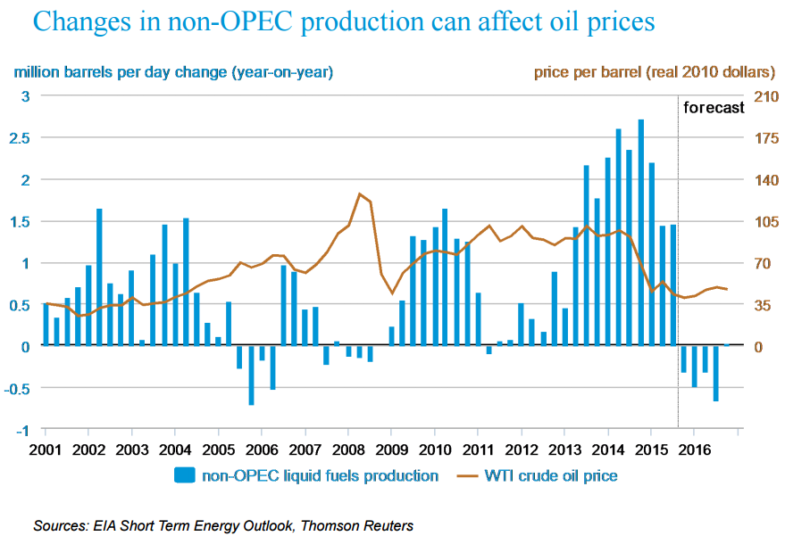

Oil prices are pivotal to the global economy, influencing everything from energy costs to investment decisions. As a crucial input for transportation and industry, fluctuations in oil prices resonate through various sectors, affecting inflation rates, monetary policy, and capital flows worldwide. The complexity of oil pricing stems from the interplay of diverse stakeholders, notably the Organization of the Petroleum Exporting Countries (OPEC), which adjusts production levels based on market conditions and economic forecasts. OPEC, alongside prominent non-OPEC producers like the United States and Canada, exerts significant influence over supply, and consequently, pricing dynamics.

Algorithmic trading has injected additional complexity into the oil markets. This technology-driven approach uses sophisticated algorithms to execute trades, responding minute-by-minute to fluctuations in market signals, including those triggered by geopolitical announcements and economic indicators. The integration of algorithmic trading has amplified oil price volatility, creating rapid swings following decisions by major players like OPEC or unexpected geopolitical events.



This article aims to explore the nuanced landscape of oil price fluctuations. It will examine the roles of OPEC and non-OPEC countries in shaping market trends and assess the impact of contemporary factors such as algorithmic trading. Understanding these dynamics is essential for stakeholders ranging from policymakers to institutional investors, who must navigate the uncertain terrain of global oil markets.

## Table of Contents

## Understanding OPEC and Oil Prices

The Organization of the Petroleum Exporting Countries (OPEC) is a prominent entity in the global oil market, significantly impacting oil production and pricing structures. Founded in 1960, OPEC's main objective is to coordinate and unify petroleum policies among its member countries, ensuring the stabilization of oil markets. By setting collective production targets, OPEC aims to secure fair and stable prices for petroleum producers and provide a consistent supply to consumers.

OPEC members contribute approximately 40% of the world's crude oil, making their decisions pivotal in shaping global oil price dynamics. The organization's ability to influence prices stems from its control over a substantial portion of global oil reserves, allowing it to manipulate production levels to either increase or decrease supply. This capability enables OPEC to address market imbalances, such as oversupply or shortages, thus affecting global oil prices.

Saudi Arabia, the largest oil producer within OPEC, plays a central role in steering the organization's policy decisions. Its substantial production capacity and strategic reserves provide it with leverage to lead negotiations and implement changes in production quotas. Saudi Arabia's leadership is often crucial during times of market volatility or geopolitical tensions, as it possesses the ability to adjust its production levels significantly.

The central role played by Saudi Arabia and OPEC's collective decisions highlight the organization's influence over the oil market. By adjusting production levels, OPEC can manage price fluctuations, which might otherwise be driven by external factors such as geopolitical events or shifts in global demand. This influence underscores the importance of OPEC as a stabilizing force in the volatile environment of global oil trading.

## The Impact of OPEC+ on Oil Prices

OPEC+, a consortium comprising the Organization of the Petroleum Exporting Countries (OPEC) and non-member countries like Russia, exerts considerable influence on the global oil market. By coordinating production quotas, OPEC+ can significantly impact oil supply, thereby affecting global pricing dynamics. The collaboration between OPEC members and countries outside the organization allows the group to control a larger share of the global oil market, enabling strategic decisions to stabilize or influence prices in response to various economic and political conditions.

The impact of OPEC+ decisions is often immediate and profound. For instance, a commitment to cut production quotas typically aims to reduce excess supply, thus supporting higher oil prices. Conversely, increasing production can lower oil prices when demand pressures necessitate greater supply. This ability to regulate oil output gives OPEC+ substantial leverage over market conditions, allowing it to respond to fluctuations with agility.

Amid ongoing geopolitical tensions, OPEC+ has frequently taken steps to stabilize oil prices. For example, during periods of political unrest in key oil-producing regions, OPEC+ has adjusted production levels to prevent drastic price instability. By doing so, the group seeks not only to manage oil prices but also to ensure a stable revenue flow for oil-dependent economies.

OPEC+'s strategic decisions are influenced by numerous factors, including global economic growth projections, technological advancements in oil extraction, and shifts in consumer energy preferences, such as the transition to renewable energy sources. As these variables evolve, the coalition must continuously adapt its approach to maintain its influence over oil market dynamics.

## The Role of Non-OPEC Countries

Non-OPEC countries, particularly the United States and Canada, play a crucial role in the global oil market by contributing significantly to the supply of [crude oil](/wiki/crude-oil). These countries, while not having the coordinated production strategies characteristic of OPEC, exert influence over oil prices through their production capacities and technological advancements.

The rise of shale oil production has been a game-changer for the U.S. oil landscape. Hydraulic fracturing and horizontal drilling have enabled access to previously untapped oil reserves, leading to a substantial increase in production. This surge has positioned the United States as one of the world's leading oil producers, challenging the dominance of traditional oil-exporting nations. Canada, with its oil sands, similarly contributes to the global oil supply, further intensifying market competition with OPEC countries.

Non-OPEC countries tend to influence the oil market more indirectly compared to OPEC nations. Rather than adhering to coordinated production quotas, these countries respond to market conditions, including price fluctuations and technological advancements, which can lead to significant changes in global oil supply. For example, high oil prices often incentivize increased production from non-OPEC producers, thereby adding to the global supply and exerting downward pressure on prices.

The influence of non-OPEC producers is evidenced by their ability to rapidly scale production in response to market signals, often offsetting supply cuts made by OPEC. This dynamic creates a delicate balance in the oil market, where production decisions from both OPEC and non-OPEC countries interplay to shape the supply levels and pricing. 

While the influence of non-OPEC countries is not always immediately apparent, their contributions to global supply, particularly during periods of geopolitical tension or OPEC production cuts, underscore their importance in determining oil price dynamics. As technological advancements continue to drive efficiency and cost-effectiveness in oil extraction, the role of these nations is expected to remain significant in the evolving global energy landscape.

## Algorithmic Trading and Oil Price Volatility

Algorithmic trading, also known as automated trading, utilizes computer algorithms to execute trades in financial markets with minimal human intervention. These algorithms are designed to follow pre-defined instructions related to timing, price, quantity, and other market conditions. In the context of oil markets, [algorithmic trading](/wiki/algorithmic-trading) has become a significant [factor](/wiki/factor-investing) affecting price [volatility](/wiki/volatility-trading-strategies).

Algorithms can react to market signals, such as news events, economic indicators, or unexpected market shifts, often at speeds faster than human traders. An essential component of algorithmic trading is its capacity to interpret vast quantities of data in real-time, making decisions based on quantitative analysis. The use of high-frequency trading ([HFT](/wiki/high-frequency-trading-strategies)), a subset of algorithmic trading, allows for thousands of trades to be executed in seconds, further influencing market dynamics.

The responsiveness of these algorithms to market signals can amplify price movements, particularly around significant announcements or changes in fundamental factors. For instance, when the Organization of the Petroleum Exporting Countries (OPEC) issues statements regarding production adjustments, algorithmic trading platforms react almost instantaneously, often leading to swift and pronounced fluctuations in oil prices.

Moreover, algorithmic trading can intensify both slumps and spikes in oil prices. When OPEC announces production cuts, for instance, algorithms might interpret this as a signal of tightening supply, leading to a rapid increase in oil prices. Conversely, announcements that suggest an oversupply or lower demand forecasts could trigger a sharp decline in prices as algorithms initiate selling strategies.

Recent studies and empirical data demonstrate that algorithmic interventions during such announcements lead to increased volatility. An example can be given in the form of volatility clusters, where algorithms exacerbate price variations within a short time frame, causing rapid changes that may not necessarily reflect market fundamentals. This behavior can be mathematically represented in models such as the GARCH (Generalized Autoregressive Conditional Heteroskedasticity) model, which captures volatility clustering—a common trait observed during hyper-reactive trading sessions induced partly by algorithmic trading.

An illustrative Python code snippet to analyze such volatility using the GARCH model may look like this:

```python
from arch import arch_model
import pandas as pd

# Sample hypothetical data for oil prices
data = pd.DataFrame({'price': [60, 65, 60, 70, 68, 66, 71, 75, 72, 78]})
returns = 100 * data['price'].pct_change().dropna()

# Fit a GARCH(1, 1) model
model = arch_model(returns, vol='Garch', p=1, q=1)
model_fit = model.fit(disp='off')

print(model_fit.summary())
```

This code models the volatility of oil price returns, highlighting how algorithmic trading might contribute to price fluctuations.

Overall, algorithmic trading plays a pivotal role in modern financial markets, including oil. While it offers the advantage of efficiency and swift market adaptation, it also presents challenges by contributing to heightened volatility, especially during periods of significant market updates, such as those stemming from OPEC announcements. Understanding these mechanisms is essential for stakeholders seeking to navigate the complexities of the oil market.

## OPEC, Non-OPEC, and Market Forces

OPEC and non-OPEC countries wield considerable influence over the supply side of the global oil market. However, demand dynamics, driven largely by economic growth patterns, also have a substantial impact on oil prices. Economic expansions typically increase the demand for energy, leading to higher oil prices, while contractions can have the opposite effect. This complex interplay between supply and demand determines pricing in oil markets.

Black Swan events, which are unpredictable and have significant consequences, can drastically affect oil market equilibrium. These events, such as pandemics or geopolitical conflicts, contribute to unexpected shifts in both oil supply and demand, leading to extreme price volatility. For instance, the COVID-19 pandemic caused a severe contraction in oil demand due to global lockdowns, resulting in unprecedented price fluctuations. Similarly, geopolitical tensions in oil-producing regions can disrupt supply, causing sudden price spikes.

OPEC's production strategies are often designed to either anticipate or respond to such disturbances in the market. By adjusting production levels, OPEC aims to stabilize prices and reduce the impact of unforeseen events on the global oil supply. These strategic decisions can mitigate the volatility induced by Black Swan events, enabling OPEC to maintain a degree of control over the market. Additionally, the actions of non-OPEC countries, although often less coordinated, contribute to the overall market adjustment process, emphasizing the interconnectedness of global oil supply chains.

## Conclusion

Oil prices are shaped by an intricate web of factors that include geopolitical decisions, economic influences, and technological innovations like algorithmic trading. Each of these elements plays a crucial role in defining the energy landscape. Geopolitical developments, such as conflicts or alliances, can lead to sudden shifts in oil supply and demand, impacting global prices. Economic trends, including growth rates and inflation, further modulate demand, influencing oil consumption patterns across countries. 

Algorithmic trading introduces an additional layer of complexity. This technological advancement allows for rapid execution of trades based on predefined criteria, amplifying market fluctuations in response to events like policy changes or economic data releases. For stakeholders such as policymakers and investors, a nuanced understanding of these interconnected factors is essential. It enables informed decision-making and strategic planning, considering the unpredictable nature of oil markets.

As the global energy landscape undergoes transformations—driven by shifts towards renewable energy sources and sustainability goals—OPEC and non-OPEC dynamics will continue to be significant. Their production decisions can stabilize or destabilize markets, especially in times of uncertainty. The integration of technological innovations like AI-driven trading systems is expected to further influence market behavior, creating new opportunities and challenges.

Recognizing these evolving trends is imperative for stakeholders to navigate future market scenarios. The interplay of OPEC, non-OPEC countries, geopolitical movements, and emerging technologies will persist as defining elements in the global oil market, necessitating ongoing assessment and adaptation by all involved parties.

## References & Further Reading

[1]: Fattouh, B., Poudineh, R., & Sen, A. (2019). ["The Dynamics of the Revenue Maximization–Market Stabilization Dilemma for OPEC and OPEC+"](https://www.keei.re.kr/library/10320/contents/5959827?checkinId=2729913&articleId=1764217). The Oxford Institute for Energy Studies.

[2]: Lopez de Prado, M. (2018). ["Advances in Financial Machine Learning"](https://www.amazon.com/Advances-Financial-Machine-Learning-Marcos/dp/1119482089). Wiley.

[3]: Ederington, L. H., & Lee, J. H. (1993). ["How Markets Process Information: News Releases and Volatility"](https://onlinelibrary.wiley.com/doi/10.1111/j.1540-6261.1993.tb04750.x). The Journal of Finance, 48(4), 1161-1191.

[4]: Bassam Fattouh, Lavan Mahadeva (2013). ["OPEC: What Difference Has it Made?"](https://www.oxfordenergy.org/wpcms/wp-content/uploads/2013/01/MEP-3.pdf?v=7516fd43adaa) Global Policy, Volume 4, Issue 2.

[5]: Chevillon, G., & Rifflart, C. (2009). ["Physical Market Determinants of the Price of Crude Oil and the Market Premium"](https://papers.ssrn.com/sol3/papers.cfm?abstract_id=964632).html). Energy Economics, 31(4), 537-549.

[6]: ["High-Frequency Trading and Price Discovery"](https://academic.oup.com/rfs/article-abstract/27/8/2267/1582754) by Charles M. Jones

[7]: Kaufmann, R. K., & Ulman, D. (2009). ["Oil Prices, Speculation, and Fundamentals: Interpreting Causal Relations among Spot and Futures Prices"](https://www.sciencedirect.com/science/article/pii/S0140988309000243). Energy Economics, 31(4), 550-558.