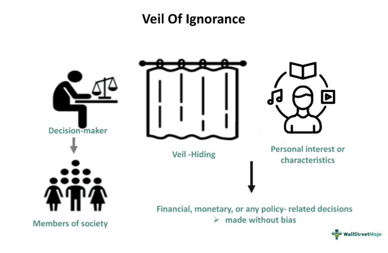

## Table of Contents

## What is the Veil of Ignorance?

The Veil of Ignorance is an idea from philosopher John Rawls. It's a way to think about fairness and justice. Imagine you are making rules for a society, but you don't know who you will be in that society. You could be rich or poor, healthy or sick, any race or gender. Because you don't know your position, you will make fairer rules that help everyone.

This idea helps us see what a just society might look like. If people don't know their own advantages or disadvantages, they are more likely to create laws that are fair to everyone. It's like wearing a blindfold when deciding rules, so personal biases don't affect the decisions. Rawls believed this method would lead to a more equal and just world.

## Who introduced the concept of the Veil of Ignorance?

John Rawls introduced the concept of the Veil of Ignorance. He was a philosopher who wanted to figure out how to make society fair for everyone. He came up with this idea to help people think about justice in a new way.

The Veil of Ignorance is like a thought experiment. Imagine you are making rules for a society, but you don't know who you will be in that society. You could end up being anyone, so you would want to make rules that are fair for everyone. This way, personal biases don't get in the way, and the rules help create a more just world.

## How does the Veil of Ignorance relate to fairness?

The Veil of Ignorance helps us think about fairness by making us imagine we don't know our place in society. If you were making rules without knowing if you'll be rich or poor, healthy or sick, you'd want those rules to be fair for everyone. This way, you wouldn't make rules that only help certain people because you might end up being one of the people who need help.

When we use the Veil of Ignorance, we try to see things from everyone's point of view. It's like wearing a blindfold so our own biases don't affect our decisions. By doing this, we can create a society where everyone has a fair chance, no matter who they are. This idea helps us build a world that's more equal and just for all.

## What are fairness principles in the context of social justice?

Fairness principles in social justice are ideas about how to make sure everyone in society is treated equally and has the same opportunities. One important principle is equality, which means everyone should get the same chances and resources, no matter who they are. Another principle is equity, which means giving people what they need to be on an equal footing, even if that means giving more help to some people than others. For example, if someone starts with less, they might need more support to catch up.

Another fairness principle is non-discrimination, which means not treating people differently because of things like their race, gender, or where they come from. This helps make sure everyone is judged by their actions and abilities, not by things they can't control. A final principle is participation, which means everyone should have a say in the decisions that affect their lives. This makes sure that the rules and laws of society reflect what people need and want, leading to a fairer world for everyone.

## Can you explain how the Veil of Ignorance is used to develop fairness principles?

The Veil of Ignorance helps us think about fairness by making us imagine we don't know our place in society. If you were making rules without knowing if you'll be rich or poor, healthy or sick, you'd want those rules to be fair for everyone. This way, you wouldn't make rules that only help certain people because you might end up being one of the people who need help. By imagining we don't know our own situation, we can see what rules would be fair for everyone, not just for ourselves.

Using the Veil of Ignorance helps us develop fairness principles like equality and equity. Equality means everyone should get the same chances and resources, no matter who they are. Equity means giving people what they need to be on an equal footing, even if that means giving more help to some people than others. When we think about these principles under the Veil of Ignorance, we realize that fair rules should help everyone have a good life, not just a few people. This way, we can create a society where everyone has a fair chance, no matter who they are.

## What are the main criticisms of the Veil of Ignorance as a tool for establishing fairness?

Some people think the Veil of Ignorance has problems. One big criticism is that it's hard to really imagine not knowing anything about yourself. People's experiences and backgrounds shape how they think, so it's tough to pretend those don't exist. Critics say this makes it hard to come up with truly fair rules because we can't completely ignore who we are.

Another criticism is that the Veil of Ignorance might make us focus too much on the worst situations. If we're always thinking about the worst possible outcomes, we might make rules that are too cautious and don't help everyone grow and improve. Some people argue that a society needs to balance fairness with the chance for people to do well and succeed, not just avoid the worst outcomes.

## How have philosophers expanded or modified the original concept of the Veil of Ignorance?

Philosophers have taken John Rawls' idea of the Veil of Ignorance and changed it a bit to fit different ideas about fairness. Some have added new things to think about, like how much people know about the world or how they make choices. For example, some philosophers say that instead of knowing nothing about ourselves, we should know some things but not others. This way, we can still make fair rules but also think about real-life situations.

Others have tried to fix some problems with the original idea. They think that if we know nothing about ourselves, we might make rules that are too careful and don't let people grow or do well. So, they suggest that we should know a little bit about our lives, just enough to make balanced rules that help everyone have a fair chance but also let people succeed. These changes help make the Veil of Ignorance a better tool for thinking about justice and fairness in different ways.

## What are some real-world applications of fairness principles derived from the Veil of Ignorance?

In the real world, fairness principles from the Veil of Ignorance help shape policies and laws that aim to give everyone a fair shot. For example, many countries have laws about equal pay for equal work. This means that people should get paid the same amount for doing the same job, no matter if they are a man or a woman, or what their background is. These laws come from the idea that if we didn't know our own situation, we'd want rules that treat everyone the same. This helps make sure workplaces are fair and everyone has an equal chance to earn a living.

Another real-world use of these fairness principles is in education. Some countries have programs to help students from poorer families get the same education as others. This might mean giving them extra help, like free school lunches or scholarships. The idea is that if we didn't know if we'd be rich or poor, we'd want everyone to have a fair chance at learning and growing. By making education more equal, these programs help create a society where everyone can succeed, no matter where they start.

## How does the Veil of Ignorance address issues of inequality and discrimination?

The Veil of Ignorance helps us think about how to fix inequality and discrimination by making us imagine we don't know our own place in society. If we don't know if we'll be rich or poor, healthy or sick, or what race or gender we'll be, we'll want to make rules that are fair for everyone. This way, we won't make rules that only help certain people because we might end up being one of the people who need help. By imagining we don't know our own situation, we can see what rules would stop inequality and discrimination, making sure everyone has a fair chance.

In real life, the ideas from the Veil of Ignorance help shape laws and policies that try to make things more equal. For example, laws about equal pay for equal work help stop discrimination based on gender or race. If we think about fairness without knowing our own situation, we'd want everyone to get paid the same for the same job. Also, programs that help students from poorer families get a better education come from the idea that everyone should have the same chance to learn and grow, no matter where they start. These policies help create a world where everyone can succeed, no matter who they are.

## In what ways does the Veil of Ignorance influence policy-making in democratic societies?

The Veil of Ignorance helps shape policy-making in democratic societies by encouraging lawmakers to think about fairness without knowing their own position in society. If they imagine they could be anyone, they are more likely to create policies that help everyone, not just certain groups. This idea pushes for laws that treat everyone equally, like rules about equal pay for equal work or non-discrimination policies. By thinking this way, lawmakers can make sure that policies don't favor one group over another, leading to a more just society.

In practice, the Veil of Ignorance influences policies that aim to reduce inequality and give everyone a fair chance. For example, education policies might include programs to help students from poorer families get the same opportunities as others. This comes from the idea that if lawmakers didn't know their own background, they'd want everyone to have a good education. Similarly, health care policies might focus on making sure everyone can get the care they need, no matter how much money they have. By using the Veil of Ignorance, democratic societies can work towards creating a world where everyone has an equal shot at a good life.

## How can the Veil of Ignorance be applied to contemporary ethical dilemmas?

The Veil of Ignorance can help us think about tough ethical problems today by making us imagine we don't know our own situation. If we're deciding on something like how to share resources during a crisis, like a global health emergency, we'd want to make sure everyone gets what they need. If we didn't know if we'd be rich or poor, healthy or sick, we'd make rules that help everyone, not just certain people. This way, we can create fair solutions that treat everyone the same, no matter who they are.

For example, when thinking about climate change, the Veil of Ignorance can guide us to make policies that are fair for everyone. If we didn't know where we'd live or how much money we'd have, we'd want to make sure that the costs and benefits of fighting climate change are shared equally. This might mean helping poorer countries deal with climate impacts or making sure everyone has access to clean energy. By using the Veil of Ignorance, we can find ways to solve big ethical problems that are fair and help everyone.

## What are the future prospects and potential developments in the theory of the Veil of Ignorance and its impact on fairness principles?

The future of the Veil of Ignorance looks promising as it continues to be a helpful tool for thinking about fairness. Philosophers might keep working on the idea, trying to make it better by adding new ways to think about it. They might look at how much people should know about themselves when making rules, or how to balance fairness with letting people do well. As our world changes, the Veil of Ignorance can help us find new ways to make sure everyone has a fair chance, no matter what challenges come up.

In the future, the Veil of Ignorance could have a bigger impact on how we make rules and laws. As more people learn about this idea, it might help shape policies in areas like health care, education, and the environment. For example, it could guide us to create health care systems that help everyone get the care they need, or education systems that give every student a fair shot at learning. By using the Veil of Ignorance, we can keep working towards a world that's fair for everyone, no matter who they are or where they come from.

## References & Further Reading

[1]: Rawls, J. (1971). ["A Theory of Justice"](https://www.jstor.org/stable/j.ctvkjb25m). Harvard University Press.

[2]: Bostrom, N., & Yudkowsky, E. (2014). ["The Ethics of Artificial Intelligence"](https://www.semanticscholar.org/paper/The-Ethics-of-Artificial-Intelligence-Bostrom-Yudkowsky/787996496a300356188ba921f02f926331f80a63). In The Cambridge Handbook of Artificial Intelligence, edited by V. C. Muller, Cambridge University Press.

[3]: Narayanan, A. (2019). ["How to Recognize AI Snake Oil"](https://www.cs.princeton.edu/~arvindn/talks/MIT-STS-AI-snakeoil.pdf). Presentation at MIT.

[4]: O'Neil, C. (2016). ["Weapons of Math Destruction: How Big Data Increases Inequality and Threatens Democracy"](https://dl.acm.org/doi/10.5555/3002861). Crown.

[5]: Pasquale, F. (2015). ["The Black Box Society: The Secret Algorithms That Control Money and Information"](https://www.jstor.org/stable/j.ctt13x0hch). Harvard University Press.