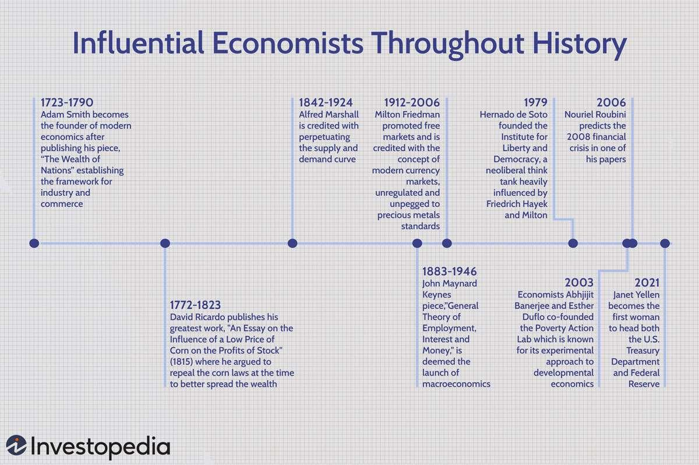

## Table of Contents

## Who are some of the most influential economists in American history?

Some of the most influential economists in American history include Adam Smith, John Maynard Keynes, and Milton Friedman. Adam Smith is often called the father of modern economics. He wrote a famous book called "The Wealth of Nations" in 1776. This book explained how free markets work and why they are good for society. John Maynard Keynes was a British economist, but his ideas had a big impact in America too. During the Great Depression, his ideas helped shape how the government could help the economy recover. He believed that the government should spend more money during tough times to create jobs and boost the economy.

Milton Friedman was another very influential economist. He believed in free markets and less government control. His ideas helped shape economic policies during the 1980s, especially during Ronald Reagan's presidency. Friedman's work on monetary policy and inflation also had a big impact on how central banks operate. These economists have shaped how we think about economics and how governments and businesses make decisions. Their ideas are still discussed and used today.

## What are the main economic theories developed by these economists?

Adam Smith is famous for his idea of the "invisible hand." This means that when people work for their own good, they end up helping the whole economy. He believed that free markets, where people can buy and sell without too many rules, are the best way to make everyone better off. In his book "The Wealth of Nations," Smith explained how countries can grow rich by focusing on what they do best and trading with others.

John Maynard Keynes came up with ideas that changed how governments handle economic problems. He thought that during bad times, like the Great Depression, the government should spend more money to help the economy. This is called "fiscal policy." Keynes believed that by spending on things like roads and schools, the government could create jobs and get the economy moving again. His ideas led to what we now call "Keynesian economics," which focuses on using government action to smooth out economic ups and downs.

Milton Friedman had different ideas from Keynes. He believed in "monetarism," which says that controlling the amount of money in the economy is the best way to keep things stable. Friedman thought that too much government spending could lead to inflation, which is when prices go up a lot. He also supported free markets and less government control. His ideas were very popular during the 1980s and influenced policies like tax cuts and deregulation. Friedman's work helped shape how we think about the role of central banks and the importance of keeping inflation in check.

## How did Adam Smith's ideas influence American economic policy?

Adam Smith's ideas had a big impact on American economic policy. His most famous idea is the "invisible hand," which says that when people look out for themselves, they end up helping the whole economy. This idea helped shape America's belief in free markets. The country was built on the idea that people should be free to buy and sell without too many rules from the government. This led to policies that encouraged trade and business, like low taxes and fewer regulations.

Smith also talked about the importance of specialization and trade. He believed that countries should focus on what they do best and trade with others. This idea influenced America's economic growth. The country used its resources and skills to become a leader in industries like farming and manufacturing. By trading with other countries, America was able to grow rich and powerful. Even today, Smith's ideas about free markets and trade are still important in shaping American economic policy.

## What was John Maynard Keynes's impact on American economic thought and policy?

John Maynard Keynes had a big impact on American economic thought and policy, especially during tough times like the Great Depression. His main idea was that the government should step in and spend more money when the economy is doing badly. This is called "fiscal policy." Keynes believed that by spending on things like roads and schools, the government could create jobs and get the economy moving again. During the Great Depression, President Franklin D. Roosevelt used some of Keynes's ideas in his "New Deal" programs. These programs helped the economy recover by creating jobs and boosting spending.

Keynes's ideas also changed how people thought about economics. Before him, many economists believed that the market would fix itself without help. But Keynes showed that the government could make a big difference. His ideas led to what we now call "Keynesian economics," which focuses on using government action to smooth out economic ups and downs. Even today, Keynes's ideas are still used and debated. When the economy is in trouble, people often talk about using "stimulus" spending to help it recover, which comes straight from Keynes's thinking.

## How did Milton Friedman's monetarist views shape American economic practices?

Milton Friedman's monetarist views had a big impact on American economic practices, especially in the 1980s. He believed that the best way to keep the economy stable was by controlling the amount of money in it. This idea is called "monetarism." Friedman thought that if the government spent too much money, it could lead to high inflation, which is when prices go up a lot. His ideas influenced how the Federal Reserve, America's central bank, worked. They started to focus more on controlling inflation by keeping a close eye on the money supply.

Friedman also believed in free markets and less government control. His ideas helped shape policies during Ronald Reagan's presidency. Reagan's government cut taxes and reduced regulations, which were ideas that came from Friedman's work. These policies were meant to let businesses grow and create more jobs. Friedman's ideas are still important today. They remind us that controlling inflation and keeping markets free can help the economy stay strong.

## What role did Friedrich Hayek play in the development of American economic philosophy?

Friedrich Hayek was an important economist whose ideas helped shape American economic philosophy. He believed strongly in free markets and less government control. Hayek thought that when people are free to make their own choices, the economy works better. He wrote a famous book called "The Road to Serfdom," which warned that too much government planning could lead to less freedom. His ideas became very popular in America, especially among people who believed in small government and individual freedom.

Hayek's ideas had a big impact on American economic policy, especially during the 1980s. His thinking helped shape the policies of President Ronald Reagan, who believed in cutting taxes and reducing regulations. Hayek's work also influenced the way people thought about the role of government in the economy. Even today, his ideas are still discussed and used by those who believe in free markets and limited government control.

## How have the theories of Karl Marx influenced economic debates in the United States?

Karl Marx's ideas have had a big impact on economic debates in the United States, even though many people disagree with them. Marx believed that workers were not paid fairly and that the rich got richer by taking advantage of them. He thought that one day, workers would rise up and create a new system where everyone shared the wealth equally. These ideas led to big debates about fairness and equality in America. Some people used Marx's ideas to argue for better pay and working conditions for workers. Others worried that following Marx's ideas would lead to less freedom and hurt the economy.

Marx's theories also influenced how people think about capitalism, which is the economic system America uses. Capitalism is based on free markets and private ownership. Marx thought that capitalism would eventually fail because it created too much inequality. This led to discussions in the United States about how to make capitalism fairer. For example, some people argued for stronger labor laws and social programs to help those who were not doing well. Even though Marx's ideas are not widely accepted in the U.S., they still play a role in debates about economic policy and how to make society more equal.

## What were the key contributions of John Kenneth Galbraith to American economic discourse?

John Kenneth Galbraith made important contributions to how people in America think and talk about the economy. He wrote many [books](/wiki/algo-trading-books) that helped explain big economic ideas in a way that everyone could understand. One of his most famous books is called "The Affluent Society." In this book, Galbraith talked about how America was getting richer, but not everyone was sharing in that wealth. He said that while some people had a lot of money, public services like schools and roads were not getting enough. This idea made people think about how to make sure everyone benefits from a growing economy.

Galbraith also talked about how big companies, or corporations, have a lot of power in the economy. In his book "The New Industrial State," he explained that these big companies can influence what people buy and how the economy works. He thought that the government should do more to balance the power of these big companies. His ideas helped start conversations about how to make the economy fairer and how to make sure that big businesses don't have too much control. Even today, people still talk about Galbraith's ideas when they discuss how to improve the economy and make it work for everyone.

## How did the work of Paul Samuelson affect economic education and policy in America?

Paul Samuelson made a big impact on how economics is taught and understood in America. He wrote a famous textbook called "Economics: An Introductory Analysis," which became very popular. This book helped students learn about economics in a clear and easy way. Samuelson used math to explain economic ideas, which was new at the time. His textbook was used in many colleges and helped shape how economics was taught for many years. Because of Samuelson, more people learned about economics and how it affects their lives.

Samuelson's ideas also influenced American economic policy. He believed in using government action to help the economy, like John Maynard Keynes. Samuelson thought that the government should spend more money during tough times to create jobs and help people. His ideas were used by many leaders and policymakers. For example, during the 1960s, President Lyndon B. Johnson used Samuelson's ideas to create programs that helped the poor and improved the economy. Samuelson's work helped make economics more important in how the country is run, and his ideas are still discussed today.

## What impact did Janet Yellen have on American economic policy during her tenure?

Janet Yellen had a big impact on American economic policy when she was the head of the Federal Reserve and later as the Secretary of the Treasury. As the head of the Federal Reserve, Yellen helped the economy recover after the 2008 financial crisis. She kept interest rates low to make it easier for people and businesses to borrow money. This helped create jobs and grow the economy. Yellen also focused on making sure the economy was fair for everyone. She talked a lot about how to help people who were not doing well, like those without jobs or enough money.

As the Secretary of the Treasury, Yellen worked with President Joe Biden to pass big laws to help the economy during the COVID-19 pandemic. She supported plans to spend a lot of money on things like helping people who lost their jobs, fixing roads and bridges, and fighting climate change. Yellen believed that by spending this money, the government could help the economy grow and make life better for everyone. Her ideas and actions helped shape how the country dealt with economic problems during her time in office.

## How do the economic theories of Thomas Piketty resonate with contemporary American economic issues?

Thomas Piketty's ideas about wealth and inequality are very important when we think about what's happening in America today. Piketty wrote a big book called "Capital in the Twenty-First Century." In it, he says that over time, rich people get richer faster than everyone else. This happens because the money they make from their investments grows faster than the economy as a whole. In America, we see this happening a lot. The rich are getting richer, and the gap between them and everyone else is getting bigger. Piketty's ideas help us understand why this is happening and why it's a problem. He says that too much inequality can make society unfair and can hurt the economy.

Piketty also talks about how to fix this problem. He thinks that one way to make things more equal is to have higher taxes on the rich. This way, the government can use that money to help everyone else. In America, people are talking a lot about this idea. Some want to raise taxes on the rich to pay for things like better schools and health care. Others worry that high taxes might hurt the economy. Piketty's ideas are part of these big debates. They help us think about how to make sure everyone has a fair chance to do well, which is a big issue in America right now.

## What are the current debates among economists about the future direction of American economic policy influenced by these historical figures?

Today, economists in America are still talking about the ideas of people like Adam Smith, John Maynard Keynes, Milton Friedman, and others. One big debate is about how much the government should be involved in the economy. Some economists believe in what Adam Smith and Milton Friedman said about free markets and less government control. They think that if people and businesses are free to make their own choices, the economy will do better. These economists often argue for lower taxes and fewer rules. On the other hand, some economists follow Keynes's ideas and think the government should step in more, especially during tough times. They believe that spending on things like roads and schools can create jobs and help the economy grow. This debate affects big decisions like how much to tax people and what kind of laws to make.

Another important debate is about inequality, which Thomas Piketty wrote a lot about. Many economists are worried that the rich are getting richer while everyone else is not doing as well. They think this is bad for society and the economy. Some economists, inspired by Piketty, argue for higher taxes on the rich to make things more equal. They believe this money can be used to help people who are struggling. But other economists worry that high taxes might hurt the economy by making it harder for businesses to grow. This debate is important because it affects how we think about fairness and how to help everyone in America have a good life.

## Who were the 20th Century Innovators: John Maynard Keynes and Milton Friedman?

John Maynard Keynes and Milton Friedman stand as towering figures in the landscape of 20th-century economic thought, presenting theories that have indelibly influenced economic policy and subsequently modern trading strategies, including [algorithmic trading](/wiki/algorithmic-trading).

John Maynard Keynes fundamentally transformed economic theory with his advocacy for active government intervention, particularly during periods of economic downturns. Keynes posited that aggregate demand, composed of household, business, and government expenditures, was the primary driving force of economic performance. During recessions, he argued that insufficient aggregate demand could lead to prolonged periods of high unemployment, suggesting that governments should intervene through fiscal policy, such as altering tax and spending levels, to stabilize the economy. This approach laid the groundwork for macroeconomics and informed many post-World War II economic policies. The basic Keynesian model can be represented by the equation:

$$
Y = C + I + G + (X - M)
$$

where $Y$ is the national income, $C$ is consumption, $I$ is investment, $G$ is government spending, $X$ is exports, and $M$ is imports.

In contrast, Milton Friedman championed the theory of monetarism, emphasizing the role of governments in controlling the money supply as a method of stabilizing the economy, and advocating for minimal government intervention otherwise. Friedman asserted that inflation was primarily a result of changes in the money supply and contended that monetary policy should be used to control inflation rather than unemployment. His work laid the foundation for policies that prioritize price stability, advocating for a steady, small expansion of the money supply, as captured in Friedman's quantity theory of money equation:

$$
MV = PQ
$$

where $M$ is the money supply, $V$ is the velocity of money, $P$ is the price level, and $Q$ is the output of the economy.

The contrasting ideas of Keynes and Friedman have led to significant policy shifts over the decades, shaping economic strategies both within the United States and globally. This intellectual rivalry laid the foundations for debates in economic philosophy and practical governance, from expansive welfare programs to laissez-faire economic policies.

In modern finance, the principles derived from both Keynesian and monetarist schools of thought have direct implications on algorithmic trading. Algorithmic trading systems are increasingly sophisticated, incorporating signals from macroeconomic indicators, such as GDP growth rates or changes in money supply, to make informed and timely investment decisions. These systems utilize adaptive strategies that are responsive to macroeconomic signals and monetary conditions, integrating Keynes’ recommendations for government intervention with Friedman’s monetary principles to optimize trading outcomes.

Algorithmic trading benefits substantially from these perspectives through the integration of data analytics and [machine learning](/wiki/machine-learning) models that consider both fiscal policy changes and monetary policy indicators as factors affecting asset prices. This dual approach ensures that contemporary trading strategies are robust and capable of navigating complex economic environments, underscoring the enduring impact of Keynes’ and Friedman’s economic insights on the evolution of trading technologies.

## References & Further Reading

[1]: Smith, A. (1776). ["An Inquiry into the Nature and Causes of the Wealth of Nations."](https://www.ibiblio.org/ml/libri/s/SmithA_WealthNations_p.pdf) 

[2]: Ricardo, D. (1817). ["Principles of Political Economy and Taxation."](https://www.econlib.org/library/Ricardo/ricP.html) 

[3]: Keynes, J. M. (1936). ["The General Theory of Employment, Interest, and Money."](https://www.files.ethz.ch/isn/125515/1366_KeynesTheoryofEmployment.pdf)

[4]: Friedman, M. (1968). ["The Role of Monetary Policy."](https://www.aeaweb.org/aer/top20/58.1.1-17.pdf) The American Economic Review, 58(1), 1-17.

[5]: Banerjee, A., & Duflo, E. (2011). ["Poor Economics: A Radical Rethinking of the Way to Fight Global Poverty."](https://onlinelibrary.wiley.com/doi/abs/10.1111/j.1728-4457.2011.00462.x) PublicAffairs.

[6]: Lopez de Prado, M. (2018). ["Advances in Financial Machine Learning."](https://www.amazon.com/Advances-Financial-Machine-Learning-Marcos/dp/1119482089) Wiley. 

[7]: Chan, E. P. (2009). ["Quantitative Trading: How to Build Your Own Algorithmic Trading Business."](https://github.com/ftvision/quant_trading_echan_book) Wiley.

[8]: Aronson, D. R. (2007). ["Evidence-Based Technical Analysis: Applying the Scientific Method and Statistical Inference to Trading Signals."](https://onlinelibrary.wiley.com/doi/book/10.1002/9781118268315) Wiley.