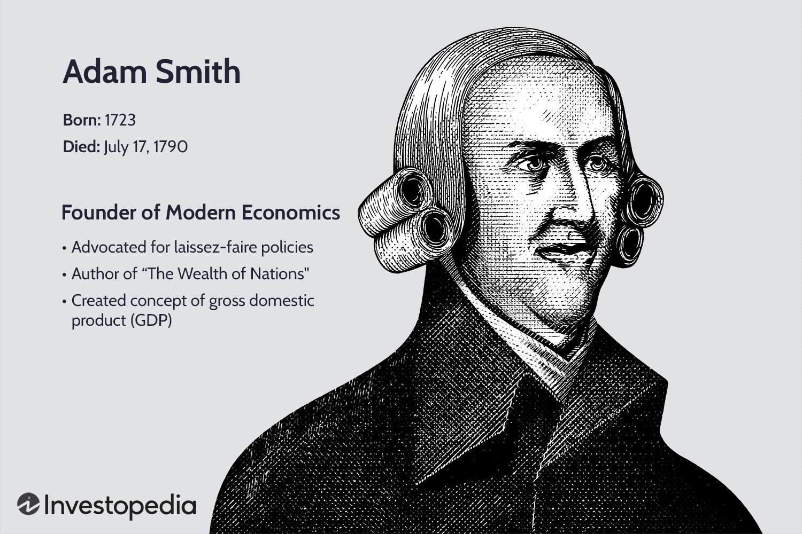

The development of American economic history has been significantly influenced by a select group of economists whose theories and policies have profoundly shaped both national and global economic landscapes. At the root of this transformation are ideas that have not only directed economic policy but have also been foundational in the evolution of modern financial systems, notably in the burgeoning field of algorithmic trading.

Algorithmic trading, a method where computer algorithms automatically execute a substantial number of trading orders at very high speeds, has emerged as a critical component of financial markets. The principles that underpin these trading algorithms are deeply rooted in the theories propounded by key economic thinkers, who have provided the intellectual framework necessary for these complex systems.



This article investigates the contributions of seminal figures in economic history and how their insights are applied in automated investing today. Figures like Adam Smith and David Ricardo laid the groundwork for understanding free market operations and trade efficiencies, while John Maynard Keynes and Milton Friedman introduced pivotal concepts in macroeconomic management and monetary policy. Their teachings remain crucial in guiding today's sophisticated trading algorithms.

Furthermore, we will explore how contemporary economists such as Janet Yellen and Nouriel Roubini have further refined economic predictions, which are integral to the algorithms used in automated trading. By examining their impact, we seek to illuminate the continuity of economic thought and its influence on the latest trading technologies.

Through this exploration, we aim to establish a meaningful connection between historical economic theories and current advancements in algorithmic trading. Understanding the legacy of these economic thinkers enhances our comprehension of the mechanisms driving today's financial markets and offers a perspective on potential future developments within the trading landscape.

## Table of Contents

## Foundations of Modern Economics: Adam Smith and David Ricardo

Adam Smith, often hailed as the "father of modern economics," significantly influenced the development of economic theory through his seminal work, "The Wealth of Nations," published in 1776. In this groundbreaking book, Smith introduced the concept of the invisible hand, a metaphor for the self-regulating nature of a free market. He argued that individuals seeking to maximize their own gain often, albeit unintentionally, benefit society as a whole. Smith's advocacy for free markets and limited government intervention laid the foundation for classical economics and inspired future economic policies centered around market efficiency and competitive advantage.

David Ricardo, another pivotal figure in economic thought, built upon Smith's foundation, further advancing economic science through his theory of comparative advantage. In his 1817 work, "Principles of Political Economy and Taxation," Ricardo introduced the concept of comparative advantage, asserting that even if a nation is less efficient in producing all goods, it can still benefit from trade by specializing in the production of goods for which it is relatively more efficient. This idea championed the benefits of specialization and free trade, arguing that global wealth distribution could be enhanced by nations focusing on industries where they had a comparative advantage.

Both Smith and Ricardo were critical of mercantilism, the prevailing economic doctrine of their times, which emphasized heavy government intervention, protectionism, and accumulating wealth through trade surpluses. Smith and Ricardo instead proposed that free trade could lead to more efficient global wealth distribution by facilitating a more competitive market environment.

The ideas laid down by Smith and Ricardo remain central to the functioning of modern financial markets and have direct implications for [algorithmic trading](/wiki/algorithmic-trading) systems, which thrive in open and competitive markets. Algorithmic trading involves using computer algorithms to automate trading decisions, often capitalizing on minute price discrepancies in highly efficient markets. The competitiveness and lack of barriers in such markets reflect the free-market ideologies proposed by Smith and Ricardo.

This period in economic thought set the stage for the emergence of complex economic models that modern algorithmic trading systems utilize. These models often incorporate the principles of comparative advantage and market efficiency to optimize trading strategies. By applying historical economic theories to practice, traders and economists continue to harness the insights of Smith and Ricardo in developing sophisticated trading algorithms adapted to a globalized economic framework.

## 20th Century Innovators: John Maynard Keynes and Milton Friedman

John Maynard Keynes and Milton Friedman stand as towering figures in the landscape of 20th-century economic thought, presenting theories that have indelibly influenced economic policy and subsequently modern trading strategies, including algorithmic trading.

John Maynard Keynes fundamentally transformed economic theory with his advocacy for active government intervention, particularly during periods of economic downturns. Keynes posited that aggregate demand, composed of household, business, and government expenditures, was the primary driving force of economic performance. During recessions, he argued that insufficient aggregate demand could lead to prolonged periods of high unemployment, suggesting that governments should intervene through fiscal policy, such as altering tax and spending levels, to stabilize the economy. This approach laid the groundwork for macroeconomics and informed many post-World War II economic policies. The basic Keynesian model can be represented by the equation:

$$
Y = C + I + G + (X - M)
$$

where $Y$ is the national income, $C$ is consumption, $I$ is investment, $G$ is government spending, $X$ is exports, and $M$ is imports.

In contrast, Milton Friedman championed the theory of monetarism, emphasizing the role of governments in controlling the money supply as a method of stabilizing the economy, and advocating for minimal government intervention otherwise. Friedman asserted that inflation was primarily a result of changes in the money supply and contended that monetary policy should be used to control inflation rather than unemployment. His work laid the foundation for policies that prioritize price stability, advocating for a steady, small expansion of the money supply, as captured in Friedman's quantity theory of money equation:

$$
MV = PQ
$$

where $M$ is the money supply, $V$ is the velocity of money, $P$ is the price level, and $Q$ is the output of the economy.

The contrasting ideas of Keynes and Friedman have led to significant policy shifts over the decades, shaping economic strategies both within the United States and globally. This intellectual rivalry laid the foundations for debates in economic philosophy and practical governance, from expansive welfare programs to laissez-faire economic policies.

In modern finance, the principles derived from both Keynesian and monetarist schools of thought have direct implications on algorithmic trading. Algorithmic trading systems are increasingly sophisticated, incorporating signals from macroeconomic indicators, such as GDP growth rates or changes in money supply, to make informed and timely investment decisions. These systems utilize adaptive strategies that are responsive to macroeconomic signals and monetary conditions, integrating Keynes’ recommendations for government intervention with Friedman’s monetary principles to optimize trading outcomes.

Algorithmic trading benefits substantially from these perspectives through the integration of data analytics and [machine learning](/wiki/machine-learning) models that consider both fiscal policy changes and monetary policy indicators as factors affecting asset prices. This dual approach ensures that contemporary trading strategies are robust and capable of navigating complex economic environments, underscoring the enduring impact of Keynes’ and Friedman’s economic insights on the evolution of trading technologies.

## Pioneers of Experimental Economics: Abhijit Banerjee and Esther Duflo

Abhijit Banerjee and Esther Duflo have significantly shaped the field of development economics by introducing a rigorous, data-driven approach through the application of randomized controlled trials (RCTs). Their methodology prioritizes empirical evidence to evaluate the effectiveness of policies aimed at alleviating poverty and improving economic outcomes. This experimental framework has not only transformed economics but also provided parallels for algorithmic trading strategies.

The core idea behind Banerjee and Duflo's work is the systematic evaluation of interventions by empirically testing their impact in controlled environments. In this context, RCTs serve as a robust analytical tool, allowing economists to isolate the causal effects of specific policies. This is achieved by randomly assigning subjects to either a treatment group, which receives the intervention, or a control group, which does not, and comparing the outcomes between these groups.

A similar principle is embraced in algorithmic trading, where data-driven models are pivotal in optimizing investment strategies. Algorithms are designed to analyze vast datasets to identify patterns and make predictions, analogous to how experimental economists assess interventions. By leveraging statistical inference and machine learning, algorithmic systems can process real-time financial data to forecast market trends and adjust trading decisions accordingly.

For instance, consider the following Python snippet using libraries like `pandas` and `numpy`, which can illustrate a simplified model for [backtesting](/wiki/backtesting) a trading strategy based on historical price data:

```python
import pandas as pd
import numpy as np

# Load historical price data
data = pd.read_csv('historical_prices.csv')

# Calculate moving average as a basic indicator
data['MA20'] = data['Close'].rolling(window=20).mean()
data['MA50'] = data['Close'].rolling(window=50).mean()

# Generate trading signals: Buy (1) if MA20 > MA50, Sell (-1) if MA20 < MA50
data['Signal'] = np.where(data['MA20'] > data['MA50'], 1, -1)

# Simulate trading based on signals
data['Strategy_Returns'] = data['Signal'].shift(1) * data['Close'].pct_change()

# Compute cumulative returns
data['Cumulative_Returns'] = (1 + data['Strategy_Returns']).cumprod()

print(data[['Date', 'Cumulative_Returns']].tail())
```

This code segment demonstrates the application of moving average crossovers — a classic trading strategy. Here, the empirical logic resembles an RCT as the strategy tests the efficiency of using moving averages to make trading decisions, akin to testing an economic intervention's effect.

Banerjee and Duflo's adoption of RCT methodologies underscores the importance of empirical validation in decision-making processes. This rigor is mirrored in trading algorithms, which thrive on precise data analysis and adapt based on evolving market conditions. The iterative process in both domains emphasizes continuous refinement and adaptation, ensuring that strategies remain relevant and effective.

Their groundbreaking work has not only enriched economic theory but has also contributed to a paradigm where systematic testing and data-driven decision-making are paramount, impacting disciplines beyond economics. The parallels between their experimental approach and algorithmic trading strategies highlight a broader trend towards optimization through empirical analysis, shaping a future where economics and technology increasingly intersect.

## Modern Economists and Algorithmic Trading

Janet Yellen's tenure as Chair of the Federal Reserve placed significant emphasis on labor markets and the broader implications of government policy on economic stability. Her focus on employment rates, inflation, and economic growth provided a nuanced understanding of market dynamics, which is crucial for predicting market trends. Algorithmic trading systems leverage these insights to anticipate fluctuations in various financial indicators. By modeling how shifts in labor markets impact asset prices, these systems can adjust their trading strategies to optimize performance.

Nouriel Roubini gained prominence for accurately predicting the 2008 financial crisis. His economic forecasts underscore the importance of recognizing and analyzing financial risks. Roubini's work highlights critical vulnerabilities in economic systems, such as excessive debt and speculative asset bubbles, which algorithmic trading platforms must consider. Traders employ these insights by constructing algorithms that assess risk factors and generate signals to navigate volatile markets effectively.

Modern algorithmic trading platforms are designed to incorporate economic insights by building models that analyze large datasets and detect market changes. These models evaluate macroeconomic indicators, such as interest rates, GDP growth, and unemployment figures, which have been emphasized by economists like Yellen and Roubini. For example, algorithms may incorporate time series analysis techniques to forecast future price movements based on changes in economic conditions.

The application of modern economic theories to algorithmic trading illustrates a significant interrelationship between economic thought and technology. Understanding the underlying economic principles allows algorithms to interpret complex datasets, execute trades with precision, and manage risks effectively. The integration of economic insights with advanced computational capabilities points to a future where trading systems are increasingly autonomous and adaptive to changing market conditions, driven by the insights of leading economists.

## Algorithmic Trading: A Convergence of Economic Theories

Algorithmic trading marks a significant advancement in financial markets, integrating a broad spectrum of economic theories into sophisticated computer algorithms. This technological evolution allows for the rapid analysis and execution of trades based on both micro and macroeconomic indicators, thereby bridging historical and contemporary economic thought with modern innovations in trading.

At its core, algorithmic trading systems process vast amounts of financial data, leveraging foundational economic principles. For instance, Adam Smith's advocacy for free markets and competition finds a parallel in the algorithmic trade strategies that thrive in open and competitive markets. These systems utilize statistical and mathematical models to predict market trends and movements, integrating concepts such as supply and demand, market equilibrium, and competitive pricing.

In practice, modern algorithms enable traders to optimize their strategies by synthesizing data inputs ranging from company-specific earnings reports (microeconomic indicators) to broader economic data such as GDP growth rates and unemployment [statistics](/wiki/bayesian-statistics) (macroeconomic indicators). This integration allows for a comprehensive view of the economic landscape, thereby informing sound trading decisions. For example, an algorithm might adjust a trading strategy in response to changes in monetary policy or economic forecasts, aligning with the views of economists like Keynes or Friedman.

The automation aspect of these systems offers a distinct advantage in terms of speed and accuracy. High-frequency trading ([HFT](/wiki/high-frequency-trading-strategies)), a subset of algorithmic trading, epitomizes this advantage by executing numerous trades within fractions of a second. This level of precision and efficiency is unachievable by human traders, providing significant competitive edges in the financial markets.

Algorithmic trading exemplifies the merger of economic theory with technological practice. By embedding economic logic into their design, these tools reflect a deep understanding of the principles that drive market behavior, offering traders advanced capabilities to navigate complex market dynamics effectively. As these algorithms continue to evolve, they are expected to become even more sophisticated, incorporating a wider array of economic insights and computational techniques to further enhance trading performance.

## Conclusion

The evolution of algorithmic trading finds its roots deeply embedded in the theories and contributions of historical economic thought leaders. From the free market ideologies espoused by Adam Smith to the contrasting monetary approaches of John Maynard Keynes and Milton Friedman, these foundational theories have left an indelible mark on modern automated trading systems. Smith's advocacy for free markets and competition laid the groundwork for today’s open and fluid trading environments, where the principles of supply and demand are integral to market mechanisms. Keynesian economics, with its focus on government intervention and macroeconomic stability, has informed strategies that algorithmic trading uses to respond to economic signals and policy changes. Meanwhile, Friedman's emphasis on controlling money supply to maintain economic stability highlights the need for algorithmic models to integrate monetary data in optimizing trading decisions.

As technology continues to advance, the synthesis of economic theories with computational innovation paves the way for new possibilities in financial markets. Algorithmic trading systems now leverage vast amounts of data, employing machine learning and [artificial intelligence](/wiki/ai-artificial-intelligence) to analyze trends and execute trades with precision and speed that were once beyond reach. This evolution aligns with the enduring influence of past economic thought, serving as a testament to the relevance of these ideas in developing future market strategies. By intertwining historical economic insights with modern technologies, traders and economists can better predict and adapt to market dynamics.

Recognizing these connections allows for a deeper comprehension of how foundational economic concepts can be applied to contemporary financial technologies. This understanding not only enriches our appreciation of economic history but also enhances our capacity to foresee and navigate the evolving landscape of trading strategies, ensuring that the legacy of economic thought continues to drive innovation and efficiency within global markets.

## References & Further Reading

[1]: Smith, A. (1776). ["An Inquiry into the Nature and Causes of the Wealth of Nations."](https://www.ibiblio.org/ml/libri/s/SmithA_WealthNations_p.pdf) 

[2]: Ricardo, D. (1817). ["Principles of Political Economy and Taxation."](https://www.econlib.org/library/Ricardo/ricP.html) 

[3]: Keynes, J. M. (1936). ["The General Theory of Employment, Interest, and Money."](https://www.files.ethz.ch/isn/125515/1366_KeynesTheoryofEmployment.pdf)

[4]: Friedman, M. (1968). ["The Role of Monetary Policy."](https://www.aeaweb.org/aer/top20/58.1.1-17.pdf) The American Economic Review, 58(1), 1-17.

[5]: Banerjee, A., & Duflo, E. (2011). ["Poor Economics: A Radical Rethinking of the Way to Fight Global Poverty."](https://onlinelibrary.wiley.com/doi/abs/10.1111/j.1728-4457.2011.00462.x) PublicAffairs.

[6]: Lopez de Prado, M. (2018). ["Advances in Financial Machine Learning."](https://www.amazon.com/Advances-Financial-Machine-Learning-Marcos/dp/1119482089) Wiley. 

[7]: Chan, E. P. (2009). ["Quantitative Trading: How to Build Your Own Algorithmic Trading Business."](https://github.com/ftvision/quant_trading_echan_book) Wiley.

[8]: Aronson, D. R. (2007). ["Evidence-Based Technical Analysis: Applying the Scientific Method and Statistical Inference to Trading Signals."](https://onlinelibrary.wiley.com/doi/book/10.1002/9781118268315) Wiley.