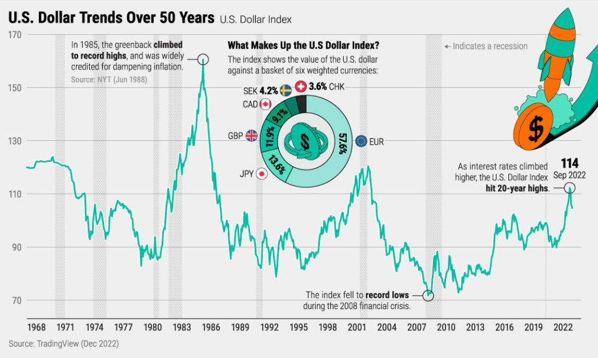

The U.S. dollar holds a paramount position in the global economy as the dominant reserve currency, underpinning international trade and financial systems. Its value influences a vast array of economic data and reports, making it a central factor in formulating trading strategies. Given the dollar's critical role, fluctuations in its value can reverberate through economic indicators, affecting investor confidence and market dynamics. Such fluctuations create both challenges and opportunities for traders.

Algorithmic trading, or algo trading, has emerged as a sophisticated method to manage these fluctuations and optimize trading outcomes. By leveraging advanced algorithms that automatically execute trades based on predefined criteria, traders can swiftly respond to market changes driven by variations in the dollar's value. This automated approach minimizes emotional bias, enhances efficiency, and enables rapid decision-making.



This article examines the complex relationship between the U.S. dollar, economic reports, and algorithmic trading. Understanding this interplay is essential for traders aiming to refine their strategies with empirical data. By utilizing technology and economic insights, traders can navigate the volatile landscape of currency markets more effectively.

## Table of Contents

## Understanding the U.S. Dollar's Global Influence

The U.S. dollar has established itself as the world's leading reserve currency. This status was solidified after World War II during the Bretton Woods Conference in 1944, where the dollar was pegged to gold, and other currencies were pegged to the U.S. dollar. This system fostered stability and placed the dollar at the center of the international monetary system. Although the Bretton Woods system eventually ended in 1971, the dollar maintained its primary position due to the size and stability of the U.S. economy, the liquidity of U.S. capital markets, and investor confidence in U.S. monetary policies.

The U.S. dollar's value is a critical factor in international trade and investments. A strong dollar increases the purchasing power of American consumers for foreign goods, making imports cheaper and potentially leading to higher trade deficits. Conversely, a weaker dollar can boost U.S. exports by making them more affordable to foreign buyers, potentially reducing trade deficits. For foreign investors, currency valuations can significantly influence returns on investments in U.S. assets. Changes in the dollar's value can impact the valuation of foreign exchange reserves held by governments worldwide.

Several major currency pairs are directly influenced by the dollar's movements, including EUR/USD, USD/JPY, and GBP/USD. These pairs represent significant trade relationships between the U.S. and European countries, Japan, and the United Kingdom, respectively. The dollar's fluctuations against these currencies can be prompted by diverse factors such as trade negotiations, interest rate differentials, and geopolitical tensions.

The Federal Reserve plays a crucial role in determining the dollar's strength through its monetary policy. Decisions regarding interest rates, quantitative easing, and open market operations directly influence the supply of and demand for the dollar. For example, an increase in interest rates can attract foreign capital, strengthening the dollar as investors seek higher returns on U.S. assets. Conversely, lower interest rates may reduce investor incentives, weakening the dollar.

Geopolitical events often reinforce the dollar's status as a safe haven currency. In times of global uncertainty, such as political unrest, economic crises, or military conflicts, investors and governments typically seek assets perceived as low-risk. The U.S. dollar, alongside U.S. Treasury securities, is traditionally favored for its security and [liquidity](/wiki/liquidity-risk-premium). Such conditions lead to increased demand for the dollar, appreciating its value irrespective of domestic economic conditions. Through its historic and ongoing influence on global trade and finance, the U.S. dollar remains a cornerstone of the international monetary system, perpetually impacting global economic dynamics.

## Economic Reports and Their Impact on the U.S. Dollar

Economic reports play a crucial role in influencing the U.S. dollar's value through various economic indicators, which inform investors and policymakers about the state of the economy. Key indicators include Gross Domestic Product (GDP), unemployment rates, and inflation, each providing insights into economic health and potential future monetary policy actions.

Gross Domestic Product (GDP) is the broadest measure of economic activity, representing the total value of goods and services produced over a specific time period. GDP reports are released quarterly by the Bureau of Economic Analysis (BEA) and are considered vital for assessing economic growth. A higher-than-expected GDP growth rate is typically bullish for the U.S. dollar as it signals robust economic conditions, potentially leading to higher interest rates.

Unemployment rates, published monthly by the Bureau of Labor Statistics (BLS), indicate the percentage of the labor force that is unemployed but actively seeking employment. A declining unemployment rate generally supports the dollar, reflecting a strengthening labor market. Conversely, rising unemployment can induce dollar depreciation due to potential monetary easing by the Federal Reserve.

Inflation metrics, particularly the Consumer Price Index (CPI) and the Personal Consumption Expenditures (PCE) index, offer insights into price stability. The CPI is released monthly by the BLS and measures the average change in prices paid by urban consumers for goods and services. The PCE index, preferred by the Federal Reserve, is published monthly within the BEA’s personal income and outlays report. Inflation exceeding the central bank's target may lead to tighter monetary policies, thus strengthening the dollar, while lower inflation may have the opposite effect.

Economic indicators are reported according to a structured schedule, enabling anticipation among traders and investors. For instance, initial GDP estimates are typically issued at the end of the first month following a quarter's end. The currency market often reacts instantly to these releases, with deviations from expectations causing [volatility](/wiki/volatility-trading-strategies). 

To illustrate unexpected impacts, consider the release of U.S. employment data on October 8, 2021, which showed a lower-than-expected increase of 194,000 jobs against a forecast of 500,000. This unexpected shortfall led to a temporary dip in the U.S. dollar as market participants adjusted their expectations for any imminent policy tightening by the Federal Reserve.

Market sentiment and investor expectations are critical in shaping the dollar's response to economic reports. Positive data that surpasses investor expectations can lead to a bullish market sentiment, while unexpected negative data can provoke sell-offs. Hence, traders closely monitor surveys such as the Bloomberg Economic Forecast or the Economic Sentiment Indicator to gauge potential market reactions prior to data releases.

By understanding the intricacies of economic report impacts, traders can make informed decisions. Economic indicators offer not only snapshots of economic health but also signals for future monetary policies, making their interpretations vital for currency valuation and trading strategy development.

## Algorithmic Trading: A Tool to Navigate the Dollar's Volatility

Algorithmic trading, frequently abbreviated as algo trading, has revolutionized modern financial markets by employing computer algorithms to automate and optimize trade execution. This form of trading leverages complex mathematical models and computational techniques to make informed trading decisions at speeds and frequencies unattainable through human intervention alone.

### Swift Reaction to Economic Data Releases

Algo trading systems are meticulously crafted to process vast amounts of market data and react in real-time to economic data releases. These systems monitor key economic indicators, such as GDP growth rates, unemployment figures, and inflation data, which often have immediate and substantial impacts on currency valuations, particularly the U.S. dollar. The automation inherent in algo trading enables traders to execute trades within milliseconds of data publication, capitalizing on short-lived market inefficiencies before human counterparts can react. This capability is attributed to sophisticated event-driven algorithms that trigger buy or sell orders based on predefined criteria responding to economic data parameters.

### Benefits of Algorithmic Trading

The advantages of utilizing [algorithmic trading](/wiki/algorithmic-trading) are manifold, encompassing enhanced speed and efficiency. Algorithms execute trades rapidly, minimizing the market impact cost, which is the price change caused by the large trades executed over a short time. Furthermore, algorithmic trading significantly reduces emotional bias, which is a common pitfall in manual trading. By adhering strictly to the logic encoded within their algorithms, traders avoid impulsive decision-making, thereby enhancing consistency and predictability in trading outcomes.

### Successful Case Studies

Numerous instances document the success of algorithmic trading strategies deployed during economic report releases. For example, during a sudden and unexpected Federal Reserve announcement, algorithms that were set to react to significant deviations from forecasted interest rates were able to execute trades instantly, capturing value before the broader market adjusted its valuations. Such strategies often involve statistical [arbitrage](/wiki/arbitrage) and market-making algorithms, designed to profit from small discrepancies between predicted and actual economic outcomes.

### Underpinning Technology and Evolution

The relentless evolution of technology has been pivotal in the advancement of algorithmic trading systems. The backbone of these systems lies in cutting-edge computational technology, involving high-frequency trading ([HFT](/wiki/high-frequency-trading-strategies)) infrastructure, latency optimization, and advanced data analytics. Continual enhancements in [machine learning](/wiki/machine-learning) and [artificial intelligence](/wiki/ai-artificial-intelligence) have further bolstered algo trading capabilities, enabling the development of predictive models that refine trading strategies based on historical market data and evolving economic indicators.

Programming languages such as Python are widely used in algorithmic trading to build and implement algorithms efficiently. Here is a simplified Python snippet that illustrates how an algorithm may be designed to trade based on a hypothetical economic indicator:

```python
import datetime
import numpy as np

# Function to simulate economic data release
def simulate_economic_release(current_value, expected_value):
    return np.random.normal(loc=current_value, scale=expected_value * 0.1)

# Trading algorithm based on economic data
def algo_trade_on_economic_data(current_value, expected_value):
    release_value = simulate_economic_release(current_value, expected_value)
    if release_value > expected_value:
        action = "BUY"
    elif release_value < expected_value:
        action = "SELL"
    else:
        action = "HOLD"
    return action

# Example usage
current_value = 100  # Hypothetical current economic indicator value
expected_value = 102  # Expected value of this indicator

print(f"Trading action: {algo_trade_on_economic_data(current_value, expected_value)}")
```

In summary, algorithmic trading stands as a formidable tool in the modern trader's arsenal, especially for navigating the volatile movements of the U.S. dollar triggered by economic reports. As financial markets continue to evolve, the role of sophisticated algo systems in harnessing and exploiting data-driven opportunities is set to grow even further.

## Combining Economic Reports with Algo Trading Strategies

Integrating economic reports into algorithmic trading strategies involves utilizing data-driven techniques to enhance trading decisions. This process is critical for traders seeking to leverage real-time economic data for improved market responsiveness and profitability.

### Methods for Integrating Economic Data into Algorithmic Trading Models

Algorithms process vast amounts of economic data such as GDP figures, employment [statistics](/wiki/bayesian-statistics), and inflation rates to generate trading signals. These models are designed to detect patterns and anomalies swiftly, providing traders with actionable insights. The integration involves three key steps: data collection, pre-processing, and model development. Data is sourced from economic calendars and financial databases, then cleaned and formatted for input into trading algorithms.

### Using Machine Learning and AI

Machine learning (ML) and artificial intelligence (AI) are pivotal in enhancing prediction accuracy and strategy effectiveness. Techniques such as regression analysis, neural networks, and support vector machines are employed to forecast market reactions based on economic indicators. For instance, a Python implementation using scikit-learn can develop a predictive model:

```python
from sklearn.model_selection import train_test_split
from sklearn.ensemble import RandomForestRegressor
import pandas as pd

# Sample dataset containing economic indicators and market responses
data = pd.read_csv('economic_data.csv')

# Splitting the data into features and target
X = data.drop('market_response', axis=1)
y = data['market_response']

# Train-test split
X_train, X_test, y_train, y_test = train_test_split(X, y, test_size=0.2, random_state=42)

# Model training
model = RandomForestRegressor(n_estimators=100, random_state=42)
model.fit(X_train, y_train)

# Prediction
predictions = model.predict(X_test)
```

This script trains a random forest model to predict market responses to economic data.

### Importance of Backtesting Strategies

Backtesting is a crucial step in validating algorithmic strategies using historical economic data. By simulating trades with past data, traders can assess the performance and robustness of their models. This process helps in identifying potential weaknesses and optimizes strategies before deployment.

### Risk Management Techniques

Risk management is integral when trading based on economic reports. Algorithms must incorporate stop-loss and take-profit mechanisms to mitigate potential losses. Additionally, diversifying trades across different markets can reduce exposure. Hedging strategies, such as using options or futures, can also be programmed into the algorithm to protect against adverse market movements.

### Challenges and Limitations

Relying on algo trading during high-impact periods presents challenges. Market conditions can change rapidly post-economic report releases, leading to increased volatility and execution risks. Algorithms may struggle with slippage and latency issues, where the actual execution price differs from the expected price. Furthermore, unexpected geopolitical events can disrupt predictions, necessitating adaptive algorithms capable of adjustment in real-time.

In conclusion, integrating economic reports into algorithmic trading models presents numerous opportunities for increased efficiency and effectiveness. However, traders must remain vigilant of the inherent challenges and continuously optimize their approaches to accommodate the dynamic nature of financial markets.

## Future Trends in Algo Trading with Economic Reports

Emerging technologies such as artificial intelligence (AI) continue to have a profound impact on algorithmic trading strategies. AI and machine learning models can process vast amounts of data, allowing traders to make informed decisions with high degrees of accuracy. As AI algorithms become more sophisticated, they can analyze patterns in economic reports and predict market movements with increasing precision. For instance, natural language processing (NLP) allows algorithms to interpret textual data from economic reports, transforming qualitative assessments into actionable insights quickly. Python libraries, such as TensorFlow and Keras, are commonly employed for developing such AI-driven trading models.

Economic globalization significantly influences the U.S. dollar's role and trading strategies. As global trade networks become more interconnected, economic events in one region can have ripple effects worldwide. This interdependence is anticipated to lead to greater volatility in foreign exchange markets. As a result, traders may seek to enhance their algo trading strategies to better navigate the fluctuations caused by global economic shifts. The potential reconfiguration of the U.S. dollar's role as the predominant global reserve currency due to emerging economies and new digital currencies could further impact trading strategies.

The future of economic report formats and data availability appears poised for transformation. The increasing digitalization of financial markets suggests economic data will become more frequent and detailed. Enhanced data availability could empower traders to incorporate real-time analytics into their trading algorithms. This development could facilitate the continuous updating of models, thus improving response times to economic events. Traders could leverage APIs to access economic data feeds, ensuring their algorithmic models are always armed with the latest information.

Regulatory changes will also play a crucial role in shaping the future of algorithmic trading. As governments and financial regulators adapt to technological advancements, they may introduce new regulations to govern the use of AI in trading. These regulations could impact how algorithms are developed, implemented, and monitored. Adherence to compliance will likely necessitate the integration of more transparent and auditable algorithms, potentially influencing the design of future trading models.

Industry experts suggest that the integration of AI with economic reports will lead to more autonomous and intelligent trading systems. These systems will not only react to market conditions but will also anticipate potential changes based on predictive analytics. This evolution is expected to elevate the strategic complexity within financial markets, requiring traders to continuously adapt and innovate.

Traders are encouraged to remain proactive in understanding and integrating these emerging trends within their trading strategies. By leveraging advancements in technology and changes in economic landscapes, traders can position themselves advantageously in an ever-evolving market.

## Conclusion

The U.S. dollar holds a significant position within global markets due to its status as a primary reserve currency, impacting economic reports and financial trading. Its fluctuations influence not only international trade but also investment strategies globally. These fluctuations present both challenges and opportunities for traders. As the dollar's value shifts, economic reports provide critical insights that can alter market dynamics, creating waves that experienced traders can leverage.

Algorithmic trading offers distinct advantages in managing and capitalizing on these dollar-induced market fluctuations. By employing complex mathematical models and sophisticated algorithms, traders can execute strategies with high precision and speed. This reduces emotional bias and enhances the ability to respond to economic data promptly, making it an invaluable tool in markets characterized by rapid shifts. For instance, an algorithm might instantaneously buy or sell assets based on predefined criteria extracted from the latest GDP figures, ensuring optimal timing.

Traders are encouraged to keep abreast of ongoing developments in both algorithmic strategies and economic indicators. As the landscape of global finance continues to evolve, staying informed about technological advancements and economic shifts is crucial. The use of machine learning and artificial intelligence is becoming increasingly prevalent, offering traders enhanced predictive capabilities.

The relationship between currency impacts, economic data, and trading technology is symbiotic, each element influencing the others. Effective trading strategies require an understanding of how these components interact. Exploring further resources, engaging with the latest research, and consulting industry expertise can enhance one's ability to harness algorithmic trading strategies effectively. Such continual learning ensures traders remain competitive, adaptive, and proficient in navigating high-stakes financial environments.

## References & Further Reading

[1]: Bergstra, J., Bardenet, R., Bengio, Y., & Kégl, B. (2011). ["Algorithms for Hyper-Parameter Optimization."](https://papers.nips.cc/paper/4443-algorithms-for-hyper-parameter-optimization) Advances in Neural Information Processing Systems 24.

[2]: ["Advances in Financial Machine Learning"](https://www.amazon.com/Advances-Financial-Machine-Learning-Marcos/dp/1119482089) by Marcos Lopez de Prado

[3]: ["Evidence-Based Technical Analysis: Applying the Scientific Method and Statistical Inference to Trading Signals"](https://www.amazon.com/Evidence-Based-Technical-Analysis-Scientific-Statistical/dp/0470008741) by David Aronson

[4]: ["Machine Learning for Algorithmic Trading"](https://github.com/stefan-jansen/machine-learning-for-trading) by Stefan Jansen

[5]: ["Quantitative Trading: How to Build Your Own Algorithmic Trading Business"](https://www.amazon.com/Quantitative-Trading-Build-Algorithmic-Business/dp/1119800064) by Ernest P. Chan