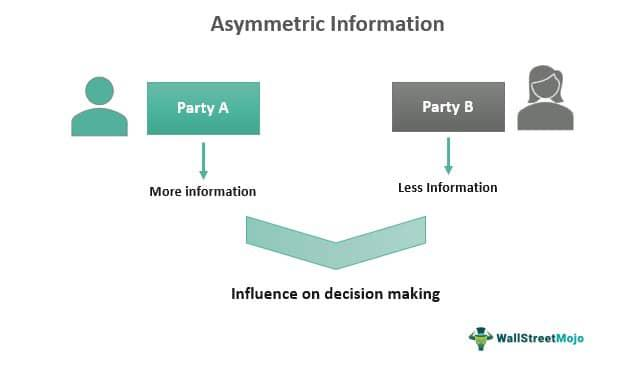

In today's fast-paced trading environment, information asymmetry plays a crucial role in shaping the dynamics of financial markets. This concept refers to a situation where one party in a transaction possesses more or superior information compared to another. In financial markets, this imbalance can significantly affect decision-making, trading outcomes, and overall market efficiency.

This article examines the impact of information asymmetry on algorithmic trading, a technology-driven method that heavily relies on data to execute trading strategies. By leveraging complex algorithms and high-frequency data, algorithmic trading has transformed how market participants engage in buying and selling activities. However, this reliance on information makes these trading models especially sensitive to any asymmetries present in the market.

Algorithmic trading systems attempt to capitalize on small, fleeting opportunities, often executing trades in fractions of a second. In an environment where quicker access to information can lead to substantial profits, information asymmetry becomes a critical factor. Parties with access to superior information can achieve advantageous positions, potentially altering market dynamics and affecting liquidity and pricing.

Understanding the nuances of information asymmetry is essential for comprehending how it influences market participants' strategies and behaviors. Traders equipped with advanced algorithms aim to analyze vast amounts of data swiftly and derive insights that may be hidden from less-informed competitors. As a result, the balance of information becomes a competitive edge in the arena of algorithmic trading.

In summary, as we explore the landscape of algorithmic trading, it becomes evident that addressing information asymmetry is vital for maintaining fair and efficient market conditions. This exploration will provide insights into the fundamental nature of information asymmetry, its implications, and the ways it can be regulated to ensure equitable trading practices.

## Table of Contents

## Understanding Information Asymmetry

Information asymmetry is a fundamental concept in economics and finance, occurring when one party in a transaction possesses more or better information than the other. This imbalance often leads to suboptimal decision-making processes and can have significant ramifications in financial markets and trading environments.

### Sources and Types of Information Asymmetry

In financial markets, information asymmetry primarily arises from two types of information: technical and fundamental. Technical information pertains to data derived from market activity, including price movements, trading volumes, and historical trends. Traders and investors rely on technical indicators and statistical patterns to make informed trading decisions. Fundamental information, on the other hand, involves data related to the intrinsic value of a financial asset, such as earnings reports, economic indicators, and industry trends. Access to more timely or accurate fundamental information can provide a significant advantage to those privy to it.

Sources of information asymmetry may include corporate insiders, analysts with access to non-public data, and technologically advanced trading entities that utilize sophisticated algorithms to analyze large datasets. These parties can achieve superior insight into an asset's potential performance, leading to advantages in market participation.

### Implications for Market Efficiency

The presence of information asymmetry poses challenges for market efficiency, a condition where prices fully reflect all available information. According to the Efficient Market Hypothesis (EMH), when information is asymmetrically distributed, the market cannot be perfectly efficient, as not all participants base their decisions on the same level of data. As a result, prices may not accurately represent an asset's true value, leading to mispricing and potential market distortions.

Mathematically, the adverse effects of information asymmetry can be represented by models such as the Grossman-Stiglitz Paradox, which argues that if markets were perfectly efficient, the incentives to gather information and trade on it would vanish, as information would already be reflected in prices. This paradox highlights the inherent tension between information acquisition and market efficiency.

Information asymmetry also introduces adverse selection and moral hazard into trading activities. Adverse selection occurs when parties with more information selectively engage in trades that are beneficial to them but detrimental to less informed participants. Moral hazard arises when one party takes on excessive risk because they do not bear the full consequences of their actions, often because the risk has been transferred to less informed stakeholders.

Addressing information asymmetry is crucial for maintaining fair and efficient markets. Regulatory frameworks and technological advancements aim to reduce these imbalances, promoting transparency and leveling the playing field for all market participants. However, complete eradication of information asymmetry remains a significant challenge.

## Effects of Information Asymmetry on Trading

Information asymmetry in trading manifests when one participant possesses more or superior information than others, leading to fundamental challenges such as adverse selection and moral hazard. Adverse selection occurs when traders with asymmetric information can anticipate market movements better than others, enabling them to execute trades that capitalize on their informational advantage. This can undermine market fairness and integrity, as these informed traders are positioned to gain disproportionately compared to their less-informed counterparts.

Moral hazard, another consequence of information asymmetry, arises when individuals or entities take on higher risks because they do not bear the full consequences of their actions, often due to the information advantage they hold. In trading contexts, this may result in behavior that distorts market dynamics, as traders leveraging inside information might engage in riskier strategies, assuming they can mitigate potential losses due to their informational edge.

Real-world examples vividly illustrate the impacts of such asymmetries: consider high-frequency trading firms that use advanced algorithms capable of processing information at lightning speeds. These firms can react to market changes more quickly than traditional investors, resulting in trades executed based on data available milliseconds before it reaches the broader market. This speed advantage allows them to benefit from price discrepancies, influencing the [liquidity](/wiki/liquidity-risk-premium) and pricing mechanisms of financial instruments.

The presence of information asymmetry affects market outcomes significantly, influencing pricing, liquidity, and overall market quality. Prices in a market with significant information asymmetries might not reflect the true value of assets, leading to inefficiencies. Algorithmic traders with superior access to information may exploit these inefficiencies, profiting from trades that align less informed traders on the less favorable side of the price.

Liquidity, a crucial component of market health, can also be adversely impacted. Disparities in information can lead to decreased trading by uninformed traders, who might withdraw due to perceived or realized disadvantages. This withdrawal reduces the overall market liquidity, which in turn escalates trading costs and enhances [volatility](/wiki/volatility-trading-strategies).

The overall market quality, defined by efficiency and fairness, deteriorates under significant information asymmetries. An imbalanced distribution of information leads to a lack of trust in market operations, causing long-term negative perceptions that can discourage participation. 

Thus, addressing information asymmetry is essential not only for maintaining fairness and efficiency but also for enhancing transparency and trust in financial markets.

## Algorithmic Trading and Information Asymmetry

Algorithmic trading utilizes advanced data analysis, programming, and mathematical formulas to execute trades with precision and speed. At the core of this practice is the ability to harness information asymmetry—when one party possesses superior information over others— to gain a competitive edge in the marketplace. Algorithms, by design, can exploit these asymmetries, often through faster and more data-driven decisions than human traders.

Algorithmic strategies capitalize on the rapid processing of vast datasets to identify trading opportunities that may not be immediately apparent to others. For instance, algorithms can assess real-time data about market movements, historical price trends, and even social media sentiment to make informed trading decisions. The speed at which algorithms process this information often means they can execute trades before the rest of the market has time to react.

To respond effectively to asymmetric information, algorithms are developed with strategies that include statistical [arbitrage](/wiki/arbitrage), [trend following](/wiki/trend-following), and market-making. These strategies rely on detecting patterns or anomalies in data that indicate potential price movements. For example, [statistical arbitrage](/wiki/statistical-arbitrage) algorithms exploit the price differentials of correlated securities, executing trades that benefit from the expected realignment of these prices.

Technological advancements play a crucial role in minimizing information gaps. High-frequency trading ([HFT](/wiki/high-frequency-trading-strategies)) is one such advancement, allowing algorithms to execute a large number of orders at extremely high speeds, often within microseconds. This capability enables traders to respond almost instantaneously to new information, maximizing their advantage over others who may not have access to the same level of data or speed.

Furthermore, [machine learning](/wiki/machine-learning) and [artificial intelligence](/wiki/ai-artificial-intelligence) are increasingly employed in [algorithmic trading](/wiki/algorithmic-trading) to enhance the ability to predict market movements and reduce information asymmetries. These technologies enable continuous learning from new data inputs, improving the algorithms' accuracy and decision-making over time.

The implementation of these advanced technologies underscores the importance of creating a balanced trading environment, where the benefits of fast, algorithm-driven trading do not lead to unfair market conditions. As algorithms become more sophisticated, so too must the regulatory frameworks that govern their use, ensuring they contribute to market efficiency rather than exploiting it.

## Regulating Information Asymmetry in Algorithmic Trading

Regulatory bodies are tasked with the crucial role of managing information asymmetries that can skew market dynamics, especially in algorithmic trading. They implement various frameworks to ensure that all market participants operate on a level playing field, which is vital for maintaining market integrity.

One of the primary regulatory measures involves the enforcement of insider trading laws. These laws prohibit trading based on non-public, material information, effectively minimizing the advantage that well-informed traders may have over others. In algorithmic trading, compliance with such regulations is essential, as algorithms can process and act on information with incredible speed. Regulatory bodies also mandate that financial institutions implement robust compliance programs that detect and prevent potential violations of insider trading rules.

Further, transparency is a critical [factor](/wiki/factor-investing) in reducing information asymmetries. Regulatory frameworks require financial markets to provide greater transparency in trading activities. This can include timely disclosures of financial information, trading volumes, and price movements. Enhanced transparency facilitates informed decision-making and reduces the chances of information exploitation by algorithmic traders. Additionally, circuit breakers and other automated mechanisms are often implemented to ensure orderly trading during periods of extreme volatility, which can be exacerbated by information asymmetries.

Beyond transparency, regulators also focus on ensuring that algorithmic trading systems are subject to stringent oversight. This includes periodic audits, the necessity for proper documentation of trading algorithms, and stress tests that simulate various market conditions to assess the resilience of these trading systems. 

Moreover, regulators have introduced measures to monitor and impose controls on high-frequency trading (HFT). By implementing minimum resting periods for orders and [volume](/wiki/volume-trading-strategy) caps, regulatory bodies aim to prevent manipulative behaviors such as quote stuffing, which can occur when algorithms deliberately submit a high volume of orders to create confusion in the market.

In conclusion, regulation plays a pivotal role in curtailing information asymmetry within algorithmic trading. Through insider trading laws, enhanced transparency, and strict oversight of trading systems, regulatory bodies strive to maintain fair market conditions and protect the interest of all market participants. These efforts not only uphold market integrity but also contribute to sustaining investor confidence in an increasingly automated trading environment.

## Challenges and Opportunities

Managing information asymmetry in algorithmic trading involves navigating several challenges while simultaneously identifying ethical and legal opportunities. One primary challenge is the rapid pace at which information is processed and utilized. Algorithms designed to exploit asymmetries must do so without breaching ethical standards or regulatory requirements. This necessitates a strategic balance between innovation and ethical practices where algorithms are not only sophisticated but also comply with market regulations.

Opportunities arise for traders to leverage asymmetries through informed decision-making that adheres to legal frameworks. Traders can harness data analytics to identify patterns and trends, using machine learning models to predict market movements with higher accuracy. Ethical leverage of asymmetries involves strategies such as statistical arbitrage, where traders capitalize on the mean-reverting nature of price series. By employing Markov chain Monte Carlo simulations or implementing [reinforcement learning](/wiki/reinforcement-learning), traders can enhance their algorithms' decision-making capacities without crossing legal boundaries.

From an ethical standpoint, it is crucial to ensure algorithms operate transparently, reducing the risk of exploiting information asymmetries unfairly. Strategies should be assessed for potential biases that could result in unethical trading practices. The deployment of algorithms that incorporate bias detection mechanisms can aid in maintaining fairness.

Looking towards the future, advancements in fintech promise to reduce information asymmetry further. Blockchain technology, for example, offers the potential to enhance transparency within financial markets by providing immutable records of transactions. Similarly, the integration of artificial intelligence in trade execution can lead to more informed strategies that consider a wider range of information factors, thereby diminishing information gaps.

Moreover, regulatory technologies (RegTech) are poised to streamline compliance processes, enabling traders to focus on ethical innovation. By using RegTech solutions such as automated monitoring systems, firms can ensure their algorithmic strategies adhere to evolving regulations, thus maintaining market integrity while encouraging innovation.

In summary, while managing information asymmetry presents challenges in both operational complexity and ethical considerations, it also offers numerous opportunities for innovation and market efficiency through technological advancements and robust regulatory mechanisms.

## Conclusion

Addressing information asymmetry in modern trading is paramount for ensuring market efficiency, transparency, and fairness. In markets characterized by rapid technological advancements and complex trading strategies, the unequal distribution of information not only distorts price discovery but also creates opportunities for participants with superior access to data. This can undermine investor confidence and lead to suboptimal allocation of resources.

To mitigate information asymmetries, continuous research and innovation are indispensable. These efforts can lead to the development of cutting-edge technologies and methodologies aimed at leveling the information playing field. For instance, advancements in artificial intelligence and machine learning offer promising avenues to process large volumes of data, potentially democratizing access to information that was previously the preserve of a few. Algorithm designers and traders should prioritize ethical algorithmic trading practices. By focusing on transparency and fairness, market participants can help foster environments where trading strategies do not rely solely on exploiting information imbalances but instead contribute to robust market dynamics. Such practices can enhance overall market liquidity and trust.

In conclusion, as trading environments continue to evolve, so too must the frameworks governing their operation. Regulatory bodies and industry participants must work in tandem to ensure that rules and systems evolve to address new challenges posed by information asymmetry. This collaboration can help safeguard the integrity of the financial system, promote investor protection, and reinforce the principles of equitable market conduct. By maintaining a proactive stance, the trading community can navigate the complex interplay of technology and regulation, ultimately contributing to a more resilient and efficient marketplace.

## References & Further Reading

[1]: Spence, M. (1973). ["Job Market Signaling."](https://academic.oup.com/qje/article/87/3/355/1909092) The Quarterly Journal of Economics, 87(3), 355-374.

[2]: Grossman, S. J., & Stiglitz, J. E. (1980). ["On the Impossibility of Informationally Efficient Markets."](https://www.aeaweb.org/aer/top20/70.3.393-408.pdf) The Quarterly Journal of Economics, 94(3), 393-408.

[3]: Akerlof, G. A. (1970). ["The Market for 'Lemons': Quality Uncertainty and the Market Mechanism."](https://personal.utdallas.edu/~nina.baranchuk/Fin7310/papers/Akerlof1970.pdf) The Quarterly Journal of Economics, 84(3), 488-500.

[4]: Easley, D., & O’Hara, M. (1987). ["Price, Trade Size, and Information in Securities Markets."](https://www.sciencedirect.com/science/article/pii/0304405X87900298) Journal of Financial Economics, 19(1), 69-90.

[5]: Barth, A., & Sojli, E. (2009). ["Information Asymmetries in Algorithmic Trading."](https://onlinelibrary.wiley.com/doi/abs/10.1111/j.1468-5957.2009.02133.x) SSRN Electronic Journal. 

[6]: O'Hara, M. (1995). ["Market Microstructure Theory."](https://openlibrary.org/books/OL1103097M/Market_microstructure_theory) Wiley-Blackwell.

[7]: Lopez de Prado, M. (2018). ["Advances in Financial Machine Learning."](https://www.amazon.com/Advances-Financial-Machine-Learning-Marcos/dp/1119482089) Wiley.

[8]: Chan, E. P. (2009). ["Quantitative Trading: How to Build Your Own Algorithmic Trading Business."](https://github.com/egorpe/EPChan-QuantitativeTrading/blob/master/example7_6.m) Wiley.