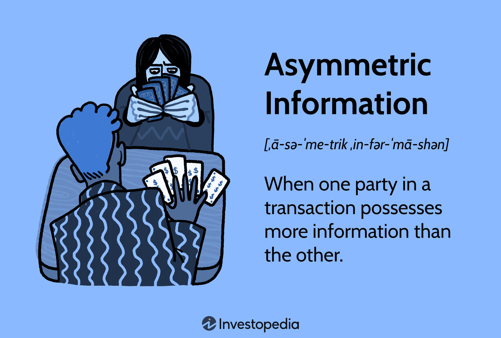

## Table of Contents

## What is information asymmetry in trading?

Information asymmetry in trading happens when one person knows more than another about something important. In trading, this means that some people might have information about a company or a market that others don't have. This can give them an advantage because they can make better decisions about buying or selling.

For example, if an insider at a company knows about a big problem that will hurt the company's profits, they might sell their shares before the news becomes public. Other people, who don't know about the problem, might keep buying the shares, thinking everything is fine. This is unfair and can lead to big losses for those who don't have the information.

To reduce information asymmetry, rules and regulations are put in place. These rules try to make sure that important information is shared with everyone at the same time. This helps to create a fairer trading environment where everyone has a better chance to make good decisions.

## How does information asymmetry affect financial markets?

Information asymmetry can cause big problems in financial markets. When some people know more than others, it can lead to unfair trades. For example, if someone knows a company is going to do badly but keeps it secret, they might sell their shares before the news gets out. Other people, who don't know about the bad news, might keep buying the shares. This can make the market prices go up or down in ways that don't make sense, and it can hurt a lot of people who lose money because they didn't know the full story.

To fix this, governments and financial groups make rules to share important information with everyone at the same time. These rules help make the market fairer. When everyone has the same information, they can make better choices about buying and selling. This can make the market more stable and trustworthy. But even with these rules, information asymmetry can still happen, and it's something that people in the market always need to watch out for.

## Can you provide examples of information asymmetry in trading?

One example of information asymmetry in trading is insider trading. Imagine that someone who works at a company finds out that the company is going to have a big problem soon. This person decides to sell their shares before the news becomes public. Other people who don't know about the problem keep buying the shares, thinking everything is okay. When the bad news finally comes out, the price of the shares drops a lot, and those who bought the shares lose money. The person who sold their shares early made money because they had information that others didn't have.

Another example is when a company knows about a new product that will be very popular, but they keep it a secret. The company's leaders might buy more shares of their own company before the product is announced. When the product is finally revealed, the share price goes up because everyone wants to buy the company's shares. The leaders who bought the shares early make a lot of money because they knew about the product before everyone else. This is unfair because other people didn't have the same chance to make money from the new product.

## What are the consequences of information asymmetry for individual investors?

Information asymmetry can be really bad for individual investors. When some people have important information that others don't, it's like playing a game where some players can see the whole board and others can't. Individual investors might buy or sell stocks based on what they know, but if they don't have all the information, they can make bad choices. This can lead to them losing money because they bought stocks that seemed good but were actually going to go down in value.

To help protect individual investors, there are rules that try to make sure everyone has the same information. These rules are important because they help make the market fair. But even with these rules, information asymmetry can still happen. So, individual investors need to be careful and do their own research. They should also pay attention to news and announcements from companies to try and stay as informed as possible. This way, they can make better decisions and protect their money.

## How can information asymmetry lead to market inefficiencies?

Information asymmetry can make markets less efficient because some people have information that others don't. When this happens, the people with more information can make trades that others might not understand. This can cause prices to move in ways that don't make sense if everyone had the same information. For example, if someone knows a company is going to do badly but keeps it secret, they might sell their shares before the bad news gets out. This can make the stock price stay high longer than it should, which is not good for the market.

When markets are not efficient, it means that prices don't always show what something is really worth. This can lead to problems because people might buy or sell things at the wrong prices. If everyone had the same information, prices would be more accurate, and the market would work better. But because of information asymmetry, some people can take advantage of others, which can make the market less fair and less efficient.

## What measures can be taken to reduce information asymmetry in trading?

To reduce information asymmetry in trading, one important measure is to have strict rules about sharing information. Companies need to tell everyone about important things that could affect their stock price at the same time. This way, no one gets a head start on the news. Governments and financial groups make these rules to keep the market fair. They also watch to make sure no one is breaking the rules, like doing insider trading, which is when someone uses secret information to make money.

Another way to reduce information asymmetry is by making sure that information is easy to find and understand. This means having good websites and reports that explain things clearly. Financial education is also important. If people know more about how markets work, they can make better choices. By helping everyone have the same chance to learn and understand, we can make the market more fair and efficient.

## How do insider trading laws relate to information asymmetry?

Insider trading laws are made to fight against information asymmetry. These laws say that people who work at a company can't use secret information to make money. For example, if someone knows their company is going to have a big problem but keeps it quiet, they can't sell their shares before everyone else finds out. This is because it's not fair to other people who don't know about the problem and might still buy the shares.

These laws help make the market more fair by trying to stop information asymmetry. When everyone has the same information, they can make better choices about buying and selling. Governments and financial groups watch to make sure no one is breaking these rules. This helps keep the market honest and stops people from taking advantage of others who don't have all the information.

## What role do financial analysts play in mitigating information asymmetry?

Financial analysts help reduce information asymmetry by collecting and sharing important information about companies and markets. They study a lot of data, like financial reports and news, to understand what is happening with a company. Then, they write reports and make predictions about how well a company might do in the future. By sharing this information with everyone, financial analysts help make sure that people in the market have a better chance to know what's going on. This way, everyone can make more informed decisions about buying or selling stocks.

Even though financial analysts do a lot to help, they can't fix all the problems with information asymmetry. Sometimes, they might not have all the information themselves, or they might make mistakes in their predictions. But overall, their work helps to level the playing field a bit. By making information more available and easier to understand, financial analysts play an important role in making the market fairer and more efficient for everyone.

## How does technology impact information asymmetry in modern trading?

Technology has changed the way information is shared in trading. Now, with the internet and social media, news and data can spread very quickly. This means that more people can find out about important things happening with companies almost at the same time. Trading platforms and apps also give people easy access to a lot of information, like stock prices and financial reports. This helps to reduce information asymmetry because more people can see the same information and make better choices about buying and selling.

But technology can also make information asymmetry worse in some ways. For example, some people might use special computer programs to find out information faster than others. These programs can look at a lot of data very quickly and find patterns that others might miss. This can give some traders an advantage because they can act on the information before everyone else knows about it. So, while technology helps to share information more widely, it can also create new kinds of information asymmetry if not everyone has access to the same tools and technology.

## What are the ethical implications of exploiting information asymmetry?

Exploiting information asymmetry is not fair. It means some people use secret information to make money, while others don't know about it and might lose money. This can hurt a lot of people who trust the market to be fair. When someone uses information that others don't have, it goes against the idea that everyone should have the same chance to make good choices. This can make people lose trust in the market and feel like it's not a fair place to trade.

Rules and laws are made to stop people from exploiting information asymmetry. These rules try to make sure everyone has the same information at the same time. But even with these rules, some people might still try to find ways to use secret information. This is why it's important for everyone to follow the rules and for governments to keep watching the market. By doing this, we can help make the market a fairer place where everyone has a better chance to succeed.

## How do different market structures influence the degree of information asymmetry?

Different market structures can change how much information asymmetry there is. In a market where there are lots of buyers and sellers, like a stock exchange, information can spread quickly. This is because many people are watching and sharing news about companies. When everyone can see the same information, it helps to reduce information asymmetry. But even in these big markets, some people might still find ways to use secret information to their advantage.

In smaller markets, like those for rare items or private companies, information asymmetry can be a bigger problem. There are fewer people involved, so it's easier for some to know things that others don't. For example, if you're buying a rare painting, the seller might know more about its value than the buyer. This can make it hard for the buyer to know if they're paying a fair price. In these smaller markets, it's important to do a lot of research and maybe even get help from experts to try and learn as much as possible.

## What advanced strategies can traders use to capitalize on or protect against information asymmetry?

Traders can use several advanced strategies to either take advantage of information asymmetry or protect themselves from it. One way is by using [algorithmic trading](/wiki/algorithmic-trading), which involves using computer programs to find patterns in market data very quickly. These programs can help traders see things that others might miss, like small changes in stock prices that could mean someone knows something others don't. By acting on this information fast, traders can make money before the news spreads to everyone. But this strategy can also make information asymmetry worse because not everyone has access to these expensive tools.

Another strategy is to focus on insider trading detection. Traders can look for signs that someone might be using secret information, like unusual trading activity before big news comes out. By watching for these signs, traders can try to protect themselves by not making the same trades as those who might have inside information. They can also report any suspicious activity to the authorities, which helps keep the market fair. This way, traders can try to avoid losing money because of information asymmetry and help make the market a better place for everyone.

## References & Further Reading

[1]: Spence, M. (1973). ["Job Market Signaling."](https://academic.oup.com/qje/article/87/3/355/1909092) The Quarterly Journal of Economics, 87(3), 355-374.

[2]: Grossman, S. J., & Stiglitz, J. E. (1980). ["On the Impossibility of Informationally Efficient Markets."](https://www.aeaweb.org/aer/top20/70.3.393-408.pdf) The Quarterly Journal of Economics, 94(3), 393-408.

[3]: Akerlof, G. A. (1970). ["The Market for 'Lemons': Quality Uncertainty and the Market Mechanism."](https://personal.utdallas.edu/~nina.baranchuk/Fin7310/papers/Akerlof1970.pdf) The Quarterly Journal of Economics, 84(3), 488-500.

[4]: Easley, D., & O’Hara, M. (1987). ["Price, Trade Size, and Information in Securities Markets."](https://www.sciencedirect.com/science/article/pii/0304405X87900298) Journal of Financial Economics, 19(1), 69-90.

[5]: Barth, A., & Sojli, E. (2009). ["Information Asymmetries in Algorithmic Trading."](https://onlinelibrary.wiley.com/doi/abs/10.1111/j.1468-5957.2009.02133.x) SSRN Electronic Journal. 

[6]: O'Hara, M. (1995). ["Market Microstructure Theory."](https://openlibrary.org/books/OL1103097M/Market_microstructure_theory) Wiley-Blackwell.

[7]: Lopez de Prado, M. (2018). ["Advances in Financial Machine Learning."](https://www.amazon.com/Advances-Financial-Machine-Learning-Marcos/dp/1119482089) Wiley.

[8]: Chan, E. P. (2009). ["Quantitative Trading: How to Build Your Own Algorithmic Trading Business."](https://github.com/egorpe/EPChan-QuantitativeTrading/blob/master/example7_6.m) Wiley.