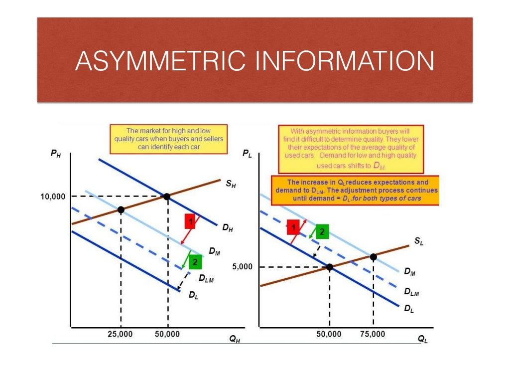

The modern financial landscape is increasingly shaped by sophisticated technologies, notably algorithmic trading. This form of trading deploys advanced algorithms and utilizes rapid processing capabilities to perform trades at speeds unreachable by human traders. By analyzing massive datasets, these systems can discern patterns and implement trades within microseconds, fundamentally transforming financial markets to become more efficient and liquid.

However, algorithmic trading systems are not without complications. One prominent issue is the introduction of asymmetric information, where an information imbalance exists between parties in a transaction. Asymmetric information arises when one party possesses more or superior information than the other, potentially leading to market inefficiencies. In the context of financial markets, this can manifest as competitive disadvantages for less informed traders, which may ultimately affect trust and decision-making processes.

The presence of asymmetric information in financial transactions may lead to market failures, characterized by adverse selection and moral hazard. Adverse selection refers to situations where traders with more information exploit those with less, impacting asset valuation and allocation efficiency. Moral hazard occurs when one party is incentivized to take excessive risks because they are insulated from consequences, commonly due to anticipated external support or bailouts.

Given these challenges, this article aims to explore the implications of information asymmetry specifically within the sphere of algorithmic trading. It will investigate how these disparities affect market dynamics and propose solutions that foster more equitable trading practices. Through a combination of regulatory frameworks and technological innovations, the goal is to enhance transparency and ensure fairer market conduct, enabling a more resilient financial ecosystem.

## Table of Contents

## Understanding Asymmetric Information

Asymmetric information occurs when one party in a transaction possesses more or better information than the other, potentially leading to an imbalance that can disrupt market operations. This concept was notably explored by economist George Akerlof in his seminal work, "The Market for Lemons." Akerlof's theory highlights the used car market as a quintessential example. Here, sellers often have more knowledge about the quality of a vehicle than buyers. This discrepancy leads to market inefficiencies, as buyers, wary of purchasing defective cars or "lemons," might be unwilling to pay a premium price, regardless of the car's actual condition. As a result, the market tends towards a lower equilibrium price and a dwindling of high-quality goods.

Beyond the used car market, asymmetric information has significant implications in various economic sectors, including insurance and healthcare. In insurance, adverse selection emerges when those at higher risk are more likely to purchase coverage, unbeknownst to insurers. This can lead insurers to raise premiums, pushing lower-risk individuals out of the market, thereby exacerbating the imbalance. Similarly, healthcare encounters challenges such as moral hazard, where insured individuals might engage in riskier health behaviors knowing they have coverage, thus influencing costs and service provisioning.

Understanding these principles of asymmetric information is crucial for promoting transparency and efficiency in markets. Addressing informational imbalances through regulatory frameworks, mandatory disclosures, and improved communication can enhance trust among market participants and improve overall functioning.

## The Market Impact of Asymmetric Information

Asymmetric information significantly impacts financial markets by facilitating adverse selection and moral hazard. Adverse selection arises when individuals privy to non-public information engage in trading activities, thereby influencing asset prices. This information imbalance creates a scenario where less-informed market participants bear higher risks, leading to suboptimal market conditions. A notable consequence of adverse selection is the distortion of prices, which can deter potential investors and reduce market [liquidity](/wiki/liquidity-risk-premium).

Moral hazard, another market inefficiency caused by asymmetric information, manifests when market participants assume excessive risks under the anticipation of external bailouts. This behavior was prominently exhibited during the 2008 financial crisis, where financial institutions engaged in high-risk activities, expecting government interventions in case of failure. Such actions undermine the stability of financial markets and can lead to severe economic repercussions.

High-frequency trading ([HFT](/wiki/high-frequency-trading-strategies)) exemplifies how asymmetries in information access can disrupt market fairness. HFT firms leverage advanced technologies to execute trades at speeds beyond the reach of traditional human traders. This speed advantage allows these firms to capitalize on fleeting price discrepancies before other market participants can react, further exacerbating information asymmetry. The widespread use of HFT raises concerns about the equitable distribution of information and the integrity of financial markets.

Addressing these disparities necessitates the implementation of technological solutions and stringent regulations. Technologies such as data analytics and [machine learning](/wiki/machine-learning) can help in monitoring trades and ensuring compliance with fair practices. These tools are capable of identifying patterns indicative of information asymmetry and can facilitate timely interventions to rectify imbalances. Moreover, regulatory frameworks play a crucial role in protecting market participants, particularly smaller investors, from the adverse effects of information asymmetries. Ensuring transparent and fair trading environments is essential for maintaining market efficiency and investor trust.

## Algorithmic Trading and Information Asymmetry

Algorithmic trading has fundamentally transformed the landscape of financial markets by executing trades at speeds unmatchable by human traders. This transformation has introduced new dimensions of information asymmetry, primarily benefiting high-frequency trading (HFT) firms. These firms leverage technological advancements to process and analyze information faster than their competitors, gaining significant market advantages. This rapid processing capability allows HFT firms to act on slight price discrepancies, often before they are widely recognized by others, thereby reaping substantial profits through [arbitrage](/wiki/arbitrage) opportunities.

AI models used in [algorithmic trading](/wiki/algorithmic-trading) further exacerbate these disparities. With the capacity to conduct advanced data analysis, these models identify complex patterns and correlations in vast amounts of financial data that are not easily discernible to human traders. For instance, machine learning algorithms can forecast market movements by identifying historical patterns and anomalies, potentially giving AI-driven trading systems a superior understanding of market dynamics compared to traditional trading methods.

The potential for collusion becomes an unintended consequence when similar AI-driven algorithms operate across different trading platforms. These algorithms might respond similarly to market conditions, inadvertently affecting market prices and contributing to [volatility](/wiki/volatility-trading-strategies). Such behavior raises concerns regarding market manipulation and fairness, as it can lead to price distortions that misrepresent the true market equilibrium.

To address these challenges, regulations and technological solutions are crucial. Regulatory bodies play a vital role in ensuring transparency and equitable data access across the market. This can involve mandating disclosures that provide all market participants with access to the same information simultaneously, thereby leveling the playing field. Technological solutions can also be implemented to monitor trading activities and detect collusive patterns among trading algorithms. Advanced surveillance systems that utilize machine learning and anomaly detection techniques help identify irregular trading behavior that may indicate unfair practices.

Overall, as algorithmic trading systems continue to evolve, ongoing efforts to address information asymmetry through regulations and technology are essential. These measures aim to promote fairer trading environments and protect against the exploitation of information disparities in financial markets.

## Economic Solutions to Mitigate Asymmetric Information

Governments play a crucial role in mitigating asymmetric information by enforcing transparency through mandatory disclosures and fair practice regulations. These measures require firms to provide accurate and timely information to stakeholders, thus reducing uncertainty and fostering trust. For instance, financial markets are governed by regulations that mandate the disclosure of financial statements and other relevant data, helping smaller investors make informed decisions and protecting them from insider trading and manipulative practices.

Warranties and guarantees further contribute to reducing information asymmetries by signaling product quality. When a company provides a warranty, it shows confidence in the product's reliability, reducing buyer concerns over hidden defects or potential malfunctions. This, in turn, boosts consumer confidence and encourages competitive market practices.

Regulatory frameworks also aim to prevent unfair practices and promote competition, which serves to balance information asymmetries. By establishing clear rules and guidelines, these frameworks level the playing field, ensuring that all market participants have equal access to necessary information. This approach discourages monopolistic behavior and encourages innovation.

Education and information dissemination are equally important in empowering consumers to make informed decisions. By enhancing financial literacy and awareness, individuals are better equipped to assess the risks and benefits of their transactions. This educational approach involves providing resources and tools that help consumers understand complex market dynamics and the potential asymmetries involved.

Overall, a combination of regulatory measures, transparency requirements, and educational initiatives are essential to address and mitigate the effects of asymmetric information in various markets. These strategies not only enhance market efficiency but also foster a more equitable environment for all participants.

## Mechanisms in Algo Trading to Address Information Asymmetry

Mechanism design theory is instrumental in addressing information asymmetry within algorithmic trading by structuring incentives and promoting transparency. This economic theory provides frameworks where desired outcomes can be achieved by aligning the interests of different market participants.

Algorithmic trading systems leverage high-speed data processing to continuously monitor market conditions and adjust trading strategies to reflect accurate pricing. These systems utilize advanced algorithms capable of executing trades with a precision that minimizes gaps in information between different market actors. By processing vast amounts of market data, algorithmic systems can swiftly identify discrepancies in pricing or market behavior, allowing the execution of trades that more accurately represent true market conditions. For example, trading algorithms can be programmed to detect arbitrage opportunities resulting from price differences across different exchanges or financial instruments.

Data analytics and machine learning models play a crucial role in parsing large volumes of trading and financial data to identify patterns indicative of market discrepancies. Machine learning models are particularly effective in this context, as they can be trained to recognize subtle changes in market dynamics that suggest new trends or potential mispricing. These models continuously learn and adapt to new information, enhancing their ability to predict market movements and inform trading strategies. One common approach is using supervised learning techniques where algorithms are trained on historical market data to forecast future price movements or identify anomalies.

Technological advancements in trade execution systems ensure that trading environments are fair by continuously adapting to changes in available information. These systems incorporate real-time data feeds and employ latency-sensitive technologies to minimize the time between data acquisition and trade execution, thereby reducing the information advantage that high-frequency traders might otherwise exploit. Technologies such as high-speed networking, parallel processing, and low-latency trading platforms are integral in supporting this rapid adaptation to information changes.

By maintaining market equilibrium, these systems contribute significantly to reducing the effects of information asymmetry. Algorithmic trading mechanisms ensure that markets remain efficient and that prices reflect all available information. This ongoing adaptation helps in providing a level playing field where price determination is less influenced by those with an informational edge. As a result, traders with access to less sophisticated tools or technologies have a better chance of competing in a market that is transparent and efficient.

In summary, the integration of mechanism design theory and technological advances in algorithmic trading helps mitigate the adverse effects of information asymmetry. Through continuous monitoring, adaptive algorithms, and data-driven insights, these systems enhance market transparency and fairness, contributing to a more stable and equitable financial environment.

## Conclusion

Addressing information asymmetry is essential for promoting market efficiency in both traditional and algorithmic trading. Information asymmetry can result in market inefficiencies, adversely affecting price discovery, liquidity, and overall market integrity. Consequently, implementing effective regulatory frameworks and harnessing technological innovations are pivotal strategies in creating more informed trading environments.

Regulatory frameworks play a crucial role in mitigating the impact of information imbalances by enforcing rules that promote transparency and fairness. These regulations aim to protect smaller investors from the manipulative practices of informed traders, thereby leveling the playing field. Policies such as mandatory disclosure requirements and restrictions on insider trading help minimize information disparities amongst market participants.

Technological advancements, especially in machine learning and data analytics, have emerged as powerful tools for identifying and correcting information imbalances. These technologies enable the rapid processing and analysis of large datasets to uncover hidden patterns and anomalies that signify distorted information flows. By enhancing transparency, they facilitate improved price accuracy and liquidity in financial markets.

Looking ahead, the development of more robust systems capable of mitigating advantages derived from information asymmetry is likely. Future trading systems might incorporate advanced algorithms capable of adapting to dynamic market conditions in real-time, reacting to new data more efficiently. Additionally, the integration of blockchain technologies may offer decentralized solutions to tracking and verifying information, thus reducing potential gaps in data integrity.

Ultimately, continuous research and innovation stand as crucial pillars in the pursuit of a fairer and more resilient financial system. As markets evolve, ongoing efforts to refine regulatory frameworks and leverage technological advancements will be vital in maintaining market equilibrium and ensuring equitable trading conditions for all participants.

## References & Further Reading

Akerlof, G. A. (1970). The Market for 'Lemons': Quality Uncertainty and the Market Mechanism. This foundational paper by George Akerlof explores the concept of asymmetric information using the used car market as an example, where sellers have more knowledge about the quality of a vehicle than buyers, leading to market inefficiencies.

Securities and Exchange Commission (SEC) (2023). Laws and Regulations. The SEC provides a comprehensive overview of the regulations in financial markets to protect investors and ensure market stability. Its emphasis on transparency and fair trading practices addresses issues related to information asymmetry.

Hull, J. C. (2015). Risk Management and Financial Institutions. This text covers the various aspects of risk management in financial institutions, including how they deal with information imbalances and hedge against potential financial risks, as well as the role of regulatory frameworks in mitigating these issues.

MacKenzie, D. (2019). Trading at the Speed of Light: How Ultrafast Algorithms Are Transforming Financial Markets. This book examines how high-frequency trading and algorithmic systems have reshaped financial markets. It sheds light on the technological arms race for speed, which often exacerbates information asymmetries.

O'Hara, M. (1997). Market Microstructure Theory. This seminal work on market microstructure addresses how various trading mechanisms and market designs can influence information flow and price formation, contributing to a deeper understanding of information asymmetry and its impact on market efficiency.

Hasbrouck, J. (2007). Empirical Market Microstructure: The Institutions, Economics, and Econometrics of Securities Trading. Hasbrouck's book analyzes the empirical aspects of market microstructure, offering insights into how information asymmetries manifest in securities trading and the tools available to measure and mitigate these effects.

