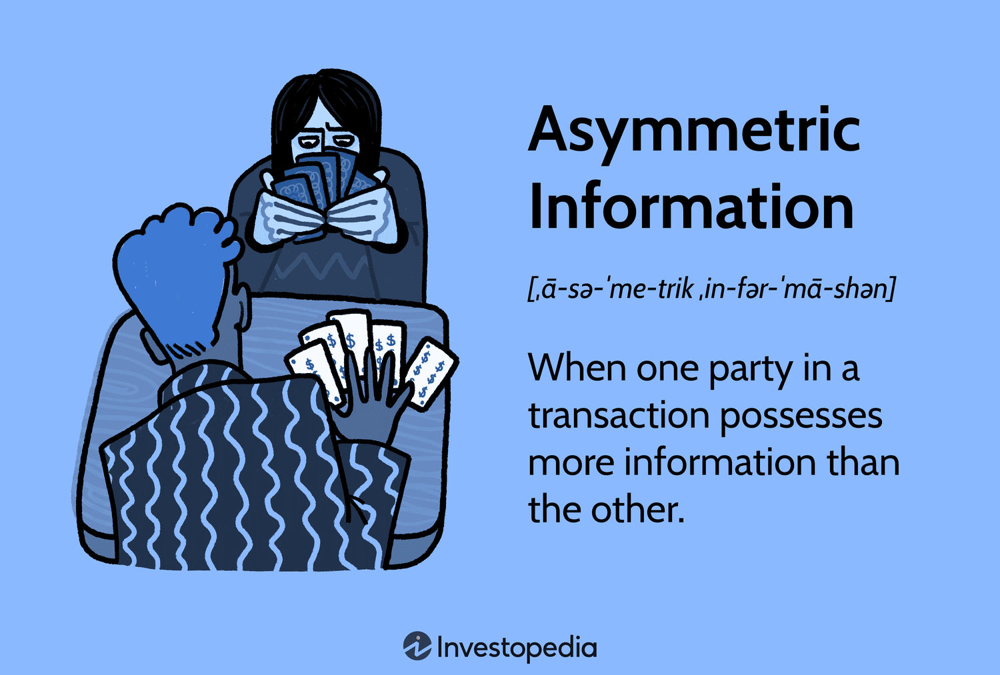

## Table of Contents

## What is information asymmetry?

Information asymmetry is when one person in a deal knows more than the other person. This often happens in business, like when selling a used car. The seller might know about problems with the car that the buyer doesn't know. Because of this, the buyer might pay too much or make a bad choice.

This can cause problems in markets. People might not want to buy things if they think the seller knows more. This can make it hard to sell good products because buyers are scared. Governments and businesses try to fix this by making rules or giving more information to everyone.

## Can you provide examples of information asymmetry in everyday life?

One common example of information asymmetry happens when you go to the doctor. The doctor knows a lot about medicine, but you might not know much. The doctor can suggest treatments or tests, but you might not know if they are really needed or if there are better options. This can make it hard for you to make good choices about your health.

Another example is when you buy a used car. The person selling the car knows all about its history, like if it has been in accidents or has problems. But you, as the buyer, might not know these things. You might end up paying a lot for a car that has hidden issues, because the seller has more information than you do.

Information asymmetry also happens in the job market. When you apply for a job, the employer might not know how good you really are at your job. You know your own skills and experience, but the employer has to guess based on your resume and interview. This can make it hard for you to get the job you want, or for the employer to find the best person for the job.

## How does information asymmetry affect market efficiency?

Information asymmetry can make markets less efficient. When one person knows more than the other, it can lead to bad choices. For example, if a buyer doesn't know about a car's problems, they might pay too much for it. This can make buyers scared to buy things, which can slow down the market. If people are afraid to buy, sellers might have a hard time selling good products, because buyers think they might be tricked.

To fix this, markets try to share more information with everyone. Governments might make rules that force sellers to tell the truth about what they are selling. Companies might also give more details about their products to build trust. When everyone has the same information, it's easier to make good choices, and the market can work better. But it's hard to get rid of information asymmetry completely, so markets are never perfectly efficient.

## What are the different types of information asymmetry?

There are two main types of information asymmetry: adverse selection and moral hazard. Adverse selection happens before a deal is made. It's when one person knows more than the other, and this can make the deal unfair. For example, if you're buying a used car, the seller might know it has problems but doesn't tell you. You might buy the car thinking it's good, but really, you're getting a bad deal. This can make people scared to buy things because they think sellers might be hiding important information.

Moral hazard happens after a deal is made. It's when one person can do something that affects the other person, but the other person can't see it. For example, if you have car insurance, you might drive more recklessly because you know the insurance will pay if you have an accident. The insurance company can't watch you all the time, so they don't know if you're being careful or not. This can make insurance more expensive for everyone because the company has to guess how risky people are.

## What is the principal-agent problem and how is it related to information asymmetry?

The principal-agent problem happens when one person (the principal) hires another person (the agent) to do something for them. The problem is that the agent might not always do what's best for the principal. This is because the agent might have different goals or might know more about what they're doing than the principal does. For example, a company's shareholders (principals) hire managers ([agents](/wiki/agents)) to run the company. The managers might make choices that help themselves more than the shareholders, like giving themselves big bonuses instead of working to make the company more profitable.

This problem is closely related to information asymmetry because the agent usually knows more about their job than the principal does. The manager knows more about running the company than the shareholders do. Because of this, it's hard for the principal to know if the agent is doing a good job or not. To try to fix this, principals might use things like performance bonuses or regular reports to keep agents in check. But it's still hard to make sure the agent always does what's best for the principal, because the agent has more information.

## How can information asymmetry lead to market failure?

Information asymmetry can lead to market failure because it makes it hard for people to trust each other. When one person knows more than the other, it can cause bad deals. For example, if a seller knows a car has problems but doesn't tell the buyer, the buyer might pay too much for a bad car. This can make buyers scared to buy things because they think sellers might be hiding important information. If people are afraid to buy, the market can slow down, and good products might not sell well.

This problem can also make markets less fair. When people don't have the same information, some might get better deals than others. This can make the market work badly because people who know more can take advantage of those who know less. To fix this, governments and businesses try to share more information with everyone. But it's hard to get rid of information asymmetry completely, so markets can still fail because of it.

## What strategies can be used to reduce information asymmetry?

One way to reduce information asymmetry is by making rules that force people to tell the truth. Governments can make laws that say sellers have to share important information about what they're selling. For example, car sellers might have to tell buyers if a car has been in an accident. This helps buyers know more about what they're buying, so they can make better choices. Companies can also help by giving more details about their products. If a company tells you everything about their product, you're more likely to trust them and buy from them.

Another way is by using technology to share information. Websites and apps can help people learn more about what they're buying. For example, you can read reviews from other buyers to see if a product is good or not. This helps everyone know more, so the market can work better. Also, having good communication between buyers and sellers can help. If buyers can ask questions and get honest answers, they'll feel more confident about their choices. By working together, we can make markets fairer and more efficient.

## How do regulations attempt to mitigate the effects of information asymmetry?

Regulations try to fix information asymmetry by making rules that force people to share important information. For example, the government might say that car sellers have to tell buyers if a car has been in an accident or has other problems. This helps buyers know more about what they're buying, so they can make better choices. By making sure everyone has the same information, regulations help make the market fairer and stop sellers from hiding important details.

Another way regulations help is by setting up rules for businesses to follow. For example, companies might have to give clear information about their products, like what's in them or how they work. This helps buyers understand what they're getting and makes it easier to compare different products. By making sure companies are honest and open, regulations help build trust between buyers and sellers, which makes the market work better for everyone.

## What role does information asymmetry play in financial markets?

In financial markets, information asymmetry can cause big problems. Imagine you want to buy stocks in a company. The people who run the company know a lot more about how it's doing than you do. They might know about problems that could make the stock go down, but you don't know that. If you buy the stock without knowing these problems, you might lose money. This can make people scared to invest, because they worry they might be tricked. When people are scared, they might not buy or sell as much, which can make the market slow down.

To fix this, there are rules that make companies share important information with everyone. For example, companies have to tell the public about their earnings and any big changes that might affect their stock price. This helps everyone know more, so they can make better choices about buying or selling stocks. But it's hard to get rid of information asymmetry completely. Some people might still find ways to know more than others, so the market can never be perfect. But by trying to share information as much as possible, we can make financial markets fairer and more efficient.

## How does information asymmetry impact negotiations and bargaining?

Information asymmetry can make negotiations and bargaining tricky. When one person knows more than the other, it can lead to unfair deals. For example, if you're buying a house, the seller might know about problems with the house that you don't know about. If you don't know these problems, you might offer more money than the house is worth. This can make you feel cheated later on. Because of this, people might be scared to negotiate, thinking the other person might be hiding important information.

To make negotiations fairer, people try to share more information. If both sides know the same things, it's easier to make a good deal. For example, in a job interview, if the employer tells you about the job and what they expect, and you tell them about your skills and experience, you can both make a better decision. But it's hard to get rid of information asymmetry completely. So, even with more information, one person might still know more than the other, which can make negotiations tough.

## What are the latest research findings on the economic impacts of information asymmetry?

Recent research shows that information asymmetry can lead to big economic problems. When one person knows more than the other in a deal, it can make markets less fair and efficient. For example, a study found that in the housing market, sellers often know more about the condition of their homes than buyers do. This can cause buyers to pay too much for houses with hidden problems, which can make them lose trust in the market. When people don't trust the market, they might not buy or sell as much, which can slow down the economy.

Another finding is that information asymmetry can affect how much people are willing to invest. A recent study in financial markets showed that when investors think companies might be hiding important information, they are less likely to buy stocks. This can make it harder for companies to get the money they need to grow, which can hurt the economy. To fix these problems, researchers suggest that governments and companies should share more information with everyone. By making markets more open and fair, we can help the economy work better for everyone.

## How can advanced technologies like blockchain help in reducing information asymmetry?

Blockchain technology can help reduce information asymmetry by making information more open and easy to check. Imagine a big book where everyone can see what's written in it, and once something is written, it can't be changed. That's what blockchain is like. When people use blockchain, they can see all the details about a deal or a product. For example, if you're buying a used car, blockchain can show you its whole history, like if it's been in accidents or had repairs. This helps you know more about what you're buying, so you can make a better choice.

Another way blockchain helps is by making it harder for people to hide information. Because everything is recorded on the blockchain and can't be changed, it's tough for someone to lie about what they're selling. This makes markets fairer because everyone has the same information. For example, in financial markets, blockchain can show all the trades and transactions, so investors can see what's really happening. By using blockchain, we can make markets more open and honest, which can help everyone trust each other more and make better deals.

## References & Further Reading

Akerlof, G. A. (1970). The Market for 'Lemons': Quality Uncertainty and the Market Mechanism. This foundational paper by George Akerlof explores the concept of asymmetric information using the used car market as an example, where sellers have more knowledge about the quality of a vehicle than buyers, leading to market inefficiencies.

Securities and Exchange Commission (SEC) (2023). Laws and Regulations. The SEC provides a comprehensive overview of the regulations in financial markets to protect investors and ensure market stability. Its emphasis on transparency and fair trading practices addresses issues related to information asymmetry.

Hull, J. C. (2015). Risk Management and Financial Institutions. This text covers the various aspects of risk management in financial institutions, including how they deal with information imbalances and hedge against potential financial risks, as well as the role of regulatory frameworks in mitigating these issues.

MacKenzie, D. (2019). Trading at the Speed of Light: How Ultrafast Algorithms Are Transforming Financial Markets. This book examines how high-frequency trading and algorithmic systems have reshaped financial markets. It sheds light on the technological arms race for speed, which often exacerbates information asymmetries.

O'Hara, M. (1997). Market Microstructure Theory. This seminal work on market microstructure addresses how various trading mechanisms and market designs can influence information flow and price formation, contributing to a deeper understanding of information asymmetry and its impact on market efficiency.

Hasbrouck, J. (2007). Empirical Market Microstructure: The Institutions, Economics, and Econometrics of Securities Trading. Hasbrouck's book analyzes the empirical aspects of market microstructure, offering insights into how information asymmetries manifest in securities trading and the tools available to measure and mitigate these effects.

