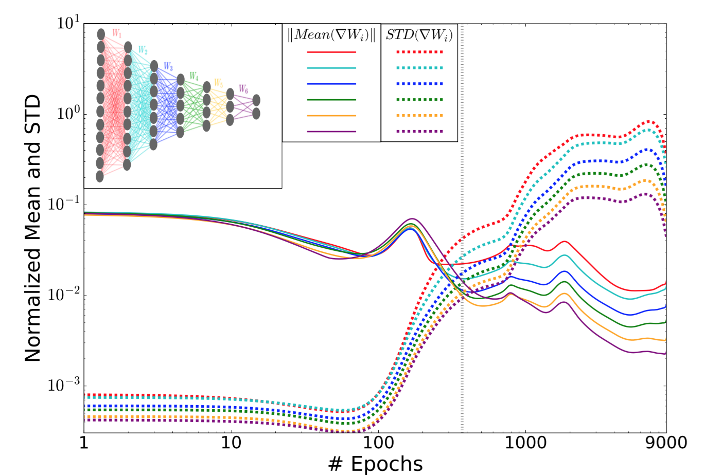

## Table of Contents

## What is the Information Bottleneck method in machine learning?

The Information Bottleneck method is a technique used in machine learning to help models learn important features from data more effectively. It works by trying to find a balance between compressing the input data and keeping the information that is useful for predicting the output. Imagine you have a lot of data, and you want to simplify it without losing what's important for making good predictions. The Information Bottleneck method helps you do that by focusing on the essential parts of the data.

This method uses concepts from information theory, specifically mutual information, to achieve this balance. Mutual information measures how much knowing one variable tells you about another variable. In the Information Bottleneck approach, the goal is to maximize the mutual information between the compressed representation of the input data and the output, while minimizing the mutual information between the compressed representation and the original input data. This can be expressed mathematically as trying to maximize $$I(T; Y)$$ while minimizing $$I(T; X)$$, where $$X$$ is the input data, $$Y$$ is the output, and $$T$$ is the compressed representation. By doing this, the model learns to focus on the most relevant features for making accurate predictions, which can lead to better performance and more efficient models.

## How does the Information Bottleneck method relate to information theory?

The Information Bottleneck method is closely tied to information theory, a branch of mathematics that deals with quantifying information. At its core, the method uses the concept of mutual information, which measures how much knowing one variable tells you about another. In the context of the Information Bottleneck method, mutual information helps in finding a compressed representation of the input data that keeps only the information needed for predicting the output. This is done by maximizing the mutual information between the compressed representation and the output, while minimizing the mutual information between the compressed representation and the original input data. The goal is to balance these two objectives, which can be expressed mathematically as trying to maximize $$I(T; Y)$$ while minimizing $$I(T; X)$$, where $$X$$ is the input data, $$Y$$ is the output, and $$T$$ is the compressed representation.

By leveraging these principles from information theory, the Information Bottleneck method helps [machine learning](/wiki/machine-learning) models focus on the most relevant aspects of the data. This approach not only aids in creating more efficient models by reducing the amount of data the model needs to process, but it also often leads to better generalization and performance. In essence, the method uses the tools of information theory to guide the learning process, ensuring that the model captures the essential features of the data that are most predictive of the output, while discarding irrelevant details.

## What are the key components of the Information Bottleneck algorithm?

The Information Bottleneck algorithm has three main parts: the input data, the compressed representation, and the output. The input data is what the algorithm starts with, like images or text. The compressed representation is a simplified version of the input data that tries to keep only the important parts. The output is what the algorithm is trying to predict or classify, like whether an image is a cat or a dog. The goal is to make the compressed representation as small as possible while still being good at predicting the output.

The algorithm uses something called mutual information to decide what to keep in the compressed representation. Mutual information measures how much knowing one thing helps you know another thing. The Information Bottleneck algorithm tries to make the mutual information between the compressed representation and the output, $$I(T; Y)$$, as big as possible. At the same time, it tries to make the mutual information between the compressed representation and the input data, $$I(T; X)$$, as small as possible. This helps the algorithm focus on the most important parts of the input data for making good predictions.

## Can you explain the mathematical formulation of the Information Bottleneck method?

The Information Bottleneck method aims to find a compressed representation of the input data that is useful for predicting the output. This is done by balancing two goals: keeping the information that helps predict the output and minimizing the information from the input data. Mathematically, this is formulated as trying to maximize the mutual information between the compressed representation, $T$, and the output, $Y$, which is written as $I(T; Y)$. At the same time, the method tries to minimize the mutual information between the compressed representation, $T$, and the input data, $X$, which is written as $I(T; X)$. The goal is to find the best $T$ that maximizes $I(T; Y)$ while minimizing $I(T; X)$.

To express this mathematically, the Information Bottleneck method can be formulated as an optimization problem. The objective is to find $T$ that solves the following:

$$\max_{p(t|x)} I(T; Y) - \beta I(T; X)$$

Here, $p(t|x)$ is the conditional probability distribution of the compressed representation $T$ given the input $X$, and $\beta$ is a parameter that controls the trade-off between the two terms. The first term, $I(T; Y)$, encourages the compressed representation to be informative about the output, while the second term, $\beta I(T; X)$, penalizes the compressed representation for being too similar to the input data. By adjusting $\beta$, you can control how much compression is applied and how much information is retained for prediction.

## What are the practical applications of the Information Bottleneck method in machine learning?

The Information Bottleneck method has many practical uses in machine learning, especially in making models more efficient and better at predicting things. For example, it can be used in data compression, where the goal is to make data smaller without losing what's important for making good predictions. This is very helpful in areas like image or text processing, where you might have a lot of data but want to keep only the parts that help you understand what's in the images or texts. By using the Information Bottleneck method, you can create a simpler version of the data that still works well for prediction tasks, which can save time and resources.

Another practical use is in feature selection, where the method helps pick out the most important parts of the data for making predictions. This can make models simpler and faster because they only need to look at the most relevant features. For example, if you're trying to predict whether someone will like a movie based on their past movie ratings, the Information Bottleneck method can help you focus on the ratings that are most important for making a good prediction. This can lead to models that are not only quicker but also more accurate because they're not distracted by irrelevant information.

In the field of [deep learning](/wiki/deep-learning), the Information Bottleneck method can be used to guide the training of neural networks. By applying the method, you can encourage the network to learn features that are both compressed and useful for the task at hand. This can be done by trying to maximize $$I(T; Y)$$ while minimizing $$I(T; X)$$, where $$T$$ is the representation learned by the network, $$X$$ is the input data, and $$Y$$ is the output. This approach can help prevent overfitting, where the model learns too much about the training data and doesn't work well on new data, leading to more robust and generalizable models.

## How does the Information Bottleneck method help in feature selection and dimensionality reduction?

The Information Bottleneck method helps in feature selection by focusing on the most important parts of the data for making predictions. It does this by using mutual information, which measures how much knowing one thing helps you know another. The method tries to keep the information that is useful for predicting the output, while getting rid of the rest. This means it can pick out the features that are most helpful for the task at hand. For example, if you're trying to predict whether someone will like a movie based on their past movie ratings, the Information Bottleneck method can help you focus on the ratings that are most important for making a good prediction. This can lead to simpler and faster models because they only need to look at the most relevant features.

In terms of dimensionality reduction, the Information Bottleneck method works by creating a compressed version of the input data that keeps the important information for prediction. This is done by maximizing the mutual information between the compressed representation, $$T$$, and the output, $$Y$$, while minimizing the mutual information between the compressed representation and the original input data, $$X$$. By doing this, the method can reduce the number of dimensions in the data while still keeping the parts that are needed for making good predictions. This can be very helpful in areas like image or text processing, where you might have a lot of data but want to keep only the parts that help you understand what's in the images or texts. The result is a simpler version of the data that still works well for prediction tasks, which can save time and resources.

## What is the difference between the Information Bottleneck and other dimensionality reduction techniques like PCA?

The Information Bottleneck method and Principal Component Analysis (PCA) are both used to reduce the number of dimensions in data, but they do it in different ways. The Information Bottleneck method focuses on keeping the information that is useful for predicting something. It does this by trying to maximize the mutual information between a compressed version of the data and the thing you want to predict, while minimizing the mutual information between the compressed version and the original data. This means it picks out the parts of the data that are most important for making good predictions. On the other hand, PCA looks at the directions in the data where there is the most variation. It tries to find new directions, called principal components, that capture as much of the data's variation as possible. PCA doesn't care about what you want to predict; it just tries to keep the data's overall structure.

Another key difference is how they handle the data. The Information Bottleneck method uses mutual information, which is a concept from information theory. It tries to solve the problem of finding the best compressed version of the data by maximizing $$I(T; Y)$$ while minimizing $$I(T; X)$$, where $$T$$ is the compressed representation, $$Y$$ is the output, and $$X$$ is the input data. This approach can be more complex but is very good at finding the most relevant features for prediction tasks. In contrast, PCA uses linear algebra to find the principal components. It's simpler and faster to compute, but it might not always pick out the features that are most important for making predictions. So, while PCA is great for general data compression and visualization, the Information Bottleneck method is better when you need to keep the parts of the data that are most useful for a specific prediction task.

## How can the Information Bottleneck method be applied to neural networks?

The Information Bottleneck method can be applied to neural networks to help them learn better and more efficiently. In a [neural network](/wiki/neural-network), the method works by guiding the network to focus on the most important parts of the data for making predictions. This is done by trying to maximize the mutual information between the network's internal representation of the data and the output it's trying to predict, while minimizing the mutual information between the internal representation and the original input data. By doing this, the network learns to create a simpler version of the data that still works well for prediction tasks. This can help prevent the network from overfitting, where it learns too much about the training data and doesn't work well on new data.

In practice, applying the Information Bottleneck method to neural networks involves adjusting the training process to include the mutual information terms. The goal is to find the best internal representation, $$T$$, that maximizes $$I(T; Y)$$ while minimizing $$I(T; X)$$, where $$X$$ is the input data and $$Y$$ is the output. This can be done by adding a penalty term to the loss function that the network tries to minimize during training. The penalty term encourages the network to compress the data while keeping the important information for prediction. By carefully balancing these two goals, the network can learn to focus on the most relevant features, leading to more robust and generalizable models.

## What challenges and limitations are associated with implementing the Information Bottleneck method?

One of the main challenges in implementing the Information Bottleneck method is the computational complexity involved in calculating mutual information. Mutual information measures how much knowing one thing helps you know another, and it can be hard to compute, especially for large datasets. This can make the method slow and resource-intensive. Another challenge is choosing the right value for the parameter $$\beta$$, which controls how much the method tries to compress the data versus keeping the information needed for prediction. If $$\beta$$ is too high, the method might compress the data too much and lose important information. If it's too low, the method might not compress the data enough, leading to less efficient models.

Another limitation is that the Information Bottleneck method can be sensitive to the quality and type of data it's applied to. If the data is noisy or has a lot of irrelevant information, the method might struggle to find the right balance between compression and prediction. This can lead to models that are not as accurate or efficient as they could be. Additionally, the method might not work well for all types of machine learning tasks. It's particularly useful for tasks where you want to focus on the most important features for prediction, but it might not be the best choice for tasks where you need to keep all the data's details, like in some image processing applications.

## Can you discuss any recent advancements or variations of the Information Bottleneck method, such as Aggregated Learning or ReInfoSelect?

Recent advancements in the Information Bottleneck method include techniques like Aggregated Learning and ReInfoSelect, which aim to improve its efficiency and effectiveness. Aggregated Learning is a variation that focuses on grouping similar data points together to make the computation of mutual information more manageable. By doing this, it can handle larger datasets more efficiently. This method helps in creating a more scalable version of the Information Bottleneck method, making it more practical for real-world applications where data is often big and complex.

ReInfoSelect, on the other hand, is a newer approach that combines the Information Bottleneck method with [reinforcement learning](/wiki/reinforcement-learning). It uses reinforcement learning to dynamically select the best features for prediction, which can improve the method's ability to find the most important parts of the data. By using reinforcement learning, ReInfoSelect can adapt to different types of data and tasks more effectively, making the Information Bottleneck method more versatile and powerful. Both of these advancements show how the Information Bottleneck method continues to evolve and find new ways to help machine learning models learn better and faster.

## How does the Information Bottleneck method contribute to the interpretability of machine learning models?

The Information Bottleneck method helps make machine learning models easier to understand by focusing on the most important parts of the data. It does this by trying to keep the information that helps predict the output, while getting rid of the rest. This means the model only looks at the features that really matter for making good predictions. When you use the Information Bottleneck method, you can see which parts of the data the model is using to make its decisions. This makes it easier to explain why the model is making certain predictions, which is important for understanding how the model works.

For example, if you're using the Information Bottleneck method to predict whether someone will like a movie based on their past movie ratings, the method can help you see which ratings are most important for making a good prediction. This can help you understand why the model thinks someone will like a particular movie. By focusing on the most relevant features, the Information Bottleneck method can make the model's decisions more transparent and easier to interpret. This is done by trying to maximize $$I(T; Y)$$ while minimizing $$I(T; X)$$, where $$T$$ is the compressed representation, $$Y$$ is the output, and $$X$$ is the input data.

## What future research directions are being considered for the Information Bottleneck method in machine learning?

One important direction for future research in the Information Bottleneck method is making it work better with big data. Right now, figuring out the mutual information between different parts of the data can be slow and hard, especially when you have a lot of data. Researchers are looking into ways to make this process faster and easier. For example, they are trying out new ways to group similar data points together, like in Aggregated Learning, to make computing mutual information more manageable. They are also looking at using reinforcement learning, like in ReInfoSelect, to help the method pick out the best features more quickly and adapt to different kinds of data.

Another area of future research is using the Information Bottleneck method to make machine learning models even easier to understand. The method already helps by focusing on the most important parts of the data, but researchers want to make it even better at explaining why a model makes certain predictions. This could involve new ways to show which parts of the data are being used and how they affect the model's decisions. By doing this, the Information Bottleneck method could help make machine learning models more transparent and trustworthy, which is important for using them in real-world situations where people need to understand how the models work.