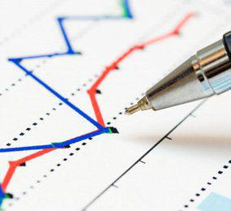

In the complex world of financial markets, understanding underlying behaviors and patterns is essential for making informed decisions. Among the various phenomena influencing market dynamics, information cascades are particularly noteworthy. Rooted in behavioral economics, information cascades occur when individuals rely on the observed actions of others rather than their private information, often leading to herding behavior. This is especially pertinent in financial markets, where herd instincts can create significant fluctuations, manifesting in phenomena such as asset bubbles and market crashes.

Information cascades have the potential to profoundly impact market behavior. They form when investors mimic the decisions of others, usually presumed to be more informed, rather than relying on their judgment. This often results in a self-reinforcing loop of collective belief, potentially detached from fundamental values. While initially stemming from a rational decision-making process, this behavior may spiral into irrational market trends driven by the trust placed in the crowd's wisdom. The fragility of these cascades emerges when new, contrary information causes a sudden shift in market sentiment, drastically altering market trajectories.



In recent years, algorithmic trading has gained prominence, transforming the operational landscape of financial markets. These algorithms, designed to execute trades at speeds unimaginable for human traders, can both influence and be influenced by information cascades. Algorithms might exacerbate the effects of a cascade if they incorporate trend-following strategies. Conversely, sophisticated algorithms can detect and exploit market inefficiencies created by cascades, allowing traders to capitalize on them. As such, algorithmic trading presents both challenges and opportunities in the context of information cascades.

This article aims to explore the complexities of information cascades within financial markets and their implications on algorithmic trading. By examining definitions, examples, and characteristics, we seek to provide a comprehensive understanding of how cascades shape market behavior. Furthermore, investigating the relationship between algorithmic trading and information cascades will highlight strategies to mitigate associated risks or harness potential gains. This understanding is crucial for investors and traders, allowing them to navigate the turbulent waters of financial markets more effectively.

## Table of Contents

## Understanding Information Cascades

An information cascade occurs when individuals, rather than relying on their own private information and analysis, opt to follow the actions and decisions of others. This phenomenon is particularly prevalent in financial markets, where investors often emulate the behavior of those they perceive as having superior knowledge or analytical capabilities. Information cascades transform into herding behavior when large groups of individuals or entities make similar decisions based on limited information, often resulting in significant market implications.

The underlying principle of information cascades is rooted in the sequential decision-making process. Consider a scenario where investors are uncertain about the intrinsic value of a particular asset. If an influential market player begins to buy or sell the asset, subsequent investors may interpret this action as a signal of superior information and adjust their actions accordingly, disregarding their own private information or analysis. This imitation can amplify trends and lead to widespread herding, where decisions are collectively based on perceived, rather than actual, information.

A critical characteristic of information cascades is their fragility. Since the cascade is built on individuals mimicking others without independent analysis, the introduction of new, credible information can easily disrupt the cascade. This can result in abrupt shifts in market dynamics, causing sudden price changes or [volatility](/wiki/volatility-trading-strategies). When new information reveals that the initial actions were based on incorrect assumptions or overestimation, the cascade can quickly reverse, resulting in sharp market corrections.

Understanding the dynamics of information cascades is essential for investors and market participants. Mistaking a cascade-driven market trend for genuine valuation changes can lead to erroneous investment decisions. For example, during the build-up to a bubble, initial price increases based on genuine demand can be exaggerated by cascades, leading many to invest based on projected trends rather than actual value. Once new information or insights reveal the mismatch between price and value, a rapid market adjustment often follows, catching investors off guard.

Overall, investors must be cautious of herd behavior and recognize the signs of information cascades to better navigate market complexities. Employing robust risk management strategies, maintaining awareness of market fundamentals, and seeking out independent analyses help mitigate the potential pitfalls associated with relying too heavily on the perceived actions of others in the marketplace.

## Examples of Information Cascades in Financial Markets

Information cascades can significantly impact financial markets by prompting sudden and pronounced shifts, which can result in the formation of bubbles or market crashes. A typical scenario illustrating an information cascade is when a respected financial analyst issues a bullish forecast on a particular stock. Enthused by the analyst's reputation and the perceived reliability of their insight, other investors might decide to purchase the stock, often disregarding their own analyses or available data. This herd behavior can drive the stock price up, sometimes far beyond its intrinsic value, underlining a classic example of an information cascade.

Throughout history, there have been numerous instances where information cascades have led to substantial market perturbations. The Dot-com Bubble of the late 1990s exemplifies this phenomenon. During this period, widespread media coverage and endorsements from influential financial experts regarding internet-based companies induced a massive wave of investments. Many investors naively followed the trend, investing significantly in dot-com companies with little regard for fundamentals or profitability, leading to an unsustainable market surge.

Moreover, the role of media reports and social media as accelerators of information cascades cannot be overstated. News outlets may amplify a market trend by repeatedly broadcasting particular economic predictions, irrespective of their veracity or potential bias. Similarly, social media platforms often act as echo chambers, where information—accurate or otherwise—rapidly echoes and magnifies among users, inducing widespread market responses. For example, platforms such as Twitter and Reddit have recently played pivotal roles in driving stock prices, as seen with the GameStop short squeeze in early 2021. Retail investors, mobilized through forums like WallStreetBets on Reddit, collectively acted in response to information and strategies shared online, highlighting the power of digital cascades.

Financial influencers, operating through social channels and investment-themed blogs, further contribute to the spread of information cascades. When these individuals share predictions or insights, they can inadvertently spur mass buying or selling actions. Given the wide audiences of some financial influencers, these opinions can materially shape market dynamics, often overriding personal judgment and leading to run-ups or drawdowns that are disconnected from the underlying securities' financial health.

Highlighting these cases emphasizes a crucial lesson for investors: the dangers of blindly following the crowd without conducting thorough due diligence. Over-reliance on external cues can compromise the stability of financial markets, making it essential for investors to practice critical assessment and independent thinking to safeguard against the potential pitfalls induced by information cascades.

## Algorithmic Trading and Market Behavior

Algorithmic trading, which utilizes computer algorithms to execute trades with speed and precision, has become a cornerstone of modern financial markets. This approach can substantially alter market dynamics, particularly in the context of information cascades. An information cascade occurs when traders, observing the actions of others, make decisions that lead to a self-reinforcing cycle, potentially causing anomalous market movements. Algorithms, relying on historical and real-time data, can be programmed to either counteract or amplify these cascades.

The influence of information cascades on [algorithmic trading](/wiki/algorithmic-trading) is significant because these algorithms can be both reactive and proactive. For instance, a well-designed algorithm might incorporate mechanisms to detect herd behavior through high-frequency trading patterns, thus avoiding buying into inflated prices. Conversely, certain algorithms might exploit these patterns by initiating trades in anticipation of predictable moves by other market participants, effectively riding the wave of the cascade.

To design effective algorithms that can recognize and manage information cascades, traders often employ advanced statistical analysis and [machine learning](/wiki/machine-learning) techniques. These technologies enable them to identify market trends and anomalies that suggest the initiation of a cascade. For example, algorithms might be programmed to initiate trades only when a particular [volume](/wiki/volume-trading-strategy) threshold is exceeded, indicating a genuine trend rather than a temporary cascade-influenced blip.

The importance of back-testing and adaptive strategies in algorithmic trading cannot be overstated. Back-testing involves simulating the performance of an algorithm using historical data to ensure its robustness under various market conditions. This process helps identify potential vulnerabilities in the algorithm that could be exploited by sudden market shifts due to information cascades. By continually updating and refining their strategies based on new data, traders can adapt to changing market conditions and minimize risks associated with unexpected cascade-induced volatility.

In practice, adaptive algorithms often utilize [reinforcement learning](/wiki/reinforcement-learning), a form of machine learning where algorithms learn optimal trading strategies through trial and error. This method allows algorithms to dynamically adjust their trading rules based on ongoing market feedback, which is crucial for navigating the unpredictability of information cascades. For example, an algorithm may initially test a strategy under different market conditions and refine its approach based on the successes and failures experienced during these trials.

Python, a widely used programming language in algorithmic trading, provides various libraries, such as NumPy and pandas, for data manipulation and analysis, while specialized libraries like TensorFlow and PyTorch facilitate the implementation of machine learning models. A simple Python snippet for back-testing a trading strategy might look like this:

```python
import pandas as pd
import numpy as np

# Sample data: historical stock prices
data = pd.read_csv('historical_prices.csv')

# Example strategy: moving average crossover
short_window = 40
long_window = 100

# Calculate the moving averages
data['Short_MA'] = data['Close'].rolling(window=short_window, min_periods=1).mean()
data['Long_MA'] = data['Close'].rolling(window=long_window, min_periods=1).mean()

# Generate trading signals
data['Signal'] = 0
data['Signal'][short_window:] = np.where(data['Short_MA'][short_window:] > data['Long_MA'][short_window:], 1, 0)

# Calculate the strategy returns
data['Strategy_Returns'] = data['Signal'].shift(1) * (data['Close'].pct_change())

# Performance metric
performance = data['Strategy_Returns'].cumsum()
print(performance)
```

This script offers a rudimentary framework for evaluating how a basic moving average strategy would perform under historical market conditions, demonstrating the initial step traders take in creating algorithms robust to information cascades.

In summary, algorithmic trading has the potential to both moderate and magnify the effects of information cascades in financial markets. Through careful design, back-testing, and adaptation, traders can either mitigate the risks associated with these patterns or utilize them to gain market advantages. Understanding and managing these dynamics is essential for optimizing trading performance and reducing exposure to cascade-driven volatilities.

## Implications for Investors and Traders

Information cascades in financial markets can serve as both a hazard and an opportunity for investors and traders. Recognizing how these cascades manifest and influence market dynamics is crucial. Investors equipped with this understanding are better positioned to devise strategies that can either hedge against potential adverse effects or exploit opportunities presented by the cascade phenomena.

One of the primary ways investors can guard against the risks of information cascades is by avoiding herd behavior. It becomes essential for investors to base their decisions on thorough and independent financial analysis rather than following the crowd. Developing a disciplined approach to due diligence helps in assessing the true value of investments amidst market noise. Investors could use quantitative models and [fundamental analysis](/wiki/fundamental-analysis) to evaluate the intrinsic value of securities, thus resisting the short-term pressures induced by cascades.

Technological advancements have substantially improved the ability to analyze market data, thereby helping traders assess the validity and impact of information cascades. Modern trading platforms offer robust analytical tools that can parse vast datasets to detect patterns indicative of herd behavior. Tools such as machine learning algorithms can scrutinize patterns in trade volumes, price movements, and sentiment analysis from news and social media. For instance, Python libraries like pandas for handling datasets, along with machine learning frameworks like scikit-learn, can assist in developing predictive models that identify the early signs of cascades.

```python
import pandas as pd
from sklearn.ensemble import RandomForestClassifier
from sklearn.model_selection import train_test_split
from sklearn.metrics import accuracy_score

# Example of utilizing machine learning to identify cascade patterns.
# Assume market_data is a DataFrame containing historical market data.
market_data = pd.read_csv("market_data.csv") 

# Features could include previous price changes, volume spikes etc.
features = market_data[['price_change', 'volume_spike', 'social_sentiment']] 
target = market_data['cascade_occurred']

# Split the data into training and testing sets.
X_train, X_test, y_train, y_test = train_test_split(features, target, test_size=0.3, random_state=42)

# Initialize the model
model = RandomForestClassifier(n_estimators=100)

# Train the model
model.fit(X_train, y_train)

# Make predictions
predictions = model.predict(X_test)

# Evaluate the model performance
accuracy = accuracy_score(y_test, predictions)
print(f"Model Accuracy: {accuracy:.2f}")
```

Balancing human intuition with algorithmic insights is imperative for optimal market performance. While algorithmic trading provides the speed and capability to process complex datasets, human insight is essential for contextual understanding and strategy adaptation. The emotional intelligence and foresight of human traders can guide strategy refinements that algorithms might overlook. Thus, an integrated approach, where human oversight complements algorithmic precision, provides a strategic edge in navigating the complexities induced by information cascades.

In summary, information cascades present a double-edged sword to market participants. By harnessing advanced analytical tools and maintaining a disciplined investment strategy, traders and investors can mitigate risks and fully capitalize on the opportunities these cascades present.

## Conclusion

Information cascades bring a unique layer of complexity to financial market behavior, influencing investor decisions and creating ripples across markets. These cascades arise when individuals in the market base their investment choices largely on the observed actions of others, often sidelining their own private information. This behavior results in herding phenomena that can trigger significant market swings, such as bubbles or crashes, due to the rapid aggregation of trends based on little substantial data.

By comprehensively understanding these cascades, investors can integrate this knowledge into their trading strategies to mitigate risks and harness potential gains. Recognizing the signs of herding behavior allows investors to steer clear of unsupported market enthusiasm or pessimism, focusing instead on data-driven decision-making. Employing thorough financial analysis combined with awareness of potential information cascades arms investors with a strategic advantage to protect and potentially grow their portfolios.

Algorithmic trading, an increasingly prevalent aspect of modern markets, is not immune to the influences of information cascades. Nonetheless, it simultaneously provides avenues for exploiting the inefficiencies they create. Algorithms equipped with the capability to detect and respond to patterns indicative of cascades can either sidestep the volatility they trigger or capitalize on the resultant temporary mispricings for profit. Such strategies necessitate rigorous back-testing and a focus on adaptive market-reactive logics to optimize performance.

The key for market participants is continuous learning and adaptation to the ever-evolving financial landscape shaped by information flows. Emphasizing the importance of ongoing education in the dynamics of information cascades alongside the evolution of algorithmic strategies is fundamental for sustained success. 

Ultimately, staying informed and cautiously balancing the insights derived from human intuition with the precision of algorithmic trading will be pivotal in navigating modern financial markets. This blend of human and technological acumen ensures a robust approach to market participation, acknowledging the rapid pace at which information and trends propagate in today's interconnected global markets.

## References & Further Reading

[1]: Bikhchandani, S., Hirshleifer, D., & Welch, I. (1992). ["A Theory of Fads, Fashion, Custom, and Cultural Change as Informational Cascades."](https://snap.stanford.edu/class/cs224w-readings/bikhchandani92fads.pdf) Journal of Political Economy, 100(5), 992-1026.

[2]: Hirshleifer, D., & Teoh, S. H. (2003). ["Herd Behaviour and Cascading in Capital Markets: a Review and Synthesis."](https://onlinelibrary.wiley.com/doi/abs/10.1111/1468-036X.00207) European Financial Management, 9(1), 25-66.

[3]: Shiller, R. J. (2000). ["Irrational Exuberance."](https://press.princeton.edu/books/paperback/9780691173122/irrational-exuberance) Princeton University Press.

[4]: Hirshleifer, D. (2001). ["Investor Psychology and Asset Pricing."](https://onlinelibrary.wiley.com/doi/abs/10.1111/0022-1082.00379) Journal of Finance, 56(4), 1533-1597.

[5]: Cont, R. (2001). ["Empirical Properties of Asset Returns: Stylized Facts and Statistical Issues."](http://rama.cont.perso.math.cnrs.fr/pdf/empirical.pdf) Quantitative Finance, 1(2), 223-236.

[6]: De Prado, M. L. (2018). ["Advances in Financial Machine Learning."](https://www.amazon.com/Advances-Financial-Machine-Learning-Marcos/dp/1119482089) Wiley.

[7]: Chan, E. P. (2009). ["Quantitative Trading: How to Build Your Own Algorithmic Trading Business."](https://github.com/ftvision/quant_trading_echan_book) Wiley Trading.

[8]: Jansen, S. (2020). ["Machine Learning for Algorithmic Trading: Predictive Models to Extract Signals from Market and Alternative Data for Systematic Trading Strategies with Python."](https://www.amazon.com/Machine-Learning-Algorithmic-Trading-alternative/dp/1839217715) Packt Publishing.