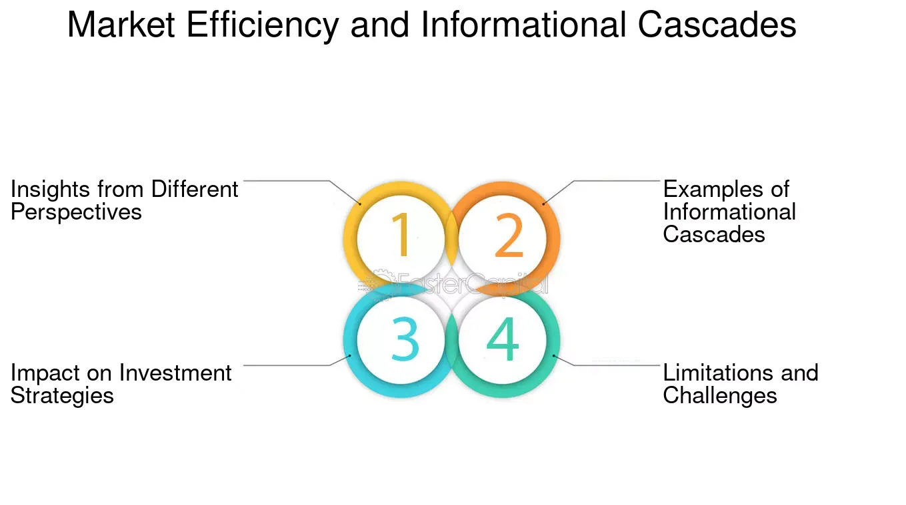

## Table of Contents

## What is an information cascade?

An information cascade happens when people make choices based on what others are doing, instead of using their own information. It starts when a few people do something, and then others see this and decide to do the same thing, thinking that the first people must have had good reasons. This can happen quickly and spread to many people, like a chain reaction.

For example, if a few people start buying a certain toy because they heard it's popular, others might see this and buy the same toy, even if they don't know why it's popular. They just follow the crowd. This can lead to a lot of people doing the same thing, even if the original information was wrong or not very good. Information cascades can affect things like what products people buy, what news they believe, or even how they vote.

## How do information cascades form in financial markets?

In financial markets, information cascades can start when investors see others making certain choices and decide to follow them. For example, if a few investors start buying a particular stock because they heard it might go up in value, others might see this and buy the same stock, thinking those first investors must know something they don't. This can lead to more and more people buying the stock, causing its price to rise quickly, even if the original information was not very reliable.

These cascades can create big swings in the market. If everyone is buying a stock because others are buying it, the price can go up a lot. But if something changes and people start selling, the price can fall just as fast. This can lead to bubbles, where prices get very high because of the cascade, and then crash when the cascade stops. It's important for investors to be careful and not just follow the crowd without thinking about why they are making their choices.

## What are the basic mechanisms driving information cascades?

Information cascades start when people see what others are doing and decide to do the same thing, instead of using their own information. This happens because people often think that if others are doing something, those others must have good reasons. For example, if someone sees a long line at a restaurant, they might think the food must be really good and decide to join the line, even if they don't know anything else about the place.

This copying behavior can spread quickly from person to person, like a chain reaction. As more people join in, the cascade grows stronger. It can keep going as long as new people keep seeing others doing the same thing and decide to follow. But if something changes, like if someone learns the restaurant's food is not good, the cascade might stop, and people might start doing something different.

## Can you provide examples of information cascades in financial markets?

One famous example of an information cascade in financial markets is the dot-com bubble in the late 1990s and early 2000s. At that time, many people started investing in internet companies because they saw others doing it and thought it was a good idea. They believed these companies would make a lot of money in the future. As more and more people bought these stocks, their prices went up a lot, even though many of the companies were not making any profit. Eventually, when people realized that many of these companies were not doing well, the bubble burst, and stock prices fell sharply.

Another example is the GameStop stock surge in early 2021. It started when some investors on social media began buying GameStop stock and talking about it online. Others saw this and thought it must be a good investment, so they started buying it too. This caused the stock price to go up very quickly. Many people joined in without really understanding the company's business, just because they saw others buying the stock. Eventually, the price went down when the buying frenzy stopped, showing how powerful information cascades can be in financial markets.

## What role do social networks play in the formation of information cascades?

Social networks are very important in starting and spreading information cascades. They help information move quickly from person to person. For example, if someone posts about a new product on social media and their friends see it, those friends might decide to buy the product too. As more people share and talk about it, even more people see the post and might decide to join in. This is how a cascade starts and grows, with each person seeing what others are doing and deciding to do the same.

In financial markets, social networks can also cause big changes. If investors see others talking about a certain stock on social media, they might decide to buy it too, thinking that others must know something they don't. This can make the stock's price go up fast as more and more people buy it. But if the information turns out to be wrong or if people stop buying, the price can fall just as quickly. Social networks make it easy for information to spread, which can start and stop cascades in the market.

## How do information cascades affect market efficiency?

Information cascades can make markets less efficient. When people follow what others are doing instead of using their own information, they might make choices that don't make sense. For example, if everyone starts buying a stock just because others are buying it, the price might go up a lot, even if the stock isn't really worth that much. This can create bubbles, where prices are too high because of the cascade. When the bubble bursts, prices can fall a lot, which can hurt the market.

On the other hand, information cascades can sometimes help markets work better. If the information that starts the cascade is good and true, more people might learn about it and make better choices. For example, if a company really is doing well and people start buying its stock because they see others doing it, the price might go up to a level that matches the company's true value. But this doesn't happen often, and usually, cascades can lead to less efficient markets because people are not using their own information to make choices.

## What are the potential benefits of information cascades in financial markets?

Information cascades can sometimes help financial markets work better. If good and true information starts the cascade, it can spread quickly to many people. For example, if a company is doing really well and people start buying its stock because they see others doing it, the price might go up to match the company's true value. This means more people can find out about good investment opportunities faster. When everyone knows the right information, they can make better choices, which can make the market more efficient.

But it's important to remember that these benefits don't happen very often. Most of the time, information cascades in financial markets can lead to problems. If the information that starts the cascade is wrong or not very good, it can cause big swings in stock prices. For example, if everyone buys a stock just because others are buying it, the price might go up a lot even if the stock isn't worth that much. This can create bubbles that can hurt the market when they burst. So, while information cascades can sometimes help, they usually make markets less efficient.

## What are the risks and negative impacts of information cascades on financial markets?

Information cascades can cause big problems in financial markets. When people start buying a stock just because others are buying it, the price can go up a lot, even if the stock isn't really worth that much. This can create a bubble, where the price is too high because of the cascade. If the bubble bursts, the price can fall quickly, and people who bought the stock at the high price can lose a lot of money. This can make the whole market go down and cause a lot of trouble for investors.

Another risk is that information cascades can make markets less fair. If only a few people know the real information and start a cascade, others might follow without knowing the truth. This means some people can make money while others lose money, just because they didn't have the same information. This can make people lose trust in the market, which is bad for everyone. So, while information cascades can sometimes help spread good information, they often lead to big problems and make markets less efficient and fair.

## How can investors identify and potentially profit from information cascades?

Investors can identify information cascades by watching what other people are doing in the market. If they see a lot of people suddenly buying a certain stock or asset, it might be because of a cascade. They can look at social media, news, and trading volumes to see if there's a lot of talk and action around a particular investment. If the price of the stock is going up quickly without clear reasons, it could be a sign that an information cascade is happening.

To potentially profit from information cascades, investors need to be careful and smart. They can try to get in early, before the cascade gets too big, and buy the stock when others start buying it. But they also need to be ready to sell before the cascade stops and the price goes down. It's important not to just follow the crowd without thinking. Investors should always do their own research and make sure they understand why they are buying something, not just because others are doing it. This way, they can make better choices and maybe make money from the cascade without getting caught in a bubble that bursts.

## What strategies can be used to mitigate the negative effects of information cascades?

One way to reduce the bad effects of information cascades is to encourage people to think for themselves. Instead of just following what others are doing, people should do their own research and make choices based on their own information. This can help stop cascades from starting or growing too big. For example, in financial markets, investors can look at a company's financial reports and news about the company, not just what others are doing. By making decisions based on good information, people can avoid getting caught in bubbles that can hurt the market.

Another strategy is to have rules and systems that help spread good information and stop bad information from spreading too fast. For example, financial markets can have rules that make companies share important information with everyone at the same time. This can help make sure that everyone has the same information and can make better choices. Also, social media and news companies can check the information they share to make sure it's true before it spreads. By doing this, they can help stop false information from starting a cascade that can cause problems.

## How do regulatory bodies address the issues caused by information cascades?

Regulatory bodies try to stop the bad effects of information cascades by making rules that help everyone get the same good information. They might make companies share important news with everyone at the same time, so no one gets left out. This can help stop some people from starting a cascade with information that others don't have. Also, regulators can watch the market closely to see if there are signs of a cascade happening, like when a lot of people start buying a stock very quickly. If they see this, they can warn people to be careful and think about why they are buying, not just follow the crowd.

Another thing regulatory bodies do is to make sure that the information people get is true. They might check what companies say about themselves and make sure it's correct. This can help stop false information from starting a cascade. They can also work with social media and news companies to stop false news from spreading fast. By doing these things, regulatory bodies try to make the market fairer and stop big problems from happening because of information cascades.

## What advanced models and theories explain the dynamics of information cascades in financial markets?

One important model that helps explain information cascades in financial markets is the "herding model." This model says that people often follow what others are doing because they think others might know something they don't. In financial markets, if a few investors start buying a stock, others might see this and buy the same stock, thinking the first investors have good information. This can start a cascade where more and more people buy the stock, making its price go up quickly. But if the original information was wrong or not very good, the price can fall just as fast when the cascade stops. The herding model helps show how these cascades can create big swings in the market.

Another theory that explains information cascades is the "rational expectations model." This theory says that people make choices based on what they think others will do. If everyone thinks others will buy a certain stock, they might buy it too, even if they don't have their own good reasons. This can start a cascade where the stock's price goes up because everyone is buying it, not because the stock is really worth that much. The rational expectations model shows how people's beliefs about what others will do can lead to big changes in the market, even if those beliefs are not based on good information.

## References & Further Reading

[1]: Bikhchandani, S., Hirshleifer, D., & Welch, I. (1992). ["A Theory of Fads, Fashion, Custom, and Cultural Change as Informational Cascades."](https://snap.stanford.edu/class/cs224w-readings/bikhchandani92fads.pdf) Journal of Political Economy, 100(5), 992-1026.

[2]: Hirshleifer, D., & Teoh, S. H. (2003). ["Herd Behaviour and Cascading in Capital Markets: a Review and Synthesis."](https://onlinelibrary.wiley.com/doi/abs/10.1111/1468-036X.00207) European Financial Management, 9(1), 25-66.

[3]: Shiller, R. J. (2000). ["Irrational Exuberance."](https://press.princeton.edu/books/paperback/9780691173122/irrational-exuberance) Princeton University Press.

[4]: Hirshleifer, D. (2001). ["Investor Psychology and Asset Pricing."](https://onlinelibrary.wiley.com/doi/abs/10.1111/0022-1082.00379) Journal of Finance, 56(4), 1533-1597.

[5]: Cont, R. (2001). ["Empirical Properties of Asset Returns: Stylized Facts and Statistical Issues."](http://rama.cont.perso.math.cnrs.fr/pdf/empirical.pdf) Quantitative Finance, 1(2), 223-236.

[6]: De Prado, M. L. (2018). ["Advances in Financial Machine Learning."](https://www.amazon.com/Advances-Financial-Machine-Learning-Marcos/dp/1119482089) Wiley.

[7]: Chan, E. P. (2009). ["Quantitative Trading: How to Build Your Own Algorithmic Trading Business."](https://github.com/ftvision/quant_trading_echan_book) Wiley Trading.

[8]: Jansen, S. (2020). ["Machine Learning for Algorithmic Trading: Predictive Models to Extract Signals from Market and Alternative Data for Systematic Trading Strategies with Python."](https://www.amazon.com/Machine-Learning-Algorithmic-Trading-alternative/dp/1839217715) Packt Publishing.