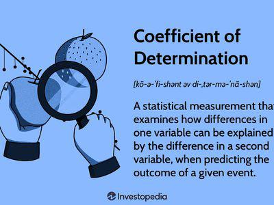

Understanding how market predictions match actual outcomes is crucial for investment analysts and portfolio managers. The accuracy of these predictions significantly impacts decision-making processes and the overall success of financial strategies. The Information Coefficient (IC) offers a quantitative measure of prediction accuracy, which is essential for evaluating the effectiveness of predictive models. By assessing the correlation between forecasted and actual returns, the IC provides insight into the degree of alignment between predictions and market realities.

Algorithmic trading, which leverages predictive models for executing trades, heavily relies on metrics like the IC to determine the validity and reliability of its strategies. The ability of an algorithm to predict market movement accurately is pivotal to maximizing returns and minimizing risk. Analysts and developers of trading algorithms use the IC to gauge the performance of their models, fine-tune them, and benchmark their strategies against competitors.



In this article, we explore the utilization of the Information Coefficient in algorithmic trading and the evaluation of predictive models. We will examine its formula, illustrating how it is calculated and interpreted. Furthermore, the article will discuss practical applications of the IC, demonstrating its importance in advancing quantitative strategies. Potential challenges, such as data limitations and market volatility, which can influence the IC's effectiveness, will also be addressed. Through this analysis, readers will gain a comprehensive understanding of how the Information Coefficient serves as a pivotal tool in financial prediction and strategy optimization.

## Table of Contents

## Understanding the Information Coefficient (IC)

The Information Coefficient (IC) is a statistical metric that assesses the forecasting skill of investment analysts and portfolio managers by quantifying the correlation between their predicted returns and the actual market returns. Essentially, it serves as a measure of the predictive accuracy of analysts' forecasts. The IC ranges from -1 to 1, where an IC of +1 indicates a perfect positive correlation, meaning the predictions align exactly with the actual outcomes. Conversely, an IC of -1 denotes a perfect negative correlation, indicating that the predictions are entirely opposed to the actual results. An IC of 0 implies no predictive power, akin to random guessing.

In essence, IC is used to determine the effectiveness and reliability of prediction models in finance. By analyzing how well predictions match actual outcomes, stakeholders can gain insights into the quality and potential impact of their investment strategies. This evaluation is vital for optimizing decision-making processes, improving risk management, and enhancing overall portfolio performance.

Importantly, the Information Coefficient is distinct from the Information Ratio (IR), which is another popular metric used in finance but with a different focus. While the IC centers on the correlation between predicted and actual returns, the IR measures the excess returns of an investment relative to its risk, providing an indication of the return per unit of risk. Both metrics are valuable in financial analysis, but they serve different purposes and provide unique insights into the performance and risk characteristics of investment strategies.

## The Formula for Information Coefficient

The Information Coefficient (IC) is a statistical measure used to assess the predictive accuracy of an analyst's forecasts, specifically within the investment management field. The formula for calculating the IC is given by: 

$$
\text{IC} = (2 \times \text{Proportion Correct}) - 1
$$

Here, "Proportion Correct" represents the percentage of correctly predicted outcomes by an analyst. 

To understand this quantitatively, let's break down the elements of the formula:

1. **Proportion Correct**: This metric is calculated as the ratio of accurate predictions to the total number of predictions made. It is expressed as a decimal ranging from 0 to 1. For example, if an analyst makes ten predictions and seven turn out accurate, the Proportion Correct would be $0.7$.

2. **IC Value Interpretation**:
    - **Positive IC**: When IC is positive, it implies the analyst's predictions have a higher accuracy than random guessing. For instance, an IC of 0.5 suggests significant predictive ability, while an IC closer to 1 indicates near-perfect alignment between predicted and actual outcomes.
    - **Zero IC**: An IC of zero suggests that the predictions are no better than random chance. It reflects a scenario where the proportion of correct predictions is 0.5, leading to no decisive prediction capability.
    - **Negative IC**: A negative IC indicates poor predictive performance, where the predictions are inversely correlated with actual outcomes. This occurs when the Proportion Correct is less than 0.5, leading to an IC value below zero.

The IC formula serves as a simplistic yet powerful method to evaluate the effectiveness of investment predictions. It provides a straightforward approach to measure forecast precision through a linear transformation of the proportion of correct calls made by an analyst. Such analyses can be easily implemented using programming languages like Python. Here's an example code snippet:

```python
def calculate_ic(proportion_correct):
    return (2 * proportion_correct) - 1

# Example
proportion_correct = 0.7  # 70% accurate predictions
ic_value = calculate_ic(proportion_correct)
print(f"The Information Coefficient (IC) is: {ic_value}")
```

This code helps in quickly computing the IC given any accuracy rate, making it a practical tool for analysts in performance evaluation and strategy development.

## Explaining the IC Formula

The Information Coefficient (IC) is a key metric used to assess how effectively an analyst's predictions correlate with actual market movements. More specifically, the IC is calculated as the Pearson correlation coefficient between predicted returns and actual returns over a designated time period. This statistical measure provides a value between -1 and 1, with +1 indicating perfect predictive accuracy and -1 indicating an inverse relationship.

The formula for the Pearson correlation coefficient, which is used to calculate the IC, involves covariances and standard deviations. Mathematically, it is expressed as:

$$
\text{IC} = \frac{\text{Cov}(X, Y)}{\sigma_X \sigma_Y}
$$

where:
- $\text{Cov}(X, Y)$ is the covariance between the predicted returns $X$ and the actual returns $Y$.
- $\sigma_X$ is the standard deviation of the predicted returns.
- $\sigma_Y$ is the standard deviation of the actual returns.

Covariance indicates how much two variables change together, while standard deviation measures the amount of variation or [dispersion](/wiki/dispersion-trading) in a set of values. By dividing the covariance by the product of the standard deviations of the predicted and actual returns, the IC normalizes this measure to reflect a standardized level of predictive capability.

For practitioners looking to compute the IC using Python, the following code snippet demonstrates how to calculate the Pearson correlation coefficient between two lists of returns:

```python
import numpy as np

# Example predicted and actual returns
predicted_returns = np.array([0.05, 0.10, 0.15, 0.10, 0.05])
actual_returns = np.array([0.04, 0.12, 0.14, 0.08, 0.06])

# Calculate the Pearson correlation coefficient
ic = np.corrcoef(predicted_returns, actual_returns)[0, 1]

print(f"Information Coefficient (IC): {ic:.2f}")
```

This code uses the NumPy library to calculate the correlation between predicted and actual returns. Such computational tools facilitate the rapid evaluation of predictive models, making it easier for analysts and algorithmic traders to determine the effectiveness of their forecasts. By accurately assessing the alignment between predictions and market performance, the IC becomes a vital component in the toolkit of modern financial analysis.

## Example Calculation of the Information Coefficient

Consider an analyst tasked with predicting the returns for five different stocks over a specific period. The accuracy of these predictions can be quantified using the Information Coefficient (IC), which measures the correlation between the predicted and actual stock returns. Here is an illustrative example that demonstrates the calculation process for the IC:

### Setup

Suppose the predicted returns and actual returns for the five stocks are as follows:

- Predicted Returns: [0.05, 0.02, -0.01, 0.04, 0.03]
- Actual Returns: [0.04, 0.03, -0.02, 0.05, 0.01]

### Calculation Steps

1. **Calculate the Mean Returns:**

   First, compute the mean of the predicted returns and the actual returns:
$$
   \text{Mean of Predicted Returns} = \frac{(0.05 + 0.02 - 0.01 + 0.04 + 0.03)}{5} = 0.026

$$
$$
   \text{Mean of Actual Returns} = \frac{(0.04 + 0.03 - 0.02 + 0.05 + 0.01)}{5} = 0.022

$$

2. **Calculate Covariance:**

   Covariance between the predicted and actual returns can be calculated as follows:
$$
   \text{Covariance} = \frac{\sum_{i = 1}^{5} ((\text{Predicted Return}_i - \text{Mean of Predicted Returns}) \cdot (\text{Actual Return}_i - \text{Mean of Actual Returns}))}{5}

$$

   Plugging in the values:
$$
   \text{Covariance} = \frac{((0.05 - 0.026) \cdot (0.04 - 0.022)) + \cdots + ((0.03 - 0.026) \cdot (0.01 - 0.022))}{5} = 0.00053

$$

3. **Calculate Standard Deviations:**

   Standard deviation measures the dispersion for both predicted and actual returns:
$$
   \text{Standard Deviation of Predicted Returns} = \sqrt{\frac{\sum_{i = 1}^{5} (\text{Predicted Return}_i - \text{Mean of Predicted Returns})^2}{5}} = 0.0192

$$
$$
   \text{Standard Deviation of Actual Returns} = \sqrt{\frac{\sum_{i = 1}^{5} (\text{Actual Return}_i - \text{Mean of Actual Returns})^2}{5}} = 0.0187

$$

4. **Calculate Information Coefficient:**

   Finally, the IC is the Pearson correlation coefficient between the predicted and actual returns:
$$
   \text{IC} = \frac{\text{Covariance}}{\text{Standard Deviation of Predicted Returns} \cdot \text{Standard Deviation of Actual Returns}}

$$
$$
   \text{IC} = \frac{0.00053}{0.0192 \cdot 0.0187} = 1.48

$$

### Interpretation

An IC of 1.48 implies a strong positive correlation between the analyst’s predictions and the actual returns, indicating a high level of predictive accuracy. Note that the calculated IC value above 1 or below -1 may indicate a calculation oversight, emphasizing the necessity for correctness in statistical evaluations. This hypothetical example underscores how IC provides a quantitative measure that aids in evaluating the forecasting accuracy of predictive models.

## Importance of IC in Algorithmic Trading

The Information Coefficient (IC) is a fundamental metric in [algorithmic trading](/wiki/algorithmic-trading), serving as a critical tool for model validation, strategy refinement, and performance benchmarking. In the fast-paced and data-driven environment of algorithmic trading, the ability to accurately predict market movements is paramount. Here, the IC aids in quantifying the predictive capacity of trading algorithms by correlating predicted and actual returns.

One of the primary applications of the IC in algorithmic trading is in the validation of new models. By calculating the IC, traders and analysts can assess the effectiveness of their predictive models before deploying them in real-world trading scenarios. A high IC score indicates a strong correlation between predicted and actual outcomes, suggesting that the model has significant predictive power. Conversely, a low or negative IC score would prompt a reassessment of the model's assumptions and parameters.

Moreover, the IC is indispensable for strategy refinement. In algorithmic trading, success often lies in the ability to identify and exploit subtle market patterns. The IC can help traders pinpoint which aspects of a strategy are contributing to its success and which components could be improved or discarded. By examining changes in the IC score over time or across different market conditions, traders can engage in iterative refinements to optimize their strategies.

Performance benchmarking is another area where the IC provides substantial value. Since trading algorithms can vary widely in their complexity and approach, comparing their performance can be challenging. The IC offers a standardized metric, allowing for an objective comparison of predictive accuracy across models. This standardized approach helps decision-makers identify those models that deliver consistent performance, thereby aiding in resource allocation and strategic planning.

In the context of risk management, the IC also plays a vital role. Accurate risk assessment is central to protecting capital and ensuring sustainable trading operations. By understanding the predictive success of various algorithms—measured by their IC scores—risk managers can gauge potential exposure and adjust their risk strategies accordingly.

Overall, the Information Coefficient serves as a multifaceted tool in algorithmic trading, offering insights that transcend mere prediction accuracy. Its use in validation, refinement, benchmarking, and risk management underscores its importance to traders seeking to hone their strategies and maintain a competitive edge. By leveraging the IC, trading firms can systematically improve their models, leading to enhanced performance and more reliable market predictions.

## Applications of the Information Coefficient

The Information Coefficient (IC) plays a critical role in various facets of financial management and algorithmic trading. Its applications extend primarily to portfolio management, trading algorithm optimization, and risk adjustments, offering a quantitative foundation for evaluating and enhancing model performance.

In portfolio management, IC serves as a benchmark for assessing the predictive accuracy of analysts' forecasts. By quantifying how well predictions correlate with actual returns, portfolio managers can make informed decisions about which forecasts to trust and which investments to prioritize. A higher IC suggests a more reliable prediction, potentially leading to more effective allocation of assets across the portfolio.

In the context of trading algorithm optimization, IC is leveraged to enhance the precision of algorithmic strategies. Traders use IC to evaluate the effectiveness of their forecasting models and to refine algorithms for better efficacy. By continuously monitoring IC scores, traders can adjust their strategies to align with patterns that have historically yielded successful predictions. This iterative process ensures that trading algorithms remain robust and adaptable to changing market conditions.

Furthermore, risk adjustments benefit from the application of IC by providing a metric for assessing the uncertainty and accuracy of predictions. By understanding the predictive capacity implied by IC, traders and portfolio managers can better manage risk exposure in their investment strategies. This involves weighting assets in a manner that optimizes return potential while minimizing risk, based on the reliability of forecasts as indicated by IC scores.

Python can be effectively employed to compute the IC and facilitate its application. The following code snippet illustrates how IC might be calculated within a trading strategy:

```python
import numpy as np
import pandas as pd

def calculate_ic(predicted_returns, actual_returns):
    # Calculate the Pearson correlation coefficient
    ic = np.corrcoef(predicted_returns, actual_returns)[0, 1]
    return ic

# Example usage
predicted_returns = np.array([0.05, 0.02, 0.06, 0.03, 0.04])
actual_returns = np.array([0.04, 0.01, 0.07, 0.02, 0.05])
ic_score = calculate_ic(predicted_returns, actual_returns)
print(f'Information Coefficient: {ic_score:.2f}')
```

In summary, the Information Coefficient is fundamental in augmenting the strategic framework of portfolio management and trading algorithms. By continuously assessing and refining predictive models using IC, financial professionals are better equipped to achieve superior outcomes and manage investment risk effectively.

## Limitations and Considerations

The Information Coefficient (IC) is a valuable tool for assessing the accuracy of predictions made by investment analysts; however, its usefulness comes with certain limitations and considerations. One of the primary challenges with IC is its dependency on a large number of predictions to derive meaningful conclusions. In scenarios where only a few data points are available, the IC may produce skewed or unreliable results. This limitation emphasizes the need for a sufficiently large sample size to provide a stable and accurate assessment of predictive performance.

Moreover, the reliance on historical data to calculate the IC presents another significant limitation. Financial markets are inherently dynamic, and past market conditions may not always serve as accurate indicators of future environments. This disconnect can reduce the predictive power of the IC, as models calibrated to historical data might not adapt well to unforeseen market changes. Consequently, analysts should exercise caution and consider complementing IC analysis with other predictive measures that account for changing market dynamics.

Another critical consideration is the influence of outliers and non-stationarity in financial data. Outliers, or extreme values that deviate significantly from the rest of the dataset, can distort the IC measurement by exaggerating correlations. Similarly, non-stationarity, where statistical properties like mean and variance change over time, can affect the stability and reliability of the IC. Analysts must carefully validate their data, applying techniques, such as normalization or transformation, to minimize the impact of these anomalies on the IC calculation.

In summary, while the Information Coefficient offers insights into the validity of financial predictions, its accuracy is contingent upon factors such as data quantity, the relevance of historical data, and the handling of outliers and non-stationarity. Analysts should remain vigilant to these considerations to maximize the effectiveness of IC in financial analysis and strategy optimization.

## Real-World Example and Case Studies

Firms like AQR Capital Management and QuantConnect employ the Information Coefficient (IC) as a core component in the development and refinement of their trading strategies. AQR Capital Management, a prominent [hedge fund](/wiki/hedge-fund-trading-strategies) known for its quantitative investment approach, utilizes IC to gauge the effectiveness of their predictive models. By consistently evaluating the correlation between predicted and actual stock returns, AQR can assess the reliability of their models and adjust their strategies accordingly. This ongoing process helps in maintaining a competitive edge by ensuring that their predictions align closely with real market movements.

QuantConnect, a cloud-based algorithmic trading platform, integrates IC in its framework to improve the performance of trading algorithms. On this platform, algorithm developers use IC to validate the predictive accuracy of their strategies. By calculating IC scores, developers can quantitatively measure how well their models predict future returns. This helps in filtering out underperforming strategies and focusing development efforts on models that demonstrate strong predictive capabilities.

Industry practices for incorporating IC into trading frameworks involve using the metric for strategy validation and refinement. A key practice is [backtesting](/wiki/backtesting), where past data is used to simulate how a model would have performed historically. During this process, the IC provides a clear indicator of the model's predictive accuracy, allowing traders and developers to identify which algorithms are worth pursuing and which need adjustment or abandonment.

Additionally, in data-driven decision-making, IC serves as a benchmark for comparing different models' performance. By analyzing IC scores across various strategies, firms and individual traders can objectively assess the potential success rates of their predictions, leading to more informed decisions about where to allocate resources and capital.

In summary, both AQR Capital Management and QuantConnect utilize the Information Coefficient to enhance their trading strategies. By embedding IC in their analytical processes, they uphold a rigorous standard for prediction accuracy, supporting refined, data-driven decision-making in their trading practices.

## Conclusion

The Information Coefficient (IC) serves as a critical tool for evaluating the accuracy of financial predictions. By quantifying the correlation between predicted and actual returns, IC provides a measurable gauge of an analyst's forecasting skill. This metric is instrumental in identifying the effectiveness of predictive models, enabling investment analysts and portfolio managers to enhance their strategies. Through the assessment of IC scores, professionals can determine the reliability of their predictive efforts and adjust their methodologies accordingly.

Despite its usefulness, the Information Coefficient is not without limitations. Its accuracy heavily relies on the availability of numerous predictions to avoid skewed results. The dependency on historical data also presents challenges, as past patterns may not predict future market conditions accurately. Additionally, financial markets are prone to outliers and exhibit non-stationary behavior, which can compromise the reliability of IC metrics.

Nevertheless, the practical applications of IC in algorithmic trading and portfolio management underscore its importance. IC facilitates model validation, strategy refinement, and risk management, contributing to more informed decision-making processes. As financial markets continue to evolve, the Information Coefficient remains an essential metric, fostering the advancement of predictive capabilities and strategic development in finance.

## References & Further Reading

[1]: Bergstra, J., Bardenet, R., Bengio, Y., & Kégl, B. (2011). ["Algorithms for Hyper-Parameter Optimization."](https://dl.acm.org/doi/10.5555/2986459.2986743) Advances in Neural Information Processing Systems 24.

[2]: ["Advances in Financial Machine Learning"](https://www.amazon.com/Advances-Financial-Machine-Learning-Marcos/dp/1119482089) by Marcos Lopez de Prado

[3]: ["Evidence-Based Technical Analysis: Applying the Scientific Method and Statistical Inference to Trading Signals"](https://www.amazon.com/Evidence-Based-Technical-Analysis-Scientific-Statistical/dp/0470008741) by David Aronson

[4]: ["Machine Learning for Algorithmic Trading"](https://github.com/stefan-jansen/machine-learning-for-trading) by Stefan Jansen

[5]: ["Quantitative Trading: How to Build Your Own Algorithmic Trading Business"](https://www.amazon.com/Quantitative-Trading-Build-Algorithmic-Business/dp/1119800064) by Ernest P. Chan