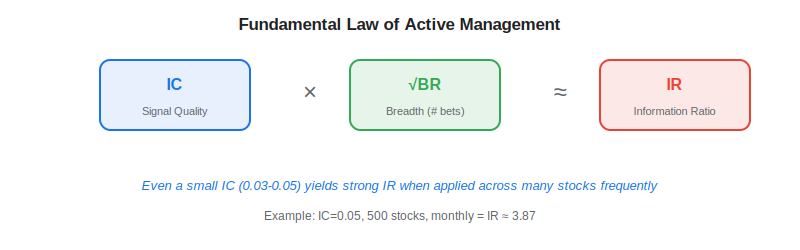
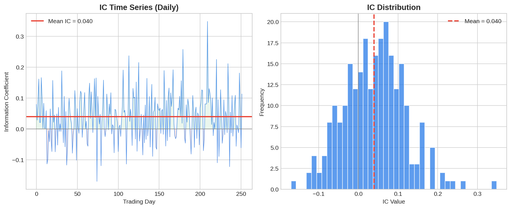

The Information Coefficient (IC) is the single most important metric for evaluating the quality of a trading signal — whether it comes from traditional factors or [alternative data](https://paperswithbacktest.com/wiki/best-alternative-data). IC measures the correlation between your signal's predictions and subsequent realized returns. An IC of 0.05 may sound tiny, but in quantitative finance, it can translate into millions in annual alpha. Understanding IC is essential for any algo trader evaluating [alternative data vendors](https://paperswithbacktest.com/wiki/alternative-data-vendors-comparison) or building proprietary signals.

## What Is the Information Coefficient?

The Information Coefficient is the Spearman rank correlation between a cross-sectional signal (at time $t$) and forward returns (from $t$ to $t+h$):

$$IC_t = \text{corr}_{\text{rank}}(\text{signal}_t, r_{t \to t+h})$$

Where $\text{signal}_t$ is the vector of signal values across all stocks at time $t$, and $r_{t \to t+h}$ is the vector of realized returns over the forecast horizon $h$. The IC is computed for each period and then averaged:

$$\overline{IC} = \frac{1}{T} \sum_{t=1}^{T} IC_t$$

A positive IC means the signal correctly predicts the relative ranking of future returns. Typical IC values for good alternative data signals range from 0.02 to 0.10.

To put these numbers in perspective, an IC of 0.05 means your signal correctly ranks roughly 52.5% of stock pairs — barely above a coin flip on any individual pair, but enormously valuable when applied across hundreds of stocks simultaneously. This is the central paradox of quantitative investing: individually, each prediction is nearly worthless; collectively, they compound into significant alpha. It is also why the IC metric is far more useful than directional accuracy (hit rate) for evaluating signals — a signal can have a hit rate barely above 50% and still generate excellent risk-adjusted returns if applied with sufficient breadth.

The IC framework was popularized by Richard Grinold and Ronald Kahn in their influential textbook *Active Portfolio Management* (1995, revised 2000), which remains the theoretical backbone of most institutional quant processes. Their key insight was connecting the raw predictive power of a signal (IC) to the portfolio-level performance (IR) through the breadth of application — encapsulated in the Fundamental Law described below. This framework gave portfolio managers a precise language for evaluating whether a new [alternative data](https://paperswithbacktest.com/wiki/best-alternative-data) source was worth its cost: compute its IC, estimate how frequently it can be applied, and calculate the resulting IR.

## Why IC Matters: The Fundamental Law of Active Management

Grinold's (1989) Fundamental Law connects IC to portfolio performance:

$$IR \approx IC \times \sqrt{BR}$$

Where $IR$ is the Information Ratio (Sharpe ratio of active returns), $IC$ is the Information Coefficient, and $BR$ is the breadth (number of independent bets per year). This means a signal with IC = 0.05 applied to 500 stocks monthly (BR ≈ 6,000) yields:

$$IR \approx 0.05 \times \sqrt{6000} \approx 3.87$$

An IR of 3.87 is exceptional. This is why even "small" ICs are enormously valuable when applied across a broad universe with frequent rebalancing.



## Python Implementation: IC Analysis Suite

```python
import numpy as np
import pandas as pd
from scipy import stats

class ICAnalyzer:
    """Comprehensive Information Coefficient analysis for trading signals."""
    
    def __init__(self, signals: pd.DataFrame, returns: pd.DataFrame):
        """
        Parameters:
        - signals: DataFrame [dates × tickers] of signal values
        - returns: DataFrame [dates × tickers] of returns
        """
        self.signals = signals
        self.returns = returns
    
    def compute_ic_series(self, horizon: int = 1) -> pd.Series:
        """Compute IC for each date at a given forward return horizon."""
        forward_returns = self.returns.shift(-horizon)
        ic_series = {}
        
        for date in self.signals.index:
            if date not in forward_returns.index:
                continue
            sig = self.signals.loc[date].dropna()
            ret = forward_returns.loc[date].dropna()
            common = sig.index.intersection(ret.index)
            
            if len(common) < 20:  # Need minimum stocks
                continue
            
            ic, _ = stats.spearmanr(sig[common], ret[common])
            ic_series[date] = ic
        
        return pd.Series(ic_series, name=f"IC_h{horizon}")
    
    def ic_summary(self, horizon: int = 1) -> dict:
        """Summary statistics for IC series."""
        ic = self.compute_ic_series(horizon)
        return {
            "mean_ic": f"{ic.mean():.4f}",
            "std_ic": f"{ic.std():.4f}",
            "ic_ir": f"{ic.mean() / ic.std():.3f}" if ic.std() > 0 else "N/A",
            "hit_rate": f"{(ic > 0).mean():.1%}",
            "t_stat": f"{ic.mean() / (ic.std() / np.sqrt(len(ic))):.2f}",
            "n_periods": len(ic),
        }
    
    def ic_by_horizon(self, horizons: list[int] = [1, 5, 10, 21]) -> pd.DataFrame:
        """Compute IC across multiple horizons for decay analysis."""
        results = []
        for h in horizons:
            summary = self.ic_summary(h)
            summary["horizon"] = h
            results.append(summary)
        return pd.DataFrame(results).set_index("horizon")

# Example usage with synthetic data
np.random.seed(42)
n_stocks, n_dates = 200, 252
dates = pd.date_range("2025-01-01", periods=n_dates, freq="B")
tickers = [f"STOCK_{i:03d}" for i in range(n_stocks)]

# Signal with embedded IC ≈ 0.04
true_alpha = np.random.randn(n_stocks) * 0.001
signals = pd.DataFrame(
    np.outer(np.ones(n_dates), true_alpha) + np.random.randn(n_dates, n_stocks) * 0.01,
    index=dates, columns=tickers
)
returns = pd.DataFrame(
    np.outer(np.ones(n_dates), true_alpha * 2) + np.random.randn(n_dates, n_stocks) * 0.02,
    index=dates, columns=tickers
)

analyzer = ICAnalyzer(signals, returns)
print("=== IC Summary (1-day horizon) ===")
for k, v in analyzer.ic_summary(1).items():
    print(f"  {k}: {v}")

print("\n=== IC Decay Across Horizons ===")
print(analyzer.ic_by_horizon([1, 5, 10, 21]))
```



## Interpreting IC Values

| IC Range | Interpretation | Strategy Implication |
|---|---|---|
| > 0.10 | Exceptional (rare, verify for data errors) | Strong standalone signal |
| 0.05–0.10 | Very good | Core alpha signal |
| 0.02–0.05 | Good | Useful in multi-signal models |
| 0.01–0.02 | Marginal | Only valuable with high breadth |
| < 0.01 | Noise | Not worth trading |

**IC Information Ratio** (ICIR = mean IC / std IC) is equally important. An IC of 0.03 with ICIR > 0.5 is more valuable than an IC of 0.05 with ICIR < 0.3, because the former is more consistent.

## IC Pitfalls to Avoid

**1. Overfitting**: Computing IC on in-sample data will overstate signal quality. Always use strict out-of-sample periods. See [alternative data and overfitting](https://paperswithbacktest.com/wiki/alternative-data-overfitting-pitfalls).

**2. Look-ahead bias**: Ensure the signal at time $t$ uses only information available before time $t$. Even small look-ahead biases can inflate IC dramatically.

**3. Survivorship bias**: If your stock universe only includes currently listed stocks, IC may be inflated because delisted losers are excluded.

**4. Non-stationarity**: IC may vary dramatically across market regimes. Analyze IC in bull vs. bear markets, high vs. low volatility periods.

## Connecting IC to the Horizon Effect

IC naturally decays as the forecast horizon increases — this is the [horizon effect](https://paperswithbacktest.com/wiki/alternative-data-horizon-effect). Running IC analysis across multiple horizons reveals the optimal rebalancing frequency for your signal. If IC at 5 days is 0.06 but at 21 days is 0.02, you should rebalance weekly, not monthly.

## Conclusion

The Information Coefficient is the lingua franca of quantitative signal evaluation. Before committing to any alternative data source, compute its cross-sectional IC at your target horizon, verify statistical significance via the t-statistic, and assess consistency via the ICIR. This single analysis tells you more about a signal's value than any vendor pitch deck.

---

**Explore further on PapersWithBacktest:**
- Browse [backtested factor strategies](https://paperswithbacktest.com/strategies) with Python code and performance metrics
- Access [clean historical market data](https://paperswithbacktest.com/datasets) for equities, crypto, and futures
- Take the [algo trading course](https://paperswithbacktest.com/course) — 60+ video lessons and notebooks
- Related wiki pages: [The Horizon Effect](https://paperswithbacktest.com/wiki/alternative-data-horizon-effect) · [Alternative Data and Overfitting](https://paperswithbacktest.com/wiki/alternative-data-overfitting-pitfalls)
