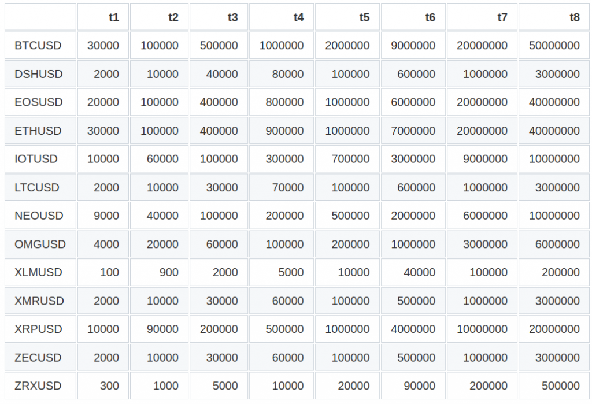

## Table of Contents

## What are information-driven bars in the context of table rows?

Information-driven bars in table rows are visual tools that help people quickly understand data. They are like small graphs inside each row of a table. These bars change in length based on the numbers they represent. For example, if you have a table showing sales numbers, the bar for a row with higher sales will be longer than the bar for a row with lower sales.

These bars make it easier to compare numbers at a glance without having to read the exact figures. They are especially useful in large tables where it can be hard to spot trends or differences just by looking at numbers. By using information-driven bars, you can see which rows have the highest or lowest values quickly, making it simpler to analyze and understand the data.

## How do information-driven bars differ from traditional table rows?

Information-driven bars add a visual element to traditional table rows. In a regular table, you just see numbers or text in each row. But with information-driven bars, you also see a small bar next to the number. This bar grows or shrinks based on the number it represents. So, if one row has a bigger number, its bar will be longer than the bar for a row with a smaller number.

This visual addition makes it easier to compare data quickly. In a traditional table, you have to read each number and do the math in your head to see which is bigger or smaller. With information-driven bars, you can just look at the length of the bars and see the differences right away. This is really helpful when you're looking at a lot of data and want to spot trends or big changes without getting bogged down in the details.

## What are the basic components of an information-driven bar?

An information-driven bar has two main parts: the bar itself and the number it represents. The bar is a visual line that gets longer or shorter based on the number next to it. If the number is bigger, the bar will be longer. If the number is smaller, the bar will be shorter. This makes it easy to see which numbers are bigger or smaller just by looking at the length of the bars.

The number next to the bar is the exact value that the bar represents. This is important because it gives you the precise data. Even though the bar helps you see the size of the number quickly, the actual number lets you know the exact amount. Together, the bar and the number make it easy to understand and compare data in a table.

## How can information-driven bars enhance data visualization in tables?

Information-driven bars make tables easier to understand by adding a visual way to see numbers. Instead of just reading numbers, you can look at the length of the bars next to each number. This helps you see which numbers are bigger or smaller without having to think too hard. It's like having a little graph in each row of the table, which makes it simple to spot trends or big changes in the data.

These bars are especially helpful when you're looking at a lot of data. In a big table, it can be hard to compare numbers just by reading them. But with information-driven bars, you can quickly see which rows have the highest or lowest values. This saves time and makes it easier to understand what the data is telling you. It's a great way to make your tables more useful and easier to read.

## What are the common use cases for implementing information-driven bars in tables?

Information-driven bars are often used in tables that show numbers, like sales data, survey results, or performance metrics. For example, if a company wants to compare sales numbers across different regions, they can add these bars to their sales report. This way, anyone looking at the report can quickly see which regions are doing well and which ones need more attention. It's a lot easier than reading through all the numbers and trying to figure it out.

These bars are also useful in dashboards and reports where people need to make quick decisions. Imagine a manager looking at a dashboard to see how different projects are progressing. With information-driven bars, they can see at a glance which projects are on track and which ones are falling behind. This helps them focus on the most important issues without getting lost in the details. It's a simple but powerful way to make data easier to understand and use.

## How do you design an effective information-driven bar for a table?

When designing an effective information-driven bar for a table, it's important to keep the bars simple and clear. The length of the bar should directly reflect the number it represents. For example, if one number is twice as big as another, the bar should be twice as long. Using a consistent scale for all bars in the table helps people compare the data easily. Also, choose a color that stands out but doesn't distract from the rest of the table. A light shade of blue or gray often works well because it's easy on the eyes and doesn't take attention away from the numbers.

Another key point is to make sure the bars are well-placed next to the numbers they represent. The bar should be right next to its number, so it's clear which bar goes with which number. This helps avoid confusion and makes the table easier to read. If the table is digital, consider adding interactive features like tooltips that show the exact number when you hover over the bar. This can be helpful for people who want to see the precise data without cluttering the table with too many numbers. By keeping these things in mind, you can create information-driven bars that make your table more useful and easier to understand.

## What are the best practices for integrating information-driven bars into existing table structures?

When adding information-driven bars to tables you already have, it's important to keep the bars simple and easy to understand. Make sure the bars are the right length for the numbers they show. If one number is bigger than another, the bar should be longer. Use the same scale for all the bars so people can compare them easily. Choose a color that stands out but doesn't distract from the rest of the table. Light blue or gray often works well because they are easy to see but don't take attention away from the numbers.

Place the bars right next to the numbers they represent. This makes it clear which bar goes with which number and helps avoid confusion. If the table is on a computer or phone, you can add features like tooltips that show the exact number when someone hovers over the bar. This way, people can see the precise data without making the table too crowded. By following these steps, you can add information-driven bars to your tables in a way that makes them more useful and easier to read.

## How can interactivity be added to information-driven bars to improve user engagement?

Adding interactivity to information-driven bars can make them more interesting and useful for users. One way to do this is by adding tooltips. When someone moves their mouse over a bar, a small box can pop up showing the exact number the bar represents. This helps users get more details without making the table look crowded. Another way is to make the bars clickable. When someone clicks on a bar, it could open a new window with more information or a detailed chart about that data point. This makes it easier for users to explore the data deeper without leaving the main table.

You can also add hover effects to the bars. For example, when someone hovers over a bar, it could change color or grow a bit to show it's interactive. This makes the table more fun to use and helps users understand they can interact with it. Another idea is to let users sort the table by clicking on the bars. If someone clicks on a bar, the table could reorder itself to show the highest or lowest values first. This feature can help users quickly find the most important data points and make the table more useful for analysis.

## What are the potential challenges and limitations of using information-driven bars in tables?

One challenge of using information-driven bars in tables is that they can make the table look crowded if not designed well. If the bars are too big or too colorful, they might distract from the numbers and make the table hard to read. Another problem is that these bars might not work well on small screens like phones. The bars might be too small to see clearly, and it can be hard to tap on them if they're interactive. Also, if the table has a lot of rows, adding bars to each one can make the table longer and harder to scroll through.

Another limitation is that information-driven bars might not be the best choice for all types of data. For example, if the numbers in the table are very close together, the bars might all look the same length, and it can be hard to tell the difference. Also, if the table has a lot of different kinds of data, adding bars to just one column might confuse people. It's important to make sure the bars help the table and don't make it harder to understand.

## How do information-driven bars support data analysis and decision-making processes?

Information-driven bars make it easier to analyze data and make decisions. When you look at a table with these bars, you can quickly see which numbers are bigger or smaller without reading each one. This helps you spot trends and patterns in the data fast. For example, if you're looking at sales numbers for different products, the bars show you which products are selling the best at a glance. This saves time and makes it easier to focus on the most important information.

These bars also help with decision-making because they make the data clearer. When you can see the differences in numbers right away, it's easier to decide what to do next. For instance, if you're a manager looking at a report on team performance, the bars can show you which team members are doing well and which ones need more support. This helps you make better decisions about where to put your attention and resources. By making the data easier to understand, information-driven bars help you make smarter and quicker choices.

## What advanced techniques can be used to customize information-driven bars for specific industries or applications?

Information-driven bars can be customized for different industries by changing their colors, sizes, and shapes to match what people in that industry need. For example, in healthcare, you might use different colors for different levels of risk, like red for high risk and green for low risk. This makes it easy for doctors and nurses to see important information quickly. In finance, you might use thicker bars for more important data points, like big changes in stock prices, to help traders see what's happening at a glance. By tweaking the bars to fit the industry, they become more useful and easier to understand.

Another way to customize information-driven bars is by adding special features that fit the needs of a specific application. For example, in a project management tool, you might let users click on a bar to see more details about a project, like its timeline and budget. This helps managers keep track of everything without getting lost in a big table. In a sports app, you might use animated bars that grow or shrink to show live updates on scores or player stats. This makes the app more exciting and helps fans stay engaged. By adding these custom features, information-driven bars can be tailored to make them more helpful and interesting for different uses.

## How can the effectiveness of information-driven bars be measured and optimized over time?

To measure how well information-driven bars are working, you can look at how quickly people understand the data and make decisions. One way to do this is by asking users to complete tasks using tables with and without the bars, and see which one helps them finish faster. You can also use surveys to ask people if they find the bars helpful and if they make the data easier to understand. By collecting this feedback, you can see if the bars are making a difference and if they need any changes.

To make information-driven bars better over time, you can keep testing and updating them based on what you learn from users. If people say the bars are too hard to see, you might make them bigger or use a different color. If users want more details, you could add features like tooltips or clickable bars that show more information. By listening to feedback and making small changes, you can keep improving the bars to make sure they stay useful and help people understand the data better.

## What are the types of Information-Driven Bars?

Information-driven bars present a sophisticated approach to data sampling in [algorithmic trading](/wiki/algorithmic-trading) by dynamically adjusting sampling frequency in response to market activity. Here, we explore three primary types of information-driven bars: Tick Imbalance Bars, Volume/Dollar Imbalance Bars, and Tick/Volume/Dollar Run Bars.

**Tick Imbalance Bars** sample data based on significant imbalances in trade direction. This method focuses on capturing the moments in market activity when the number of trades executed in one direction (buy or sell) greatly exceeds the number in the opposite direction. The idea is to identify and highlight conditions where market sentiment may be shifting, thereby offering a more accurate reflection of supply and demand dynamics. These imbalances can be quantified using formulas that compare cumulative tick volumes over a specified analytical window, subsequently determining the threshold for sampling based on pre-defined imbalance criteria.

For instance, the imbalance can be defined by:

$$
\text{Imbalance} = \sum_{i=1}^{N} \left( I(\text{buy})_i - I(\text{sell})_i \right)
$$

where $I$ is the indicator function for buy or sell trades. 

**Volume/Dollar Imbalance Bars** sample based on disparities in trade volume or dollar amounts, offering a deeper dive into the intensity of market participation. These bars trigger when there is a significant deviation in the cumulative volume or dollar amount transacted in one direction compared to another. By doing so, they capture the ebbs and flows of market liquidity and participant interest more effectively than conventional time-based bars. Volume imbalances often serve as precursors to price moves, providing a more granular and timely view of market conditions. 

The calculation might look like:

$$
\text{Dollar Imbalance} = \sum_{i=1}^{N} \left( V_i \times P_i \times I(\text{dir})_i \right)
$$

where $V$ is the trade volume, $P$ is the trade price, and $I(\text{dir})$ indicates trade direction. 

**Tick/Volume/Dollar Run Bars** emphasize the capture of streaks or runs in data, characterized by a continuous sequence of trades in the same direction or consistent volume/dollar values, indicative of emerging trends. These bars are generated when a series of successive trades meet a pre-defined cumulative threshold, signaling sustained market momentum. By aligning the data sampling closer with actual market behavior, run bars can better communicate the strength and duration of emerging price trends, providing valuable insight for traders seeking to capitalize on sustained market movements.

Python code, such as using libraries like Pandas, can be used for implementing these bars. Here's a simplistic Python pseudocode outline for implementing a Tick Imbalance Bar:

```python
def tick_imbalance_bar(trades, imbalance_threshold):
    bar_data = []
    buy_ticks = 0
    sell_ticks = 0

    for trade in trades:
        if trade['type'] == 'buy':
            buy_ticks += 1
        else:
            sell_ticks += 1

        if abs(buy_ticks - sell_ticks) >= imbalance_threshold:
            bar_data.append((buy_ticks, sell_ticks))
            buy_ticks, sell_ticks = 0, 0

    return bar_data
```

This code calculates tick bars by continually aggregating buy and sell trades and triggers a new bar when the imbalance between the two exceeds a specified threshold. Such custom algorithms enable traders to tailor bar settings to strategy-specific needs, optimizing the timing and quality of market insights.

## How can we implement information-driven bars?

Implementing information-driven bars requires setting specific thresholds to determine when to sample data, thus capturing dynamic market activities more effectively than traditional fixed-interval bars. To set these thresholds, traders often rely on moving averages, which can help tailor thresholds to reflect real-time market conditions. The moving average acts as a smoothing mechanism that reflects the average level of activity over a defined period, and it adapts to the inherent fluctuations in market data.

For example, if using Tick Imbalance Bars, one might calculate a moving average of tick imbalances over recent intervals to set a dynamic threshold. As the market conditions evolve, this moving average will adjust, enabling more responsive data sampling aligned with the frequency and intensity of market shifts. The moving average is typically computed using the exponential moving average (EMA), given by the formula:

$$
EMA_t = \left(Price_t \times \frac{2}{n+1}\right) + EMA_{t-1} \times \left(1 - \frac{2}{n+1}\right)
$$

where $Price_t$ is the current price, and $n$ is the number of periods over which the moving average is calculated.

Additionally, involving experimentation with different configurations of bar types, such as Volume/Dollar Imbalance Bars or Run Bars, can provide traders with a more nuanced understanding of market movements. Traders may need to test and refine various configurations by adjusting thresholds, considering historical data patterns, and observing the resultant impact on trading strategies to achieve optimal performance. Python coding can facilitate this experimentation. Below is a simple example illustrating the initialization of a moving average for threshold determination:

```python
import pandas as pd

def calculate_ema(prices, periods):
    return prices.ewm(span=periods, adjust=False).mean()

# Example usage:
data = pd.Series([50, 51, 52, 53, 54, 55])
ema = calculate_ema(data, 5)
print(ema)
```

Ultimately, the dynamic nature of information-driven bars necessitates continuous refinement and adaptation. Traders must consider specific market conditions, the characteristics of their dataset, and their trading objectives to tailor settings and maximize insight extraction—thus positioning themselves to leverage market shifts before substantial price changes occur.

## References & Further Reading

[1]: Avellaneda, M., & Zhang, J. (2010). ["Statistical arbitrage in the US equities market"](https://papers.ssrn.com/sol3/papers.cfm?abstract_id=1153505). Quantitative Finance, 10(7), 735-755.

[2]: Bouchaud, J. P., Farmer, J. D., & Lillo, F. (2009). ["How Markets Slowly Digest Changes in Supply and Demand"](https://arxiv.org/abs/0809.0822). Handbook of Financial Markets: Dynamics and Evolution.

[3]: Cont, R. (2001). ["Empirical properties of asset returns: stylized facts and statistical issues"](https://www.tandfonline.com/doi/abs/10.1080/713665670). Quantitative Finance, 1(2), 223-236.

[4]: Gill, P., & Guo, H. (2017). ["Algorithmic Trading and the Role of Order Types"](https://journals.sagepub.com/doi/10.1177/2158244019899085). International Journal of Financial Studies, 5(2), 8.

[5]: Lopez de Prado, M. (2018). ["Advances in Financial Machine Learning"](https://www.amazon.com/Advances-Financial-Machine-Learning-Marcos/dp/1119482089). Wiley.

[6]: Zhang, F. (2010). ["High-Frequency Trading, Stock Volatility, and Price Discovery"](https://papers.ssrn.com/sol3/papers.cfm?abstract_id=1691679). Working Paper, Massachusetts Institute of Technology.