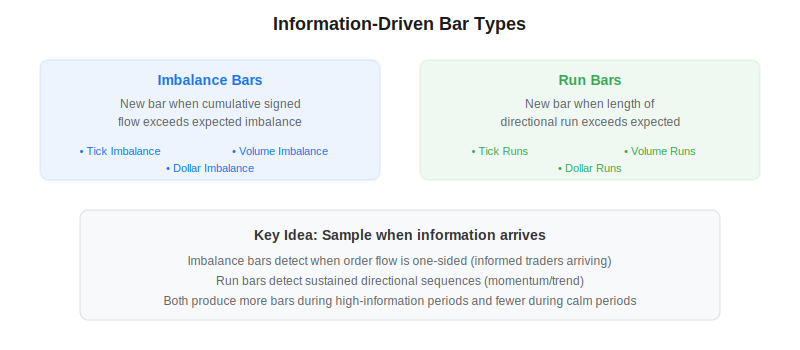
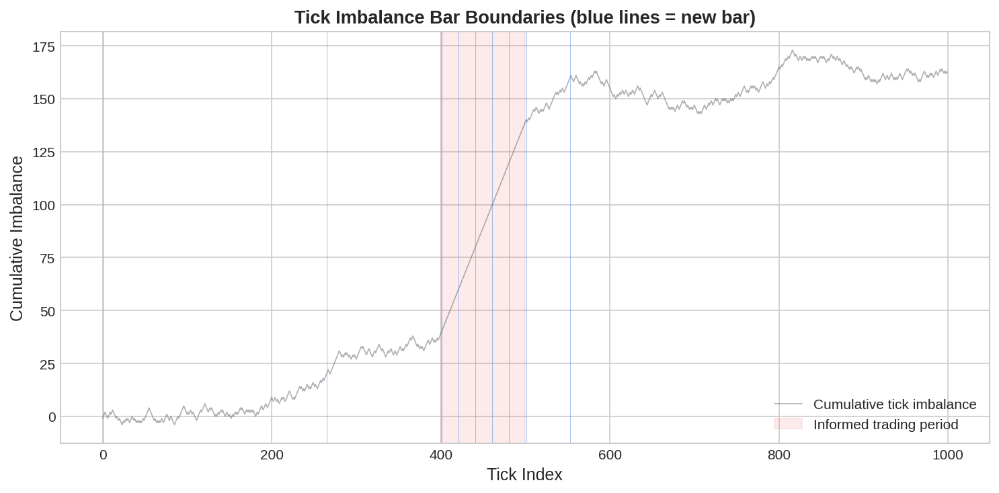

Information-driven bars are a family of data sampling methods introduced by Marcos Lopez de Prado in *Advances in Financial Machine Learning* (2018) that create new bars only when a statistical measure of market activity deviates from its expected value. Unlike [volume bars and dollar bars](https://paperswithbacktest.com/wiki/volume-bars-dollar-bars) which use fixed thresholds, imbalance bars and run bars adapt their sampling rate based on the direction and intensity of order flow. This produces bars that are synchronized with the arrival of new information.

## What Are Imbalance Bars?

Imbalance bars sample a new observation when the cumulative signed volume (or tick direction) exceeds an expected threshold. The intuition is that one-sided flow indicates informed trading activity.

For tick imbalance bars (TIBs), each trade is signed +1 (uptick) or -1 (downtick). A new bar forms when:

$$\left|\sum_{t=t_0}^{t_k} b_t\right| \geq E[T] \cdot |E[b_t]|$$

where $b_t$ is the tick sign, $E[T]$ is the expected bar length, and $E[b_t]$ is the expected tick direction. [Tick imbalance bars](https://paperswithbacktest.com/wiki/tick-imbalance-bars-tibs) are the most common variant.

Volume imbalance bars and dollar imbalance bars weight each tick by its volume or dollar amount respectively, making them more sensitive to large institutional trades.



## What Are Run Bars?

Run bars focus on the *length* of directional sequences rather than cumulative imbalance. A new bar forms when the longest run of same-direction ticks exceeds an expected value. This captures sustained momentum or trend activity:

$$\max(\text{buy run}, \text{sell run}) \geq E[\text{run length}]$$

Run bars are particularly useful in trending markets where the order flow is persistently one-sided without large individual imbalances.



## Python Implementation

```python
import numpy as np
import pandas as pd

def tick_imbalance_bars(ticks, initial_threshold=100):
    signed = np.sign(ticks["price"].diff().fillna(0))
    signed[signed == 0] = 1  # continuation rule
    
    bars = []
    cum_imbalance = 0
    threshold = initial_threshold
    bar_start = 0
    
    for i in range(len(ticks)):
        cum_imbalance += signed.iloc[i]
        if abs(cum_imbalance) >= threshold:
            bar_data = ticks.iloc[bar_start:i+1]
            bars.append({
                "open": bar_data["price"].iloc[0],
                "high": bar_data["price"].max(),
                "low": bar_data["price"].min(),
                "close": bar_data["price"].iloc[-1],
                "volume": bar_data["volume"].sum(),
                "n_ticks": len(bar_data),
            })
            # Update threshold using EWMA of bar lengths
            if len(bars) > 1:
                threshold = 0.95 * threshold + 0.05 * abs(cum_imbalance)
            cum_imbalance = 0
            bar_start = i + 1
    return pd.DataFrame(bars)
```

## Comparison of Bar Types

| Bar Type | Trigger | Best For | Weakness |
|---|---|---|---|
| Time bars | Fixed time interval | Simplicity | Oversamples quiet periods |
| Volume bars | Fixed volume | Activity-normalized data | Not direction-aware |
| Dollar bars | Fixed dollar volume | Price-adjusted sampling | Not direction-aware |
| Tick imbalance | Cumulative signed ticks | Detecting informed flow | Threshold calibration |
| Volume imbalance | Cumulative signed volume | Large-order detection | Requires tick data |
| Tick runs | Longest directional run | Momentum/trends | Sensitive to noise |

## Limitations and Risks

Information-driven bars require tick-level data and careful threshold calibration. The expected imbalance $E[T] \cdot |E[b_t]|$ must be estimated with an exponentially weighted moving average (EWMA) that adapts to changing market conditions. Poorly calibrated thresholds produce either too many bars (noisy) or too few (slow to react). These bars also lose the time dimension, complicating analysis of time-based patterns.

## Conclusion

Information-driven bars represent the most sophisticated data sampling approach in the AFML framework. By creating bars only when market conditions signal new information, they produce features that are inherently more informative for ML models. Combined with the [CUSUM filter](https://paperswithbacktest.com/wiki/cusum-filter) for event detection and [fractional differentiation](https://paperswithbacktest.com/wiki/fractional-differentiation) for stationarity, they form the optimal data pipeline for [systematic trading strategies](https://paperswithbacktest.com/wiki/systematic-trading-strategies).

---

**Explore further on PapersWithBacktest:**
- Browse [backtested strategies](https://paperswithbacktest.com/strategies) with Python code and performance metrics
- Access [clean historical market data](https://paperswithbacktest.com/datasets) for equities, crypto, and futures
- Take the [algo trading course](https://paperswithbacktest.com/course) — 60+ video lessons and notebooks
- Related wiki pages: [Tick Imbalance Bars](https://paperswithbacktest.com/wiki/tick-imbalance-bars-tibs) · [Volume Bars and Dollar Bars](https://paperswithbacktest.com/wiki/volume-bars-dollar-bars) · [CUSUM Filter](https://paperswithbacktest.com/wiki/cusum-filter)
