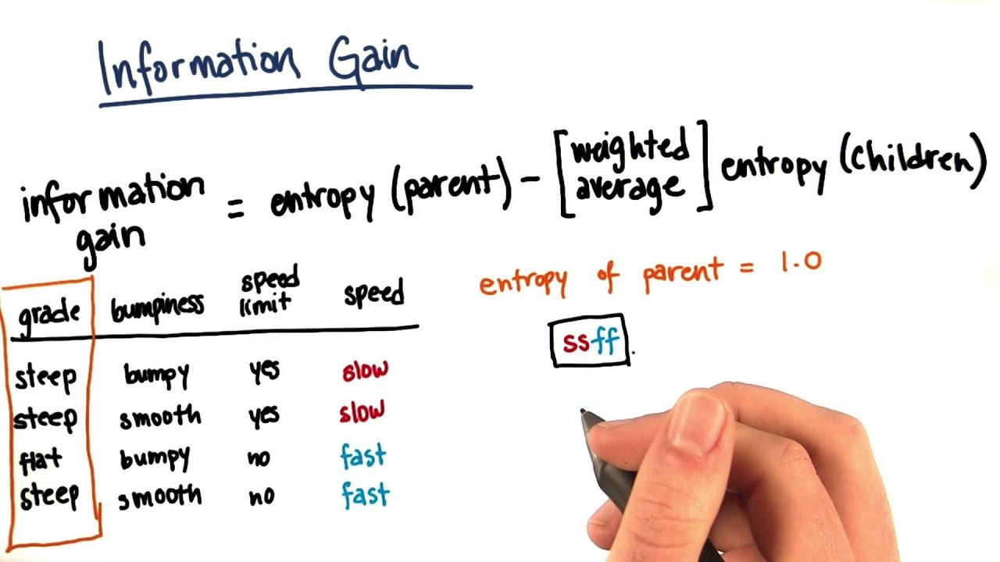

## Table of Contents

## What is Information Gain in the context of machine learning?

Information Gain is a concept used in machine learning, particularly in decision tree algorithms, to decide which feature to split on at each step of building the tree. It measures how much "information" a feature gives us about the class. In other words, it helps us figure out which questions to ask to get the most useful answers. The higher the information gain, the more useful the feature is in helping us classify the data correctly.

To calculate information gain, we first need to understand the concept of entropy, which is a measure of randomness or uncertainty in the data. Entropy is calculated using the formula $$H(S) = -\sum_{i=1}^{n} p_i \log_2(p_i)$$, where $S$ is the dataset, $n$ is the number of classes, and $p_i$ is the proportion of the dataset that belongs to class $i$. Information gain is then calculated as the difference between the entropy of the dataset before the split and the weighted average entropy of the subsets after the split. This helps in choosing the split that results in the most homogeneous subsets, thereby reducing uncertainty and improving the model's predictive power.

## How does Information Gain relate to entropy?

Information Gain and entropy are closely related in machine learning, especially when building decision trees. Entropy measures the randomness or uncertainty in a dataset. Think of it as how mixed up or disorganized the data is. The formula for entropy is $$H(S) = -\sum_{i=1}^{n} p_i \log_2(p_i)$$, where $S$ is the dataset, $n$ is the number of classes, and $p_i$ is the proportion of the dataset that belongs to class $i$. When entropy is high, it means the data is very mixed, and it's hard to make predictions. When entropy is low, the data is more organized, making it easier to predict outcomes.

Information Gain uses entropy to decide which feature to split on when building a decision tree. It calculates how much the entropy decreases after splitting the data based on a particular feature. In simpler terms, Information Gain tells us how much more organized or predictable the data becomes after we ask a certain question. If a feature results in a big drop in entropy, it has high Information Gain, meaning it's very useful for making our predictions more accurate. So, Information Gain helps us pick the best questions to ask to get the most useful answers, by looking at how much they reduce the uncertainty in our data.

## Can you explain the formula used to calculate Information Gain?

Information Gain is calculated by finding the difference between the entropy of the dataset before a split and the weighted average entropy of the subsets after the split. The formula for Information Gain is $$IG(S, A) = H(S) - \sum_{v \in Values(A)} \frac{|S_v|}{|S|} H(S_v)$$, where $IG(S, A)$ is the Information Gain of dataset $S$ when split on attribute $A$, $H(S)$ is the entropy of the dataset $S$, $Values(A)$ are the possible values of attribute $A$, $|S_v|$ is the number of samples in subset $S_v$ (the subset of $S$ for which attribute $A$ has value $v$), and $|S|$ is the total number of samples in $S$. This formula helps us see how much more organized the data becomes after splitting it based on a particular feature.

To break it down simply, first, you calculate the entropy of the whole dataset, which tells you how mixed up the data is. Then, you split the data based on a feature and calculate the entropy of each subset created by the split. You take a weighted average of these subset entropies, where the weights are the sizes of the subsets relative to the whole dataset. The difference between the original entropy and this weighted average entropy is the Information Gain. A higher Information Gain means the split made the data more organized and easier to predict, which is what we want when building a decision tree.

## What is the role of Information Gain in decision tree algorithms?

Information Gain plays a crucial role in decision tree algorithms by helping to decide which feature to split on at each step of building the tree. When you're making a decision tree, you want to ask the best questions to sort your data into groups that are as pure as possible. Information Gain tells you which question will make your data the most organized. It does this by measuring how much the uncertainty in your data decreases after you split it based on a particular feature. The feature with the highest Information Gain is chosen because it reduces the randomness in your data the most, making it easier to predict outcomes.

To calculate Information Gain, you first find the entropy of the whole dataset, which measures how mixed up your data is. Entropy is calculated with the formula $$H(S) = -\sum_{i=1}^{n} p_i \log_2(p_i)$$, where $S$ is the dataset, $n$ is the number of classes, and $p_i$ is the proportion of the dataset that belongs to class $i$. Then, you split the data based on a feature and calculate the entropy of each subset. You take a weighted average of these subset entropies and subtract it from the original entropy to get the Information Gain. The formula for Information Gain is $$IG(S, A) = H(S) - \sum_{v \in Values(A)} \frac{|S_v|}{|S|} H(S_v)$$. By choosing the feature with the highest Information Gain, decision trees can make better and more accurate predictions.

## How does Information Gain help in feature selection?

Information Gain is a helpful tool for [picking](/wiki/asset-class-picking) the best features in [machine learning](/wiki/machine-learning), especially when building decision trees. It measures how much a feature helps us sort our data into clear groups. By calculating the Information Gain for each feature, we can see which one makes our data the most organized. The feature with the highest Information Gain is the one that reduces the randomness in our data the most, making it easier to predict outcomes. So, when we're choosing which features to use, we pick the ones with the highest Information Gain because they give us the most useful information.

To calculate Information Gain, we start by finding the entropy of the whole dataset, which tells us how mixed up our data is. Entropy is calculated with the formula $$H(S) = -\sum_{i=1}^{n} p_i \log_2(p_i)$$, where $S$ is the dataset, $n$ is the number of classes, and $p_i$ is the proportion of the dataset that belongs to class $i$. Then, we split the data based on a feature and calculate the entropy of each subset. We take a weighted average of these subset entropies and subtract it from the original entropy to get the Information Gain. The formula for Information Gain is $$IG(S, A) = H(S) - \sum_{v \in Values(A)} \frac{|S_v|}{|S|} H(S_v)$$. By using Information Gain, we can select the features that make our predictions more accurate and reliable.

## What are the limitations of using Information Gain for feature selection?

Information Gain is a useful tool for picking the best features in machine learning, but it has some limitations. One big problem is that it can be biased towards features with many different values. This means that if a feature can have a lot of different answers, it might seem more important than it really is, even if those answers don't help much in sorting the data. For example, if you have a feature like "ID number," which is different for every data point, it might have a high Information Gain, but it won't actually help you predict anything useful.

Another limitation is that Information Gain doesn't work well with continuous data. It's designed for features that have clear, separate categories. If you have a feature like "temperature," which can have any value, you need to turn it into categories first, which can be tricky and might not give you the best results. Also, Information Gain can sometimes miss out on features that are important but only help a little bit at a time. These features might not have a high Information Gain on their own, but together with other features, they can be very useful. So, while Information Gain is helpful, it's important to think about these limitations when using it for feature selection.

## How does Information Gain differ from Gain Ratio and Gini Impurity?

Information Gain, Gain Ratio, and Gini Impurity are all used to help choose the best features in decision trees, but they do it in different ways. Information Gain measures how much a feature helps sort the data into clear groups by calculating the difference in entropy before and after splitting the data. It's calculated with the formula $$IG(S, A) = H(S) - \sum_{v \in Values(A)} \frac{|S_v|}{|S|} H(S_v)$$. But, Information Gain can be biased towards features with many different values. For example, if you have a feature like "ID number," which is different for every data point, it might seem more important than it really is.

Gain Ratio tries to fix this problem by adding a step to Information Gain. It divides the Information Gain by the "split information," which is a measure of how spread out the values of the feature are. This helps to balance out the bias towards features with many values. The formula for Gain Ratio is $$GR(S, A) = \frac{IG(S, A)}{SplitInformation(A)}$$, where $$SplitInformation(A) = -\sum_{v \in Values(A)} \frac{|S_v|}{|S|} \log_2 \left( \frac{|S_v|}{|S|} \right)$$. On the other hand, Gini Impurity doesn't use entropy at all. Instead, it measures how often a randomly chosen element from the set would be incorrectly labeled if it was randomly labeled according to the distribution of labels in the subset. The formula for Gini Impurity is $$Gini(S) = 1 - \sum_{i=1}^{n} p_i^2$$, where $p_i$ is the probability of an item being classified to a particular class. Gini Impurity is simpler to calculate and works well in practice, but it can be less sensitive to changes in the dataset compared to Information Gain and Gain Ratio.

## Can Information Gain be used in other machine learning models besides decision trees?

Information Gain is most commonly used in decision trees, but it can be helpful in other machine learning models too. For example, it can be used in feature selection for any model. If you want to pick the best features before training a model like a random forest, support vector machine, or even a [neural network](/wiki/neural-network), you can use Information Gain to see which features are most useful. By calculating the Information Gain for each feature, you can choose the ones that help sort your data into clear groups, making your model more accurate.

In addition to feature selection, Information Gain can also be used in other ways. For instance, it can help in data preprocessing by identifying and removing noisy or irrelevant features. This can improve the performance of many different types of models. Information Gain can also be used in ensemble methods, where multiple models are combined to make better predictions. By using Information Gain to select the best features for each model in the ensemble, you can create a more powerful and accurate overall model.

## How do you interpret the results of Information Gain in a practical dataset?

When you use Information Gain on a practical dataset, you're looking at how much each feature helps you sort your data into clear groups. If a feature has a high Information Gain, it means that feature is really good at making your data more organized and easier to predict. For example, if you're trying to predict whether someone will buy a product based on their age, gender, and income, the feature with the highest Information Gain would be the one that, when you split the data on it, makes the groups of buyers and non-buyers the most clear. You can calculate Information Gain using the formula $$IG(S, A) = H(S) - \sum_{v \in Values(A)} \frac{|S_v|}{|S|} H(S_v)$$, where $H(S)$ is the entropy of the whole dataset, and the other parts help you find the weighted average entropy of the subsets after splitting on a feature.

In a practical setting, you might see that some features have very high Information Gain values, while others have low values. This tells you which features are most important for making accurate predictions. For instance, if you're working on a dataset about customer churn, and the feature "customer satisfaction score" has a high Information Gain, it means that knowing the satisfaction score helps you predict whether a customer will leave or stay better than other features. On the other hand, if a feature like "customer ID" has a low Information Gain, it's not helping you sort the data into clear groups of churners and non-churners. By understanding these results, you can focus on the features that matter most and maybe even remove the ones that don't help much, making your model simpler and more effective.

## What are some common pitfalls when using Information Gain in machine learning?

One common pitfall when using Information Gain in machine learning is its bias towards features with many different values. For example, if you have a feature like "customer ID," which is unique for every customer, it might have a high Information Gain because splitting on it creates perfectly pure subsets. But this doesn't help in making useful predictions. The formula for Information Gain is $$IG(S, A) = H(S) - \sum_{v \in Values(A)} \frac{|S_v|}{|S|} H(S_v)$$, and this formula can make features with lots of different values look more important than they really are.

Another pitfall is that Information Gain doesn't work well with continuous data. It's designed for features that have clear, separate categories. If you have a feature like "temperature," which can have any value, you need to turn it into categories first. This can be tricky and might not give you the best results. Also, Information Gain might miss out on features that are important but only help a little bit at a time. These features might not have a high Information Gain on their own, but together with other features, they can be very useful. So, it's important to think about these limitations when using Information Gain for feature selection.

## How can Information Gain be optimized or improved in advanced applications?

In advanced applications, Information Gain can be optimized by combining it with other methods to reduce its bias towards features with many different values. One way to do this is by using Gain Ratio, which adjusts Information Gain by dividing it by the "split information." This helps to balance out the bias and give a fairer assessment of feature importance. The formula for Gain Ratio is $$GR(S, A) = \frac{IG(S, A)}{SplitInformation(A)}$$, where $$SplitInformation(A) = -\sum_{v \in Values(A)} \frac{|S_v|}{|S|} \log_2 \left( \frac{|S_v|}{|S|} \right)$$. By using Gain Ratio, you can get a better idea of which features are truly useful for making predictions, even if they have fewer categories.

Another way to improve Information Gain is by using it in ensemble methods, where multiple models are combined to make better predictions. For example, you can use Information Gain to select the best features for each model in a random forest. By doing this, you can create a more powerful and accurate overall model. Additionally, Information Gain can be used in feature selection algorithms that consider the interactions between features. Instead of looking at each feature's Information Gain separately, these algorithms can find combinations of features that together have a high Information Gain, even if each feature alone doesn't seem very important. This can help capture more complex relationships in the data and improve the performance of your machine learning models.

## What are the latest research developments related to Information Gain in machine learning?

Recent research in machine learning has been working on making Information Gain even better. One big focus is on fixing the problem where Information Gain can be biased towards features with lots of different values. Researchers are using methods like Gain Ratio to help with this. Gain Ratio adjusts Information Gain by dividing it by the "split information," which helps to give a fairer idea of how important each feature really is. The formula for Gain Ratio is $$GR(S, A) = \frac{IG(S, A)}{SplitInformation(A)}$$, where $$SplitInformation(A) = -\sum_{v \in Values(A)} \frac{|S_v|}{|S|} \log_2 \left( \frac{|S_v|}{|S|} \right)$$. By using Gain Ratio, we can pick the best features for our models more accurately.

Another area of research is about using Information Gain in new ways, like in ensemble methods. Ensemble methods combine multiple models to make better predictions. Researchers are using Information Gain to pick the best features for each model in an ensemble, like a random forest. This can make the overall model more powerful and accurate. Also, some new research is looking at how Information Gain can help find important combinations of features. Instead of just looking at each feature by itself, these methods can find groups of features that together have a high Information Gain. This can help capture more complex relationships in the data and make our machine learning models work even better.