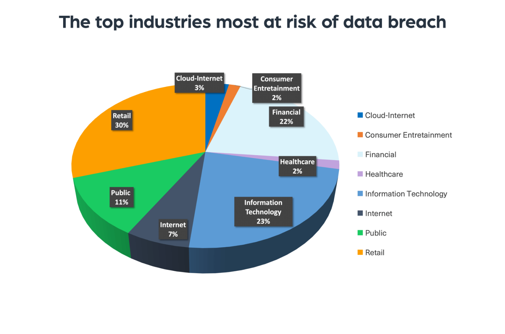

## Table of Contents

## What is information leakage in the context of markets?

Information leakage in markets happens when secret or important information gets out before it should. This can affect how people buy or sell things, like stocks or other investments. When this information leaks, some people might use it to make money unfairly, which can hurt the market and make it less fair for everyone else.

For example, if someone knows a company is about to do really well but hasn't told everyone yet, and they tell their friends, those friends could buy the stock before the news comes out. This gives them an advantage over others who don't know the secret information. This kind of unfair advantage can lead to problems in the market, like less trust and more people trying to cheat the system.

## How does information leakage occur in financial markets?

Information leakage in financial markets can happen in many ways. One common way is through insiders, like company employees or executives, who might accidentally or intentionally share confidential information with others. For example, an employee might talk about upcoming financial results at a social event, not realizing that someone there could use that information to trade stocks. Another way is through hacking or cyber attacks, where criminals break into company systems to steal sensitive data. They might then sell this information to others who want to make quick profits from trading.

Another source of information leakage is through the supply chain or business partners. Companies often work with other firms, and during these interactions, sensitive information might be shared. If someone in these partner companies leaks the information, it can spread quickly. Additionally, regulatory filings and reports can sometimes be a source of leaks. If a company submits a report to a regulatory body, and that information is supposed to be confidential until a certain date, a leak could occur if someone at the regulatory agency shares it prematurely. All these ways show how hard it is to keep important information secret in the fast-moving world of financial markets.

## What are the common sources of information leakage?

Information leakage can happen in many ways. One way is through insiders. These are people like employees or executives who know secret stuff about their company. They might tell their friends or family about this secret stuff without meaning to cause harm. But those friends or family might use this information to make money by buying or selling stocks. Another way is through hackers. These are bad people who break into company computers and steal information. They might then sell this information to others who want to use it to make quick money.

Another source of information leakage is through business partners or the supply chain. Companies often work with other firms, and during these interactions, they might share sensitive information. If someone in these partner companies leaks the information, it can spread quickly. Also, regulatory filings can be a source of leaks. When a company sends a report to a government agency, the information is supposed to stay secret until a certain date. But if someone at the agency leaks it early, that can cause problems. All these ways show how hard it is to keep important information secret in the fast-moving world of financial markets.

## What are the potential impacts of information leakage on market efficiency?

Information leakage can make markets less efficient. When secret information leaks out before it's supposed to, some people get to use it to make money. This means the market doesn't work as it should because not everyone has the same information. When some people know more than others, they can buy or sell things at better prices, which can make the market move in ways it wouldn't if everyone knew the same stuff. This can lead to prices that don't really show what things are worth, making it harder for the market to do its job well.

This unfair advantage can also hurt trust in the market. When people find out that some folks are using secret information to make money, they might feel like the market isn't fair. This can make them less likely to invest or trade, which can slow down the market. If fewer people are buying and selling, the market can become less active and less able to find the right prices for things. Over time, this can make the market less efficient and less helpful for everyone who uses it.

## How can information leakage affect individual investors?

Information leakage can really hurt individual investors. When secret information gets out before everyone knows it, some people can use it to make money. This means they might buy or sell stocks at better prices than others who don't know the secret information. As a result, individual investors who don't have this secret information might end up buying stocks at higher prices or selling them at lower prices than they should. This can lead to them losing money or not making as much as they could have if the market was fair.

This unfair situation can also make individual investors lose trust in the market. When they find out that others are using secret information to get ahead, they might feel like the market is not a fair place to invest their money. This can make them less likely to buy or sell stocks, or even stop investing altogether. Over time, this can mean they miss out on opportunities to grow their money, and it can make the market less active and less helpful for everyone.

## What are the legal and ethical implications of information leakage?

Information leakage has big legal problems. It's against the law to use secret information to make money in the stock market. This is called insider trading, and it can get you in a lot of trouble. People who do this can be fined a lot of money, sent to jail, or both. Companies also have to be careful because if their secret information leaks out, they can get in trouble too. They might have to pay fines and could lose the trust of their customers and investors.

There are also ethical problems with information leakage. It's not fair if some people know secret information and use it to make money while others don't. This can make the market unfair and hurt a lot of people who are just trying to invest their money honestly. When people see that others are cheating, they might lose trust in the market and stop investing. This can make the market less active and less helpful for everyone. It's important for everyone to play by the same rules so the market can be fair and work well for all.

## What measures can companies take to prevent information leakage?

Companies can take several steps to prevent information leakage. One important step is to have strict rules about who can see secret information and who can't. They should only let people who really need to know have access to this information. Companies can also use special computer systems that keep track of who looks at what information. This way, if there's a leak, they can find out who might have done it. Another thing they can do is train their employees to be careful about what they say and where they say it. They should remind everyone that talking about secret stuff at parties or on social media can cause big problems.

Another way to prevent information leakage is to have strong security measures in place. This means using good passwords, keeping software up to date, and being careful about emails and other messages that might be from hackers. Companies should also check their systems regularly to make sure no one has broken in. It's also a good idea to have a plan for what to do if there is a leak. This plan should say who to tell and how to stop the leak from spreading. By taking these steps, companies can make it harder for secret information to get out and keep the market fair for everyone.

## How do regulatory bodies address information leakage?

Regulatory bodies like the SEC in the U.S. work hard to stop information leakage. They make rules that say it's illegal to use secret information to make money in the stock market. This is called insider trading. If they find out someone is doing this, they can fine them a lot of money or even send them to jail. They also watch companies closely to make sure they are not leaking information on purpose. If a company does leak information, the regulatory body might fine them too.

These bodies also do a lot of work to find out where leaks are coming from. They use special tools and methods to track down who might be leaking information. They might look at trading patterns to see if someone is using secret information to buy or sell stocks. If they find evidence of a leak, they start an investigation. This helps them stop the leak and make sure it doesn't happen again. By doing all these things, regulatory bodies try to keep the market fair for everyone.

## What are some historical examples of information leakage in markets?

One famous example of information leakage happened in 1986 with the case of Ivan Boesky. He was a big investor who used secret information to make a lot of money. He got this information from people inside companies who told him about big deals before anyone else knew. Boesky made millions of dollars this way, but he got caught. He had to pay a huge fine and went to jail. This case showed everyone how serious information leakage can be and how it can hurt the market.

Another example is the Martha Stewart case in 2001. Martha Stewart, a famous businesswoman, got a tip from her broker about a drug company called ImClone. The tip said that the FDA was going to reject one of ImClone's drugs, so the stock price would go down. Stewart sold her shares in ImClone before the news came out, saving herself a lot of money. She got caught and went to jail for lying about why she sold the stock. This case also showed how information leakage can lead to big legal problems and hurt people's trust in the market.

## How can advanced technologies like AI and machine learning detect information leakage?

Advanced technologies like AI and machine learning can help detect information leakage by looking at a lot of data really fast. They can find patterns that might show someone is using secret information to buy or sell stocks. For example, if a lot of people start buying a stock right before big news comes out, AI can spot this and tell the people in charge to look closer. This helps catch leaks early and stop them from causing more problems.

These technologies can also watch how people use company computers and systems. If someone is looking at secret information they shouldn't be, AI can notice this and send a warning. This way, companies can find out who might be leaking information and stop it before it spreads. By using AI and machine learning, companies and regulators can keep the market fair and make sure everyone plays by the same rules.

## What are the latest research findings on the effects of information leakage on market dynamics?

Recent research has shown that information leakage can really mess up how markets work. When secret information gets out before everyone knows it, it can cause big swings in stock prices. This happens because some people use the secret information to buy or sell stocks at better prices than others. This can make the market less fair and less efficient. Studies have found that when there's a lot of information leakage, it can be harder for the market to find the right price for things. This is because the prices are being moved by people who know more than others, not by what the things are really worth.

Another thing researchers have found is that information leakage can hurt trust in the market. When people see that others are using secret information to make money, they might feel like the market isn't fair. This can make them less likely to invest or trade, which can slow down the market. If fewer people are buying and selling, the market can become less active and less able to find the right prices for things. Over time, this can make the market less efficient and less helpful for everyone who uses it.

## How can traders and investors use strategies to mitigate risks associated with information leakage?

Traders and investors can use different strategies to protect themselves from the risks of information leakage. One way is to always do their own research and not just follow what others are doing. By looking at a company's financial reports, news, and other public information, they can make better decisions without relying on secret tips. Another strategy is to spread out their investments. Instead of putting all their money into one stock, they can invest in many different stocks or other things like bonds. This way, if one stock goes down because of a leak, they won't lose all their money.

Another important thing traders and investors can do is to be careful about where they get their information. They should only trust sources that are known to be reliable and not listen to rumors or tips from people they don't know well. It's also a good idea to use stop-loss orders. These are orders that automatically sell a stock if it drops to a certain price, which can help limit losses if a stock goes down because of a leak. By using these strategies, traders and investors can better protect themselves and make smarter choices in the market.

## What are the technological advancements and what are the future prospects?

Machine learning (ML) and [artificial intelligence](/wiki/ai-artificial-intelligence) (AI) are increasingly integral in detecting information leakage risks in algorithmic trading. These advanced technologies analyze vast datasets to identify patterns and anomalies indicative of potential leaks. By leveraging machine learning algorithms, traders can develop predictive models that swiftly detect unusual market behaviors associated with information dissemination, thereby mitigating risk exposure.

Artificial intelligence optimizes trading strategies through continuous learning. AI systems can adapt to ever-changing market conditions by processing real-time data faster than humanly possible. This adaptability enhances the robustness of algorithms against unpredictable market dynamics, ensuring strategic precision even when exposed to potential information leaks.

For instance, [reinforcement learning](/wiki/reinforcement-learning), a subset of AI, is particularly effective in developing adaptive strategies. Through a process of trial and error, AI models trained via reinforcement learning can tailor trading decisions that minimize leakage risks while maximizing profitability. This process is expressed mathematically as:

$$
Q(s, a) \leftarrow Q(s, a) + \alpha [ R + \gamma \max_{a'} Q(s', a') - Q(s, a) ]
$$

where $Q(s, a)$ represents the quality of action $a$ taken in state $s$, $\alpha$ is the learning rate, $R$ is the reward, and $\gamma$ is the discount factor for future rewards.

Collaboration and standardization of security protocols are crucial among market participants. Establishing industry-wide protocols for data security and information sharing can significantly reduce leakage risks. Standardization enables the seamless integration of protective measures across trading systems, creating a cohesive defense mechanism that is more effective than isolated efforts.

Furthermore, initiatives like blockchain technology offer promising prospects for enhancing security in trading environments. Blockchain's decentralized and immutable ledger systems ensure transparency and integrity, potentially preventing unauthorized access and data tampering.

In conclusion, the strategic integration of machine learning and artificial intelligence within algorithmic trading, coupled with collaborative efforts among market participants to standardize security protocols, is essential for cultivating leak-resistant trading environments. As these technologies continue to evolve, they promise to refine trading strategies further and fortify market stability against information leakage.

## References & Further Reading

Zhang, M. Y., & Cohen, K. (2020). 'Detecting information leakage in high-frequency trading systems.' This work explores methodologies for identifying and preventing information leakage risks in high-frequency trading environments. The authors employ statistical analysis and algorithmic models to assess the integrity of trading systems, offering insights into potential vulnerabilities that could be exploited by adversaries.

Cartea, Á., Jaimungal, S., & Penalva, J. (2015). 'Algorithmic and High-Frequency Trading.' This book provides a comprehensive overview of the mechanics behind algorithmic and high-frequency trading ([HFT](/wiki/high-frequency-trading-strategies)). It covers a range of topics including market impact, order book dynamics, and the development of strategic models to minimize risks associated with trading, such as information leakage.

Easley, D., López de Prado, M. M., & O'Hara, M. (2012). 'Flow Toxicity and Liquidity in a High-frequency World.' This paper examines the implications of flow toxicity on market liquidity within a high-frequency trading context. It introduces the concept of 'flow toxicity' as the potential loss due to the adverse selection of trades and its connection to information leakage.

Kearns, M., Nevmyvaka, Y., & Schapire, R. E. (2012). 'Machine Learning for Market Microstructure and High-Frequency Trading.' This publication addresses the application of machine learning techniques to trading problems, focusing on microstructure and HFT scenarios. It highlights the role of machine learning in enhancing trade decision-making processes and managing risks, including those posed by information leakage.

Johnson, B. (2010). 'Algorithmic Trading & DMA: An Introduction to Direct Access Trading Strategies.' This introductory text covers key concepts in algorithmic trading and direct market access (DMA). It discusses the development and implementation of trading strategies and technologies that help safeguard against issues like information leakage through optimized trade execution and order management.

