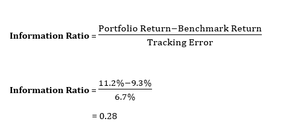

The world of finance is characterized by a myriad of metrics that allow investors and traders to evaluate the performance and value of their investments and strategies comprehensively. Among these, the Sharpe Ratio and the Information Ratio have emerged as two critical metrics, particularly valuable within the framework of algorithmic trading. These ratios equip market participants with quantifiable measures to assess risk-adjusted returns, which is essential in developing and optimizing trading strategies.

Algorithmic trading, an approach that employs automated systems for executing trades, relies extensively on quantitative metrics. It demands precise tools that can discern the quality and sustainability of the returns generated. The Sharpe Ratio serves as a pivotal marker by indicating how well an investment compensates for the risk taken. By quantifying the excess return per unit of risk, it helps traders isolate the contributions of a strategy's return from the inherent risk. Conversely, the Information Ratio appraises the portfolio's returns relative to a benchmark, offering insights into the manager's skill by highlighting performance consistency against a market standard.



This article aims to furnish a thorough comprehension of these financial metrics, tracing their conceptual underpinnings, mathematization, and implications for strategy design within algo trading. By understanding their application, limitations, and potential for improving trading outcomes, traders can harness these tools to craft a more informed, decisive approach to the complex landscape of financial markets.

## Table of Contents

## Understanding the Sharpe Ratio

The Sharpe Ratio, introduced by economist William F. Sharpe in 1966, is a key metric used to evaluate the risk-adjusted return of an investment. This ratio provides a comprehensive means of comparing the performance of an investment by factoring both return and risk. It is mathematically represented as:

$$
\text{Sharpe Ratio} = \frac{R_p - R_f}{\sigma_p}
$$

In this formula:
- $R_p$ represents the return of the portfolio or investment.
- $R_f$ stands for the risk-free rate, which is the return expected from an investment with no risk, typically associated with government bonds.
- $\sigma_p$ is the standard deviation of the portfolio's excess return, acting as a proxy for the investment's volatility.

The core idea behind the Sharpe Ratio is to determine how much excess return an investor receives for bearing additional risk inherent in the investment. A higher Sharpe Ratio indicates a more favorable risk-adjusted return, suggesting that the investment provides better compensation for the risk taken.

In the rapidly growing field of [algorithmic trading](/wiki/algorithmic-trading), assessing the efficiency and performance of trading models is vital. The Sharpe Ratio serves as an indispensable tool in this regard. By quantifying the return in excess of the risk-free rate per unit of risk, traders are equipped to evaluate the merit of trading strategies, compare different trading models, and refine their strategies to achieve optimal performance. Algorithmic trading involves making rapid, data-driven decisions, and the clarity provided by a high Sharpe Ratio can be decisive for success.

For example, consider an algorithmic trading strategy with a monthly return of 1.0%, a risk-free rate of 0.2%, and a standard deviation of 1.5% in its monthly excess returns. The Sharpe Ratio for this strategy would be calculated as:

$$
\text{Sharpe Ratio} = \frac{1.0\% - 0.2\%}{1.5\%} = 0.533
$$

This indicates that the strategy provides a return of 0.533% for each unit of risk, highlighting potential efficiency in risk-adjusted performance. Such insights enable traders and investors to discern which trading models enhance portfolio outcomes.

## Importance of Sharpe Ratio in Algorithmic Trading

Algorithmic trading, characterized by the use of advanced mathematical models and computational resources to make trading decisions, demands precise evaluation of strategies for effectiveness and risk management. The Sharpe Ratio plays a pivotal role in this process by providing a quantifiable measure of risk-adjusted return, which is essential for assessing the efficiency and robustness of trading algorithms.

The use of the Sharpe Ratio in algorithmic trading enables traders to evaluate the performance of their strategies by considering both the returns generated and the risks taken to achieve those returns. This ratio, defined as $\text{Sharpe Ratio} = \frac{R_p - R_f}{\sigma_p}$, where $R_p$ is the portfolio's return, $R_f$ is the risk-free rate, and $\sigma_p$ denotes the standard deviation of the portfolio’s excess return, serves as a benchmark for strategy evaluation. By focusing on risk-adjusted returns, traders can identify strategies that not only provide high returns but also maintain an acceptable level of [volatility](/wiki/volatility-trading-strategies).

Furthermore, the Sharpe Ratio aids in risk management. By highlighting the relationship between risk and return, it allows traders to discern whether an increase in return is justified by the associated increase in risk. This assessment is crucial in the development and adjustment of algorithmic trading strategies, as it ensures that risk is systematically controlled and optimized.

Traders often utilize the Sharpe Ratio to compare multiple trading strategies. A higher Sharpe Ratio indicates better risk-adjusted performance, informing traders about the superiority of one strategy over another. This comparative analysis is instrumental in portfolio management, enabling adjustment of allocations to favor strategies with higher Sharpe Ratios, thereby optimizing overall portfolio performance.

In summary, the Sharpe Ratio serves as a foundational tool in algorithmic trading, offering insights into strategy evaluation, risk management, and portfolio optimization. Its application ensures that trading decisions are informed by a thorough understanding of the trade-off between risk and return, thereby enhancing the decision-making process in algorithmic trading environments.

## Calculating the Sharpe Ratio

The Sharpe Ratio is a widely used metric for calculating the risk-adjusted return of an investment portfolio. The formula for the Sharpe Ratio is:

$$
\text{Sharpe Ratio} = \frac{R_p - R_f}{\sigma_p}
$$

where:
- $R_p$ represents the return of the portfolio.
- $R_f$ is the risk-free rate.
- $\sigma_p$ is the standard deviation of the portfolio's excess return.

This ratio is valuable for evaluating an investment's performance by assessing how much excess return an investor receives for the additional volatility endured. The greater the Sharpe Ratio, the more attractive the risk-adjusted return of the investment is.

To illustrate this with an example: consider a trading strategy that yields an average return ($R_p$) of 12%. If the risk-free rate ($R_f$) is 3% and the standard deviation ($\sigma_p$) of the portfolio’s excess returns is 10%, the Sharpe Ratio would be calculated as follows:

$$
\text{Sharpe Ratio} = \frac{12\% - 3\%}{10\%} = \frac{9\%}{10\%} = 0.9
$$

This implies that for each unit of risk, the portfolio generates 0.9 units of return above the risk-free rate. Such a ratio helps investors and traders in the evaluation and comparison of trading strategies, aiding in decision-making processes. It succinctly captures the trade-off between risk and return, providing a single value for judgment.

## Limitations of the Sharpe Ratio

The Sharpe Ratio, while widely used to evaluate the risk-adjusted returns of an investment, comes with several limitations that traders and investors need to be aware of. One of the primary assumptions of the Sharpe Ratio is that returns are normally distributed. This assumption simplifies the analysis but may lead to inaccuracies because real-world financial returns often exhibit skewness and kurtosis, deviating from the normal distribution. Events such as market crashes or rallies can significantly affect the distribution of returns, rendering the Sharpe Ratio less effective in these situations.

Another limitation is that the Sharpe Ratio is inherently time-dependent. It can fluctuate significantly across different market conditions and time periods, which means that the ratio calculated over a specific timeframe might not be representative of longer-term performance. For instance, a high Sharpe Ratio during a bullish market phase does not necessarily indicate sustained performance, as the same strategy might underperform during a downturn.

The Sharpe Ratio also does not account for extreme market events or fat tails, which refer to the probability of extreme outcomes being higher than what the normal distribution predicts. These events can greatly influence investment returns, and the inability of the Sharpe Ratio to [factor](/wiki/factor-investing) in such anomalies can be misleading for investors relying solely on this metric to gauge risk.

Furthermore, the assumption of a constant risk-free rate is another drawback. The risk-free rate, often represented by government bond yields, can vary over time due to changes in monetary policy and economic conditions. These fluctuations can directly impact the Sharpe Ratio, complicating the comparison of risk-adjusted returns across different periods and economic environments.

Overall, while the Sharpe Ratio is a useful tool for assessing risk-adjusted performance, it is essential to consider its limitations and complement it with other analyses and metrics for a more comprehensive evaluation of an investment's risk and return profile.

## Exploring the Information Ratio

The Information Ratio (IR) is a crucial metric for assessing the performance of an investment portfolio relative to a benchmark index. It evaluates both excess returns and the consistency of these returns. The formula for calculating the Information Ratio is:

$$
\text{Information Ratio (IR)} = \frac{R_p - R_b}{\sigma_e}
$$

where $R_p$ represents the annualized return of the portfolio, $R_b$ is the return of the benchmark index, and $\sigma_e$ is the tracking error, which quantifies the standard deviation of the difference between the portfolio and benchmark returns.

The Information Ratio serves as an indicator of how efficiently a portfolio manager generates excess returns relative to the risk taken, as represented by the tracking error. In this context, a higher IR indicates better performance as it reflects more significant excess returns for each unit of risk. Consistency is key, and the IR is especially valuable for evaluating strategies where maintaining a steady level of outperformance is critical.

Unlike the Sharpe Ratio, which measures returns against a risk-free rate, the Information Ratio focuses on the portfolio's ability to outperform a benchmark, considering the volatility of this outperformance. It allows for the evaluation of active fund management strategies by offering insights into how well a fund manager achieves returns above a passive benchmark. This comparison is essential for investors seeking to distinguish between skillful management and mere luck.

The Information Ratio complements the Sharpe Ratio by providing a more targeted analysis in scenarios where a clear benchmark exists. Investors and fund managers might use both metrics to gain comprehensive insight into the risk-adjusted performance of their investment strategies, especially when evaluating active versus passive fund management.

## Information Ratio vs. Sharpe Ratio

The Sharpe Ratio and the Information Ratio (IR) are fundamental in analyzing the risk-adjusted performance of investment portfolios, but they serve distinct purposes and are applicable in different contexts. The Sharpe Ratio is primarily concerned with the return of an investment relative to the risk-free rate, providing a measure of the excess return per unit of risk. Mathematically, it is expressed as:

$$
\text{Sharpe Ratio} = \frac{R_p - R_f}{\sigma_p}
$$

where $R_p$ is the return of the portfolio, $R_f$ is the risk-free rate, and $\sigma_p$ is the standard deviation of the portfolio's excess return.

In contrast, the Information Ratio evaluates portfolio returns relative to a specific benchmark index, accounting for the consistency of outperformance. It is calculated using:

$$
\text{Information Ratio} = \frac{R_p - R_b}{\sigma_d}
$$

where $R_p$ is the portfolio return, $R_b$ is the benchmark return, and $\sigma_d$ is the tracking error, representing the standard deviation of the difference in returns between the portfolio and the benchmark.

The selection between these two metrics largely hinges on the investment strategy and the benchmark reference in place. For strategies that focus on absolute returns, such as those not directly tied to any benchmark or aiming for a set return objective over the risk-free rate, the Sharpe Ratio offers a straightforward measure of performance by assessing how much excess return is achieved for each unit of risk assumed.

On the other hand, the Information Ratio is more suited for active strategies that aim to outperform a benchmark. Here, the focus is on the incremental return achieved over that benchmark, adjusted for the tracking error. A higher IR indicates sound active management yielding consistent outperformance over the benchmark after accounting for volatility, making it an essential metric for assessing manager skill and efficacy in strategies like equity mutual funds that benchmark themselves against indices like the S&P 500.

Strategically, a portfolio manager might prefer the Sharpe Ratio for evaluating absolute return strategies which seek to maximize risk-adjusted returns irrespective of market movements. Conversely, the Information Ratio becomes invaluable for evaluating performance consistency of strategies benchmarked against market indices, offering insights into how well the portfolio manager adds value over passively managed investments.

In summary, while both metrics provide vital insights into risk-adjusted returns, their application differs based on investment objectives and benchmark considerations. An adept understanding and application of both ratios can significantly enhance investment decision-making processes.

## Practical Applications and Examples

In practical terms, the Sharpe Ratio and Information Ratio serve as essential metrics for evaluating risk-adjusted returns across different investment strategies. A higher ratio indicates better performance relative to the associated risk, thereby providing investors with a more effective means of comparison.

Consider an example where two fund managers are evaluated using these metrics. Fund Manager A has an annualized return of 10% with a tracking error of 4%. In contrast, Fund Manager B achieves an annualized return of 8% with a tracking error of 2%. To determine which manager performs more consistently relative to a benchmark, the Information Ratio can be calculated as follows:

$$
\text{Information Ratio (IR)} = \frac{\text{Portfolio Return} - \text{Benchmark Return}}{\text{Tracking Error}}
$$

Assuming a benchmark return of 5%, Fund Manager A's IR is:

$$
\text{IR}_A = \frac{10\% - 5\%}{4\%} = 1.25
$$

Fund Manager B's IR is:

$$
\text{IR}_B = \frac{8\% - 5\%}{2\%} = 1.5
$$

Despite a lower absolute return, Fund Manager B demonstrates better risk-adjusted performance due to a lower tracking error, resulting in a higher Information Ratio. This suggests that Manager B offers superior performance consistency relative to the benchmark.

Employing these metrics enables traders to go beyond mere return figures and assess performance considering the risk taken to achieve those returns. Over time, the continuous assessment of the Sharpe and Information Ratios helps in strategy validation and optimization, facilitating improved alignment with investors' risk tolerance and return objectives.

Using Python, these calculations can be implemented as follows:

```python
def information_ratio(portfolio_return, benchmark_return, tracking_error):
    return (portfolio_return - benchmark_return) / tracking_error

portfolio_return_A = 0.10
benchmark_return = 0.05
tracking_error_A = 0.04

portfolio_return_B = 0.08
tracking_error_B = 0.02

IR_A = information_ratio(portfolio_return_A, benchmark_return, tracking_error_A)
IR_B = information_ratio(portfolio_return_B, benchmark_return, tracking_error_B)

print("Information Ratio for Fund Manager A:", IR_A)
print("Information Ratio for Fund Manager B:", IR_B)
```

These assessments underscore the practical utility of Sharpe and Information Ratios in distinguishing between funds or strategies, enhancing the alignment of investment choices with individual performance and risk management goals.

## Improving Trading Strategies with Financial Metrics

Traders seeking to enhance their trading strategies can benefit significantly from the use of financial metrics. These metrics provide a quantitative basis to evaluate and adjust trading approaches, thus maximizing risk-adjusted returns. By continuously optimizing the parameters of their trading algorithms, traders can better navigate the complexities of the financial markets.

One approach to improving trading strategies is through [backtesting](/wiki/backtesting) and forward testing. Backtesting involves applying a trading strategy to historical data to evaluate its effectiveness. By doing this, traders can identify which parameters work best under different market conditions. Once a strategy is optimized through backtesting, it should be forward-tested on live data to ensure robustness.

Incorporating measures such as the Sharpe Ratio and Information Ratio into the strategy development process provides insight into how well a strategy compensates for risk. For instance, an elevated Sharpe Ratio indicates that a trader is effectively balancing risk and return, while a high Information Ratio demonstrates the consistency of a strategy's performance relative to a benchmark.

Furthermore, algorithmic traders can use [machine learning](/wiki/machine-learning) techniques to enhance model predictions and improve decision-making processes. By employing models that learn from data, traders can adapt their strategies in real-time as market conditions change. The Python programming language, with its extensive libraries such as NumPy, pandas, and scikit-learn, provides powerful tools for implementing and optimizing these algorithms:

```python
import numpy as np
import pandas as pd
from sklearn.model_selection import train_test_split
from sklearn.ensemble import RandomForestRegressor

# Load historical market data
data = pd.read_csv('market_data.csv')

# Define feature set and target variable
features = data[['feature1', 'feature2', 'feature3']]
target = data['returns']

# Split data into training and testing sets
X_train, X_test, y_train, y_test = train_test_split(features, target, test_size=0.3, random_state=42)

# Initialize and train the model
model = RandomForestRegressor(n_estimators=100, random_state=42)
model.fit(X_train, y_train)

# Predict and evaluate model performance
predictions = model.predict(X_test)
performance_metric = np.mean((predictions - y_test) ** 2)  # mean squared error as a simple performance metric

print(f"Performance Metric (MSE): {performance_metric}")
```

This simple RandomForestRegressor example illustrates the application of machine learning to predict financial returns, an essential step in refining trading strategies.

Finally, it is crucial for traders to establish a feedback loop wherein they regularly review their performance metrics and make necessary adjustments. This iterative process helps align trading strategies with desired financial objectives, ensuring traders remain competitive in an ever-evolving market landscape.

## Conclusion

Both the Sharpe Ratio and the Information Ratio serve essential roles in evaluating and optimizing trading strategies. By examining the risk-adjusted performance of investments, these metrics provide traders with a nuanced understanding of both absolute and relative return prospects. The Sharpe Ratio offers insights into the efficiency of a trading strategy by comparing excess returns to the associated risks, while the Information Ratio addresses the consistency of a portfolio's performance relative to a benchmark index.

For traders looking to refine their strategies, a deep understanding of these metrics is invaluable. By accurately interpreting their outcomes, traders can make better-informed decisions that align with their risk and return objectives. However, it is crucial to recognize the limitations inherent in each ratio. For instance, the Sharpe Ratio's dependence on a normally distributed return assumption and the assumption of constant risk-free rates can skew results. Similarly, the Information Ratio's focus on tracking error might not capture all dimensions of portfolio risk.

To achieve a holistic view of trading strategy performance, these metrics should be used alongside other analytical tools and methods. Incorporating additional analyses, such as stress testing, scenario analysis, or factor modeling, can provide a more comprehensive approach to assessing and improving trading strategies. Consequently, leveraging both these ratios and supplementary analyses will enable traders to better navigate the complexities of financial markets and optimize their strategies for enduring success.

## References & Further Reading

[1]: Sharpe, W. F. (1966). ["Mutual Fund Performance."](https://www.jstor.org/stable/2351741) Journal of Business, 39(1), 119-138.

[2]: Grinold, R. C., & Kahn, R. N. (1999). ["Active Portfolio Management: A Quantitative Approach for Producing Superior Returns and Controlling Risk."](https://www.amazon.com/Active-Portfolio-Management-Quantitative-Controlling/dp/0070248826) (2nd ed.). McGraw-Hill.

[3]: Treynor, J. L., & Black, F. (1973). ["How to Use Security Analysis to Improve Portfolio Selection."](https://www.jstor.org/stable/2351280) Journal of Business.

[4]: Fabozzi, F. J., Focardi, S. M., & Kolm, P. N. (2010). ["Quantitative Equity Investing: Techniques and Strategies."](https://www.semanticscholar.org/paper/Quantitative-Equity-Investing%3A-Techniques-and-Fabozzi-Focardi/1c49a2a53919f7e65cb96f16691b8ff726fd3cd7) Wiley.

[5]: Lo, A. W. (2009). ["The Heretics of Finance: Conversations with Leading Practitioners of Technical Analysis."](https://www.amazon.com/Heretics-Finance-Conversations-Practitioners-Technical/dp/1576603164) John Wiley & Sons.