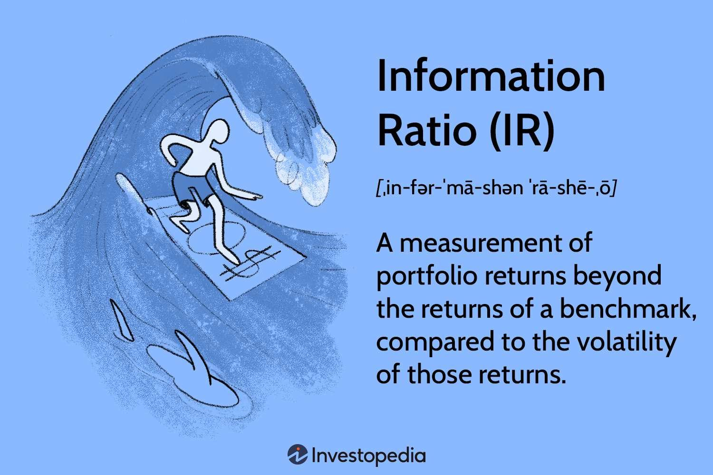

## Table of Contents

## What is the Information Ratio?

The Information Ratio is a way to measure how well a portfolio manager is doing compared to a benchmark, like a stock market index. It looks at the extra return the manager gets, called "active return," and compares it to the extra risk they take, called "tracking error." The formula for the Information Ratio is the active return divided by the tracking error. A higher Information Ratio means the manager is doing a better job of getting more return for the extra risk they are taking.

Think of it like this: if you have two managers, and both get the same extra return, but one takes more risk to get it, the one who took less risk would have a better Information Ratio. It helps investors see if the extra return they are getting is worth the extra risk they are taking. A good Information Ratio is usually considered to be above 0.5, but this can change depending on what you are comparing it to.

## What is the Sharpe Ratio?

The Sharpe Ratio is a way to measure how good an investment is by looking at the return you get compared to the risk you take. It was created by a man named William F. Sharpe. The way you calculate it is by taking the return of your investment and subtracting the risk-free rate, like what you would get from a safe investment like a government bond. Then, you divide that number by the standard deviation of the investment's returns, which is a way to measure how much the returns go up and down. A higher Sharpe Ratio means the investment is giving you more return for the risk you are taking.

Think of the Sharpe Ratio like this: if you have two investments and they both give you the same return, but one is a lot riskier, the one with less risk will have a better Sharpe Ratio. It helps you see if the extra return you are getting from an investment is worth the extra risk. A good Sharpe Ratio is usually thought to be above 1, but this can change depending on what you are comparing it to.

## How is the Information Ratio calculated?

The Information Ratio is a way to see how well a portfolio manager is doing compared to a benchmark, like a stock market index. To calculate it, you first find the active return. This is the difference between the return of the portfolio and the return of the benchmark. For example, if the portfolio went up by 10% and the benchmark went up by 8%, the active return would be 2%. Then, you need to find the tracking error. This is a measure of how much the portfolio's returns go up and down compared to the benchmark. It's usually calculated as the standard deviation of the active returns.

Once you have the active return and the tracking error, you can calculate the Information Ratio by dividing the active return by the tracking error. So, if the active return is 2% and the tracking error is 1%, the Information Ratio would be 2 divided by 1, which equals 2. A higher Information Ratio means the portfolio manager is doing a better job of getting more return for the extra risk they are taking. A good Information Ratio is usually thought to be above 0.5, but this can change depending on what you are comparing it to.

## How is the Sharpe Ratio calculated?

The Sharpe Ratio is a way to see how good an investment is by comparing the return it gives you to the risk you take. It was created by a guy named William F. Sharpe. To calculate it, you take the return of your investment and subtract the risk-free rate. The risk-free rate is what you would get from a very safe investment, like a government bond. Then, you divide that number by the standard deviation of the investment's returns. The standard deviation is a way to measure how much the returns go up and down.

A higher Sharpe Ratio means the investment is giving you more return for the risk you are taking. If you have two investments and they both give you the same return, but one is a lot riskier, the one with less risk will have a better Sharpe Ratio. It helps you see if the extra return you are getting from an investment is worth the extra risk. A good Sharpe Ratio is usually thought to be above 1, but this can change depending on what you are comparing it to.

## What is the difference between the Information Ratio and the Sharpe Ratio?

The Information Ratio and the Sharpe Ratio are both used to see how good an investment is, but they look at different things. The Information Ratio is used to see how well a portfolio manager is doing compared to a benchmark, like a stock market index. It looks at the extra return the manager gets, called the active return, and compares it to the extra risk they take, called the tracking error. So, it helps you see if the manager is getting enough extra return for the extra risk they are taking. A higher Information Ratio means the manager is doing a better job.

The Sharpe Ratio, on the other hand, is used to see how good an investment is by comparing its return to the risk you take. It was created by William F. Sharpe. To calculate it, you take the return of your investment and subtract the risk-free rate, which is what you would get from a very safe investment like a government bond. Then, you divide that number by the standard deviation of the investment's returns, which measures how much the returns go up and down. A higher Sharpe Ratio means the investment is giving you more return for the risk you are taking. So, while the Information Ratio focuses on a manager's performance compared to a benchmark, the Sharpe Ratio looks at the overall risk and return of an investment.

## In what scenarios is the Information Ratio more useful than the Sharpe Ratio?

The Information Ratio is more useful than the Sharpe Ratio when you want to see how well a portfolio manager is doing compared to a specific benchmark, like a stock market index. It helps you understand if the manager is getting enough extra return for the extra risk they are taking compared to the benchmark. For example, if you are looking at a fund manager who is supposed to beat the S&P 500, the Information Ratio will tell you how well they are doing that job. It's all about comparing the manager's performance to a specific goal or standard.

On the other hand, the Sharpe Ratio is more about looking at the overall risk and return of an investment, without comparing it to a specific benchmark. It's useful when you want to see if an investment is giving you enough return for the risk you are taking, but it doesn't tell you how the investment is doing compared to a specific index or goal. So, if you are more interested in how a manager is doing compared to a specific benchmark, the Information Ratio is the better choice.

## In what scenarios is the Sharpe Ratio more useful than the Information Ratio?

The Sharpe Ratio is more useful than the Information Ratio when you want to see how good an investment is by looking at the return it gives you compared to the risk you are taking. It's all about figuring out if the extra return you are getting from an investment is worth the extra risk. For example, if you are thinking about investing in a stock, a mutual fund, or even a whole portfolio, the Sharpe Ratio can help you see if that investment is giving you a good bang for your buck in terms of risk and return. It's great for comparing different investments to see which one is the best choice for you, without needing to compare them to a specific benchmark like a stock market index.

In contrast, the Information Ratio is more focused on how a portfolio manager is doing compared to a specific benchmark. So, if you don't have a specific benchmark in mind and you just want to look at the overall performance of an investment, the Sharpe Ratio is the better tool. It's also really helpful when you are comparing investments that don't have a clear benchmark to compare against. For example, if you are looking at different types of investments like stocks, bonds, and real estate, the Sharpe Ratio can help you see which one is giving you the best return for the risk you are taking, without needing to compare them to a specific index.

## How do the risk-free rates affect the Sharpe Ratio?

The risk-free rate is a big part of the Sharpe Ratio. It's what you would get from a very safe investment, like a government bond. When you calculate the Sharpe Ratio, you take the return of your investment and subtract the risk-free rate. This shows you the extra return you are getting for taking more risk. If the risk-free rate goes up, the Sharpe Ratio goes down because the extra return you are getting from your investment looks smaller. On the other hand, if the risk-free rate goes down, the Sharpe Ratio goes up because the extra return looks bigger.

This means the Sharpe Ratio can change a lot depending on what the risk-free rate is. For example, if the risk-free rate is really high, like during times when the economy is doing well and interest rates are up, the Sharpe Ratio for your investments might look lower. But if the risk-free rate is really low, like during times when the economy is not doing so well and interest rates are down, the Sharpe Ratio for your investments might look higher. So, when you are looking at the Sharpe Ratio, it's important to know what the risk-free rate is and how it might affect your numbers.

## What are the limitations of using the Information Ratio?

One big problem with the Information Ratio is that it looks at how a portfolio manager did in the past, but it doesn't tell you how they will do in the future. Just because a manager did well before doesn't mean they will keep doing well. Also, the Information Ratio can be tricky because it depends a lot on the benchmark you choose. If you pick a different benchmark, the Information Ratio can change a lot. So, you have to be careful about which benchmark you use when you're trying to figure out how good a manager is.

Another issue is that the Information Ratio doesn't tell you everything about risk. It only looks at how much the returns go up and down compared to the benchmark, which is called tracking error. But there are other kinds of risk that it doesn't think about, like the chance of losing a lot of money all at once. So, if you only use the Information Ratio, you might miss some important risks. That's why it's good to use other ways to check how a manager is doing, not just the Information Ratio.

## What are the limitations of using the Sharpe Ratio?

One big problem with the Sharpe Ratio is that it looks at how an investment did in the past, but it doesn't tell you how it will do in the future. Just because an investment did well before doesn't mean it will keep doing well. Also, the Sharpe Ratio can be tricky because it depends a lot on the risk-free rate you use. If the risk-free rate changes, the Sharpe Ratio can change a lot too. So, you have to be careful about what risk-free rate you use when you're trying to figure out how good an investment is.

Another issue is that the Sharpe Ratio doesn't tell you everything about risk. It only looks at how much the returns go up and down, which is called standard deviation. But there are other kinds of risk that it doesn't think about, like the chance of losing a lot of money all at once. So, if you only use the Sharpe Ratio, you might miss some important risks. That's why it's good to use other ways to check how an investment is doing, not just the Sharpe Ratio.

## How can the Information Ratio and Sharpe Ratio be used together in portfolio management?

In portfolio management, using both the Information Ratio and the Sharpe Ratio can give you a fuller picture of how well your investments are doing. The Information Ratio helps you see how a portfolio manager is doing compared to a specific benchmark, like the S&P 500. It tells you if the manager is getting enough extra return for the extra risk they are taking. On the other hand, the Sharpe Ratio looks at the overall risk and return of your whole investment, not just compared to a benchmark. It helps you see if the extra return you are getting is worth the risk you are taking, no matter what the benchmark is.

By using both ratios together, you can get a better understanding of your investments. For example, if the Information Ratio is high, it means your portfolio manager is doing a good job compared to the benchmark. But if the Sharpe Ratio is low, it might mean that the overall risk and return of your investment aren't that great. So, you might want to think about changing your investments or finding a different manager. Using both ratios helps you make smarter choices about your money by looking at different parts of your investment's performance.

## What advanced statistical considerations should be taken into account when interpreting the Information Ratio and Sharpe Ratio?

When you use the Information Ratio and Sharpe Ratio, it's important to think about how the numbers are spread out. Both ratios use something called standard deviation to measure risk. But standard deviation only looks at how much the numbers go up and down, not how they are shaped. This means they might not catch all the risks. For example, if your investment has a lot of big drops, the standard deviation might not show that as clearly as you'd like. So, you might want to use other ways to measure risk, like looking at how often your investment loses money, to get a better picture.

Another thing to think about is how long you look at the data. Both ratios can change a lot depending on whether you look at a short time or a long time. If you only look at a short time, like a few months, the numbers might not show the real risk and return of your investment. It's better to look at longer times, like a few years, to get a more accurate idea. Also, both ratios assume that the returns follow a normal pattern, but real investments often don't. So, it's a good idea to check if the returns really do follow a normal pattern before you trust the ratios too much.

## What is the Sharpe Ratio and how can it be understood?

The Sharpe Ratio, introduced by economist William F. Sharpe in 1966, is a key metric used to evaluate the risk-adjusted return of an investment. This ratio provides a comprehensive means of comparing the performance of an investment by factoring both return and risk. It is mathematically represented as:

$$
\text{Sharpe Ratio} = \frac{R_p - R_f}{\sigma_p}
$$

In this formula:
- $R_p$ represents the return of the portfolio or investment.
- $R_f$ stands for the risk-free rate, which is the return expected from an investment with no risk, typically associated with government bonds.
- $\sigma_p$ is the standard deviation of the portfolio's excess return, acting as a proxy for the investment's volatility.

The core idea behind the Sharpe Ratio is to determine how much excess return an investor receives for bearing additional risk inherent in the investment. A higher Sharpe Ratio indicates a more favorable risk-adjusted return, suggesting that the investment provides better compensation for the risk taken.

In the rapidly growing field of [algorithmic trading](/wiki/algorithmic-trading), assessing the efficiency and performance of trading models is vital. The Sharpe Ratio serves as an indispensable tool in this regard. By quantifying the return in excess of the risk-free rate per unit of risk, traders are equipped to evaluate the merit of trading strategies, compare different trading models, and refine their strategies to achieve optimal performance. Algorithmic trading involves making rapid, data-driven decisions, and the clarity provided by a high Sharpe Ratio can be decisive for success.

For example, consider an algorithmic trading strategy with a monthly return of 1.0%, a risk-free rate of 0.2%, and a standard deviation of 1.5% in its monthly excess returns. The Sharpe Ratio for this strategy would be calculated as:

$$
\text{Sharpe Ratio} = \frac{1.0\% - 0.2\%}{1.5\%} = 0.533
$$

This indicates that the strategy provides a return of 0.533% for each unit of risk, highlighting potential efficiency in risk-adjusted performance. Such insights enable traders and investors to discern which trading models enhance portfolio outcomes.

## How do you calculate the Sharpe Ratio?

The Sharpe Ratio is a widely used metric for calculating the risk-adjusted return of an investment portfolio. The formula for the Sharpe Ratio is:

$$
\text{Sharpe Ratio} = \frac{R_p - R_f}{\sigma_p}
$$

where:
- $R_p$ represents the return of the portfolio.
- $R_f$ is the risk-free rate.
- $\sigma_p$ is the standard deviation of the portfolio's excess return.

This ratio is valuable for evaluating an investment's performance by assessing how much excess return an investor receives for the additional volatility endured. The greater the Sharpe Ratio, the more attractive the risk-adjusted return of the investment is.

To illustrate this with an example: consider a trading strategy that yields an average return ($R_p$) of 12%. If the risk-free rate ($R_f$) is 3% and the standard deviation ($\sigma_p$) of the portfolio’s excess returns is 10%, the Sharpe Ratio would be calculated as follows:

$$
\text{Sharpe Ratio} = \frac{12\% - 3\%}{10\%} = \frac{9\%}{10\%} = 0.9
$$

This implies that for each unit of risk, the portfolio generates 0.9 units of return above the risk-free rate. Such a ratio helps investors and traders in the evaluation and comparison of trading strategies, aiding in decision-making processes. It succinctly captures the trade-off between risk and return, providing a single value for judgment.

## What is Exploring the Information Ratio?

The Information Ratio (IR) is a crucial metric for assessing the performance of an investment portfolio relative to a benchmark index. It evaluates both excess returns and the consistency of these returns. The formula for calculating the Information Ratio is:

$$
\text{Information Ratio (IR)} = \frac{R_p - R_b}{\sigma_e}
$$

where $R_p$ represents the annualized return of the portfolio, $R_b$ is the return of the benchmark index, and $\sigma_e$ is the tracking error, which quantifies the standard deviation of the difference between the portfolio and benchmark returns.

The Information Ratio serves as an indicator of how efficiently a portfolio manager generates excess returns relative to the risk taken, as represented by the tracking error. In this context, a higher IR indicates better performance as it reflects more significant excess returns for each unit of risk. Consistency is key, and the IR is especially valuable for evaluating strategies where maintaining a steady level of outperformance is critical.

Unlike the Sharpe Ratio, which measures returns against a risk-free rate, the Information Ratio focuses on the portfolio's ability to outperform a benchmark, considering the volatility of this outperformance. It allows for the evaluation of active fund management strategies by offering insights into how well a fund manager achieves returns above a passive benchmark. This comparison is essential for investors seeking to distinguish between skillful management and mere luck.

The Information Ratio complements the Sharpe Ratio by providing a more targeted analysis in scenarios where a clear benchmark exists. Investors and fund managers might use both metrics to gain comprehensive insight into the risk-adjusted performance of their investment strategies, especially when evaluating active versus passive fund management.

## What is the difference between the Information Ratio and the Sharpe Ratio?

The Sharpe Ratio and the Information Ratio (IR) are fundamental in analyzing the risk-adjusted performance of investment portfolios, but they serve distinct purposes and are applicable in different contexts. The Sharpe Ratio is primarily concerned with the return of an investment relative to the risk-free rate, providing a measure of the excess return per unit of risk. Mathematically, it is expressed as:

$$
\text{Sharpe Ratio} = \frac{R_p - R_f}{\sigma_p}
$$

where $R_p$ is the return of the portfolio, $R_f$ is the risk-free rate, and $\sigma_p$ is the standard deviation of the portfolio's excess return.

In contrast, the Information Ratio evaluates portfolio returns relative to a specific benchmark index, accounting for the consistency of outperformance. It is calculated using:

$$
\text{Information Ratio} = \frac{R_p - R_b}{\sigma_d}
$$

where $R_p$ is the portfolio return, $R_b$ is the benchmark return, and $\sigma_d$ is the tracking error, representing the standard deviation of the difference in returns between the portfolio and the benchmark.

The selection between these two metrics largely hinges on the investment strategy and the benchmark reference in place. For strategies that focus on absolute returns, such as those not directly tied to any benchmark or aiming for a set return objective over the risk-free rate, the Sharpe Ratio offers a straightforward measure of performance by assessing how much excess return is achieved for each unit of risk assumed.

On the other hand, the Information Ratio is more suited for active strategies that aim to outperform a benchmark. Here, the focus is on the incremental return achieved over that benchmark, adjusted for the tracking error. A higher IR indicates sound active management yielding consistent outperformance over the benchmark after accounting for volatility, making it an essential metric for assessing manager skill and efficacy in strategies like equity mutual funds that benchmark themselves against indices like the S&P 500.

Strategically, a portfolio manager might prefer the Sharpe Ratio for evaluating absolute return strategies which seek to maximize risk-adjusted returns irrespective of market movements. Conversely, the Information Ratio becomes invaluable for evaluating performance consistency of strategies benchmarked against market indices, offering insights into how well the portfolio manager adds value over passively managed investments.

In summary, while both metrics provide vital insights into risk-adjusted returns, their application differs based on investment objectives and benchmark considerations. An adept understanding and application of both ratios can significantly enhance investment decision-making processes.

## What are some practical applications and examples?

In practical terms, the Sharpe Ratio and Information Ratio serve as essential metrics for evaluating risk-adjusted returns across different investment strategies. A higher ratio indicates better performance relative to the associated risk, thereby providing investors with a more effective means of comparison.

Consider an example where two fund managers are evaluated using these metrics. Fund Manager A has an annualized return of 10% with a tracking error of 4%. In contrast, Fund Manager B achieves an annualized return of 8% with a tracking error of 2%. To determine which manager performs more consistently relative to a benchmark, the Information Ratio can be calculated as follows:

$$
\text{Information Ratio (IR)} = \frac{\text{Portfolio Return} - \text{Benchmark Return}}{\text{Tracking Error}}
$$

Assuming a benchmark return of 5%, Fund Manager A's IR is:

$$
\text{IR}_A = \frac{10\% - 5\%}{4\%} = 1.25
$$

Fund Manager B's IR is:

$$
\text{IR}_B = \frac{8\% - 5\%}{2\%} = 1.5
$$

Despite a lower absolute return, Fund Manager B demonstrates better risk-adjusted performance due to a lower tracking error, resulting in a higher Information Ratio. This suggests that Manager B offers superior performance consistency relative to the benchmark.

Employing these metrics enables traders to go beyond mere return figures and assess performance considering the risk taken to achieve those returns. Over time, the continuous assessment of the Sharpe and Information Ratios helps in strategy validation and optimization, facilitating improved alignment with investors' risk tolerance and return objectives.

Using Python, these calculations can be implemented as follows:

```python
def information_ratio(portfolio_return, benchmark_return, tracking_error):
    return (portfolio_return - benchmark_return) / tracking_error

portfolio_return_A = 0.10
benchmark_return = 0.05
tracking_error_A = 0.04

portfolio_return_B = 0.08
tracking_error_B = 0.02

IR_A = information_ratio(portfolio_return_A, benchmark_return, tracking_error_A)
IR_B = information_ratio(portfolio_return_B, benchmark_return, tracking_error_B)

print("Information Ratio for Fund Manager A:", IR_A)
print("Information Ratio for Fund Manager B:", IR_B)
```

These assessments underscore the practical utility of Sharpe and Information Ratios in distinguishing between funds or strategies, enhancing the alignment of investment choices with individual performance and risk management goals.

## References & Further Reading

[1]: Sharpe, W. F. (1966). ["Mutual Fund Performance."](https://www.jstor.org/stable/2351741) Journal of Business, 39(1), 119-138.

[2]: Grinold, R. C., & Kahn, R. N. (1999). ["Active Portfolio Management: A Quantitative Approach for Producing Superior Returns and Controlling Risk."](https://www.amazon.com/Active-Portfolio-Management-Quantitative-Controlling/dp/0070248826) (2nd ed.). McGraw-Hill.

[3]: Treynor, J. L., & Black, F. (1973). ["How to Use Security Analysis to Improve Portfolio Selection."](https://www.jstor.org/stable/2351280) Journal of Business.

[4]: Fabozzi, F. J., Focardi, S. M., & Kolm, P. N. (2010). ["Quantitative Equity Investing: Techniques and Strategies."](https://www.semanticscholar.org/paper/Quantitative-Equity-Investing%3A-Techniques-and-Fabozzi-Focardi/1c49a2a53919f7e65cb96f16691b8ff726fd3cd7) Wiley.

[5]: Lo, A. W. (2009). ["The Heretics of Finance: Conversations with Leading Practitioners of Technical Analysis."](https://www.amazon.com/Heretics-Finance-Conversations-Practitioners-Technical/dp/1576603164) John Wiley & Sons.