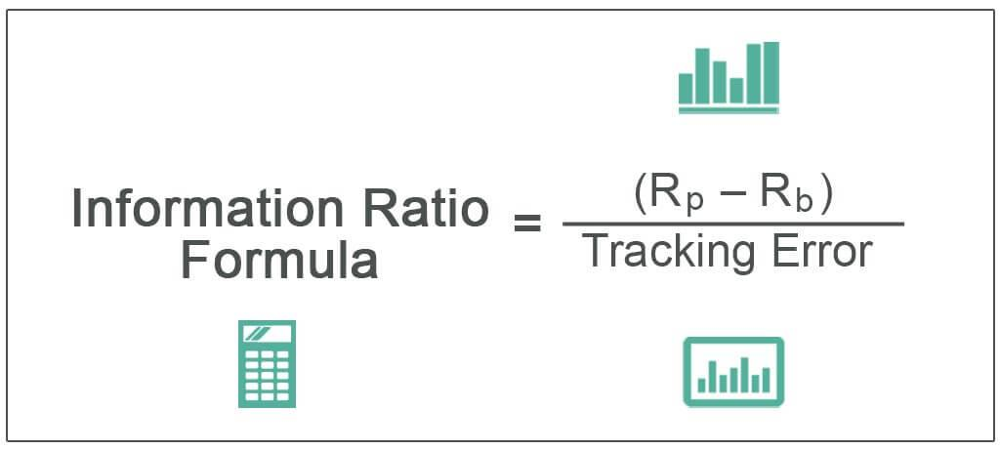

## Table of Contents

## What is the Information Ratio?

The Information Ratio is a measure used to evaluate the performance of an investment manager or a portfolio. It compares the returns of the portfolio to a benchmark, like a stock market index, and looks at how consistently the portfolio beats the benchmark. The ratio is calculated by taking the difference between the portfolio's returns and the benchmark's returns (known as the active return), and then dividing that by the standard deviation of the active return. This standard deviation is a measure of how much the active return varies over time.

In simple terms, the Information Ratio tells us how well a manager is doing in picking investments that perform better than a standard benchmark, and how steady their performance is. A higher Information Ratio means the manager is doing a good job of beating the benchmark more often and with less ups and downs. For example, if a manager's portfolio consistently beats the S&P 500 index, and does so with little variation, they would have a high Information Ratio. This makes the Information Ratio a useful tool for investors trying to decide which fund managers to trust with their money.

## How is the Information Ratio calculated?

The Information Ratio is calculated by looking at how much better or worse a portfolio does compared to a benchmark, like the S&P 500. This difference is called the active return. To find the active return, you subtract the benchmark's return from the portfolio's return. For example, if the portfolio went up by 10% and the benchmark went up by 8%, the active return would be 2%.

After finding the active return, the next step is to see how much this active return changes over time. This is done by calculating the standard deviation of the active returns. The standard deviation tells us how much the active return varies. To get the Information Ratio, you divide the average active return by the standard deviation of the active returns. A higher Information Ratio means the portfolio is doing a good job of beating the benchmark more consistently.

## Why is the Information Ratio important in investment analysis?

The Information Ratio is important in investment analysis because it helps investors see how well a portfolio manager is doing compared to a standard benchmark, like the S&P 500. It tells us if the manager is [picking](/wiki/asset-class-picking) investments that do better than the benchmark and how steady their performance is. A high Information Ratio means the manager is good at beating the benchmark more often and with less ups and downs. This is useful for investors because it helps them decide which fund managers to trust with their money.

By looking at the Information Ratio, investors can get a clear picture of a manager's skill in picking investments. It's not just about beating the benchmark once or twice; it's about doing it consistently over time. This makes the Information Ratio a valuable tool for comparing different managers and choosing the ones who are likely to give better returns with less risk.

## What does a high Information Ratio indicate?

A high Information Ratio means that a portfolio manager is doing a great job at picking investments that do better than a standard benchmark, like the S&P 500. It shows that the manager is not only beating the benchmark but doing so consistently over time. This consistency is important because it means the manager is good at making smart investment choices that lead to better returns.

Investors look at the Information Ratio to decide which fund managers to trust with their money. A high Information Ratio tells them that the manager can beat the benchmark more often and with less ups and downs. This makes the Information Ratio a helpful tool for choosing managers who are likely to give better returns with less risk.

## What does a low Information Ratio suggest?

A low Information Ratio means that a portfolio manager is not doing a good job at picking investments that do better than a standard benchmark, like the S&P 500. It shows that the manager is not beating the benchmark very often or their performance is not steady. This inconsistency can be a red flag for investors because it means the manager is not making smart investment choices that lead to better returns.

When investors see a low Information Ratio, it suggests that the manager might not be the best choice for managing their money. A low ratio means there is more risk and less reward compared to what the benchmark is doing. So, investors might want to look for other managers who have a higher Information Ratio to get better and more consistent returns on their investments.

## How does the Information Ratio differ from the Sharpe Ratio?

The Information Ratio and the Sharpe Ratio are both used to measure how well an investment is doing, but they focus on different things. The Information Ratio looks at how much better or worse a portfolio does compared to a benchmark, like the S&P 500. It tells us if the portfolio manager is picking good investments that beat the benchmark and how steady their performance is. A high Information Ratio means the manager is doing a good job at beating the benchmark more often and with less ups and downs.

On the other hand, the Sharpe Ratio looks at how much return an investment gives for the amount of risk it takes. It compares the return of the portfolio to the risk-free rate, like the return on a U.S. Treasury bond, and then divides that by the standard deviation of the portfolio's returns. The Sharpe Ratio helps investors see if they are getting enough return for the risk they are taking. A high Sharpe Ratio means the investment is giving good returns for the risk involved.

So, while the Information Ratio is about comparing a portfolio to a benchmark and looking at consistency, the Sharpe Ratio is about comparing the portfolio's return to a risk-free rate and looking at risk-adjusted returns. Both ratios are important, but they give different kinds of information to help investors make better choices.

## Can the Information Ratio be used to compare different investment managers?

Yes, the Information Ratio can be used to compare different investment managers. It helps investors see how well each manager is doing at picking investments that do better than a standard benchmark, like the S&P 500. By looking at the Information Ratio, you can tell if a manager is beating the benchmark more often and with less ups and downs. A higher Information Ratio means the manager is doing a better job at this, making it easier for investors to choose the best manager for their money.

However, it's important to remember that the Information Ratio is just one tool. It doesn't tell the whole story about a manager's performance. Other things like the manager's investment style, the types of investments they choose, and how much risk they take also matter. So, while the Information Ratio is a helpful way to compare managers, it should be used along with other measures to get a full picture of how well a manager is doing.

## What are the limitations of using the Information Ratio?

The Information Ratio has some limits that investors should know about. It only looks at how well a portfolio does compared to a benchmark, like the S&P 500. It doesn't tell you about other important things, like how much risk the manager is taking or what kind of investments they are choosing. So, even if a manager has a high Information Ratio, they might be taking a lot of risk to get those returns. This means the Information Ratio alone might not give you the whole picture of how good a manager really is.

Another thing to think about is that the Information Ratio can be affected by the time period you look at. If you only look at a short time, like a year, the Information Ratio might not show how well the manager does over the long run. Also, the benchmark you choose can make a big difference. If you pick a benchmark that doesn't match the investments in the portfolio, the Information Ratio might not be very useful. So, it's best to use the Information Ratio along with other measures to get a better idea of a manager's performance.

## How can the Information Ratio be improved by an investment manager?

An investment manager can improve their Information Ratio by focusing on picking investments that do better than the benchmark more often and more consistently. This means they need to be good at finding stocks or other investments that will go up more than the average stock in the benchmark. They should also try to keep their choices steady, so their performance doesn't go up and down too much. By doing this, the difference between their portfolio's returns and the benchmark's returns (the active return) will be higher, and the ups and downs of that difference (the standard deviation) will be lower. This will lead to a higher Information Ratio.

Another way to improve the Information Ratio is by managing risk better. The manager should try to take smart risks that help them beat the benchmark without making their performance too unpredictable. They can do this by diversifying their investments, which means spreading their money across different types of investments. This can help smooth out the ups and downs in their returns. By focusing on both picking good investments and managing risk well, the manager can make their Information Ratio better and show investors that they are doing a great job.

## What role does the benchmark play in calculating the Information Ratio?

The benchmark is really important when calculating the Information Ratio. It's like a standard that we compare the portfolio's performance to. For example, if you're looking at a stock portfolio, the S&P 500 might be the benchmark. The Information Ratio tells us how much better or worse the portfolio does compared to this benchmark. So, if the portfolio does better than the S&P 500, the Information Ratio will be higher. If it does worse, the Information Ratio will be lower.

Choosing the right benchmark is key because it can change the Information Ratio a lot. If the benchmark doesn't match the investments in the portfolio, the Information Ratio might not be very useful. For example, if you're looking at a portfolio of small company stocks, using the S&P 500 as a benchmark might not make sense because the S&P 500 has mostly big company stocks. So, it's important to pick a benchmark that fits the portfolio to get a true picture of how well the portfolio is doing.

## How does tracking error relate to the Information Ratio?

Tracking error is how much a portfolio's returns go up and down compared to the benchmark's returns. It's like measuring how bumpy the ride is when a portfolio tries to follow a benchmark. The Information Ratio uses tracking error in its calculation. It takes the difference between the portfolio's returns and the benchmark's returns (the active return) and divides it by the tracking error. So, if the portfolio beats the benchmark by a lot but also has big ups and downs, the Information Ratio might not be as high as you'd think because the tracking error is big.

A lower tracking error means the portfolio's returns are closer to the benchmark's returns, making the ride smoother. If a portfolio has a high active return but a low tracking error, the Information Ratio will be high. This shows that the portfolio manager is doing a good job at picking investments that do better than the benchmark and doing it in a steady way. But if the tracking error is high, even a high active return might not lead to a great Information Ratio, because the portfolio's performance is too unpredictable. So, tracking error is a big part of the Information Ratio, helping investors see how steady the portfolio's performance is compared to the benchmark.

## What advanced statistical techniques can enhance the analysis of the Information Ratio?

Advanced statistical techniques can help make the analysis of the Information Ratio even better. One way is by using something called regression analysis. This helps us see if the portfolio's returns are really because of the manager's smart choices or just because the market is doing well. By using regression, we can separate the manager's skill from what's happening in the market. Another technique is bootstrapping, which is like running a lot of pretend tests to see how likely it is that the Information Ratio we see is just by chance. This helps us understand if the manager is really good or if they just got lucky.

Another useful technique is time-series analysis, which looks at how the Information Ratio changes over time. This can help us see if the manager is good at beating the benchmark consistently, or if their performance goes up and down a lot. By using time-series analysis, we can get a better idea of how steady the manager's performance is. These advanced techniques help us get a fuller picture of the Information Ratio, making it easier to tell if a manager is really doing a good job or not.

## What is the Information Ratio?

The Information Ratio (IR) is a key metric used in finance to evaluate the performance of an investment strategy relative to a benchmark. It is calculated by comparing the excess returns of a portfolio over a benchmark to the [volatility](/wiki/volatility-trading-strategies) of those returns. Essentially, the Information Ratio provides insights into how efficiently a portfolio generates excess returns per unit of risk taken when compared to a benchmark. A higher Information Ratio indicates a more favorable risk/reward trade-off, suggesting that the strategy efficiently converts risk into excess returns.

The mathematical formula for the Information Ratio is:

$$
\text{Information Ratio} = \frac{R_p - R_b}{\text{Tracking Error}}
$$

Where:
- $R_p$ is the average return of the portfolio.
- $R_b$ is the average return of the benchmark.
- Tracking Error is the standard deviation of the difference between the portfolio and benchmark returns.

The Information Ratio is an invaluable tool for traders and portfolio managers who seek to enhance their strategy's risk-adjusted performance. By comparing a portfolio's returns to those of its benchmark, the IR helps in identifying how well a strategy is performing in generating alpha - the excess return over the benchmark in question. High values of the Information Ratio signal that a strategy is adept at achieving superior returns while managing risk effectively. Conversely, a lower Information Ratio might indicate inefficiencies in capitalizing on risk, prompting a reassessment of the strategy.

## How does this compare with other performance metrics?

In evaluating trading strategies, it's important to recognize the nuances between different performance metrics. The Information Ratio stands out by focusing on excess returns relative to a benchmark, a feature that differentiates it from other measures such as the Sharpe Ratio, Maximum Drawdown, and Profit Factor.

The Sharpe Ratio is a widely used metric that assesses risk-adjusted returns but does so independently of any benchmark. It is defined as:

$$
\text{Sharpe Ratio} = \frac{\text{Rp} - \text{Rf}}{\text{Std Dev of Returns}}
$$

where $\text{Rp}$ is the portfolio return, $\text{Rf}$ is the risk-free rate, and the denominator represents the standard deviation of the portfolio's excess return over the risk-free rate. This metric offers insights into the return on investment per unit of total risk. However, it may obscure inadequate performance relative to specific market indices, as it does not consider the performance against a benchmark.

On the other hand, Maximum Drawdown provides a measure of the largest peak-to-trough decline in portfolio value over a specific period. It offers a perspective on the potential for loss and the risk of enduring significant declines. Though invaluable for understanding risk exposure, Maximum Drawdown does not account for relative performance against a benchmark, a key element for traders assessing efficiency against market indices.

Similarly, the Profit Factor, calculated as the ratio of gross profits to gross losses during a trading period, highlights overall profit efficiency. While it effectively measures historical profitability at a glance, it lacks the context of benchmark-relative performance, often critical for algorithmic strategies striving for consistent excess returns.

Thus, while each of these metrics offers valuable insights into different dimensions of portfolio performance, the Information Ratio uniquely provides a measure of return efficiency that is directly tied to a benchmark. This makes it particularly useful for traders and analysts focused on outperforming specific market indices within their algorithmic strategies.

## How do you compute and interpret the Information Ratio?

To calculate the Information Ratio, it is essential to gather historical return data from both the trading strategy and its associated benchmark. The objective is to assess how well the strategy performs when compared to the benchmark within the context of taking risk. Here's how you can compute and interpret this important metric:

1. **Calculate Excess Returns**: Start by determining the excess return for each period, which is the difference between the portfolio return (Rp) and the benchmark return (Rb). This is given by:
$$
   \text{Excess Return} = R_p - R_b

$$
   This step highlights how much additional return the strategy generates over the benchmark.

2. **Determine Tracking Error**: The Tracking Error is a statistical measure of how the portfolio's returns differ from the benchmark's returns. Compute the standard deviation of the excess returns over the evaluation period. The formula for Tracking Error (TE) is:
$$
   \text{Tracking Error} = \sigma(R_p - R_b)

$$
   where $\sigma$ represents the standard deviation.

3. **Compute the Information Ratio**: With the excess return and the Tracking Error determined, calculate the Information Ratio using the formula:
$$
   \text{Information Ratio} = \frac{\overline{(R_p - R_b)}}{\sigma(R_p - R_b)}

$$
   Here, $\overline{(R_p - R_b)}$ is the average excess return over the specified period.

4. **Interpretation**: A higher Information Ratio indicates that the trading strategy is achieving more return per unit of risk relative to the benchmark. It suggests efficient performance as the strategy successfully capitalizes on excess return opportunities while managing volatility effectively. Conversely, a lower Information Ratio may indicate inefficiencies or potential areas for improvement in the strategy.

Using this computational approach, traders can systematically evaluate and refine their strategies based on how effectively they generate returns in comparison to their benchmark, given the risk involved.

## References & Further Reading

[1]: Bergstra, J., Bardenet, R., Bengio, Y., & Kégl, B. (2011). ["Algorithms for Hyper-Parameter Optimization."](https://papers.nips.cc/paper/4443-algorithms-for-hyper-parameter-optimization) Advances in Neural Information Processing Systems 24.

[2]: ["Advances in Financial Machine Learning"](https://www.amazon.com/Advances-Financial-Machine-Learning-Marcos/dp/1119482089) by Marcos Lopez de Prado

[3]: ["Evidence-Based Technical Analysis: Applying the Scientific Method and Statistical Inference to Trading Signals"](https://www.amazon.com/Evidence-Based-Technical-Analysis-Scientific-Statistical/dp/0470008741) by David Aronson

[4]: ["Machine Learning for Algorithmic Trading"](https://github.com/stefan-jansen/machine-learning-for-trading) by Stefan Jansen

[5]: ["Quantitative Trading: How to Build Your Own Algorithmic Trading Business"](https://books.google.com/books/about/Quantitative_Trading.html?id=j70yEAAAQBAJ) by Ernest P. Chan