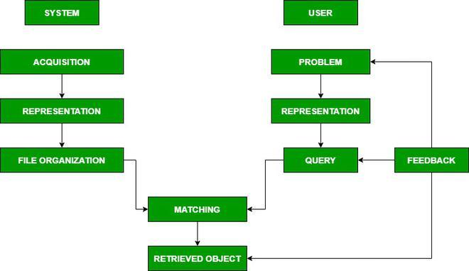

## Table of Contents

## What is Information Retrieval and why is it important in machine learning?

Information Retrieval (IR) is the process of finding and getting information from a large collection of data. It's like searching for a book in a big library. When you type something into a search engine, IR helps find the best matching results. It uses different methods to understand what you're looking for and then ranks the results so the most relevant ones show up first.

IR is important in machine learning because it helps machines understand and process human language better. Machine learning models can learn from the data retrieved by IR systems to improve their performance. For example, if a machine learning model is used to recommend products, it can use IR to find similar products that customers might like. This makes the recommendations more accurate and useful. By working together, IR and machine learning can make systems smarter and more helpful to users.

## What are the basic components of an Information Retrieval system?

An Information Retrieval system has several key parts that work together to help you find what you're looking for. First, there's the collection of data, which is like a big library of documents, images, or other types of information. When you search for something, the system uses an index to quickly find relevant items. The index is like a catalog that helps the system know where to look without having to check every single item in the collection.

Next, there's the query processor, which understands what you're asking for. It takes your search terms and turns them into something the system can use to find matches. After that, the retrieval part comes in, which actually finds the items that match your search. The system then uses a ranking algorithm to decide which results are most relevant and should be shown first. This ranking can be based on how well the items match your query or how popular they are.

Finally, the user interface is what you see and interact with. It shows you the search results and lets you refine your search if needed. All these parts work together to make sure you get the best and most relevant information quickly and easily.

## How does the SERAC method work in Information Retrieval?

The SERAC method, which stands for Search, Evaluate, Retrieve, Analyze, and Classify, is a structured approach used in Information Retrieval to help find and process information more effectively. When you start with a search, you type in what you're looking for, and the system uses this to find relevant items from its collection. After searching, the system evaluates the results to see how well they match your query. This step involves checking things like keywords and the context of the documents to make sure they are relevant.

Once the system has evaluated the results, it retrieves the most relevant items. This is where the system pulls out the documents or data that it thinks will be most helpful to you. After retrieving the items, the system analyzes them to understand their content better. This might involve looking at the text, images, or other data to see what they are about. Finally, the system classifies the retrieved items into categories. This helps in organizing the results so you can find what you need more easily. By following these steps, the SERAC method makes sure you get the best and most organized information from your search.

## What are the key features of TILDEv2 and how does it improve upon previous versions?

TILDEv2 is a newer version of a tool used for Information Retrieval, and it has some cool new features that make it better than the older versions. One big improvement is that it's faster and can handle more data at the same time. This means you can search through a huge collection of information without waiting too long for results. TILDEv2 also uses smarter ways to understand what you're searching for, so it can find more relevant results. It's like having a super smart helper that knows exactly what you need.

Another key feature of TILDEv2 is that it's easier to use. The people who made it listened to feedback and made the tool simpler to set up and use. This means you don't need to be a computer expert to get the most out of it. TILDEv2 also works better with other tools and systems, so you can use it alongside other programs you already have. Overall, TILDEv2 makes finding and using information much easier and more efficient than before.

## Can you explain the ReInfoSelect method and its applications in Information Retrieval?

The ReInfoSelect method is a way to pick out the most important information from a big collection of data. It works by first figuring out what you're looking for and then using that to find the best matches. ReInfoSelect uses a special formula to decide which pieces of information are the most useful. It looks at how well the information matches your search and how important it is. This helps make sure you get the best results quickly.

ReInfoSelect is really helpful in many areas of Information Retrieval. For example, it's used in search engines to give you the most relevant web pages when you search for something. It's also used in libraries to help find the right [books](/wiki/algo-trading-books) or articles. ReInfoSelect makes it easier to find what you need by sorting through a lot of information and [picking](/wiki/asset-class-picking) out the best parts. This method is great because it saves time and makes searching more accurate.

## How do SERAC, TILDEv2, and ReInfoSelect compare in terms of performance and efficiency?

SERAC, TILDEv2, and ReInfoSelect are all methods used in Information Retrieval, but they have different ways of working and different strengths. SERAC follows a step-by-step process: Search, Evaluate, Retrieve, Analyze, and Classify. This method is thorough and helps make sure you get the most relevant and organized information. However, it might take a bit longer because it goes through all these steps. ReInfoSelect, on the other hand, uses a special formula to quickly pick out the most important information. It's faster because it focuses on finding the best matches right away, but it might not be as thorough as SERAC in organizing the results.

TILDEv2 is the newest of the three and has been improved to be faster and easier to use. It can handle more data at once and uses smarter ways to understand your search, making it more efficient than the older versions. Compared to SERAC, TILDEv2 might give you results more quickly, but it might not be as detailed in its analysis and classification. Compared to ReInfoSelect, TILDEv2 is easier to set up and use, but ReInfoSelect might be better at quickly finding the most important information. Overall, TILDEv2 offers a good balance of speed and ease of use, while SERAC provides thoroughness, and ReInfoSelect focuses on quick and relevant results.

## What are the common metrics used to evaluate Information Retrieval systems?

Information Retrieval systems are evaluated using several common metrics to see how well they work. One of the main metrics is precision, which measures how many of the results returned by the system are actually relevant to your search. If you get 10 results and 8 of them are useful, the precision is 80%. Another important metric is recall, which looks at how many of the relevant results the system found out of all the relevant results that exist. If there are 20 relevant results and the system found 8 of them, the recall is 40%. These two metrics together help give a good picture of how accurate and complete the system's results are.

Another useful metric is the F1 score, which combines precision and recall into one number. It's calculated using the formula $$ F1 = 2 \times \frac{\text{precision} \times \text{recall}}{\text{precision} + \text{recall}} $$. This helps balance the trade-off between finding all relevant results and making sure the results are relevant. Mean Average Precision (MAP) is also used, especially for systems that rank results. It measures the average precision at different points in the list of results, giving a better idea of how well the system ranks relevant items higher. These metrics help make sure Information Retrieval systems are doing a good job at finding what you need.

## How can machine learning algorithms enhance the effectiveness of Information Retrieval methods?

Machine learning algorithms can make Information Retrieval methods better by learning from past searches to understand what people are looking for. For example, if a lot of people search for "apple" and click on results about the fruit instead of the company, the system can learn to show fruit-related results first. This is called relevance feedback. Machine learning can also help by figuring out what words mean in different contexts. If someone searches for "bank," the system can use [machine learning](/wiki/machine-learning) to decide if they mean a river bank or a place to keep money, based on other words in the search or the user's past searches.

Another way machine learning helps is by improving how results are ranked. Algorithms like neural networks can learn to rank results in a way that makes the most relevant ones show up first. This can be done by using a formula like $$ \text{Score} = \alpha \times \text{Relevance} + \beta \times \text{Popularity} $$, where the system adjusts the values of $\alpha$ and $\beta$ to get the best results. Machine learning can also help with personalization, making search results more useful for each person. By looking at what a user has searched for before, the system can show results that are more likely to be what they want. This makes searching faster and more accurate for everyone.

## What are the challenges faced when implementing Information Retrieval methods in real-world scenarios?

Implementing Information Retrieval methods in real-world scenarios can be tricky because of the huge amount of data that needs to be handled. Systems have to search through millions or even billions of documents, images, or other types of information to find what users are looking for. This means the systems need to be very fast and efficient. They also have to deal with different languages and ways of searching. For example, someone might search for "car" while another person searches for "automobile," but they're looking for the same thing. The system needs to understand these differences and find the right results.

Another challenge is keeping the information up to date and accurate. The internet changes all the time, with new pages being added and old ones being taken down. Information Retrieval systems have to keep track of these changes and make sure the results they show are current. They also have to deal with things like fake news or spam, which can make it hard to find the right information. Machine learning can help with these problems, but it's not perfect. It needs a lot of good data to learn from, and sometimes it can make mistakes. So, making sure the system works well in the real world takes a lot of work and careful planning.

## How do you optimize and fine-tune Information Retrieval models for specific domains?

To optimize and fine-tune Information Retrieval models for specific domains, you need to focus on the unique characteristics and needs of that domain. For example, if you're working on a medical database, you'll want the system to understand medical terms and prioritize results based on their relevance to medical professionals. This can be done by training the model on a dataset that includes medical documents and using domain-specific keywords. You can also use relevance feedback, where the system learns from the searches and clicks of users in the medical field to improve its understanding of what's important. This helps the system give better results over time.

Fine-tuning can also involve adjusting the ranking algorithms to better suit the domain. For instance, in a legal database, you might want to rank results based on the authority of the source or the recency of the case law. You can use machine learning to tweak the formula used for ranking, like $$ \text{Score} = \alpha \times \text{Relevance} + \beta \times \text{Authority} + \gamma \times \text{Recency} $$, where you adjust the values of $\alpha$, $\beta$, and $\gamma$ to get the best results for legal searches. Additionally, you might need to customize the user interface to make it easier for users in the specific domain to find what they need. By focusing on these aspects, you can make the Information Retrieval model more effective and useful for the people who will be using it.

## What recent advancements have been made in Information Retrieval using deep learning techniques?

Recent advancements in Information Retrieval using [deep learning](/wiki/deep-learning) techniques have made searching for information much smarter and more accurate. One big improvement is the use of neural networks to understand the meaning behind words and phrases. For example, deep learning models like BERT (Bidirectional Encoder Representations from Transformers) can understand the context of a search query better than older methods. This means if you search for "bank," the system can figure out if you mean a river bank or a place to keep money based on the other words you use. This makes the search results more relevant and useful.

Another advancement is in how results are ranked. Deep learning models can learn to rank results in a way that puts the most important ones at the top. They do this by using formulas like $$ \text{Score} = \alpha \times \text{Relevance} + \beta \times \text{Popularity} $$, where the system adjusts the values of $\alpha$ and $\beta$ to get the best results. These models can also learn from what users click on, making the system better over time. This is called learning to rank, and it helps make sure you see the most helpful information first.

## How can Information Retrieval methods be integrated into larger machine learning systems for improved performance?

Information Retrieval methods can be integrated into larger machine learning systems to make them work better. For example, when you use a search engine, it uses Information Retrieval to find the best results for your query. By adding machine learning, the system can learn from what people click on and improve its search results over time. This is called relevance feedback. The machine learning part can also help understand the meaning behind words and phrases, making the search more accurate. For instance, if you search for "apple," the system can figure out if you mean the fruit or the company based on other words you use or your past searches.

Another way to integrate Information Retrieval with machine learning is by using deep learning models to rank results. These models can learn to put the most relevant results at the top of the list. They do this by using a formula like $$ \text{Score} = \alpha \times \text{Relevance} + \beta \times \text{Popularity} $$, where the system adjusts the values of $\alpha$ and $\beta$ to get the best results. This makes the search faster and more useful for everyone. By combining Information Retrieval with machine learning, systems can become smarter and better at finding what you need.

## References & Further Reading

[1]: Manning, C. D., Raghavan, P., & Schütze, H. (2008). ["Introduction to Information Retrieval."](https://nlp.stanford.edu/IR-book/information-retrieval-book.html) Cambridge University Press.

[2]: Mitra, B., & Craswell, N. (2018). ["An Introduction to Neural Information Retrieval."](https://ieeexplore.ieee.org/document/8620670) Foundations and Trends in Information Retrieval.

[3]: Vaswani, A., Shazeer, N., Parmar, N., et al. (2017). ["Attention is All You Need."](https://arxiv.org/abs/1706.03762) Advances in Neural Information Processing Systems.

[4]: Devlin, J., Chang, M. W., Lee, K., & Toutanova, K. (2019). ["BERT: Pre-training of Deep Bidirectional Transformers for Language Understanding."](https://arxiv.org/abs/1810.04805) Proceedings of the 2019 Conference of the North American Chapter of the Association for Computational Linguistics: Human Language Technologies.

[5]: Li, C., Liu, J., & Wang, X. (2014). ["Learning to Rank for Information Retrieval: A Classification Approach."](https://ieeexplore.ieee.org/abstract/document/8186875) Proceedings of the 23rd International Conference on World Wide Web.

[6]: Robertson, S., & Zaragoza, H. (2009). ["The Probabilistic Relevance Framework: BM25 and Beyond."](https://dl.acm.org/doi/10.1561/1500000019) Foundations and Trends in Information Retrieval.