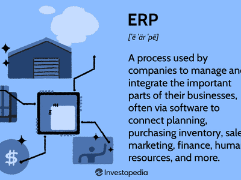

In today's rapidly evolving business landscape, organizations recognize the critical importance of ensuring a seamless flow of information. This efficiency is fundamental to achieving success, yet many companies continue to face significant challenges in managing data effectively. A primary obstacle to this seamless flow is the existence of information silos. Information silos are isolated repositories of data that impede communication and collaboration across various departments within an organization. These silos result from a combination of organizational structure, technological limitations, and cultural barriers, often leading to inefficiencies and redundant efforts.

This article explores the relationship between organizational communication, data management, and information silos, and their collective impact, particularly on algorithmic trading. Algorithmic trading, which relies on precise and comprehensive data to make informed decisions, can be significantly hindered by the presence of fragmented data sources. This problem underscores the necessity for organizations, especially in the financial sector, to eliminate silos to enhance their algorithmic trading strategies and improve market responsiveness.

We will focus on understanding these concepts and investigate strategies to enhance organizational efficiency and trading practices. The discussion will highlight the challenges posed by information silos and propose methods to dismantle these barriers, thereby promoting better data management and improved trading outcomes. By prioritizing these initiatives, organizations can unlock their full operational potential, leading to greater innovation, agility, and competitive advantage in the digital age.

## Table of Contents

## Understanding Information Silos

Information silos are data management systems that are isolated and unable to communicate effectively with other systems, leading to disconnected pockets of information. This isolation occurs due to several factors, including organizational structure, technological limitations, and cultural barriers, each playing a significant role in hindering efficient data sharing within enterprises.

Organizational structure contributes to the formation of information silos when different departments or business units operate independently with their own data sets and systems. This separation often arises from strategic decisions or legacy practices where departments prioritize their specific goals over organizational cohesion. As a result, data is not shared effectively, leading to redundancies and inefficiencies.

Technological limitations also play a critical role in the creation of information silos. In many cases, organizations use disparate software systems that are not interoperable. For instance, a company may employ multiple enterprise resource planning (ERP) systems that do not integrate with customer relationship management (CRM) software, hindering seamless communication across platforms. The lack of interoperability leads to the duplication of data entry efforts and increases the risk of errors.

Cultural barriers further exacerbate the problem. A lack of communication between departments may develop due to competitive rather than collaborative mindsets, with teams reluctant to share data perceived as valuable. This lack of transparency can stymie coordinated decision-making, resulting in departments working at cross-purposes, and potentially missing strategic opportunities.

The presence of information silos creates significant inefficiencies within organizations, impacting both daily operations and long-term strategic initiatives. Redundant data entry, which occurs when different departments independently input the same data, not only wastes time but also increases the likelihood of inconsistencies and errors. Without a coordinated approach to data management, decision-making becomes fragmented, as departments may draw conclusions from incomplete datasets.

Addressing the challenges posed by information silos is crucial for organizations striving for operational efficiency and innovation. By acknowledging the existence and impact of silos, organizations can begin to implement strategies to break down these barriers, promoting a more integrated and cohesive data management approach. This can involve investing in interoperable technology, fostering a culture of open communication and collaboration, and restructuring organizational practices to prioritize data sharing across all levels.

## Impact of Information Silos on Algorithmic Trading

Algorithmic trading is a method of executing orders using automated and pre-programmed trading instructions, which need access to accurate, comprehensive datasets to function effectively. Information silos, however, can significantly disrupt the seamless flow of data essential for these trading algorithms.

The presence of information silos creates data fragmentation issues that can lead to discrepancies. For instance, if different departments within a financial institution maintain separate databases without integrated systems, the resultant lack of coordination can produce inconsistent data. This fragmented data perspective can restrict [algorithmic trading](/wiki/algorithmic-trading) systems' ability to assess the full spectrum of market conditions, and a distorted view can lead to suboptimal strategies and decisions. Consequently, the algorithms, which rely on real-time and historical data to identify trading opportunities, may fail to execute trades at optimal prices.

An essential aspect of successful algorithmic trading is the modeling and analysis of complex financial phenomena using up-to-date and historical data. Fragmented data caused by information silos limits this capability. For instance, a simple time-series model applied to disjointed data can yield inaccurate predictions. Consider a basic moving average calculation which, when applied without complete data, might miss critical trends that are evident only from aggregated and comprehensive datasets.

To counteract this, traders and organizations must endeavor to dismantle these silos, thereby ensuring that trading algorithms have timely access to complete datasets. This necessitates a concerted effort combining technology and organizational strategies to create integrated data management platforms. By implementing these solutions, financial institutions can improve the accuracy and efficiency of their trading algorithms, thereby enhancing their responsiveness to market changes and maximizing potential profits.

## Breaking Down Information Silos for Better Data Management

Organizations today face the critical need to dismantle information silos that impede operational efficiency and innovation. One effective strategy in tackling these silos is the adoption of a centralized data management approach. By consolidating data into a unified platform, companies can significantly boost communication and information exchange across various departments, facilitating a more cohesive operational structure.

The implementation of a unified data platform ensures that data from different departments is not only accessible but also integrated in a manner that maximizes its utility. This platform acts as a central repository where all relevant information streams converge, enabling a seamless flow of data. For instance, enterprise data warehouses or data lakes can serve as such platforms, allowing for the storage and retrieval of vast amounts of structured and unstructured data without the constraints of siloed data environments.

In addition to centralized data platforms, assembling cross-functional teams can further enhance collaboration and inhibit the formation of new silos. These teams, composed of members from multiple departments, promote diverse perspectives and foster a culture of open communication. The collaborative environment encourages employees to share information freely, thereby reducing the likelihood of data becoming isolated within specific departments.

Moreover, integrated data systems play a pivotal role in breaking down information silos. These systems are designed to connect disparate data sources, ensuring that data is both accessible and interoperable. For example, using APIs (Application Programming Interfaces), businesses can facilitate the seamless transfer and integration of data across various platforms, ensuring consistent data flow and reducing redundancy.

By adopting a centralized data management approach, organizations not only enhance their decision-making processes but also create an environment conducive to innovation and efficiency. With readily accessible and comprehensive data, companies can make informed decisions quickly, respond agilely to market dynamics, and seize business opportunities promptly. This approach ultimately fosters a culture of continuous improvement and supports the organization's strategic objectives by harnessing data as a strategic asset.

## Strategies to Prevent and Eliminate Information Silos

Organizations aiming to dismantle information silos should prioritize creating an integrated data architecture that ensures seamless communication across various systems. This involves implementing robust strategies that enable systems to work in harmony, thus facilitating efficient data management and utilization.

Key to this initiative is fostering a culture of knowledge sharing and transparency. Encouraging open communication and collaboration across departments can significantly reduce the barriers that contribute to the formation of silos. Transparency in data practices ensures that information is accessible and usable by all relevant stakeholders, which helps mitigate the recurrence of siloed information nodes.

Technological advancement plays a crucial role in preventing and eliminating information silos. Solutions such as Enterprise Resource Planning (ERP) and Customer Relationship Management (CRM) systems are instrumental in bridging disparate data sources. ERP systems help integrate core business processes, providing a comprehensive view of operations across departments. CRM systems, on the other hand, centralize customer information and interactions, enhancing coordination in service provision and decision-making. These technologies facilitate the unification of information, making it accessible and actionable across the organization.

Continuous training and support are essential to ensure employees are proficient in managing and utilizing these integrated systems effectively. Regular training sessions can update employees on the use of new technologies and best practices in data management. Support structures, such as help desks or on-demand training modules, can assist employees in overcoming any challenges they encounter with the systems.

In summary, preventing and eliminating information silos requires a multifaceted approach involving the development of integrated data architectures, fostering a culture of transparency and knowledge sharing, leveraging advanced technological solutions, and providing continuous employee training and support. These strategies collectively enhance the organization's ability to manage data efficiently, leading to improved communication, collaboration, and decision-making capabilities.

## Conclusion

Information silos represent a significant barrier to efficient organizational communication and data management, affecting a wide range of operations from everyday tasks to sophisticated algorithmic trading mechanisms. These isolated pockets of data can lead to inefficiencies, stifle innovation, and create challenges in maintaining a competitive edge. For organizations to realize their full potential, it is crucial to adopt strategies that promote data integration and management.

By focusing on comprehensive data integration strategies, organizations can dismantle silos, thus unlocking operational efficiency and effectiveness. This involves implementing centralized data management solutions, fostering collaboration across departments, and using technology to bridge communication gaps. As these barriers are removed, organizations not only become more efficient but also enhance their capability for innovation. This is particularly important in today’s fast-paced digital market, where the ability to adapt and evolve is a key competitive differentiator.

Moreover, breaking down information silos should be a priority for organizations aiming to improve data management and trading strategies. In doing so, they enhance their agility, streamline decision-making processes, and strengthen their strategic positioning. The integration of siloed information aligns with the broader organizational goals of enhancing innovation and boosting competitive advantage, ultimately contributing to sustained growth and success in the digital landscape.

## References & Further Reading

[1]: Bergstra, J., Bardenet, R., Bengio, Y., & Kégl, B. (2011). ["Algorithms for Hyper-Parameter Optimization."](https://dl.acm.org/doi/10.5555/2986459.2986743) Advances in Neural Information Processing Systems 24.

[2]: ["Advances in Financial Machine Learning"](https://www.amazon.com/Advances-Financial-Machine-Learning-Marcos/dp/1119482089) by Marcos Lopez de Prado

[3]: ["Evidence-Based Technical Analysis: Applying the Scientific Method and Statistical Inference to Trading Signals"](https://www.amazon.com/Evidence-Based-Technical-Analysis-Scientific-Statistical/dp/0470008741) by David Aronson

[4]: ["Machine Learning for Algorithmic Trading"](https://github.com/stefan-jansen/machine-learning-for-trading) by Stefan Jansen

[5]: ["Quantitative Trading: How to Build Your Own Algorithmic Trading Business"](https://www.amazon.com/Quantitative-Trading-Build-Algorithmic-Business/dp/1119800064) by Ernest P. Chan