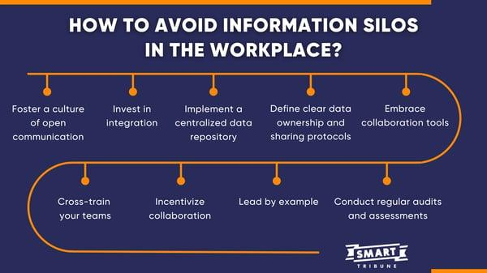

## Table of Contents

## What are information silos?

Information silos are when different parts of a company keep their information separate from other parts. This happens when departments or teams don't share what they know with each other. It's like having different buckets of information that don't mix. This can make it hard for the company to work together well because people don't have all the information they need.

Having information silos can cause problems. For example, if the marketing team has data that could help the sales team, but they don't share it, the sales team might not do as well as they could. It can also slow down decision-making because people have to spend time finding the information they need. Breaking down these silos can help everyone in the company work better together and make smarter decisions.

## How do information silos form in organizations?

Information silos form in organizations when different departments or teams start working in their own little worlds. This happens because each group focuses on their own tasks and goals, and they don't see the need to share what they know with others. Over time, they build up their own set of information and tools that they use every day. They might use different software or keep their data in separate places, which makes it hard for others to access it.

Another reason silos form is because of the way companies are structured. If there are strict hierarchies or if teams are very separate from each other, it can be hard for information to flow freely. People might feel like they don't have the time or the permission to share what they know with other teams. Also, if there's a lot of competition between departments, they might not want to share their information because they think it could give others an advantage. This can lead to even more separation and less sharing of information across the organization.

## What are the common causes of information silos?

Information silos often start because different parts of a company focus on their own work and don't share what they know with others. Each team might use different tools or keep their data in separate places, which makes it hard for others to see it. Over time, this can lead to big gaps in what people know across the company.

Another reason silos form is because of how companies are set up. If there are strict rules about who can talk to whom, or if teams are kept very separate, it can be tough for information to move around freely. Sometimes, teams might not share because they feel like they don't have the time or they're not allowed to. Also, if teams are competing with each other, they might keep their information to themselves to stay ahead, which makes the silos even worse.

## What are the basic functions of information silos?

Information silos have a few basic functions in organizations. One main function is to keep data and knowledge within specific departments or teams. This means that each group can work on their tasks using their own set of information without needing to share it with others. For example, the marketing team might have their own data about customer preferences, which they use to plan campaigns.

Another function of information silos is to help teams focus on their own goals and tasks. When information is kept separate, teams can work more efficiently within their own areas without being distracted by what other teams are doing. This can be good for getting things done quickly, but it can also lead to problems if the information isn't shared when it's needed. For instance, the sales team might miss out on important insights from the marketing team's data, which could help them sell more effectively.

## How do information silos impact communication within an organization?

Information silos can make communication within an organization harder. When different teams keep their information to themselves, it's like they're speaking different languages. If the marketing team has data that could help the sales team, but they don't share it, the sales team might not know what's going on. This can lead to confusion and missed opportunities because people don't have all the information they need to do their jobs well.

Also, information silos can slow down how quickly people can make decisions. If someone needs information from another team, they might have to spend a lot of time trying to find it. This can make the whole organization slower and less efficient. When teams don't talk to each other and share what they know, it can feel like everyone is working in their own little world, which makes it hard to work together as one big team.

## What are the effects of information silos on organizational efficiency?

Information silos can make an organization less efficient. When different teams keep their information to themselves, it's hard for everyone to work together smoothly. For example, if the marketing team has data that could help the sales team, but they don't share it, the sales team might not be able to sell as well as they could. This can lead to missed opportunities and wasted time because people have to search for information that should be easy to find.

Also, information silos can slow down decision-making. If someone needs information from another team, they might have to spend a lot of time trying to get it. This can make the whole organization slower and less efficient. When teams don't share what they know, it's like everyone is working in their own little world, which makes it hard to work together as one big team. Breaking down these silos can help everyone in the company work better together and make smarter decisions faster.

## How can information silos lead to data duplication and inconsistency?

Information silos can cause data to be duplicated because different teams might keep their own copies of the same information. For example, if the sales team and the marketing team both have customer lists, they might not know that they're working with the same data. So, they end up with two lists that have the same names but might not be updated at the same time. This can lead to a lot of extra work because people have to keep track of multiple versions of the same thing.

Also, information silos can make data inconsistent. When teams don't share what they know, they might change their data in different ways without telling each other. For instance, if the sales team updates a customer's address, but the marketing team doesn't know about it, they might still use the old address. This can lead to mistakes and confusion because everyone is working with different versions of the truth. Breaking down these silos can help make sure everyone has the same, up-to-date information.

## What are the advanced strategies to identify information silos?

To find information silos in a company, you can start by looking at how people talk to each other. If different teams don't share what they know or if they use different tools and systems, that's a sign of silos. You can also look at the company's structure. If there are strict rules about who can talk to whom, or if teams are kept very separate, it can be hard for information to move around freely. Another way to spot silos is by checking if the same data is kept in different places. If teams have their own copies of the same information, it can lead to confusion and wasted time.

Another strategy is to use technology to help find silos. You can use special software that looks at how data moves around the company. This software can show you where information is stuck and not shared between teams. Also, you can do surveys or interviews with employees to see if they feel like they have all the information they need to do their jobs. If they say no, it might mean there are silos. By using these methods, you can find where the silos are and start to break them down so everyone can work better together.

## How do information silos affect decision-making processes?

Information silos can slow down decision-making in a company. When different teams keep their information to themselves, it's hard for everyone to make quick and smart choices. If someone needs data from another team, they might have to spend a lot of time trying to find it. This can make the whole organization slower because people are waiting for information that should be easy to get. When teams don't share what they know, it's like everyone is working in their own little world, which makes it hard to work together as one big team.

Also, information silos can lead to bad decisions. If teams don't have all the information they need, they might make choices based on what they know, which might not be the whole picture. For example, if the sales team doesn't know about new marketing data, they might miss out on important insights that could help them sell better. This can lead to mistakes and missed opportunities because everyone is working with different pieces of the puzzle. Breaking down these silos can help everyone in the company make better decisions faster.

## What are the long-term impacts of information silos on organizational culture?

Information silos can change how people work together in a company over time. When teams keep their information to themselves, it can make people feel like they are working in different worlds. This can lead to less trust between teams because they don't know what others are doing. It can also make people feel like they are not part of the bigger picture, which can make them less happy at work. Over time, this can create a culture where people don't want to share or help each other, which can make the whole company feel more divided.

Also, information silos can make the company less open to new ideas. When teams don't share what they know, it's hard for new ideas to spread across the company. This can make the company less creative and less able to solve problems. Over time, this can lead to a culture where people are afraid to try new things because they don't have all the information they need. Breaking down these silos can help make the company feel more like one big team, where everyone can share ideas and work together better.

## What technologies can be used to break down information silos?

One way to break down information silos is by using special software called enterprise resource planning (ERP) systems. These systems help different teams in a company share the same information easily. For example, if the sales team updates a customer's information, the marketing team can see it right away. This makes sure everyone is working with the same data, which can help them work together better.

Another technology that can help is a data integration platform. This kind of software can connect different systems and tools that teams use, so they can share information without having to switch between different programs. For example, if the HR team uses one system and the finance team uses another, a data integration platform can help them share information easily. This can make the company more efficient and help everyone make better decisions.

Also, using collaboration tools like Slack or Microsoft Teams can help break down silos. These tools let people from different teams talk to each other and share files easily. When teams can communicate better, they are more likely to share what they know and work together more effectively. This can help create a culture where everyone feels like they are part of the same team.

## How can organizations implement a comprehensive strategy to eliminate information silos?

To eliminate information silos, organizations need to start by looking at how they are set up. They should make sure that teams can talk to each other easily and that there are no strict rules stopping them from sharing information. It's important to encourage a culture where everyone feels like they are part of the same team. This can be done by having regular meetings where different teams can share what they are working on and what they need help with. Also, training employees on the importance of sharing information and how to do it can help break down silos.

Using technology can also help a lot. Organizations can use special software like ERP systems to make sure everyone is working with the same information. Data integration platforms can connect different tools and systems, so teams don't have to switch between programs to share data. Collaboration tools like Slack or Microsoft Teams can make it easier for people to talk to each other and share files. By using these technologies, organizations can make sure information flows freely across the company. Over time, this can help create a culture where everyone works together better and makes smarter decisions.

## References & Further Reading

[1]: Bergstra, J., Bardenet, R., Bengio, Y., & Kégl, B. (2011). ["Algorithms for Hyper-Parameter Optimization."](https://dl.acm.org/doi/10.5555/2986459.2986743) Advances in Neural Information Processing Systems 24.

[2]: ["Advances in Financial Machine Learning"](https://www.amazon.com/Advances-Financial-Machine-Learning-Marcos/dp/1119482089) by Marcos Lopez de Prado

[3]: ["Evidence-Based Technical Analysis: Applying the Scientific Method and Statistical Inference to Trading Signals"](https://www.amazon.com/Evidence-Based-Technical-Analysis-Scientific-Statistical/dp/0470008741) by David Aronson

[4]: ["Machine Learning for Algorithmic Trading"](https://github.com/stefan-jansen/machine-learning-for-trading) by Stefan Jansen

[5]: ["Quantitative Trading: How to Build Your Own Algorithmic Trading Business"](https://www.amazon.com/Quantitative-Trading-Build-Algorithmic-Business/dp/1119800064) by Ernest P. Chan