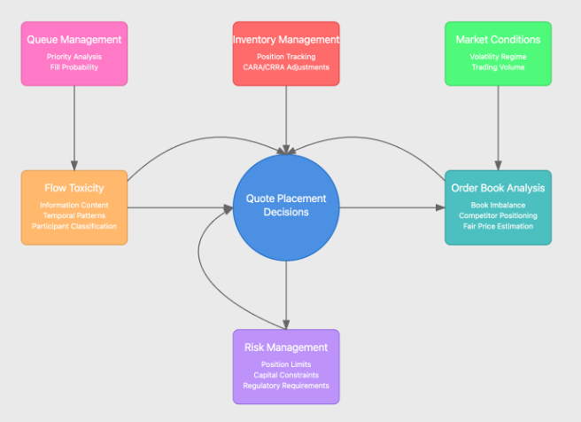

## Table of Contents

## What is information theory and how does it relate to trading?

Information theory is a branch of mathematics that deals with how to measure, store, and communicate information. It was developed by Claude Shannon in the 1940s and focuses on concepts like entropy, which measures the uncertainty or randomness in a set of data. In simple terms, information theory helps us understand how much information is contained in a message and how efficiently we can send that message.

In trading, information theory can be very useful. Traders are always looking for new information that can help them make better decisions about buying and selling. By using ideas from information theory, traders can figure out how much new information a piece of news or data contains. For example, if a company announces earnings that are much higher than expected, this news has a lot of information because it reduces uncertainty about the company's performance. Traders can use this understanding to predict how markets might react to new information and adjust their strategies accordingly.

## How can entropy be used to measure uncertainty in financial markets?

Entropy is a concept from information theory that can help measure uncertainty in financial markets. Imagine you're trying to guess the outcome of a coin toss. If it's a fair coin, there's a lot of uncertainty because it could land on heads or tails with equal chance. This high uncertainty means the entropy is high. In financial markets, entropy works the same way. If the market is unpredictable and prices can go up or down with equal likelihood, the entropy is high, showing there's a lot of uncertainty.

Traders can use entropy to understand how much new information impacts the market. For example, if a company releases a surprising earnings report, it reduces uncertainty about the company's future. This new information lowers the entropy because the market now has a better idea of what might happen next. By measuring entropy, traders can see how much new information is affecting the market and make smarter trading decisions based on how much uncertainty is left.

## What are the basic principles of information theory that traders should understand?

Information theory is all about understanding how information works, how it can be measured, and how it can be sent from one place to another. The main idea traders should get is entropy, which is like a measure of how unsure or random something is. In trading, if you have a lot of uncertainty about what will happen next in the market, that means the entropy is high. When new information comes in, like a company's earnings report, it can lower the uncertainty and thus lower the entropy. Traders can use this idea to figure out how much new information really matters to the market.

Another important concept is the idea of information content. When traders get new information, they want to know how much it changes their view of the market. If a news report doesn't change anything they already know, it has low information content. But if it's something surprising, it has high information content because it makes them rethink their strategies. By understanding how much information is in new data, traders can make better decisions about when to buy or sell.

Lastly, traders should know about the concept of redundancy. In information theory, redundancy is like extra information that isn't really needed but can help make sure the message gets through correctly. In trading, redundancy might mean having multiple sources of information to confirm a trend or news. This can help traders feel more confident in their decisions because they're not relying on just one piece of data. By understanding these basic principles, traders can better navigate the uncertainties of the market.

## How can mutual information help in understanding the relationship between different financial instruments?

Mutual information is a concept from information theory that helps us understand how much knowing about one thing can tell us about another thing. In trading, this can be really useful for figuring out how different financial instruments, like stocks or currencies, are related to each other. For example, if you know that knowing the price of one stock gives you a good idea about what the price of another stock might do, then those two stocks have high mutual information. This means they are closely connected, and changes in one might predict changes in the other.

Traders can use mutual information to make smarter decisions. If two financial instruments have high mutual information, a trader might decide to buy or sell one based on what's happening with the other. This can help them see patterns and connections that they might miss otherwise. By understanding these relationships, traders can better predict market movements and manage their portfolios more effectively.

## What are some common information-theoretic metrics used in trading strategies?

In trading, one common information-theoretic metric is entropy. Entropy helps traders measure how unpredictable the market is. If the market is very unpredictable, the entropy is high, which means there's a lot of uncertainty. Traders use entropy to see how much new information, like a company's earnings report, changes the market's uncertainty. If the report is surprising, it lowers the entropy because it gives traders more information about what might happen next. By understanding entropy, traders can better predict how the market might react to new information.

Another useful metric is mutual information. This helps traders understand how much knowing about one financial instrument can tell them about another. For example, if knowing the price of one stock helps predict the price of another stock, those stocks have high mutual information. Traders use this to find connections between different stocks or other financial instruments. If two instruments have high mutual information, a trader might decide to buy or sell one based on what's happening with the other. This can help traders make more informed decisions and manage their portfolios better.

Lastly, traders also look at information content. This metric tells them how much new information really changes their view of the market. If a news report doesn't change anything they already know, it has low information content. But if it's something surprising, it has high information content because it makes them rethink their strategies. By understanding the information content of new data, traders can decide when to act on new information and when to wait for more.

## How can information theory be applied to optimize trading algorithms?

Information theory can help make trading algorithms better by using ideas like entropy and mutual information. Entropy measures how unpredictable the market is. If the market is very unpredictable, the entropy is high, which means there's a lot of uncertainty. Trading algorithms can use entropy to figure out how much new information, like a company's earnings report, changes the market's uncertainty. If the report is surprising, it lowers the entropy because it gives the algorithm more information about what might happen next. By understanding entropy, the algorithm can better predict how the market might react to new information and make smarter trading decisions.

Another way information theory helps is through mutual information, which shows how much knowing about one financial instrument can tell us about another. For example, if knowing the price of one stock helps predict the price of another stock, those stocks have high mutual information. Trading algorithms can use this to find connections between different stocks or other financial instruments. If two instruments have high mutual information, the algorithm might decide to buy or sell one based on what's happening with the other. This can help the algorithm make more informed decisions and manage the portfolio better. By using these information-theoretic metrics, trading algorithms can be optimized to perform better in the market.

## What role does the concept of 'information gain' play in trading decisions?

Information gain is about how much new information helps us make better decisions. In trading, when you get new information, like a company's earnings report, you want to know how much it changes what you already know. If the report tells you something you didn't expect, it has high information gain. This means it's really useful because it helps you understand the market better and make smarter choices about buying or selling.

Traders use information gain to decide when to act on new information. If a news report doesn't change anything they already know, it has low information gain, and they might not need to do anything. But if the news is surprising and changes their view of the market a lot, it has high information gain. This tells them it's time to rethink their strategies and maybe buy or sell based on this new understanding. By focusing on information gain, traders can make better decisions and improve their chances of success in the market.

## How can traders use information theory to manage risk and improve portfolio diversification?

Traders can use information theory to manage risk by understanding how much uncertainty, or entropy, is in the market. If the market is very unpredictable, with high entropy, traders know there's a lot of risk. They can use this understanding to decide when to take risks and when to be more careful. For example, if a new piece of information, like a company's earnings report, comes out and it's very surprising, it lowers the entropy because it reduces uncertainty. Traders can then adjust their strategies to take advantage of this new information and manage their risk better.

Information theory also helps traders improve portfolio diversification by looking at mutual information. This tells traders how much knowing about one financial instrument can tell them about another. If two stocks have high mutual information, it means they are closely connected, and changes in one might predict changes in the other. To diversify their portfolio, traders want to pick stocks that don't have high mutual information with each other. This way, if one stock does badly, the others might not be affected as much, which helps spread out the risk. By using mutual information, traders can build a more balanced and less risky portfolio.

## What are the challenges and limitations of applying information theory to real-time trading?

Applying information theory to real-time trading can be tricky because the market changes so quickly. Information theory helps us measure uncertainty and connections between financial instruments, but in real-time trading, new information comes in all the time. This means traders have to quickly figure out how much new information changes the market's uncertainty. If they're too slow, they might miss out on good trading opportunities or make bad decisions based on outdated information. Also, the calculations needed for information theory can be complex and might not be fast enough for real-time trading, which needs quick decisions.

Another challenge is that information theory works best with a lot of data, but in real-time trading, you don't always have all the data you need right away. Sometimes, the data you get might be noisy or not complete, which can make it hard to use information theory accurately. Traders also have to be careful not to rely too much on past patterns because the market can change in unexpected ways. So, while information theory can help traders understand the market better, it has limits when it comes to making quick, real-time decisions.

## How have advanced information-theoretic models impacted high-frequency trading?

Advanced information-theoretic models have made a big difference in high-frequency trading. These models help traders quickly understand how much new information changes the market. In high-frequency trading, where trades happen in milliseconds, knowing this fast is super important. Traders use these models to measure the uncertainty in the market and see how connected different stocks are. This helps them make better decisions about when to buy or sell, and it can give them an edge over other traders who aren't using these advanced tools.

However, using these models in high-frequency trading also has its challenges. The market changes so fast that it can be hard to keep up with all the new information. Sometimes, the data might not be complete or could be noisy, which can mess up the models' calculations. Even though these models can help, traders need to be careful not to rely too much on them because the market can do unexpected things. So, while advanced information-theoretic models have improved high-frequency trading, they also come with some limits that traders need to think about.

## Can you discuss case studies where information theory has significantly improved trading outcomes?

One case where information theory helped trading is with a big investment firm that wanted to make better stock picks. They used the idea of entropy to measure how unpredictable the stock market was. When they got new information, like a company's earnings report, they looked at how much it changed the uncertainty in the market. If the report was surprising, it lowered the entropy a lot, which meant it was really important. By understanding this, the firm could make smarter decisions about when to buy or sell stocks. Over time, they found that their trading strategies worked better because they were using this new information in the right way.

Another example is a [hedge fund](/wiki/hedge-fund-trading-strategies) that used mutual information to improve their portfolio. They wanted to know how much knowing about one stock could tell them about another stock. If two stocks had high mutual information, it meant they were closely connected. The hedge fund used this to pick stocks that weren't too connected to each other. This helped them spread out their risk better. By using mutual information, they made their portfolio more diverse and less likely to be hurt by big changes in just one stock. This approach helped them make more money and manage their risk better.

## What are the future trends and potential developments in information-theoretic approaches to trading?

In the future, information theory will likely become even more important in trading. As technology gets better, traders will be able to use more advanced models to understand the market. These models will help them see how much new information really matters and how different stocks are connected. This will make it easier for traders to make quick, smart decisions, especially in high-frequency trading where every millisecond counts. Also, new tools and software will make it simpler for traders to use information theory, even if they don't know a lot about math.

Another trend will be using information theory to manage risk better. Traders will use it to figure out how unpredictable the market is and how to spread out their investments to lower risk. With more data and better ways to analyze it, traders will be able to predict market changes more accurately. This will help them make safer bets and protect their money better. Overall, as information theory keeps growing, it will help traders make better decisions and improve their chances of success in the market.

## What are Information Theoretic Approaches in Trading?

Information Theory, a mathematical discipline concerned with the quantification, storage, and communication of information, is finding significant applications in [algorithmic trading](/wiki/algorithmic-trading). Central to this theory is the concept of entropy, which quantifies the uncertainty or unpredictability of information sources. In the context of financial markets, entropy can be used to measure the randomness inherent in market data, providing a basis for optimizing trading strategies.

Entropy is mathematically defined as:

$$
H(X) = -\sum p(x) \log p(x)
$$

where $H(X)$ is the entropy of a random variable $X$, and $p(x)$ is the probability distribution function of $X$. In trading, $X$ can represent various market parameters like price movements or trading volumes. High entropy indicates greater uncertainty, while low entropy suggests more predictability. Traders seek to exploit these patterns by adjusting their strategies based on entropy measurements.

Information Theoretic approaches are further enhanced when integrated with [machine learning](/wiki/machine-learning). These methods utilize algorithms capable of learning from data inputs, identifying patterns, and making decisions with minimal human intervention. The combination of Information Theory and machine learning can enhance prediction accuracy and trading performance. For example, entropy measures can serve as features in machine learning models, helping to improve the model's ability to predict market trends and price movements.

Moreover, Information Theoretic tools are adept at identifying market inefficiencies and potential reversals. Traditional algorithms often focus on historical data and patterns, whereas Information Theoretic approaches, by measuring the current information content and uncertainty, can detect anomalies and predict events not apparent from historical trends. This capability allows traders to preemptively adjust their positions, potentially increasing profit margins and reducing risks.

Implementing these sophisticated approaches requires advanced computational techniques and robust data infrastructure. Python, with its extensive libraries like NumPy and SciPy, offers resources for calculating entropy and other Information Theoretic measures. Below is a simple Python example calculating entropy:

```python
import numpy as np
from scipy.stats import entropy

def calculate_entropy(probabilities):
    return entropy(probabilities, base=2)

# Example probabilities of price movement
probabilities = np.array([0.2, 0.5, 0.3])
ent = calculate_entropy(probabilities)
print(f"Entropy: {ent}")
```

This script calculates the entropy of a hypothetical probability distribution representing market movements. The resulting entropy values provide insights into market uncertainty, guiding traders in strategy optimization.

Information Theoretic approaches in trading allow for a systematic and data-driven way to manage financial data and make informed decisions. As these methods continue to evolve, they offer the potential to outperform traditional trading strategies, highlighting their growing importance in modern finance.

## References & Further Reading

[1]: Shannon, C. E. (1948). ["A Mathematical Theory of Communication."](https://onlinelibrary.wiley.com/doi/abs/10.1002/j.1538-7305.1948.tb01338.x) Bell System Technical Journal, 27(3), 379-423.

[2]: Cover, T. M., & Thomas, J. A. (2006). ["Elements of Information Theory."](https://onlinelibrary.wiley.com/doi/book/10.1002/047174882X),+2nd+Edition-p-9780471241959) Wiley-Interscience.

[3]: Schneider, T. D. (2006). ["Information Theory Primer."](http://www.ece.iit.edu/~biitcomm/research/references/Thomas%20D.%20Schneider/Information%20Theory%20Primer.pdf) NCBI Gene Database.

[4]: Bouchaud, J. P., & Potters, M. (2003). ["Theory of Financial Risk and Derivative Pricing: From Statistical Physics to Risk Management."](https://assets.cambridge.org/97805218/19169/frontmatter/9780521819169_frontmatter.pdf) Cambridge University Press.

[5]: Lopez de Prado, M. (2018). ["Advances in Financial Machine Learning."](https://www.amazon.com/Advances-Financial-Machine-Learning-Marcos/dp/1119482089) Wiley.

[6]: Chan, E. P. (2009). ["Quantitative Trading: How to Build Your Own Algorithmic Trading Business."](https://github.com/egorpe/EPChan-QuantitativeTrading/blob/master/example7_6.m) Wiley.

[7]: Jansen, S. (2020). ["Machine Learning for Algorithmic Trading."](https://github.com/stefan-jansen/machine-learning-for-trading) Packt Publishing.

[8]: Aronson, D. R. (2006). ["Evidence-Based Technical Analysis: Applying the Scientific Method and Statistical Inference to Trading Signals."](https://www.amazon.com/Evidence-Based-Technical-Analysis-Scientific-Statistical/dp/0470008741) Wiley.