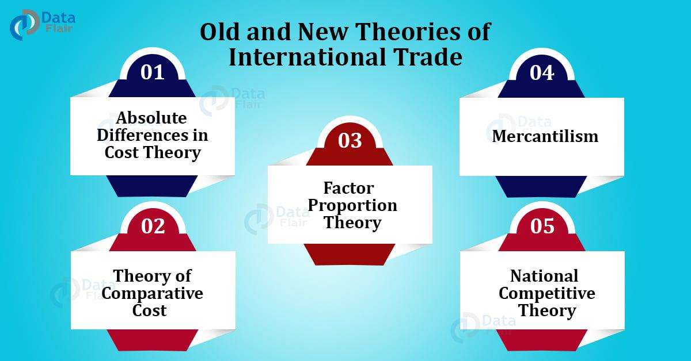

In recent years, algorithmic trading, often referred to as algo trading, has dramatically transformed financial markets by enhancing trading efficiency and precision. At its core, algo trading empowers market participants to automate trade execution, thereby reducing human error and emotional biases by relying on predefined mathematical models and strategic criteria. Among the innovative approaches spearheading this revolution are Information Theoretic methods, which utilize concepts from Information Theory to optimize trading strategies.

Information Theory, primarily concerned with the quantification and dissemination of information, offers powerful tools such as entropy, which measures the uncertainty or unpredictability of market data. By employing these tools, traders can refine algorithms to better interpret vast datasets, improve prediction accuracy, and optimize trading models for more informed decision-making. The marriage of data, mathematics, and computational prowess in this context aims to capitalize on market inefficiencies, thereby enhancing performance and achieving consistent results.



For both novice and experienced traders, understanding these cutting-edge methodologies is essential to harness the potential of Information-driven algo trading. This article aims to provide a comprehensive exploration of the principles and applications of Information Theoretic methods in the context of algorithmic trading, equipping traders with the insights needed to thrive in an increasingly complex financial landscape.

## Table of Contents

## Understanding Algorithmic Trading

Algorithmic trading involves the use of computer algorithms to automate the process of executing trades. This method eliminates human error and bias by adhering to a set of predefined rules or criteria. These criteria can revolve around various factors such as price, timing, and trading volume. Additionally, algorithms may also quantify complex market behaviors to optimize trading outcomes.

A significant enhancement to these traditional models is the integration of Information Theoretic approaches. These methodologies leverage robust data analysis and entropy-based calculations to improve the precision of trading algorithms. Entropy, in the context of Information Theory, measures the uncertainty or disorder within a dataset. In financial markets, this can be instrumental in analyzing complex patterns and predicting market shifts.

For example, an algorithm might be designed to execute a buy order when the market entropy exceeds a certain threshold, indicating high uncertainty and potential profitability. Conversely, a decrease in entropy could signal market stability, suggesting a hold or sell strategy.

Implementing such sophisticated systems necessitates a strong understanding of quantitative finance, data science, and programming. Quantitative finance provides the necessary skills to model and understand market behaviors mathematically. Data science facilitates the efficient handling and processing of large datasets, which is crucial for real-time trading decisions. Programming, particularly in languages like Python, enables the coding and implementation of these complex algorithms. Below is a simple Python example illustrating how entropy can be calculated for a given dataset:

```python
import numpy as np
from scipy.stats import entropy

# Sample data representing market variables
data = [0.1, 0.2, 0.4, 0.3]

# Calculate entropy
market_entropy = entropy(data, base=2)
print(f"Market Entropy: {market_entropy}")
```

The code snippet calculates Shannon entropy from a list of market variables, which can help gauge market disorder. As [algorithmic trading](/wiki/algorithmic-trading) becomes increasingly sophisticated, the blending of Information Theoretic methods into trading strategies continues to offer enhanced decision-making capabilities.

## Types of Algorithmic Trading Strategies

Various algorithmic trading strategies are designed to exploit different market conditions and opportunities. These strategies leverage sophisticated algorithms to execute trades with precision and speed, surpassing traditional manual trading. Here, we explore some prevalent algo trading strategies and how Information Theory can enhance their performance.

### Trend Following
Trend following algorithms aim to capitalize on the direction and [momentum](/wiki/momentum) of market prices. These strategies typically rely on technical indicators such as moving averages, the Moving Average Convergence Divergence (MACD), and Relative Strength Index (RSI) to detect and confirm sustained market movements. Algorithms identify trends when prices consistently exhibit upward or downward momentum, prompting positions in the direction of the trend. By utilizing pattern recognition techniques from Information Theory, these algorithms can improve their accuracy in identifying and tracking trends, distinguishing short-term fluctuations from significant market shifts, leading to more reliable signal generation.

### Arbitrage
Arbitrage strategies focus on exploiting price discrepancies across different markets or financial instruments. This involves buying an asset in one market where it is undervalued and simultaneously selling it in another market where it is overvalued, thereby securing a risk-free profit. The efficiency and feasibility of [arbitrage](/wiki/arbitrage) suffer from the need for rapid execution and low-latency data access. Entropy-based methods from Information Theory can be instrumental in detecting the transient market inefficiencies that facilitate arbitrage opportunities. These methods help quantify the level of information surrounding asset prices across various exchanges, improving the detection of arbitrage possibilities before they diminish.

### Mean Reversion
Mean reversion strategies are built on the premise that asset prices will revert to their historical averages over time. Algorithms implementing these strategies monitor price deviations from their mean and execute trades to capitalize on the expected reversion. By integrating Information Theoretic approaches, such as calculating the entropy of price distributions, traders can better assess the likelihood of reversion events. This statistical measure provides insights into the unpredictability inherent in price movements, allowing for more calculated decisions when identifying potential mean reversion scenarios.

### Information Theory Enhancement
Information Theory offers tools to refine these algorithmic strategies through real-time data analysis and anomaly detection. By utilizing concepts like entropy, traders can quantify uncertainty and detect structural changes in market behavior. For instance, anomaly detection algorithms can leverage Kullback-Leibler divergence to quantify the difference between real-time market data and historical models, identifying deviations that may indicate emerging trends or arbitrage opportunities.

In conclusion, algorithmic trading strategies stand to gain significantly from the incorporation of Information Theoretic techniques. These methods provide a rigorous framework for analyzing market data, enhancing the precision and profitability of trading strategies by improving pattern detection and market prediction capabilities.

## Information Theoretic Approaches in Trading

Information Theory, a mathematical discipline concerned with the quantification, storage, and communication of information, is finding significant applications in algorithmic trading. Central to this theory is the concept of entropy, which quantifies the uncertainty or unpredictability of information sources. In the context of financial markets, entropy can be used to measure the randomness inherent in market data, providing a basis for optimizing trading strategies.

Entropy is mathematically defined as:

$$
H(X) = -\sum p(x) \log p(x)
$$

where $H(X)$ is the entropy of a random variable $X$, and $p(x)$ is the probability distribution function of $X$. In trading, $X$ can represent various market parameters like price movements or trading volumes. High entropy indicates greater uncertainty, while low entropy suggests more predictability. Traders seek to exploit these patterns by adjusting their strategies based on entropy measurements.

Information Theoretic approaches are further enhanced when integrated with [machine learning](/wiki/machine-learning). These methods utilize algorithms capable of learning from data inputs, identifying patterns, and making decisions with minimal human intervention. The combination of Information Theory and machine learning can enhance prediction accuracy and trading performance. For example, entropy measures can serve as features in machine learning models, helping to improve the model's ability to predict market trends and price movements.

Moreover, Information Theoretic tools are adept at identifying market inefficiencies and potential reversals. Traditional algorithms often focus on historical data and patterns, whereas Information Theoretic approaches, by measuring the current information content and uncertainty, can detect anomalies and predict events not apparent from historical trends. This capability allows traders to preemptively adjust their positions, potentially increasing profit margins and reducing risks.

Implementing these sophisticated approaches requires advanced computational techniques and robust data infrastructure. Python, with its extensive libraries like NumPy and SciPy, offers resources for calculating entropy and other Information Theoretic measures. Below is a simple Python example calculating entropy:

```python
import numpy as np
from scipy.stats import entropy

def calculate_entropy(probabilities):
    return entropy(probabilities, base=2)

# Example probabilities of price movement
probabilities = np.array([0.2, 0.5, 0.3])
ent = calculate_entropy(probabilities)
print(f"Entropy: {ent}")
```

This script calculates the entropy of a hypothetical probability distribution representing market movements. The resulting entropy values provide insights into market uncertainty, guiding traders in strategy optimization.

Information Theoretic approaches in trading allow for a systematic and data-driven way to manage financial data and make informed decisions. As these methods continue to evolve, they offer the potential to outperform traditional trading strategies, highlighting their growing importance in modern finance.

## Advantages and Challenges of Information Theoretic Trading

Leveraging Information Theoretic methods in trading offers a range of advantages, primarily centered around increased precision and consistency in trade execution. These methods utilize mathematical frameworks to analyze and quantify informational content in market data, leading to more informed trading decisions.

One of the key benefits is enhanced risk management. By employing Information Theoretic tools, traders can achieve more accurate market predictions and detect anomalies more effectively. For instance, the use of entropy, which measures the amount of unpredictability or uncertainty in market data, allows for better anticipation of market fluctuations, thereby improving the ability to manage risk.

However, integrating Information Theoretic approaches into trading systems is complex, requiring considerable technical expertise and robust data infrastructure. The complexity arises from the need to process vast amounts of data and the necessity for sophisticated computational methods to extract meaningful insights. Traders and firms must invest in advanced data processing technologies and skilled personnel, proficient in quantitative finance and data science, to fully exploit these techniques.

Moreover, before deploying Information Theoretic models in live trading environments, extensive [backtesting](/wiki/backtesting) is essential. Backtesting allows for the validation and refinement of algorithms using historical data, ensuring they can handle real-market conditions effectively. This process is crucial to assess the algorithm's performance and mitigate the risk of potential losses in live trading scenarios.

In conclusion, while Information Theoretic trading offers substantial potential in optimizing trading strategies and risk management, it also presents significant challenges that necessitate thorough preparation and expertise. These methods can lead to substantial gains if integrated thoughtfully, backed by state-of-the-art infrastructure and continuous refinement through backtesting and strategy iteration.

## Getting Started with Information Theoretic Algo Trading

To effectively start with Information Theoretic Algorithmic Trading, having a robust understanding of financial mathematics is essential. This involves grasping key concepts such as probability theory, statistical analysis, and quantitative methods which are critical for developing algorithms that can assess and predict market behavior. Acquiring programming skills is equally vital, with Python being a highly preferred language due to its extensive libraries and ease of use in handling data analytics and machine learning tasks.

Platforms that support Information Theoretic algorithms provide essential APIs for real-time trading data access. Utilizing these platforms allows traders to integrate complex algorithms with live market data, offering opportunities for dynamic and responsive trading strategies. APIs such as those provided by trading platforms like [Interactive Brokers](/wiki/interactive-brokers-api) or Alpaca facilitate seamless access to market data and enable automated trade executions.

Backtesting with historical data is a crucial step before implementing algorithms in a live trading environment. This process validates the effectiveness of a trading strategy by simulating it against historical market conditions, ensuring that the algorithm performs optimally and manages risks appropriately. Libraries such as [backtrader](/wiki/backtrader) or PyAlgoTrade can be leveraged to perform backtesting within a Python environment, offering features to evaluate the success of strategies under various market conditions.

Continuous education is imperative to keep abreast of advancements in Information Theory and trading technologies. The landscape of algorithmic trading is rapidly advancing, with ongoing research and technological developments constantly shaping the industry. Engaging with academic journals, online courses, and professional forums will support the ongoing enhancement of trading strategies, enabling traders to leverage cutting-edge techniques and maintain a competitive edge. 

Adapting to these evolving strategies and methodologies can significantly aid in refining algorithmic trading models, providing an edge in the increasingly data-driven financial markets.

## Conclusion

Information Theoretic approaches have the potential to fundamentally reshape algorithmic trading by systematically organizing and processing vast amounts of financial data. These methodologies facilitate the development of more informed trading decisions by leveraging mathematical frameworks to quantify and interpret the underlying information within market signals. For instance, entropy, a key concept within Information Theory, allows traders to measure uncertainty and potential variability in market behaviors, thus optimizing predictive models and enhancing trading strategies.

However, the implementation of these advanced strategies does not come without challenges. The complexity involved in integrating Information Theoretic methods necessitates a robust technical infrastructure and a highly skilled team with expertise in quantitative finance, data science, and algorithm design. The ability to process large datasets in real-time and derive actionable insights requires significant computational power and sophisticated algorithmic infrastructure. Despite these barriers, the advantages of Information-driven trading strategies, such as improved accuracy in predicting market trends and early detection of anomalies, can lead to significant financial gains.

As financial markets continue to evolve, the reliance on technology and data-driven strategies will become increasingly important for maintaining competitiveness in trading. Embracing these sophisticated methodologies not only furthers the capability to manage intricate data but also enhances market analysis, ensuring more effective and efficient trading operations. For traders and financial institutions aiming to stay at the forefront of technological advancements, integrating Information Theoretic approaches into their trading systems offers a path toward sustained success and innovation.

## References & Further Reading

[1]: Shannon, C. E. (1948). ["A Mathematical Theory of Communication."](https://onlinelibrary.wiley.com/doi/abs/10.1002/j.1538-7305.1948.tb01338.x) Bell System Technical Journal, 27(3), 379-423.

[2]: Cover, T. M., & Thomas, J. A. (2006). ["Elements of Information Theory."](https://onlinelibrary.wiley.com/doi/book/10.1002/047174882X),+2nd+Edition-p-9780471241959) Wiley-Interscience.

[3]: Schneider, T. D. (2006). ["Information Theory Primer."](http://www.ece.iit.edu/~biitcomm/research/references/Thomas%20D.%20Schneider/Information%20Theory%20Primer.pdf) NCBI Gene Database.

[4]: Bouchaud, J. P., & Potters, M. (2003). ["Theory of Financial Risk and Derivative Pricing: From Statistical Physics to Risk Management."](https://assets.cambridge.org/97805218/19169/frontmatter/9780521819169_frontmatter.pdf) Cambridge University Press.

[5]: Lopez de Prado, M. (2018). ["Advances in Financial Machine Learning."](https://www.amazon.com/Advances-Financial-Machine-Learning-Marcos/dp/1119482089) Wiley.

[6]: Chan, E. P. (2009). ["Quantitative Trading: How to Build Your Own Algorithmic Trading Business."](https://github.com/egorpe/EPChan-QuantitativeTrading/blob/master/example7_6.m) Wiley.

[7]: Jansen, S. (2020). ["Machine Learning for Algorithmic Trading."](https://github.com/stefan-jansen/machine-learning-for-trading) Packt Publishing.

[8]: Aronson, D. R. (2006). ["Evidence-Based Technical Analysis: Applying the Scientific Method and Statistical Inference to Trading Signals."](https://www.amazon.com/Evidence-Based-Technical-Analysis-Scientific-Statistical/dp/0470008741) Wiley.