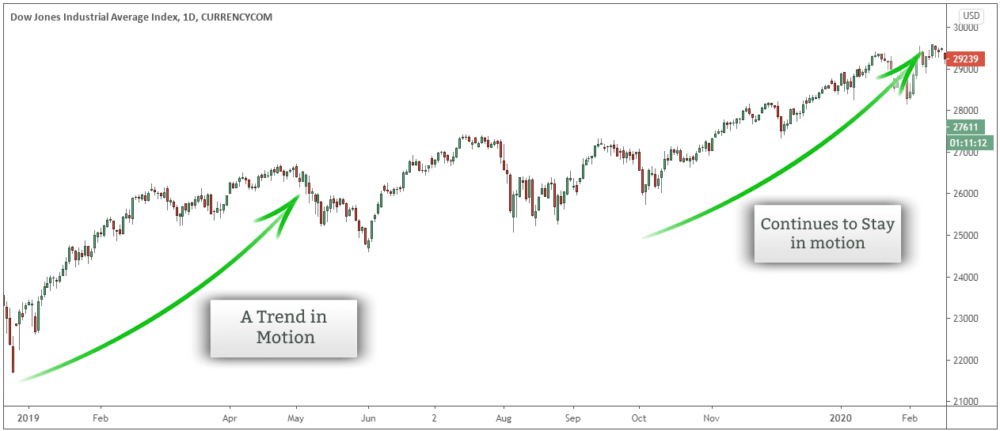

## Table of Contents

## What is information theory and how does it relate to trading?

Information theory is a branch of mathematics that deals with how we can measure, store, and communicate information. It was developed by Claude Shannon in the 1940s and is important in many fields, like computer science and telecommunications. The main idea is to understand how to send messages efficiently and accurately, using concepts like entropy, which measures the uncertainty or randomness in a message.

In trading, information theory can be very useful because it helps traders understand and use the information they get from the markets. Traders always look for new information to make better decisions about buying or selling. By using information theory, they can measure how much new information a piece of news or data really contains. This helps them decide how much they should change their trading strategies based on that information. For example, if a news report has low entropy, it might not change the market much, but if it has high entropy, it could lead to big market movements.

## What are the basic principles of information-theoretic trading strategies?

Information-theoretic trading strategies focus on using the ideas from information theory to make better trading decisions. The main principle is to measure how much new information a piece of news or data brings to the market. Traders use a concept called entropy to figure this out. If a piece of information has high entropy, it means it's very surprising or unexpected, and it could cause big changes in the market. On the other hand, if the information has low entropy, it's not very surprising, and the market might not change much.

Another important principle is to understand how quickly information spreads in the market. Traders want to be among the first to know about new information so they can act before others do. This is called having an "information advantage." By using information theory, traders can predict how fast news will spread and how it will affect prices. This helps them decide when to buy or sell to make the most profit.

## How can entropy be used to measure market uncertainty in trading?

Entropy is a way to measure how much uncertainty there is in the market. In trading, when something unexpected happens, like a sudden news event, it can make the market more uncertain. If the news is very surprising, it has high entropy, which means there's a lot of uncertainty. Traders can use this to understand how much the market might change because of the news. If the news is not surprising, it has low entropy, and the market might not change much.

Traders look at entropy to decide how to react to new information. If they see high entropy, they know the market might move a lot, so they might want to act quickly to take advantage of the changes. If the entropy is low, they might not need to change their plans much. By measuring entropy, traders can better predict how the market will react and make smarter trading decisions.

## What role does mutual information play in predicting market movements?

Mutual information helps traders see how much one piece of information can tell them about another. In trading, this means understanding how news or data about one thing, like a company's earnings, can help predict what might happen to its stock price. If there's a lot of mutual information between the earnings report and the stock price, it means the earnings can tell us a lot about where the stock price might go. Traders use this to make better guesses about future market movements.

By looking at mutual information, traders can figure out which pieces of news or data are most important for predicting the market. For example, if they find that news about interest rates has a lot of mutual information with stock market trends, they'll pay close attention to interest rate announcements. This helps them focus on the most useful information and ignore things that don't help much in predicting market changes.

## How can traders use information theory to identify profitable trading opportunities?

Traders can use information theory to spot profitable opportunities by figuring out how much new information different news or data brings to the market. They do this by measuring something called entropy. If a piece of news has high entropy, it means it's very surprising and could shake up the market a lot. Traders look for these high-entropy events because they can lead to big price changes, which means more chances to make money. On the other hand, if news has low entropy, it's not very surprising, and the market might not move much. By focusing on news with high entropy, traders can find the best times to trade.

Another way traders use information theory is by looking at mutual information. This helps them see how much one piece of news can tell them about another. For example, if news about a company's earnings has a lot of mutual information with its stock price, traders know that the earnings report can help predict where the stock price might go. By finding these strong connections, traders can pick the most useful pieces of information to base their trading decisions on. This way, they can focus on the news that really matters and ignore the rest, helping them find the best trading opportunities.

## What are some common information-theoretic indicators used in trading?

Traders use a few key information-theoretic indicators to help them make better decisions. One important indicator is entropy. Entropy measures how much surprise or uncertainty there is in the market. When something unexpected happens, like a big news event, it can make the market more uncertain. Traders use entropy to figure out how much the market might change because of the news. If the entropy is high, it means the news is very surprising and could shake things up a lot, so traders might want to act quickly.

Another useful indicator is mutual information. This helps traders see how much one piece of news can tell them about another. For example, if news about a company's earnings can help predict its stock price, there's a lot of mutual information between them. Traders look for these strong connections to decide which pieces of news are most important for their trading decisions. By focusing on the news that has a lot of mutual information with the market, traders can spot the best times to buy or sell.

## How does the concept of data compression apply to financial markets?

Data compression is about making information smaller without losing what's important. In financial markets, traders use data compression to deal with all the information they get every day. They look for patterns and trends in the data to make it easier to understand. By doing this, they can focus on the most important information and ignore the rest. This helps them make better decisions faster, because they don't have to go through so much data.

For example, traders might use data compression to find out which news or data really affects the market. They can see that some news, like a company's earnings, always makes the stock price move a lot. By compressing this data, they can quickly understand what's important and react to it. This way, they can make the most of the information they have and find good trading opportunities without getting lost in all the details.

## What are the challenges of implementing information-theoretic strategies in real-time trading?

Using information theory in real-time trading can be tough because the market moves fast and there's a lot of information to handle. Traders need to quickly figure out how much new information a piece of news brings and how it might change the market. This means they have to calculate things like entropy and mutual information very fast. If they're too slow, they might miss out on good trading chances or make bad decisions based on old information.

Another challenge is dealing with all the noise in the market. There's a lot of data coming in all the time, and not all of it is useful. Traders have to sort through this data to find what really matters. This can be hard because sometimes important news gets mixed up with less important stuff. Also, the tools and computers they use need to be really good at handling all this data quickly and accurately. If the technology isn't up to the job, it can slow everything down and make it harder to use information theory effectively in real-time trading.

## How can information theory help in optimizing portfolio diversification?

Information theory can help traders make their portfolios more diverse by looking at how different investments relate to each other. When traders use something called mutual information, they can see how much one investment can tell them about another. If two investments have a lot of mutual information, it means they tend to move in similar ways. By finding investments that don't have much mutual information with each other, traders can build a portfolio where the different parts don't all go up or down at the same time. This helps spread out the risk and can make the portfolio more stable.

Another way information theory helps with diversification is by measuring the uncertainty, or entropy, of different investments. If an investment has high entropy, it means it's hard to predict how it will move. By including some high-entropy investments in their portfolio, traders can add variety and possibly increase their chances of making money. But they also need to balance this with some low-entropy investments, which are more predictable. This mix of high and low entropy can help traders manage risk and find the best balance for their portfolio.

## What advanced techniques exist for using information theory in high-frequency trading?

In high-frequency trading, traders use a technique called entropy estimation to quickly figure out how much new information is coming into the market. They look at the data in real-time and calculate the entropy to see if the market is getting more or less uncertain. If the entropy is high, it means something unexpected is happening, and the market might move a lot. Traders use fast computers to do these calculations very quickly, so they can make trades before others do. This helps them take advantage of the changes in the market and make money from small price movements.

Another advanced technique is using mutual information to find patterns in the market. Traders look at how different pieces of data relate to each other, like how stock prices move with news about interest rates. By calculating mutual information, they can see which data is most important for predicting market changes. In high-frequency trading, this means they can set up their trading systems to react to the right pieces of information very quickly. This helps them make better trading decisions and find more profitable opportunities in the fast-moving market.

## How do information-theoretic approaches compare to traditional statistical methods in trading?

Information-theoretic approaches and traditional statistical methods both help traders make decisions, but they look at things differently. Traditional statistical methods focus on things like averages, trends, and how likely something is to happen. Traders use these methods to find patterns in the data and predict what might happen next. For example, they might look at how a stock has moved in the past to guess where it might go in the future. These methods are good at dealing with numbers and can help traders understand the market's behavior over time.

On the other hand, information-theoretic approaches focus on how much new information is coming into the market and how it affects things. Traders using these methods measure things like entropy, which tells them how surprising or uncertain the market is. They also look at mutual information to see how different pieces of data relate to each other. This helps them understand which news or data is most important for making trading decisions. Information-theoretic methods can be especially useful in fast-moving markets where new information is always coming in, helping traders react quickly to changes.

## What are the future prospects and potential developments in information-theoretic trading strategies?

The future of information-theoretic trading strategies looks bright because more and more traders are seeing how useful they can be. As computers get faster and better at handling big amounts of data, traders will be able to use information theory in more ways. They might be able to find new ways to measure things like entropy and mutual information even quicker. This could help them make better guesses about the market and find more chances to make money. Also, as more people start using these strategies, the tools and software for them will get better, making it easier for everyone to use information theory in trading.

One potential development is using artificial intelligence (AI) with information theory. AI can learn from lots of data and find patterns that humans might miss. By combining AI with information theory, traders could make even smarter decisions. For example, AI could help figure out which news or data is most important for the market and how it might change things. This could make information-theoretic trading strategies even more powerful. As technology keeps getting better, we might see more traders using these advanced methods to stay ahead in the fast-moving world of trading.

## What is Understanding Information Theory?

Information theory, developed by Claude Shannon in the mid-20th century, serves as a mathematical framework for quantifying information. This discipline focuses on the fundamental aspects of communication systems, including the transmission, processing, and utilization of information. In essence, information theory seeks to understand how information is encoded, transmitted, and decoded, while minimizing the loss of data integrity.

In trading, information theory can provide valuable insights by quantifying the predictability or uncertainty inherent in market data. Such quantification is critical for traders and investors who need to make informed decisions based on the available data. Two key measures in information theory are entropy and mutual information.

Entropy is a measure of uncertainty or unpredictability in a given set of data. Mathematically, it is defined for a discrete random variable $X$ with a probability mass function $p(x)$ as follows:

$$
H(X) = -\sum_{x \in X} p(x) \log p(x)
$$

Here, entropy $H(X)$ quantifies the average level of uncertainty or surprise associated with the possible outcomes of $X$. In the context of trading, high entropy in market data suggests greater uncertainty, while low entropy indicates predictability.

Mutual information measures the amount of information that one random variable contains about another. It is particularly useful in assessing statistical dependencies between variables. For two random variables $X$ and $Y$, mutual information is defined as:

$$
I(X; Y) = \sum_{x \in X} \sum_{y \in Y} p(x, y) \log \left( \frac{p(x, y)}{p(x)p(y)} \right)
$$

Mutual information quantifies the reduction in uncertainty about one variable given knowledge of the other. In trading, mutual information can help identify correlations or relationships between different market indicators, aiding in the development of predictive models.

Understanding these concepts is crucial for effectively applying them in trading algorithms. By leveraging measures like entropy and mutual information, traders can construct algorithms that assess the quality and relevance of market information, ultimately optimizing decision-making processes in financial markets. This systematic approach allows for enhanced prediction accuracy and improved trading performance.

## References & Further Reading

[1]: Shannon, C. E. (1948). ["A Mathematical Theory of Communication."](https://onlinelibrary.wiley.com/doi/abs/10.1002/j.1538-7305.1948.tb01338.x) Bell System Technical Journal, 27(3), 379-423.

[2]: Cover, T. M., & Thomas, J. A. (2006). ["Elements of Information Theory,"](https://onlinelibrary.wiley.com/doi/book/10.1002/047174882X) 2nd Edition. Wiley-Interscience.

[3]: "Advances in Financial Machine Learning" by Marcos Lopez de Prado. Available at [Amazon](https://www.amazon.com/Advances-Financial-Machine-Learning-Marcos/dp/1119482089)

[4]: "Machine Learning for Algorithmic Trading" by Stefan Jansen. Available at [Amazon](https://www.amazon.com/Machine-Learning-Algorithmic-Trading-alternative/dp/1839217715)

[5]: Thomas, P., & Cover, T. M. (1991). ["Information Theory for Continuous Systems,"](https://onlinelibrary.wiley.com/doi/book/10.1002/047174882X) IEEE Transactions on Information Theory, 37(1), 114-127.

[6]: "Quantitative Trading: How to Build Your Own Algorithmic Trading Business" by Ernest P. Chan. Available at [Amazon](https://www.amazon.com/Quantitative-Trading-Build-Algorithmic-Business/dp/1119800064)

[7]: Kraskov, A., Stögbauer, H., & Grassberger, P. (2004). ["Estimating Mutual Information,"](https://pubmed.ncbi.nlm.nih.gov/15244698/) Physical Review E 69, 066138.