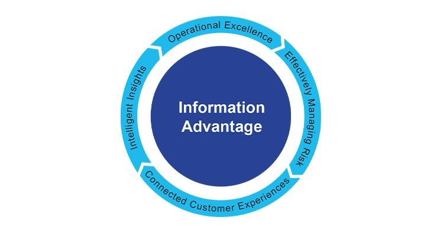

## Table of Contents

## What is informational advantage?

Informational advantage is when someone knows more about something than others. This can help them make better choices or do better in what they are doing. For example, if a person knows more about a company than others, they might make smarter choices about buying or selling its stock.

Having an informational advantage can be very useful in many areas, like business, sports, or even everyday life. People who have more information can often predict what will happen next or find new opportunities that others might miss. But, it's important to use this advantage fairly and not to cheat or harm others.

## How does informational advantage differ from other types of advantages?

Informational advantage is different from other types of advantages because it's all about knowing more than others. Other advantages might be things like having more money, being stronger, or having better tools. For example, if you're playing a game, having more money (financial advantage) or better equipment (technological advantage) can help you win. But if you know more about the game's rules or strategies (informational advantage), you can also do better, even if you don't have as much money or the best equipment.

Another way informational advantage is different is that it can change quickly. If you have a physical advantage, like being taller, that doesn't change easily. But if you learn something new or if others learn what you know, your informational advantage can go away fast. This means you need to keep learning and stay ahead to keep your advantage. Also, informational advantage often needs you to be smart about how you use what you know, while other advantages might just help you without needing much thought.

## Can you provide examples of informational advantage in everyday life?

One example of informational advantage in everyday life is when you're shopping for a used car. If you know a lot about cars, like which models are reliable and what a fair price is, you can get a better deal than someone who doesn't know as much. You might spot a good car that others overlook or negotiate a lower price because you know the car's true value.

Another example is in the kitchen. If you know a lot about cooking, you can make tastier meals with the same ingredients that someone else might use. You might know special tricks or recipes that make your food stand out. This can impress your friends and family, and it can also save you money because you can make delicious meals without needing to buy expensive ingredients.

## What are the key sources of informational advantage?

One key source of informational advantage is education. When you go to school or learn on your own, you gain knowledge that others might not have. This can be about anything, like science, history, or how to fix a car. The more you learn, the more you know, and this can help you make better choices or do things better than others. For example, if you study a lot about computers, you might be able to fix them faster than someone who doesn't know as much.

Another source is experience. When you do something a lot, you learn from it and get better at it. This experience can give you an advantage because you know what works and what doesn't. For example, if you've been cooking for many years, you know how to make dishes taste good without needing a recipe. You can also spot problems and fix them quickly because you've seen them before. Experience helps you understand things in a way that [books](/wiki/algo-trading-books) alone can't teach you.

A third source is networking. Talking to other people and learning from them can give you information that you wouldn't find on your own. If you know a lot of people in your field, they can share tips, warn you about problems, or tell you about new opportunities. For example, if you're a business owner and you talk to other business owners, they might tell you about a new way to save money or a new market to sell your products in. Networking helps you stay up-to-date and learn from the experiences of others.

## How can informational advantage be used ethically in business?

Using informational advantage in business can be done ethically by sharing knowledge with others and using it to create better products or services. For example, if a company knows a lot about what customers want, they can use this information to make things that people really need. This helps the business grow and also helps customers by giving them better choices. It's important to be honest and open about what you know, so everyone can benefit from the information.

Another way to use informational advantage ethically is by helping others learn and grow. If a business leader knows a lot about their industry, they can teach their employees or even share some of their knowledge with other businesses. This can create a better working environment and help the whole industry improve. By using information to help others, the business can build a good reputation and trust with customers and partners.

## What are the potential risks and downsides of seeking informational advantage?

Seeking informational advantage can have some risks. One big risk is that you might do something wrong or unfair to get the information. For example, if you spy on another company to learn their secrets, that's not fair and could get you in trouble. Also, if you focus too much on getting information, you might forget about other important things, like treating people well or making good products. If people find out you're using information in a sneaky way, they might not trust you anymore, and that can hurt your business or your relationships.

Another downside is that having too much information can be confusing. Sometimes, knowing a little bit about a lot of things can make it hard to decide what to do. You might spend so much time learning and trying to stay ahead that you don't have time to actually use what you know. Plus, if you share your information with others, they might use it against you. It's important to be careful about who you trust with your information and how you use it, so you don't end up hurting yourself or others.

## How can individuals develop and maintain an informational advantage?

To develop an informational advantage, individuals should focus on learning as much as they can about their areas of interest. This means reading books, taking classes, or watching educational videos to build a strong base of knowledge. Talking to people who know a lot about the subject can also help, because they can share their experiences and tips. It's important to keep learning new things and staying up-to-date with what's happening in the field. By doing this, you can understand things better than others and make smarter choices.

Maintaining an informational advantage means you have to keep learning even after you know a lot. Things change, and new information comes out all the time, so you need to stay on top of it. This could mean reading news, joining groups where people share what they know, or going to events where you can learn more. It's also smart to think about how you can use what you know to help others, because sharing information can make it grow and keep you sharp. By always trying to learn more and use your knowledge wisely, you can keep your informational advantage strong.

## What role does technology play in creating and sustaining informational advantage?

Technology helps a lot in creating and keeping an informational advantage. It makes it easy to find and learn new things. For example, the internet lets you read news, watch videos, and take online classes from anywhere. You can use search engines to find answers to your questions quickly. Also, technology like smartphones and computers helps you keep all your information in one place, so you can use it whenever you need to. This means you can learn more and faster than before, which helps you stay ahead of others.

Technology also helps you keep your informational advantage by letting you connect with other people. You can join online groups or use social media to talk to experts and learn from them. This way, you can always get new ideas and stay up-to-date. But, you have to be careful because technology can also make it easier for others to find the same information. So, you need to keep learning and using what you know in smart ways to keep your advantage.

## How do regulatory environments affect the pursuit of informational advantage?

Regulatory environments can make it harder or easier to get an informational advantage. Rules and laws set by governments can stop people from using unfair ways to get information. For example, laws against insider trading make sure that people can't use secret information to make money in the stock market. These rules help keep things fair, but they can also make it harder for people to find and use information that could give them an advantage.

On the other hand, some regulations can help people get an informational advantage by making sure that important information is shared with everyone. For example, rules that make companies report their financial information to the public can help investors make better choices. By following these rules, people can learn more about a company and use that knowledge to their advantage. So, regulatory environments can both help and hurt the pursuit of informational advantage, depending on how they are set up.

## What are advanced strategies for leveraging informational advantage in competitive markets?

In competitive markets, one advanced strategy for leveraging informational advantage is to focus on niche markets. By understanding a specific area deeply, you can become an expert in that niche. This means learning everything about the customers, their needs, and the competition. When you know more than others about a small part of the market, you can make better products or services that meet the exact needs of those customers. This can help you stand out and attract more business, even when there are many other companies around.

Another strategy is to use data analytics to make smart decisions. By collecting and analyzing data about your market, you can find patterns and trends that others might miss. This can help you predict what customers will want next or spot new opportunities before anyone else does. For example, if you see that more people are buying a certain type of product, you can start making more of that product before your competitors catch on. Using data this way helps you stay ahead and keep your informational advantage strong.

## How can informational advantage be measured and quantified?

Measuring and quantifying informational advantage can be tricky, but there are ways to do it. One way is to look at how well someone does compared to others who don't have the same information. For example, if a stock trader makes more money than other traders because they know more about a company, that shows they have an informational advantage. Another way is to use tests or surveys to see how much someone knows about a topic. If they score higher than others, it means they have more information and a possible advantage.

Another method to measure informational advantage is by looking at how quickly someone can make decisions or solve problems. If someone can make good choices faster than others because they know more, that's a sign of an informational advantage. Also, businesses can use data to measure this advantage. They can look at things like how many new ideas they come up with or how well their products sell compared to competitors. If they are doing better because they have more information, it shows they have an informational advantage.

## What are the future trends and predictions regarding informational advantage in various industries?

In the future, informational advantage will become even more important in many industries. With the rise of big data and [artificial intelligence](/wiki/ai-artificial-intelligence), companies will use these tools to learn more about their customers and markets. This will help them make better products and services, and stay ahead of their competitors. For example, in healthcare, doctors will use more data to understand diseases better and find new treatments. In finance, traders will use AI to predict market trends and make smarter investments. As technology gets better, the amount of information available will grow, making it easier for those who know how to use it to gain an advantage.

However, as more people and companies get access to the same information, it will be harder to keep an informational advantage. This means that the focus will shift to how quickly and creatively people can use the information they have. Companies will need to be fast at turning data into action and coming up with new ideas. Also, privacy laws and regulations will play a bigger role in how information is used. Companies will need to find ways to use information ethically and legally to keep their advantage. Overall, the future of informational advantage will be about using technology wisely, staying ahead of the competition, and doing it all in a fair way.

## References & Further Reading

[1]: ["Advances in Financial Machine Learning"](https://www.amazon.com/Advances-Financial-Machine-Learning-Marcos/dp/1119482089) by Marcos Lopez de Prado

[2]: ["Machine Learning for Algorithmic Trading, Second Edition"](https://github.com/PacktPublishing/Machine-Learning-for-Algorithmic-Trading-Second-Edition) by Stefan Jansen

[3]: ["Algorithmic Trading: Winning Strategies and Their Rationale"](https://www.amazon.com/Algorithmic-Trading-Winning-Strategies-Rationale/dp/1118460146) by Ernie Chan

[4]: Aldridge, I. (2013). ["High-Frequency Trading: A Practical Guide to Algorithmic Strategies and Trading Systems, Second Edition"](https://www.amazon.com/High-Frequency-Trading-Practical-Algorithmic-Strategies/dp/1118343506)

[5]: Easley, D., López de Prado, M. M., & O'Hara, M. (2012). ["The Volume Clock: Insights into the High-Frequency Paradigm."](https://papers.ssrn.com/sol3/papers.cfm?abstract_id=2034858) The Review of Financial Studies, 25(5), 1457-1493.

[6]: ["Secrets of Successful Traders: How to Trade Successfully Using Proven Insider Secrets of the World’s Trading Elite"](https://www.davelandry.com/17-trading-secrets/) by Simon Sinclair

[7]: Narang, R. K. (2013). ["Inside the Black Box: A Simple Guide to Quantitative and High-Frequency Trading, Second Edition"](https://onlinelibrary.wiley.com/doi/book/10.1002/9781118662717)