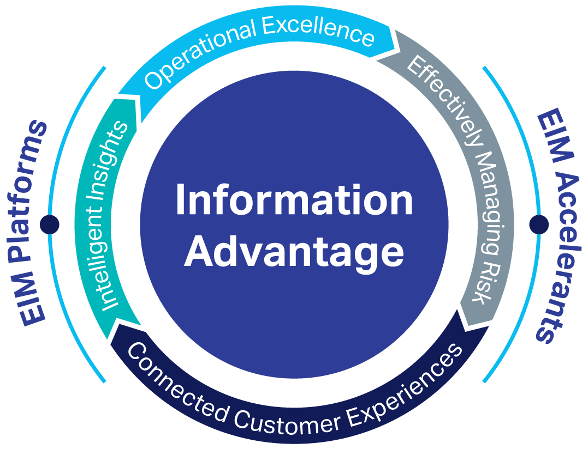

The surge of algorithmic trading (algo trading) has revolutionized the financial markets, offering unparalleled speed, efficiency, and reduced human error in trading operations. This transformation is driven by the application of sophisticated algorithms that execute trades at a pace and precision far beyond the capabilities of human traders. A pivotal element in the success of algorithmic trading is the informational advantage it provides, rooted in superior data access, real-time processing capabilities, and advanced analytical methodologies.

Informational advantage in algo trading refers to the edge that algorithmic traders gain by harnessing a wealth of data through high-speed networks and advanced computing power. This advantage allows traders to receive market data, news, and social media updates more rapidly than traditional methods could allow. Consequently, they can make informed trading decisions swiftly, maximizing opportunities for profit while minimizing exposure to risk.



This article will explore the concept of informational advantage in algorithmic trading, breaking down its key components, examining the benefits it provides, and the challenges that traders face in maintaining this edge. By gaining a deeper understanding of these aspects, traders, wealth managers, and market enthusiasts can navigate the evolving landscape of algorithmic trading with greater skill and insight. In particular, this discourse will highlight the critical role of informational advantage and how it distinguishes successful algorithmic traders from their peers by enabling them to outperform in the market. 

The discussion will provide valuable insights into the integration of cutting-edge technology and sophisticated strategies, offering a comprehensive overview of the factors that contribute to success in the complex and dynamic world of algorithmic trading.

## Table of Contents

## What is Informational Advantage in Algo Trading?

Informational advantage in algorithmic trading is a critical factor that determines the success of traders operating with automated strategies. It hinges on the ability to access and process market data at speeds far superior to traditional trading methods, thus facilitating more informed trading decisions. This advantage is primarily derived from leveraging cutting-edge technologies, such as artificial intelligence (AI) and big data analytics, which enable the acquisition and interpretation of vast datasets.

Advanced algorithms employed in algorithmic trading quickly aggregate data from various sources, including historical market data, financial news, and social media feeds. These algorithms are designed to analyze the data for patterns and correlations that may indicate potential market movements. This is often achieved through the integration of complex mathematical models and machine learning techniques. For instance, machine learning algorithms can learn from past data to predict future trends, thereby allowing traders to anticipate market changes and execute trades with higher precision.

Moreover, possessing an informational advantage reduces the risk of costly trading errors and enhances profitability by enabling timely responses to market events. By having access to real-time data and powerful analytical tools, traders can swiftly identify advantageous trading opportunities that may not be apparent through conventional analysis.

An in-depth understanding of informational advantage can significantly improve the development and implementation of trading strategies. It equips traders with the skills to refine their algorithms and adapt to market conditions dynamically, ensuring that they can maintain their competitive edge in a rapidly evolving financial landscape. As the complexity of financial markets continues to grow, the importance of informational advantage in [algorithmic trading](/wiki/algorithmic-trading) is more pronounced than ever, empowering traders to make data-driven decisions with confidence.

## Components of Informational Advantage

Data acquisition plays a pivotal role in establishing an informational advantage in algorithmic trading. This process involves the gathering of real-time market data, financial news, and social media analytics. The ability to access this information promptly enables traders to respond swiftly to market changes. High-frequency trading platforms frequently utilize APIs to connect with data streams, offering instant access to crucial financial indicators. The seamless integration of diverse data sources forms the foundation upon which algorithmic models rely.

Computational power is another essential component, enabling the processing of vast data sets at unprecedented speeds. High-performance computing (HPC) systems facilitate the execution of complex algorithms, enhancing the capacity for rapid and informed decision-making. The employment of advanced processors and parallel computing systems allows for quicker analysis and interpretation of data, empowering traders to act on insights almost instantaneously. For instance, the utilization of Graphics Processing Units (GPUs) in trading algorithms illustrates a significant leap in computational capability, offering superior processing power compared to traditional CPUs.

Prediction models, underpinned by [machine learning](/wiki/machine-learning) (ML) and [artificial intelligence](/wiki/ai-artificial-intelligence) (AI), are crucial for enhancing trading accuracy. These models analyze historical and current market data to forecast future price movements. Machine learning techniques, such as supervised learning and [reinforcement learning](/wiki/reinforcement-learning), are commonly employed to refine these predictive models. For example, in Python, libraries like TensorFlow and Scikit-learn can be used to develop and train models:

```python
from sklearn.model_selection import train_test_split
from sklearn.ensemble import RandomForestRegressor
import numpy as np

# Sample data
market_data = np.array(...)  # Multidimensional array of market metrics
price_movements = np.array(...)  # Corresponding asset price movements

# Split the data into training and testing sets
X_train, X_test, y_train, y_test = train_test_split(market_data, price_movements, test_size=0.2, random_state=42)

# Initialize and train a Random Forest model
model = RandomForestRegressor(n_estimators=100, random_state=42)
model.fit(X_train, y_train)

# Predict future price movements
predictions = model.predict(X_test)
```

The accuracy of these models is pivotal in minimizing errors and optimizing trading strategies, ultimately leading to improved profitability.

Network structure also contributes significantly by reducing latency in trade execution. The physical proximity to exchange servers and a robust network infrastructure minimize the time taken for data to travel between the trader's system and the market. Techniques such as colocation, where trading firms place their servers within or near an exchange's data center, are employed to achieve reduced latency. This proximity advantage allows orders to be placed milliseconds before competitors, which can be decisive in high-frequency trading environments.

Collectively, these components—data acquisition, computational power, prediction models, and network structure—synthesize to form the informational advantage that distinguishes successful algorithmic traders. As the trading landscape evolves, enhancing these components will remain critical for maintaining a competitive edge.

## Benefits of Informational Advantage in Algo Trading

Algorithmic trading, powered by informational advantage, offers several notable benefits that elevate trading operations and decision-making capabilities. The primary benefits include improved speed and accuracy, enhanced risk management, superior market prediction, and a competitive edge.

Speed and accuracy are paramount in algorithmic trading, where decisions need to be executed with minimal lag. Informational advantage enables the rapid processing of vast data sets far quicker than traditional manual methods. Advanced algorithms can analyze market conditions and execute trades within milliseconds, significantly reducing latency issues. This speed translates to enhanced accuracy in trade execution, allowing traders to capitalize on fleeting opportunities, therefore limiting slippage and maximizing potential profits.

Enhanced risk management is another critical benefit attributed to informational advantage. With sophisticated analytical tools, algorithmic trading systems can perform real-time risk assessments, identifying potential market risks before they materialize. These systems employ complex models that analyze historical data and current market trends, enabling traders to predict and mitigate risks more effectively. By constant monitoring and adjusting to market changes, these algorithms help in optimizing portfolio performance and maintaining robust risk control.

Market prediction techniques are significantly improved through the use of state-of-the-art machine learning models. These models are trained on extensive historical and current market data to recognize patterns and predict future market trends with high accuracy. Machine learning algorithms like neural networks and random forests are commonly used because of their ability to adapt and improve over time, directly increasing the predictive power of trading strategies. Accurate market prediction allows traders to preemptively position themselves advantageously, gaining from market movements before they occur.

A competitive edge is crucial in volatile and highly competitive financial markets. Firms leveraging an informational advantage through superior data access, processing capabilities, and analytical insights have a significant upper hand. These capabilities allow traders to uncover actionable insights and make better-informed decisions faster than competitors lacking such an edge. As a result, they can capture value that other participants may miss, thereby solidifying their position in the market.

In conclusion, the benefits of informational advantage in algorithmic trading are expansive, offering tangible enhancements in speed, risk management, predictability, and competitiveness. These advantages underscore the transformative impact of technology and data-driven insights in modern trading strategies. Continual advancements in these areas promise even more significant benefits, ensuring that informational advantage remains a cornerstone of successful algorithmic trading.

## Challenges and Risks

Algorithmic trading, known for its speed and precision, faces several challenges and risks that can impact its effectiveness. Among these, overfitting stands out as a primary concern. Overfitting occurs when an algorithm develops a model that fits historical data too closely, potentially capturing noise instead of genuine market patterns. This over-reliance on past data can lead to inaccurate predictions about future market behavior. To mitigate this risk, traders often employ techniques such as cross-validation and regularization to ensure their models generalize well to unseen data.

Regulatory compliance presents another significant challenge. Algorithmic trading operates within a framework of stringent regulations that vary across different jurisdictions. These regulations are designed to maintain market integrity and protect investors. Algorithmic traders must ensure that their systems adhere to all applicable laws, including those related to market manipulation and unfair trading practices. Failure to comply can result in hefty fines and legal penalties.

Execution risk is an inherent aspect of algorithmic trading systems. Despite their sophistication, algorithms can fail due to technical glitches, such as software bugs or hardware malfunctions. Additionally, unforeseen market conditions, such as flash crashes or unprecedented [volatility](/wiki/volatility-trading-strategies), can disrupt execution, leading to significant financial losses. Traders must implement robust risk management protocols and contingency measures to address these potential failures.

Ethical concerns also arise, particularly when algorithmic strategies lack transparency or are potentially manipulative. Algorithms that exploit market inefficiencies or create artificial price movements can raise ethical questions and damage market confidence. Ensuring ethical compliance requires transparency in algorithm design and operation, as well as regular audits to prevent manipulative practices.

Addressing these challenges requires a careful balance of technological innovation and stringent oversight. As algorithmic trading continues to evolve, the focus on managing these risks and challenges will remain crucial to maintaining efficient and fair financial markets.

## Conclusion

Informational advantage is a key [factor](/wiki/factor-investing) in algorithmic trading, offering opportunities to enhance trading performance by leveraging superior data access and processing capabilities. This advantage allows traders to navigate complex financial markets with greater precision and speed, differentiating successful strategies from average ones. Despite the numerous benefits, it is imperative for traders to be aware of the potential risks and ethical considerations associated with the use of informational advantage in trading operations.

The landscape of algorithmic trading is continuously evolving, driven by technological innovations and advances in data science. These developments are likely to further accentuate the importance of maintaining an informational edge. For instance, machine learning and artificial intelligence models are expected to become more sophisticated, leading to more accurate market predictions and improved risk management practices.

In a dynamic market environment, the amalgamation of cutting-edge technology and strategic insight provided by an informational advantage can enhance a trader’s ability to outperform market trends. This powerful combination not only provides a competitive edge but also fosters the development of robust and adaptive trading strategies. As the field progresses, maintaining an informational advantage will be crucial for those aiming to excel in algorithmic trading.

## References & Further Reading

[1]: ["Advances in Financial Machine Learning"](https://www.amazon.com/Advances-Financial-Machine-Learning-Marcos/dp/1119482089) by Marcos Lopez de Prado

[2]: ["Machine Learning for Algorithmic Trading, Second Edition"](https://github.com/PacktPublishing/Machine-Learning-for-Algorithmic-Trading-Second-Edition) by Stefan Jansen

[3]: ["Algorithmic Trading: Winning Strategies and Their Rationale"](https://www.amazon.com/Algorithmic-Trading-Winning-Strategies-Rationale/dp/1118460146) by Ernie Chan

[4]: Aldridge, I. (2013). ["High-Frequency Trading: A Practical Guide to Algorithmic Strategies and Trading Systems, Second Edition"](https://www.amazon.com/High-Frequency-Trading-Practical-Algorithmic-Strategies/dp/1118343506)

[5]: Easley, D., López de Prado, M. M., & O'Hara, M. (2012). ["The Volume Clock: Insights into the High-Frequency Paradigm."](https://papers.ssrn.com/sol3/papers.cfm?abstract_id=2034858) The Review of Financial Studies, 25(5), 1457-1493.

[6]: ["Secrets of Successful Traders: How to Trade Successfully Using Proven Insider Secrets of the World’s Trading Elite"](https://www.davelandry.com/17-trading-secrets/) by Simon Sinclair

[7]: Narang, R. K. (2013). ["Inside the Black Box: A Simple Guide to Quantitative and High-Frequency Trading, Second Edition"](https://onlinelibrary.wiley.com/doi/book/10.1002/9781118662717)