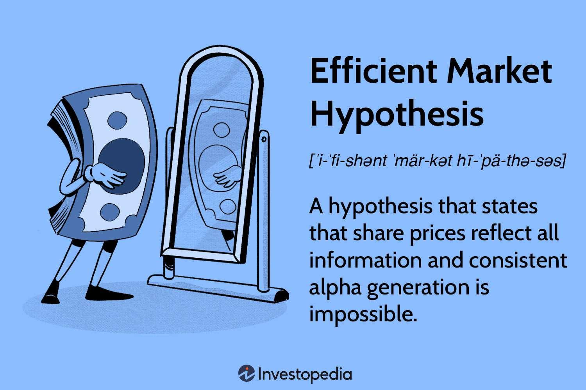

## Table of Contents

## What is an informationally efficient market?

An informationally efficient market is a market where the prices of assets, like stocks, quickly reflect all available information. This means that if new information comes out, the prices of stocks will change almost immediately to show this new information. For example, if a company announces good news, its stock price will go up fast because everyone knows about the good news and wants to buy the stock.

In an informationally efficient market, it's hard to beat the market by trading because the prices already include all known information. This makes it difficult to find stocks that are underpriced or overpriced. Investors who believe in efficient markets often choose to invest in a broad range of stocks, like in an index fund, rather than trying to pick individual stocks that might do better than the market.

## Who developed the Efficient Market Hypothesis (EMH)?

The Efficient Market Hypothesis (EMH) was developed by Eugene Fama, an economist, in the 1960s. He worked at the University of Chicago and wrote about how stock prices reflect all available information. Fama's idea was that if markets are efficient, it's hard to beat them by picking stocks because the prices already show everything people know.

Fama's work on the EMH changed how people think about investing. Before his theory, many believed they could find undervalued stocks and make big profits. But Fama showed that in an efficient market, this is very difficult because prices adjust quickly to new information. His ideas led to more people using passive investing strategies, like index funds, instead of trying to beat the market.

## What are the three forms of market efficiency according to EMH?

According to the Efficient Market Hypothesis (EMH), there are three forms of market efficiency: weak, semi-strong, and strong. The weak form says that all past prices of a stock are already included in its current price. This means you can't use old price data to predict future prices and make money. If the market follows the weak form, looking at charts and patterns won't help you beat the market.

The semi-strong form goes further and says that all public information, like news and financial reports, is also included in the stock's price. So, if a company announces good news, the price will change right away to reflect that news. In a semi-strong market, it's hard to beat the market even if you read all the news and reports because the prices adjust so quickly.

The strong form is the most extreme. It says that all information, even private or insider information, is already in the stock's price. This means that even if you have secret information about a company, you still can't beat the market because the price already shows everything. In reality, strong form efficiency is hard to believe because insider trading can still give some people an advantage.

## How does the weak form of market efficiency differ from the strong form?

The weak form of market efficiency says that all past prices of a stock are already included in its current price. This means you can't use old price data to predict future prices and make money. If the market follows the weak form, looking at charts and patterns won't help you beat the market. It's all about saying that what happened before with prices doesn't help you know what will happen next.

The strong form of market efficiency goes much further. It says that all information, even private or insider information, is already in the stock's price. This means that even if you have secret information about a company, you still can't beat the market because the price already shows everything. In reality, strong form efficiency is hard to believe because insider trading can still give some people an advantage. The strong form is the most extreme version of market efficiency, suggesting that no one can have an edge, no matter what they know.

## What is the role of information in an efficient market?

In an efficient market, information plays a big role. It's all about how fast and well the prices of things like stocks change when new information comes out. If the market is efficient, the prices will change really quickly to show this new information. For example, if a company says they made a lot more money than people thought, the price of their stock will go up fast because everyone knows about the good news and wants to buy the stock.

The idea is that if everyone has the same information, no one can get a big advantage over others. In a perfect efficient market, even secret information would be in the price, but that's hard to believe because people with secret info can still make money. But in general, if the market is efficient, it's hard to pick stocks that will do better than the market because the prices already show all the known information.

## Can you explain the concept of 'random walk' in relation to market prices?

The 'random walk' idea says that the prices of stocks move in a way that you can't predict. It's like if you were walking around but choosing each step randomly. You can't guess where you'll end up because each step is a surprise. In the same way, if stock prices follow a random walk, looking at past prices won't help you know what the price will do next. This fits with the weak form of market efficiency, which says that past prices are already in the current price, so they don't help predict the future.

The random walk theory is important because it supports the idea that markets are efficient. If prices move randomly, it means that all the information people know is already in the price. So, trying to find patterns in past prices to make money won't work. This makes it hard for people to beat the market by [picking](/wiki/asset-class-picking) stocks, because the next price change is just as likely to go up as it is to go down, no matter what happened before.

## What are some common criticisms of the Efficient Market Hypothesis?

Some people don't agree with the Efficient Market Hypothesis (EMH) because they think it's too simple. They say that real markets aren't as perfect as EMH suggests. For example, some investors, like Warren Buffett, have made a lot of money by picking stocks that they think are undervalued. This goes against EMH, which says you can't beat the market because all information is already in the price. Critics also point out that people can have emotional reactions to news, causing prices to move in ways that aren't rational. This means that prices don't always reflect all information perfectly.

Another criticism is that not everyone has the same information at the same time. Some people might know things that others don't, like insider information, which can give them an advantage. Also, gathering and understanding all the information out there is hard and takes time. So, even if new information comes out, not everyone will know about it right away, which can make prices move slowly. These things show that markets might not be as efficient as EMH says they are.

## How do behavioral finance theories challenge the EMH?

Behavioral finance theories challenge the Efficient Market Hypothesis (EMH) by showing that people don't always act rationally when they make decisions about money. EMH says that all information is quickly put into stock prices, but behavioral finance says that people's feelings and mistakes can make prices move in ways that don't make sense. For example, people might get too excited about a stock and buy a lot of it, making the price go up even if the company isn't doing that well. Or they might sell a stock just because everyone else is selling, even if the stock is still a good investment. These actions show that emotions and group behavior can affect prices, which goes against the idea that markets are always efficient.

Another way behavioral finance challenges EMH is by pointing out that people often make the same mistakes over and over. They might hold onto losing stocks too long, hoping they'll go back up, or sell winning stocks too soon to lock in a small profit. These behaviors can lead to patterns in the market that some investors can use to make money. For example, if a lot of people are selling a stock because it's going down, it might become undervalued, and smart investors can buy it at a low price and make money later. This shows that markets might not be as efficient as EMH claims, because people's predictable mistakes can create opportunities to beat the market.

## What empirical evidence supports the Efficient Market Hypothesis?

Some studies have shown that stock prices do seem to follow a random walk, which supports the Efficient Market Hypothesis (EMH). For example, researchers have looked at past stock prices and found that you can't use them to predict what the price will do next. This fits with the weak form of EMH, which says that all past prices are already in the current price. Also, when big news comes out, like a company's earnings report, stock prices often change very quickly. This suggests that the market is good at taking in new information and adjusting prices to match, which supports the semi-strong form of EMH.

However, there is also evidence that markets might not be as efficient as EMH says. Some investors have been able to beat the market over long periods of time, which goes against the idea that it's impossible to do better than the market. For example, people like Warren Buffett have made a lot of money by picking stocks they think are undervalued. Also, events like stock market bubbles and crashes show that prices can be affected by people's emotions and not just by new information. These things suggest that while markets can be efficient sometimes, they aren't always perfect, and people's behavior can make a difference.

## What empirical evidence contradicts the Efficient Market Hypothesis?

Some people have made a lot of money by picking stocks they think are undervalued, which goes against the Efficient Market Hypothesis (EMH). For example, Warren Buffett has been very successful at picking stocks over many years. This suggests that it might be possible to beat the market, even though EMH says it's not. Also, there are times when stock prices move in ways that don't make sense, like during stock market bubbles or crashes. These events show that people's emotions can affect prices, not just new information. If markets were really efficient, prices would always reflect all information, but these events show that's not always true.

Another piece of evidence against EMH is that some studies have found patterns in stock prices that people can use to make money. For example, some stocks tend to go up in January, a pattern known as the "January effect." If markets were perfectly efficient, these patterns shouldn't exist because prices would adjust to all information right away. Also, research has shown that stocks can be mispriced because of things like overconfidence or herd behavior, where people follow what others are doing without thinking for themselves. These findings suggest that markets might not be as efficient as EMH claims, because people's predictable mistakes can create opportunities to beat the market.

## How do market anomalies and bubbles relate to the critique of EMH?

Market anomalies and bubbles are big reasons why some people don't believe in the Efficient Market Hypothesis (EMH). Anomalies are patterns in stock prices that shouldn't happen if markets were really efficient. For example, some stocks tend to go up in January, which is called the "January effect." If markets were perfectly efficient, these patterns wouldn't exist because prices would change right away to show all the information. But these anomalies show that prices might not always reflect all the information, which goes against what EMH says.

Bubbles are another problem for EMH. A bubble happens when the price of something, like a stock, goes up a lot because people get too excited about it, not because it's worth that much. When the bubble pops, the price falls fast. This shows that people's feelings can affect prices, not just new information. If markets were efficient, prices would always show what something is really worth, but bubbles show that's not always true. So, market anomalies and bubbles are important evidence that markets might not be as efficient as EMH claims.

## What are the implications of EMH for investors and financial regulation?

The Efficient Market Hypothesis (EMH) has big effects on how people invest their money. If you believe in EMH, you might think it's hard to pick stocks that will do better than the market because all the information people know is already in the stock price. So, instead of trying to pick individual stocks, you might choose to invest in a broad range of stocks, like in an index fund. This way, you can get the average return of the market without trying to beat it. Many people who believe in EMH use this kind of passive investing because it's simple and doesn't need a lot of work.

EMH also affects how the government makes rules for the stock market. If markets are efficient, then rules should focus on making sure everyone has the same information at the same time. This means stopping insider trading, where some people know secret information that others don't. It also means making sure companies share their financial information quickly and honestly. If markets aren't efficient, then rules might need to do more to protect people from big price changes caused by emotions or mistakes. Either way, understanding EMH helps the government make better rules to keep the market fair and working well.

## References & Further Reading

[1]: Fama, E. F. (1970). ["Efficient Capital Markets: A Review of Theory and Empirical Work."](https://www.jstor.org/stable/2325486) Journal of Finance, 25(2), 383-417.

[2]: Lo, A. W. (2004). ["The Adaptive Markets Hypothesis: Market Efficiency from an Evolutionary Perspective."](https://papers.ssrn.com/sol3/papers.cfm?abstract_id=602222) Journal of Portfolio Management, 30(5), 15-29.

[3]: Barberis, N., & Thaler, R. (2003). ["A Survey of Behavioral Finance."](https://www.nber.org/papers/w9222) Handbook of the Economics of Finance, 1053-1128.

[4]: Hendershott, T., Jones, C. M., & Menkveld, A. J. (2011). ["Does Algorithmic Trading Improve Liquidity?"](https://onlinelibrary.wiley.com/doi/full/10.1111/j.1540-6261.2010.01624.x) Journal of Finance, 66(1), 1-33.

[5]: Kirilenko, A. A., Kyle, A. S., Samadi, M., & Tuzun, T. (2017). ["The Flash Crash: High-Frequency Trading in an Electronic Market."](https://www.jstor.org/stable/26652722) Journal of Finance, 72(3), 967-998.

[6]: Shleifer, A. (2000). ["Inefficient Markets: An Introduction to Behavioral Finance."](https://academic.oup.com/book/27761) Oxford University Press.

[7]: Aldridge, I. (2013). ["High-Frequency Trading: A Practical Guide to Algorithmic Strategies and Trading Systems."](https://www.amazon.com/High-Frequency-Trading-Practical-Algorithmic-Strategies/dp/1118343506) Wiley.

[8]: Lo, A. W., & MacKinlay, A. C. (1999). ["A Non-Random Walk Down Wall Street."](https://www.jstor.org/stable/j.ctt7tccx) Princeton University Press.