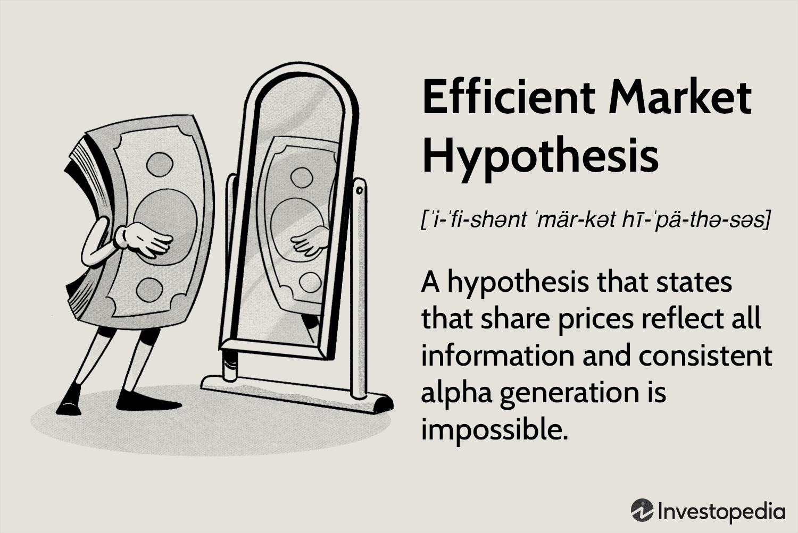

Market efficiency is a foundational concept in finance that refers to the degree to which asset prices reflect all available information. It posits that in an efficient market, prices fully and instantaneously incorporate relevant information, making it impossible to consistently achieve returns that exceed average market returns. This concept is encapsulated in the Efficient Market Hypothesis (EMH), which serves as a cornerstone of modern financial theory.

The Efficient Market Hypothesis, initially posited by Eugene Fama in the 1960s, suggests that it is impossible for investors to "beat the market" consistently on a risk-adjusted basis, because stock market prices should only respond to new information. EMH can be categorized into three forms: weak, semi-strong, and strong, each representing different levels of market information efficiency. The weak form suggests that all past trading information is embedded in asset prices, while the semi-strong form posits that all publicly available information is already reflected in prices. The strong form asserts that all information, including insider details, is accounted for in current asset prices.

Information plays a crucial role in asset pricing. In theory, in an efficient market, as soon as news or data becomes available, it is immediately analyzed and incorporated into asset prices, thus providing a fair valuation. However, the dynamic nature of markets means the flow of information is constant and multifaceted, significantly influencing price movements. Innovations in technology have accelerated this flow, leading to the development and proliferation of algorithmic trading.

Algorithmic trading refers to the use of computer algorithms to execute trades at speeds and frequencies that are impossible for human traders. This type of trading leverages the vast amounts of available financial data and employs mathematical models and strategies to make trading decisions. In doing so, it contributes to increased market liquidity and enhances the price discovery process, which are indicators of market efficiency.

Algorithmic trading, while enhancing market efficiency in many respects, also presents challenges. Its ability to execute large orders rapidly can lead to significant market fluctuations and events such as flash crashes. Additionally, the intense competition among traders employing similar algorithms can sometimes lead to herd behavior, causing anomalies in market pricing.

Therefore, the interplay between market efficiency and algorithmic trading is complex. While algorithmic trading has the potential to promote efficiency, it can also introduce volatility and systematic risks. As such, understanding the nuanced relationship between these elements is crucial for investors, regulators, and policymakers in navigating and maintaining the integrity of financial markets.

## Table of Contents

## Understanding the Efficient Market Hypothesis

The Efficient Market Hypothesis (EMH) is a financial theory that asserts that asset prices fully reflect all available information at any given time. Proposing that it is impossible to consistently achieve returns higher than average market returns on a risk-adjusted basis, EMH suggests that any attempt to outperform the market would require exposure to higher risk.

EMH is classified into three versions based on the level of market information reflected in asset prices: weak, semi-strong, and strong forms. The weak form stipulates that current stock prices incorporate all historical price and [volume](/wiki/volume-trading-strategy) data. This implies that technical analysis, which relies on past stock price movements, is ineffective in predicting future price movements. The semi-strong form extends this by stating that current prices not only reflect historical data but also all publicly available information, such as financial statements and news releases. Thus, according to this form, neither technical analysis nor [fundamental analysis](/wiki/fundamental-analysis) can consistently generate alpha. The strong form of EMH posits that stock prices reflect all public and private information, rendering even insider information ineffective for gaining market advantage.

EMH is founded upon several critical assumptions: markets are composed of numerous rational investors who aim to maximize utility, information is freely available and promptly digested by investors, and stocks trade at their fair value, meaning that any anomalies are quickly corrected by market forces.

Historically, EMH gained prominence during the 1970s through the work of economists like Eugene Fama, who extensively studied market behaviors and the distribution of stock prices. Fama's work elucidated the random walk hypothesis, suggesting that price changes are random and unpredictable, further popularizing EMH.

For investors, the implications of EMH are profound. If markets are efficient as EMH suggests, then passive index investing becomes more appealing since active management strategies aiming to "beat the market" are likely to underperform after considering transaction costs and fees. Moreover, it implies that achieving superior risk-adjusted returns requires insights not yet reflected in market prices, which is highly improbable if EMH holds true. This has led to the proliferation of passive investment vehicles like index funds and ETFs, allowing investors to achieve market returns with minimal fees.

In summary, understanding the Efficient Market Hypothesis provides a framework for evaluating market behaviors and the challenges inherent in consistently outperforming market averages. Its implications continue to influence investment strategies and the development of financial theories even as ongoing critiques and discussions about its validity persist.

## Market Efficiency: The Core Idea

Market efficiency is a fundamental concept in financial economics that refers to the degree to which market prices reflect all available information. An efficient market is one where asset prices accurately incorporate every piece of public and private information, ensuring that securities are priced fairly and accurately at all times. This concept is critical because it underpins the theoretical foundation of how financial markets function, influencing both investment strategies and market regulation.

### Impact on Price Discovery and Investor Behavior

Market efficiency significantly affects price discovery—the process by which asset prices adjust to reflect new information. In an efficient market, price discovery is swift, meaning any new information is rapidly incorporated into asset prices, minimizing the chances of prolonged mispricings. For investors, market efficiency implies that it is challenging to achieve returns exceeding the average market return on a risk-adjusted basis, as any potential gains from information-based trading are quickly eroded by the market's rapid adjustment to new data.

### Factors Contributing to Market Efficiency

Several factors contribute to market efficiency. The availability and dissemination of information are paramount; as access to information increases and technology enables faster dissemination, markets tend to become more efficient. Additionally, the level of market participation is crucial; markets with a large number of active and informed participants tend to be more efficient. Liquidity also plays a vital role since higher [liquidity](/wiki/liquidity-risk-premium) facilitates easier trading, helping prices adjust more quickly. Finally, regulations and transparency contribute to efficiency by ensuring a level playing field for all market participants.

### Indicators of an Efficient Market

An efficient market is typically characterized by several indicators. These include narrow bid-ask spreads, which suggest that buyers and sellers are in harmony about asset valuation. High trading volumes are another indicator, reflecting active market participation and the ability for information to be absorbed quickly. The random walk theory, which posits that stock prices move in a random manner, is often used as evidence of market efficiency—if price movements are random, it implies information is being quickly and fully integrated into prices. Additionally, low levels of [arbitrage](/wiki/arbitrage) opportunities are indicative of efficiency, as such opportunities quickly vanish when markets are efficient.

### Challenges to Achieving Perfect Market Efficiency

Despite its theoretical appeal, achieving perfect market efficiency in practice is fraught with challenges. Information asymmetry, where different market players have varying access to information, can impede market efficiency. Behavioral biases among investors, such as overconfidence and herd behavior, can also lead to mispricings and deviations from expected price movements. Market frictions, such as transaction costs and liquidity constraints, further complicate the achievement of perfect efficiency. Lastly, macroeconomic factors and regulatory changes can cause shifts and irregularities in how efficiently markets operate.

In conclusion, while perfect market efficiency is an idealized state rarely achieved, understanding the components and implications of market efficiency is essential for investors, policymakers, and financial professionals for creating strategies and frameworks that align closely with the true nature of financial markets.

## Algorithmic Trading: Revolutionizing Market Dynamics

Algorithmic trading refers to the use of computer algorithms to automate and execute trading strategies in financial markets. Typically, these algorithms follow predefined rules and operate at speeds and efficiencies beyond human capability. With roots tracing back to the 1970s, the significant advancements in technology and computing power have made [algorithmic trading](/wiki/algorithmic-trading) a mainstream component of modern finance.

Algorithmic trading contributes markedly to market efficiency. By leveraging high-frequency and [quantitative trading](/wiki/quantitative-trading) strategies, algorithms quickly process large volumes of market data, facilitating rapid price adjustments to new information. This process aids in the alignment of asset prices with their intrinsic values. For example, [statistical arbitrage](/wiki/statistical-arbitrage), a common algorithmic technique, exploits short-term pricing inefficiencies by analyzing historical price series and executing trades based on mean-reversion principles.

The benefits of algorithmic trading in enhancing liquidity and price discovery cannot be overstated. Algorithms contribute to tighter bid-ask spreads, making it easier for buyers and sellers to transact without significantly impacting market prices. This increased liquidity reduces transaction costs for all market participants. Additionally, through continuous and systematic trading, algorithms provide new prices based on current information, thereby improving price discovery. This constant pricing feedback loop ensures that asset prices more accurately reflect available information.

Despite its advantages, algorithmic trading also presents potential risks and drawbacks. One significant concern is the amplification of market [volatility](/wiki/volatility-trading-strategies). In scenarios of heightened algorithmic activity, rapid buying or selling can exacerbate price swings, potentially triggering market-wide disturbances. Flash crashes, such as the notable event on May 6, 2010, highlight the potential for unintended consequences driven by algorithmic trading. The complex interplay of fast-acting algorithms can also lead to liquidity 'squeezes', where the withdrawal of algorithms concurrently can leave markets temporarily illiquid.

Case studies further illustrate the profound impact of algorithmic trading. During the 2010 Flash Crash, an algorithm inadvertently executed a large sell order in a short period, rapidly depleting market liquidity and causing a sharp market decline. However, algorithms also brought the market to recovery within a matter of minutes, demonstrating both the disruptive potential and corrective benefits these systems can provide.

Algorithmic trading continues to evolve, with advancements in [artificial intelligence](/wiki/ai-artificial-intelligence) and [machine learning](/wiki/machine-learning) paving the way for more sophisticated strategies. Nonetheless, the growing complexity underscores the need for robust regulatory frameworks to ensure the stability and integrity of financial markets. As technology continues to reshape market dynamics, understanding and managing the impact of algorithmic trading remains a critical focus for both market participants and regulators.

## Critiques of the Efficient Market Hypothesis

The Efficient Market Hypothesis (EMH) posits that asset prices fully reflect all available information, suggesting that it is impossible to consistently achieve returns that exceed average market returns on a risk-adjusted basis. However, behavioral economics presents numerous critiques of this hypothesis, challenging its assumptions and implications.

Behavioral economics argues that psychological factors often influence investor decisions, leading to systematic deviations from rationality and market efficiency posited by EMH. One key critique is that EMH overlooks the role of investor sentiment and emotional responses in asset pricing. Irrational behaviors, such as overconfidence and loss aversion, can lead to significant price deviations from intrinsic values.

Market anomalies provide concrete empirical challenges to EMH. These anomalies, such as the small-cap effect, January effect, and [momentum](/wiki/momentum) effects, indicate patterns that deviate from the efficient market model. For example, the small-cap effect suggests that small-cap stocks tend to outperform large-cap stocks on a risk-adjusted basis, a finding inconsistent with the EMH prediction.

Another aspect challenging the EMH is the presence of psychological biases in market behavior. Cognitive biases such as the disposition effect, where investors are reluctant to sell losing stocks and quick to sell winning ones, and herding behavior, where investors blindly follow the majority, can lead to significant market inefficiencies. These biases often result in price trends and reversals unexplained by EMH.

Historical events have further highlighted the limitations of EMH. The 1987 stock market crash and the dot-com bubble in the late 1990s serve as prominent examples. These events saw massive deviations from rational pricing models, driven largely by psychological factors and speculative behaviors. Such occurrences illustrate the inability of EMH to account for extreme market volatility and speculative bubbles.

For investors and policymakers, these critiques imply a need for strategies that incorporate behavioral insights. Investors may benefit from adopting contrarian strategies that exploit anomalies and behavioral biases. Policymakers could consider frameworks that address behavioral risks, such as implementing circuit breakers to mitigate panic sell-offs or designing investor education programs to reduce irrational behaviors.

Overall, while the Efficient Market Hypothesis offers a foundational understanding of market dynamics, it remains overly simplistic in accounting for human behavior and irrational market phenomena. Acknowledging and addressing these critiques is vital for more robust financial modeling and policy-making.

## Reconciling EMH with Algorithmic Trading

The Efficient Market Hypothesis (EMH) posits that asset prices fully reflect all available information, suggesting that it is impossible to consistently achieve higher returns without assuming additional risk. Algorithmic trading, which utilizes computer algorithms to execute trades at speeds and frequencies beyond human capability, aligns with EMH principles by enhancing market efficiency. Algorithmic trading can process vast amounts of information rapidly, reacting to new data and price changes swiftly. This promotes the reflection of information in asset prices, a core aspect of EMH. High-frequency trading, a subset of algorithmic trading, accelerates this process by exploiting minute market inefficiencies.

However, challenges arise when algorithmic trading contributes to market inefficiencies. The speed and volume of algorithmic trades can lead to sudden and significant market movements, contributing to increased volatility. A notable example is the 2010 Flash Crash, where algorithms allegedly caused a rapid market decline, followed by an equally quick recovery. This instance underscored how algorithms could exacerbate price swings, leading to temporary mispricings in financial markets.

Regulatory frameworks play a crucial role in mitigating these risks. They aim to ensure fair market practices and protect against the destabilizing effects of algorithmic trading. For instance, the Securities and Exchange Commission (SEC) in the United States has introduced measures such as circuit breakers, which temporarily halt trading during extreme market movements. These regulations help maintain market integrity, curbing the excessive risks introduced by high-frequency trading algorithms.

Despite these challenges, the future relationship between EMH and algorithmic trading remains promising. Technological advancements and enhanced regulatory oversight can foster an environment where algorithmic trading continues to promote market efficiency without compromising market stability. Financial institutions and regulatory bodies must continuously adapt to evolving trading technologies. By doing so, they can leverage the benefits of algorithmic trading while minimizing its potential drawbacks. This ongoing adaptation underscores the need for a dynamic approach to managing the intersection of market efficiency and technological advancements in the financial markets.

## Conclusion

In conclusion, the efficient market hypothesis (EMH) remains a cornerstone of modern financial theory, providing a framework that suggests markets effectively reflect all available information in asset prices. Despite critiques and challenges, particularly from behavioral economics, the notion that markets are generally efficient continues to hold significant influence. This fundamental belief shapes how investors and policymakers perceive price discovery and respond to new data.

Concurrently, algorithmic trading has emerged as a transformative force in financial markets. By leveraging computational power and sophisticated algorithms to execute trades at high speed and volumes, algorithmic trading enhances liquidity and sharpens the efficiency of price discovery. However, it also introduces complexities, such as volatility spikes and systemic risks, which require careful management and regulation.

The evolving landscape of financial markets underscores the need for continuous adaptation. As technology integrates more deeply with market dynamics, understanding the nuances of EMH in conjunction with these advancements becomes crucial. This intersection of market efficiency and technology is not a static one; it demands ongoing research and flexible regulatory frameworks to mitigate risks while promoting innovation.

In essence, while EMH provides a foundational lens through which to view market behavior, the reality of modern markets is dynamic. As algorithmic trading continues to expand its role, the financial community must remain vigilant, adapting strategies and policies to harness technological benefits without compromising market stability.

## References & Further Reading

[1]: Fama, E. F. (1970). ["Efficient Capital Markets: A Review of Theory and Empirical Work."](https://www.jstor.org/stable/2325486) Journal of Finance, 25(2), 383-417.

[2]: Lo, A. W. (2004). ["The Adaptive Markets Hypothesis: Market Efficiency from an Evolutionary Perspective."](https://papers.ssrn.com/sol3/papers.cfm?abstract_id=602222) Journal of Portfolio Management, 30(5), 15-29.

[3]: Barberis, N., & Thaler, R. (2003). ["A Survey of Behavioral Finance."](https://www.nber.org/papers/w9222) Handbook of the Economics of Finance, 1053-1128.

[4]: Hendershott, T., Jones, C. M., & Menkveld, A. J. (2011). ["Does Algorithmic Trading Improve Liquidity?"](https://onlinelibrary.wiley.com/doi/full/10.1111/j.1540-6261.2010.01624.x) Journal of Finance, 66(1), 1-33.

[5]: Kirilenko, A. A., Kyle, A. S., Samadi, M., & Tuzun, T. (2017). ["The Flash Crash: High-Frequency Trading in an Electronic Market."](https://www.jstor.org/stable/26652722) Journal of Finance, 72(3), 967-998.

[6]: Shleifer, A. (2000). ["Inefficient Markets: An Introduction to Behavioral Finance."](https://academic.oup.com/book/27761) Oxford University Press.

[7]: Aldridge, I. (2013). ["High-Frequency Trading: A Practical Guide to Algorithmic Strategies and Trading Systems."](https://www.amazon.com/High-Frequency-Trading-Practical-Algorithmic-Strategies/dp/1118343506) Wiley.

[8]: Lo, A. W., & MacKinlay, A. C. (1999). ["A Non-Random Walk Down Wall Street."](https://www.jstor.org/stable/j.ctt7tccx) Princeton University Press.