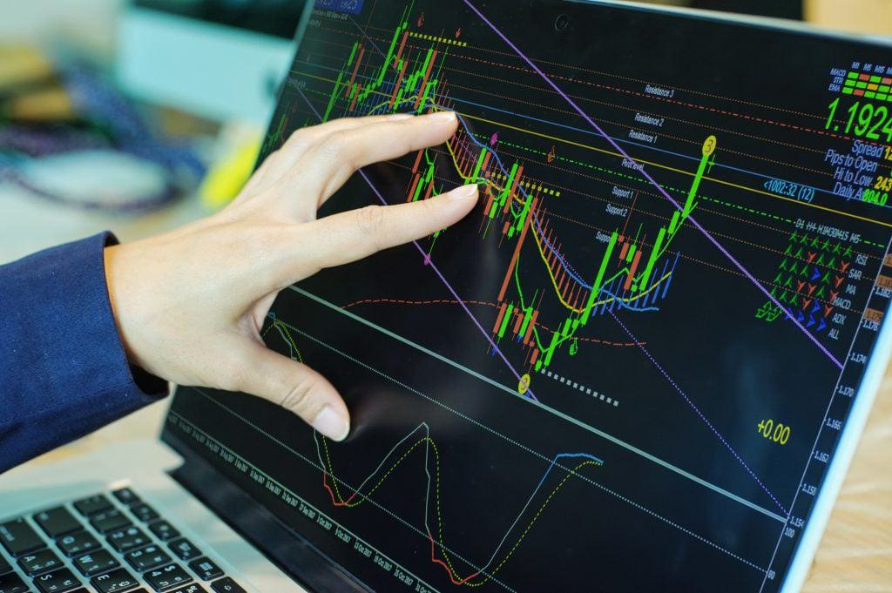

Informed trading, often synonymous with algorithmic trading (algo trading), marks a technological advancement in the stock market domain. This innovative approach employs sophisticated computer algorithms to execute trades based on predefined criteria, offering a level of speed and precision that traditional manual trading methods cannot achieve. Designed to eliminate human error and emotional bias, algo trading enhances the efficiency of trading operations.

This article provides a comprehensive understanding of algorithmic trading, including its fundamental principles, potential strategies, and applications for individuals and institutions. By analyzing vast quantities of market data, these algorithms can execute trades at velocities and frequencies that allow traders to more effectively capture market tops and bottoms compared to conventional methods. We will explore various types of algorithmic trading strategies, examine their respective advantages and disadvantages, and offer guidance for those interested in embarking on their journey in algo trading.



## Table of Contents

## What Is Algorithmic Trading?

Algorithmic trading involves the application of computer algorithms, consisting of a series of instructions, to automate the trading of financial securities. The primary objective of algorithmic trading is to minimize human error and emotional influence, thus enhancing the overall efficiency of trading activities.

These algorithms are designed to analyze vast amounts of market data, identifying patterns and trends that are not easily detectable through traditional manual methods. By processing this data at high speed, algorithms can execute trades in a matter of milliseconds, capturing the optimal market prices, commonly referred to as market tops and bottoms. This capability enables traders to achieve better precision and effectiveness than manual trading approaches, which are typically slower and more susceptible to human bias.

In practical application, algorithmic trading leverages quantitative models and mathematical computations, often integrating indicators and trading signals that determine the optimal timing and volume for executing trades. This automation ensures that trades are carried out based on predefined criteria, aligned with the trader's strategy, without the interference of emotional decision-making.

Furthermore, algorithmic trading allows for high-frequency trading (HFT), a subset where algorithms execute a large number of orders at extremely rapid speeds. This can include strategies like arbitrage, where traders exploit price discrepancies between different markets or instruments, or market making, delivering liquidity and profiting from bid-ask spreads.

Overall, the implementation of [algorithmic trading](/wiki/algorithmic-trading) has revolutionized the financial markets by providing high-speed, high-frequency, and emotion-free trading solutions, contributing to more efficient and dynamic market operations.

## Types of Algorithmic Trading Strategies

Algorithmic trading strategies encompass a diverse array of techniques, each designed to achieve specific trading objectives through the use of advanced algorithms. The following are some of the most prominent types of algorithmic trading strategies:

1. **Trend Following**: Trend following strategies aim to capitalize on the momentum of the market by identifying and following existing market trends, whether upward or downward. These strategies typically utilize technical indicators such as moving averages, the Moving Average Convergence Divergence (MACD), or the Relative Strength Index (RSI) to detect trends. The core idea is to enter a trade in the direction of the prevailing trend and exit when the trend reverses.

2. **Arbitrage Opportunities**: Arbitrage strategies seek to exploit price discrepancies of the same asset across different markets or instruments. By identifying and capitalizing on these inefficiencies, traders can lock in risk-free profits. Common forms include spatial arbitrage, which involves buying and selling the same asset in different markets simultaneously, and statistical arbitrage, which involves trading long and short positions based on expected mean reversion patterns.

3. **Market Making**: Market making algorithms provide liquidity to the markets by continuously offering buy and sell quotes for a particular security. These algorithms profit from the bid-ask spread, the difference between the higher price a buyer is willing to pay and the lower price a seller is willing to accept. The rapid response nature of algorithmic market makers helps stabilize markets and reduce volatility.

4. **Mean Reversion**: Mean reversion strategies are based on the premise that prices and returns eventually move back towards the mean or average level. These strategies typically involve identifying overbought or oversold conditions using statistical measures such as Bollinger Bands or the Z-score. Trades are executed under the assumption that the current deviance from the average is temporary and will revert to the mean over time.

5. **Volume-Weighted Average Price (VWAP)**: The VWAP strategy is often used by institutional traders to minimize the market impact of large orders. It involves breaking large orders into smaller ones and executing them throughout the trading period at prices close to the VWAP. This ensures that the trader receives an average execution price that is line with the market's prevailing liquidity conditions. The VWAP is calculated as follows:
$$
   \text{VWAP} = \frac{\sum_{i=1}^{n}(P_i \times Q_i)}{\sum_{i=1}^{n}Q_i}

$$
   where $P_i$ is the price of the trade at time $i$ and $Q_i$ is the quantity of the trade at time $i$.

Each of these strategies leverages the speed and computational power of algorithmic systems, allowing traders to execute transactions efficiently and effectively across various market conditions. These strategies also require careful design and testing to ensure robustness against the dynamic nature of financial markets.

## Pros and Cons of Algorithmic Trading

Algorithmic trading presents several advantages and disadvantages that traders must consider before implementation. One of the main benefits is the speed and efficiency offered by algorithms. These systems can process vast amounts of data and execute trades within milliseconds, providing a significant edge over traditional manual trading methods. The enhanced speed allows quick reactions to market events, which is critical in fast-paced environments.

Another advantage of algorithmic trading is the anonymity and unbiased nature of decision-making. Unlike human traders, algorithms operate without emotional influence. This ensures that trades are executed based on predefined logic and criteria, potentially increasing execution effectiveness and reducing the risk of human error.

The ability to backtest trading strategies on historical data is another appealing feature of algorithmic trading. Backtesting allows traders to evaluate the viability and performance of strategies before deploying them in live markets. By simulating a strategy against past market data, traders can refine their approach to mitigate risks and improve potential outcomes.

Algorithmic trading also broadens market access, allowing participants to engage in multiple markets at the same time. This capability can exploit global market opportunities and achieve better diversification in a portfolio.

Despite these advantages, algorithmic trading comes with its own set of challenges. The primary disadvantage is the complexity involved. Developing and maintaining sophisticated algorithms requires a deep understanding of both financial markets and technology. Traders must be versed in programming languages and quantitative methods, which can be a barrier to entry for some.

Over-optimization is another potential pitfall. Strategies that perform exceptionally well on historical data may not necessarily achieve similar outcomes in live markets. This phenomenon often occurs when a strategy is excessively tailored to past data, making it less adaptable to future market conditions.

System failures pose another risk, as technical malfunctions can lead to significant losses or missed trading opportunities. Reliable technology and robust infrastructure are essential to ensure continuous operation and minimize downtime.

Finally, algorithmic trading must navigate regulatory challenges. The financial sector is subject to evolving regulations, and compliance can be burdensome. Traders must stay informed about legal requirements, as non-compliance can lead to penalties or restrictions on trading activities.

Overall, while algorithmic trading offers significant benefits, traders must carefully weigh these against the inherent risks and complexities to make informed decisions about their trading strategies.

## Steps to Start with Algorithmic Trading

To embark on the journey of algorithmic trading, a series of methodical steps are advisable to ensure successful implementation and execution.

1. **Acquire Fundamental Knowledge**: Begin by familiarizing yourself with the financial markets and honing skills in essential programming languages such as Python or R. This foundational knowledge is crucial for coding algorithms that can interpret financial data and execute trades. Resources such as online courses and financial textbooks can provide insight into market dynamics and algorithmic principles. Python, known for its extensive libraries like NumPy and pandas, is a favored choice for data analysis and trading algorithms.

2. **Select a Brokerage Platform**: Choosing an appropriate brokerage platform is vital as it impacts your algorithmic strategy's execution. Opt for a broker that supports algorithmic trading by offering robust Application Programming Interfaces (APIs) that enable direct market access. These platforms should facilitate the seamless integration of trading algorithms, offer comprehensive market data, and ensure low latency for optimal performance. Consider brokers that provide demo accounts to practice trading without financial risk.

3. **Develop a Strategy**: The next step is crafting a trading strategy that aligns with your investment objectives and risk appetite. Whether it is a trend-following strategy, exploiting arbitrage opportunities, or other models, clarity in the strategy helps define the algorithm's logic. Strategies should be based on thorough market research and statistical analysis. For instance, a basic moving average crossover strategy could be implemented as follows in Python:

   ```python
   import pandas as pd

   data = pd.read_csv('stock_data.csv')
   data['SMA_50'] = data['Close'].rolling(window=50).mean()
   data['SMA_200'] = data['Close'].rolling(window=200).mean()

   def generate_signals(data):
       buy_signals = (data['SMA_50'] > data['SMA_200'])
       sell_signals = (data['SMA_50'] < data['SMA_200'])
       return buy_signals, sell_signals
   ```

4. **Backtest Your Strategy**: Before live deployment, it is prudent to rigorously backtest your strategy against historical data. Backtesting helps assess the strategy's viability and optimize its parameters. Utilize historical market data to simulate trading performance, which can highlight potential areas for improvement and help in understanding the statistical properties of returns and risks. Be mindful of overfitting, where a model might perform well on historical data but poorly in real-time trading.

5. **Continuously Monitor**: Once the algorithm is live, continuous monitoring is essential to ensure that it performs as expected and adapts to evolving market conditions. Regularly review trade executions, algorithmic indicators, and performance metrics. Adjust the strategy as needed to align with market changes and refine it to boost returns while minimizing risks. Automated alerts and dashboards can aid in maintaining oversight over your trading activities.

By systematically following these steps, individuals can effectively harness the potential of algorithmic trading and navigate the complexities of the financial markets.

## Required Capital for Algorithmic Trading

Starting in algorithmic trading requires a significant investment in both technology and data infrastructure to ensure seamless and effective operations. Initial costs are an important consideration, and they typically encompass the following components:

1. **Brokerage Fees**: Selecting the right broker is crucial for cost management. Brokers offer various fee structures, and it's advantageous for traders to opt for those providing competitive fees. Some brokerage platforms may even waive fees on specific types of transactions or offer fixed-rate pricing, thus furnishing a more economical trading environment compared to traditional brokerage models.

2. **Technology Costs**: Successful algorithmic trading necessitates high-performance computing systems capable of running complex algorithms efficiently. Traders should invest in powerful computers with robust processing capabilities and sufficient memory to handle intensive computational tasks. A stable and fast internet connection is also essential to facilitate continuous trading operations without interruptions, ensuring that trades are executed in real-time with minimal latency.

3. **Data Feeds**: Access to high-quality data is paramount in algorithmic trading. Traders require both real-time and historical data feeds to develop, test, and refine their algorithms. Data providers often charge a subscription fee for these services, and traders need to budget accordingly. The accuracy and timeliness of data can significantly impact trading outcomes, emphasizing the importance of reliable data sources.

4. **Risk Reserves**: Capital allocation for potential losses is a prudent practice given the inherent risks associated with algorithmic trading. Despite the precision of automated systems, market anomalies, unforeseen events, and technical failures can result in financial setbacks. Thus, maintaining a risk reserve is vital, allowing traders to absorb losses without jeopardizing their trading accounts. This aspect of capital management underscores the necessity for a disciplined approach to risk management in algorithmic trading. 

Investing wisely in these components not only supports the operational needs of algorithmic trading but also provides a foundation for scalability and adaptability to evolving market conditions.

## Conclusion

Algorithmic trading has undeniably transformed the landscape of financial markets by enabling more precise execution and reducing the influence of human emotion in trading decisions. This transformation facilitates the rapid exploitation of market opportunities, benefitting those who can effectively harness its capabilities. Despite these advantages, potential entrants into algorithmic trading must be prepared for the complexities inherent in this approach. The need for proficiency in both technological tools and financial analysis cannot be overlooked. Prospective algorithmic traders should invest in acquiring programming skills and financial market knowledge, as these are fundamental components for success.

Moreover, the technical infrastructure required for algorithmic trading represents a significant investment not only in computer hardware but also in maintaining the reliability and security of trading systems. This includes the development and optimization of algorithms capable of processing vast amounts of market data with minimal latency. The continuous monitoring and refinement of trading strategies is another crucial aspect, as market conditions are in constant flux.

As financial markets continue to evolve, algorithmic trading offers considerable advantages. Personal investors and financial institutions that prioritize technological and educational investments can position themselves to capitalize on the efficiencies and opportunities provided by this method. The future of algorithmic trading appears promising, as advancements in technology and data analytics further enhance its potential to redefine traditional trading paradigms.

## References & Further Reading

[1]: ["Algorithmic Trading and DMA: An Introduction to Direct Access Trading Strategies"](https://www.amazon.com/Algorithmic-Trading-DMA-introduction-strategies/dp/0956399207) by Barry Johnson

[2]: López de Prado, M. (2018). ["Advances in Financial Machine Learning"](https://books.google.com/books/about/Advances_in_Financial_Machine_Learning.html?id=oU9KDwAAQBAJ) Wiley.

[3]: Chan, E. P. (2009). ["Quantitative Trading: How to Build Your Own Algorithmic Trading Business"](https://github.com/ftvision/quant_trading_echan_book) Wiley.

[4]: Jansen, S. (2018). ["Machine Learning for Algorithmic Trading"](https://github.com/stefan-jansen/machine-learning-for-trading) Packt Publishing.

[5]: Aronson, D. R. (2007). ["Evidence-Based Technical Analysis: Applying the Scientific Method and Statistical Inference to Trading Signals"](https://www.amazon.com/Evidence-Based-Technical-Analysis-Scientific-Statistical/dp/0470008741) Wiley.

[6]: Aldridge, I. (2013). ["High-Frequency Trading: A Practical Guide to Algorithmic Strategies and Trading Systems"](https://www.wiley.com/en-us/High+Frequency+Trading%3A+A+Practical+Guide+to+Algorithmic+Strategies+and+Trading+Systems-p-9780470579770) Wiley.