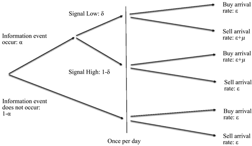

## Table of Contents

## What is informed trading?

Informed trading happens when someone trades stocks or other financial assets using secret or special information that other people don't know. This information can give them an advantage in making money from their trades. For example, if someone knows a company is about to announce good news, they might buy its stock before the news comes out, hoping the stock price will go up.

This kind of trading can be unfair because it gives an advantage to those with the secret information over regular investors. It's also often illegal and is known as insider trading. Laws are in place to stop this, but it still happens sometimes. The goal is to make sure everyone has a fair chance in the market.

## How does informed trading differ from uninformed trading?

Informed trading is when someone uses special information that not everyone knows to buy or sell stocks or other financial things. This information can help them make better guesses about what will happen to the price of what they're trading. For example, if someone knows a company will soon share good news, they might buy its stock before the news comes out, hoping to sell it later at a higher price. This kind of trading can be seen as unfair because it gives an advantage to those who have the secret information.

On the other hand, uninformed trading is when people trade without any special or secret information. They might make their decisions based on what they see in the news, what other people are doing, or just a guess. Uninformed traders don't have the advantage of knowing something others don't, so they're all on a more level playing field. This type of trading is what most people do when they invest in the stock market, and it's what helps keep the market fair for everyone.

## What are the key characteristics of an informed trader?

An informed trader has special information that others don't know. This information can be about a company's future plans, like a new product or a big deal, or it can be about the economy or market trends. Because they know things others don't, informed traders can make smarter choices about when to buy or sell stocks or other investments. This gives them an advantage over other people in the market.

Informed traders often try to keep their information a secret so they can use it to make money. They might trade quickly to take advantage of their knowledge before it becomes public. But, using secret information to trade can be illegal if it's considered insider trading. Laws are in place to make sure everyone has a fair chance in the market, so informed traders need to be careful about how they use their information.

## What types of information do informed traders use?

Informed traders use special information that most people don't know about. This can be about a company's plans, like if they are going to launch a new product or make a big deal with another company. It could also be about financial news, like if a company is going to report higher profits than expected. Knowing these things before others can help informed traders decide when to buy or sell stocks to make money.

Sometimes, this information comes from people inside the company, like executives or employees, who might share it with friends or family. Other times, it might come from people who study the market closely and notice small signs that suggest big changes are coming. Either way, using this secret information can give informed traders an edge over others in the market, but it can also be risky because it might be illegal if it's considered insider trading.

## How can informed trading impact market efficiency?

Informed trading can make the market more efficient because it helps prices reflect all the information available more quickly. When informed traders use their special knowledge to buy or sell, they push the prices of stocks closer to what they should be based on that information. For example, if an informed trader knows a company is about to announce good news and buys its stock, the price might go up even before the news is public. This means the market is reacting faster to new information, which is a good thing for efficiency.

However, informed trading can also hurt market efficiency if it's not fair. When only a few people know important information and use it to trade, it can make the market less fair for everyone else. This can lead to prices that don't really reflect what's happening in the company or the economy, because they're being moved by a small group of people with secret information. So, while informed trading can help the market work better in some ways, it can also make it worse if it's not done in a way that's fair to all investors.

## What are the legal and ethical considerations of informed trading?

Informed trading, especially when it involves insider information, can be illegal. Laws are in place to stop people from using secret information to make money in the stock market. This is called insider trading, and it's against the rules because it's not fair to other investors who don't know the secret information. If someone gets caught doing this, they can face big fines or even go to jail. The goal of these laws is to make sure everyone has a fair chance in the market.

There are also ethical issues with informed trading. Even if it's not always illegal, using special information that others don't have can be seen as wrong. It goes against the idea of fairness and honesty that many people believe should be part of the market. When some people have an advantage because they know secrets, it can make others feel cheated and can hurt trust in the whole system. So, while informed trading might help some people make money, it can also cause problems for the market and society as a whole.

## What is the relationship between informed trading and insider trading?

Informed trading happens when someone uses special information that others don't know to buy or sell stocks or other financial things. This information can give them an advantage in making money. Insider trading is a specific type of informed trading where the special information comes from someone inside the company, like an executive or employee. Insider trading is illegal because it's not fair to other investors who don't have that secret information.

The main difference between informed trading and insider trading is where the information comes from. Informed trading can use any kind of special information, but insider trading specifically uses information from inside the company. Both can give traders an edge over others, but insider trading is against the law because it's seen as cheating. Laws are in place to stop insider trading and make sure everyone has a fair chance in the market.

## How do regulatory bodies monitor and control informed trading?

Regulatory bodies like the Securities and Exchange Commission (SEC) in the United States work hard to watch for and stop informed trading, especially when it's illegal insider trading. They use different ways to keep an eye on the market. One way is by looking at trading data to find strange patterns that might show someone is using secret information. They also get tips from people who might know about illegal trading. If they find something that looks wrong, they can start an investigation to see if laws were broken.

When regulatory bodies find evidence of illegal informed trading, they can take action to stop it and punish those who did it. They might fine the people involved a lot of money or even send them to jail. The goal is to make sure the market stays fair for everyone. By watching closely and taking action when needed, these bodies try to keep the market honest and make sure no one gets an unfair advantage from using secret information.

## What are the common strategies used by informed traders?

Informed traders often use special information to decide when to buy or sell stocks. They might hear about a company's plans before anyone else, like a new product coming out or a big deal happening. With this secret information, they can buy stocks before the news is public, hoping the price will go up when everyone else finds out. They might also sell stocks if they know bad news is coming, expecting the price to drop. This strategy helps them make money by being ahead of the market.

Another strategy informed traders use is to trade quickly. Since their advantage comes from knowing something others don't, they want to act before that information becomes public. They might buy a lot of a stock all at once or sell it fast to take advantage of their knowledge. This quick trading can move the market prices closer to what they should be, based on the secret information. But, they have to be careful because using inside information can be illegal and lead to big trouble if they get caught.

## How can one identify informed trading in market data?

Identifying informed trading in market data can be tricky, but there are some signs people look for. One way is to watch for unusual patterns in trading, like when a lot of people suddenly start buying or selling a stock without any clear reason. If the stock's price moves a lot right before big news comes out, it might mean some traders knew about the news ahead of time. Another sign is if certain traders make a lot of money from their trades, especially if they do it often. This could suggest they have special information that helps them make better guesses about what will happen to the stock's price.

Regulatory bodies and researchers use different tools to spot these signs. They look at trading data to see if there are any strange patterns or if some traders are making too much money too often. They might also use computer programs to help find these patterns faster. If they see something that looks like informed trading, they can start an investigation to see if anything illegal is going on. This helps keep the market fair for everyone by stopping people from using secret information to make money.

## What role does technology play in facilitating informed trading?

Technology makes it easier for informed traders to use their special information quickly. With fast computers and the internet, traders can buy or sell stocks in seconds. This means they can act on their secret information before it becomes public, hoping to make money before the market reacts. Technology also helps traders look at a lot of data very fast. They can use computer programs to find patterns or signs that might show when to buy or sell. This can give them an edge over other people who don't have the same tools.

But, technology also helps catch informed trading. Regulatory bodies use computer programs to watch the market and find strange trading patterns. These programs can look at a lot of data quickly and spot when something might be wrong. If they see signs of informed trading, they can start an investigation to see if anyone is breaking the law. So, while technology can help informed traders, it also helps keep the market fair by making it easier to catch people who are using secret information in a way that's not allowed.

## What are the advanced statistical models used to analyze informed trading?

Advanced statistical models help researchers and regulators spot informed trading by looking at market data. One common model is the "probability of informed trading" (PIN) model. It looks at how often trades happen and how many of them seem to be based on secret information. The model tries to guess if a trade was made because someone knew something others didn't. Another model is the "volume-synchronized probability of informed trading" (VPIN). This model looks at trading volume to see if there are signs of informed trading, especially in fast-moving markets.

These models use math to find patterns in trading data that might show informed trading. They can help regulators decide if they need to look closer at certain trades or traders. But, these models are not perfect. They can sometimes make mistakes and think a trade was informed when it wasn't. Still, they are useful tools for keeping the market fair and making sure no one gets an unfair advantage from secret information.

## What are the types of algorithmic trading strategies?

Algorithmic trading strategies encompass a diverse array of techniques, each designed to achieve specific trading objectives through the use of advanced algorithms. The following are some of the most prominent types of algorithmic trading strategies:

1. **Trend Following**: Trend following strategies aim to capitalize on the momentum of the market by identifying and following existing market trends, whether upward or downward. These strategies typically utilize technical indicators such as moving averages, the Moving Average Convergence Divergence (MACD), or the Relative Strength Index (RSI) to detect trends. The core idea is to enter a trade in the direction of the prevailing trend and exit when the trend reverses.

2. **Arbitrage Opportunities**: Arbitrage strategies seek to exploit price discrepancies of the same asset across different markets or instruments. By identifying and capitalizing on these inefficiencies, traders can lock in risk-free profits. Common forms include spatial arbitrage, which involves buying and selling the same asset in different markets simultaneously, and statistical arbitrage, which involves trading long and short positions based on expected mean reversion patterns.

3. **Market Making**: Market making algorithms provide liquidity to the markets by continuously offering buy and sell quotes for a particular security. These algorithms profit from the bid-ask spread, the difference between the higher price a buyer is willing to pay and the lower price a seller is willing to accept. The rapid response nature of algorithmic market makers helps stabilize markets and reduce volatility.

4. **Mean Reversion**: Mean reversion strategies are based on the premise that prices and returns eventually move back towards the mean or average level. These strategies typically involve identifying overbought or oversold conditions using statistical measures such as Bollinger Bands or the Z-score. Trades are executed under the assumption that the current deviance from the average is temporary and will revert to the mean over time.

5. **Volume-Weighted Average Price (VWAP)**: The VWAP strategy is often used by institutional traders to minimize the market impact of large orders. It involves breaking large orders into smaller ones and executing them throughout the trading period at prices close to the VWAP. This ensures that the trader receives an average execution price that is line with the market's prevailing liquidity conditions. The VWAP is calculated as follows:
$$
   \text{VWAP} = \frac{\sum_{i=1}^{n}(P_i \times Q_i)}{\sum_{i=1}^{n}Q_i}

$$
   where $P_i$ is the price of the trade at time $i$ and $Q_i$ is the quantity of the trade at time $i$.

Each of these strategies leverages the speed and computational power of algorithmic systems, allowing traders to execute transactions efficiently and effectively across various market conditions. These strategies also require careful design and testing to ensure robustness against the dynamic nature of financial markets.

## References & Further Reading

[1]: ["Algorithmic Trading and DMA: An Introduction to Direct Access Trading Strategies"](https://www.amazon.com/Algorithmic-Trading-DMA-introduction-strategies/dp/0956399207) by Barry Johnson

[2]: López de Prado, M. (2018). ["Advances in Financial Machine Learning"](https://books.google.com/books/about/Advances_in_Financial_Machine_Learning.html?id=oU9KDwAAQBAJ) Wiley.

[3]: Chan, E. P. (2009). ["Quantitative Trading: How to Build Your Own Algorithmic Trading Business"](https://github.com/ftvision/quant_trading_echan_book) Wiley.

[4]: Jansen, S. (2018). ["Machine Learning for Algorithmic Trading"](https://github.com/stefan-jansen/machine-learning-for-trading) Packt Publishing.

[5]: Aronson, D. R. (2007). ["Evidence-Based Technical Analysis: Applying the Scientific Method and Statistical Inference to Trading Signals"](https://www.amazon.com/Evidence-Based-Technical-Analysis-Scientific-Statistical/dp/0470008741) Wiley.

[6]: Aldridge, I. (2013). ["High-Frequency Trading: A Practical Guide to Algorithmic Strategies and Trading Systems"](https://www.wiley.com/en-us/High+Frequency+Trading%3A+A+Practical+Guide+to+Algorithmic+Strategies+and+Trading+Systems-p-9780470579770) Wiley.