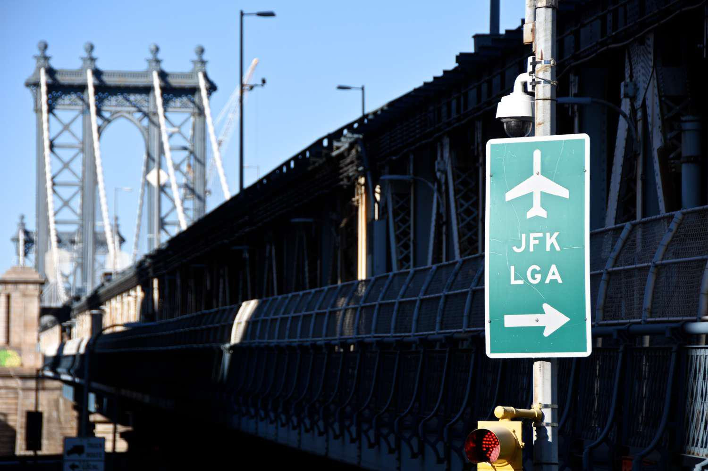

## Table of Contents

## What is the Infrastructure Investment and Jobs Act (IIJA)?

The Infrastructure Investment and Jobs Act (IIJA) is a big law that the U.S. government passed in 2021. It's all about spending money to fix and improve things like roads, bridges, and public transportation. The law gives a lot of money, about $1.2 trillion, to help make these improvements. This money will be used over several years to make sure that the country's infrastructure is safe and works well.

The IIJA isn't just about roads and bridges. It also includes money for other important things like clean water, high-speed internet, and electric vehicle charging stations. The idea is to help the country grow and make life better for people. By fixing and building new infrastructure, the law hopes to create jobs and make communities stronger.

## When was the Infrastructure Investment and Jobs Act signed into law?

The Infrastructure Investment and Jobs Act was signed into law on November 15, 2021. This happened after a lot of talking and planning by the people in the government. They wanted to make sure the country's roads, bridges, and other important things were taken care of.

The signing of the law was a big deal because it meant that money could start being used to fix and build new things. It was all about making the country better and helping people have safer and easier lives.

## What are the main goals of the IIJA?

The main goals of the Infrastructure Investment and Jobs Act (IIJA) are to fix and improve the country's roads, bridges, and other important things that people use every day. The law wants to make sure that these things are safe and work well. It gives a lot of money, about $1.2 trillion, to help with this. By fixing roads and bridges, the IIJA hopes to make traveling easier and safer for everyone.

Another big goal of the IIJA is to create jobs and help the economy grow. When the government spends money on fixing and building new things, it needs people to do the work. This means more jobs for people who build roads, bridges, and other things. The law also wants to make sure that everyone can have access to things like clean water, high-speed internet, and electric vehicle charging stations. By doing this, the IIJA hopes to make life better for everyone and help communities become stronger.

## How much funding does the IIJA allocate, and where does the funding come from?

The Infrastructure Investment and Jobs Act (IIJA) gives about $1.2 trillion to fix and improve things like roads, bridges, and public transportation. This money will be used over several years to make sure the country's infrastructure is safe and works well. The IIJA also includes money for other important things like clean water, high-speed internet, and electric vehicle charging stations. 

The funding for the IIJA comes from different places. A big part of it, about $550 billion, is new money that the government is spending on top of what it usually spends on infrastructure. The rest of the money, about $650 billion, comes from what the government already planned to spend on infrastructure. This means that some of the money was already set aside, but the IIJA adds a lot more to help make bigger improvements.

## What types of infrastructure projects does the IIJA aim to support?

The Infrastructure Investment and Jobs Act (IIJA) aims to support many different types of infrastructure projects. It wants to fix and build new roads and bridges to make traveling easier and safer for everyone. The law also gives money to improve public transportation like buses and trains, so people can get around their cities better. Another big focus is on making sure everyone has clean water to drink and use, so the IIJA supports projects that fix and improve water systems.

The IIJA also wants to help with other important things like making sure everyone can get high-speed internet. This is important for people to work, learn, and stay connected. The law also gives money to build more electric vehicle charging stations, so more people can use electric cars and help the environment. By supporting all these different projects, the IIJA hopes to make life better for people and help communities grow stronger.

## How does the IIJA address climate change and environmental concerns?

The Infrastructure Investment and Jobs Act (IIJA) helps with climate change and the environment by giving money to projects that make the air and water cleaner. It supports building more electric vehicle charging stations, which means more people can use electric cars instead of cars that use gas. Electric cars don't make the air dirty, so this helps to fight climate change. The IIJA also gives money to fix and improve public transportation like buses and trains. When more people use public transportation, there are fewer cars on the road, which means less pollution.

The IIJA also helps the environment by making sure everyone has clean water to drink and use. It gives money to fix and improve water systems, so they don't leak or get dirty. This is important because clean water helps people stay healthy and also helps the environment. By supporting these projects, the IIJA wants to make the country a better place to live and help fight climate change at the same time.

## What are the key differences between the IIJA and previous infrastructure bills?

The Infrastructure Investment and Jobs Act (IIJA) is different from previous infrastructure bills because it gives a lot more money, about $1.2 trillion, to fix and improve things like roads, bridges, and public transportation. Older bills didn't give as much money, so they couldn't do as much. The IIJA also focuses on more than just roads and bridges. It includes money for clean water, high-speed internet, and electric vehicle charging stations, which older bills didn't focus on as much.

Another big difference is that the IIJA tries to help with climate change and the environment. It gives money to projects that make the air and water cleaner, like building more electric vehicle charging stations and improving public transportation. Older bills didn't focus on the environment as much. They were more about fixing what was already there, not about making the country better for the future. By doing all these things, the IIJA wants to make life better for people and help communities grow stronger.

## How is the funding from the IIJA distributed across different states and regions?

The money from the Infrastructure Investment and Jobs Act (IIJA) is shared among all the states and regions in the U.S. The way it's shared depends on things like how many people live in each place, how bad their roads and bridges are, and what they need most. Some states might get more money because they have more people or because their roads and bridges need a lot of fixing. The government looks at all these things to decide how to give out the money fairly.

The IIJA also makes sure that the money goes to different kinds of projects. Some of it is used to fix roads and bridges, some is used to improve public transportation like buses and trains, and some is used to make sure everyone has clean water and high-speed internet. This way, every state and region can use the money for what they need most. By sharing the money like this, the IIJA hopes to help every part of the country get better and stronger.

## What mechanisms are in place to ensure transparency and accountability in the use of IIJA funds?

The Infrastructure Investment and Jobs Act (IIJA) has ways to make sure the money is used correctly and openly. The government keeps track of where the money goes and how it's spent. They do this by making reports that show how much money each state and project gets. These reports are shared with the public so everyone can see how the money is being used. This helps to make sure that the money is spent on the things it's supposed to be spent on, like fixing roads and bridges, improving public transportation, and making sure everyone has clean water and high-speed internet.

There are also rules that say how the money can be used. These rules help to make sure that the money is spent in a fair way and that it helps the people who need it most. If someone thinks the money is not being used correctly, they can tell the government. The government can then check to see if the money is being used the right way. By having these rules and ways to check, the IIJA makes sure that the money is used to help make the country better and stronger.

## How does the IIJA impact job creation and economic growth?

The Infrastructure Investment and Jobs Act (IIJA) helps create jobs and grow the economy by spending a lot of money on fixing and building new things. When the government uses money to fix roads, bridges, and public transportation, it needs people to do the work. This means more jobs for people who build and fix things. The IIJA also gives money to other projects like clean water systems and high-speed internet, which also need workers. By creating these jobs, the IIJA helps people earn money and spend it in their communities, which helps the economy grow.

The IIJA also helps the economy by making it easier for businesses to work and grow. When roads and bridges are fixed, it's easier for businesses to move their goods and services around. Better public transportation means more people can get to work easily. High-speed internet helps businesses connect with customers and other businesses. Clean water systems make sure that factories and other businesses can work safely. By improving all these things, the IIJA makes it easier for businesses to do well, which helps the economy grow even more.

## What challenges might arise in the implementation of the IIJA?

One big challenge in implementing the Infrastructure Investment and Jobs Act (IIJA) is making sure the money is used correctly and quickly. With so much money, about $1.2 trillion, it can be hard to keep track of where it all goes. The government has to make sure the money goes to the right projects and that it's spent in a fair way. This can take a lot of time and work. Also, some projects might take longer to finish because of things like bad weather or problems finding the right workers and materials. This means that people might have to wait longer to see the improvements they need.

Another challenge is making sure everyone agrees on how to use the money. Different states and regions might want to use the money for different things. Some might want to fix roads, while others might need more help with clean water or high-speed internet. It can be hard to make everyone happy and to make sure the money is shared fairly. Also, some people might not like the IIJA and might try to stop or slow down the projects. This can make it harder to get things done and can cause delays. By working together and being patient, the government hopes to overcome these challenges and make the country better for everyone.

## What are the long-term expected outcomes of the IIJA on U.S. infrastructure?

The Infrastructure Investment and Jobs Act (IIJA) is expected to make the U.S. infrastructure much better in the long run. By spending a lot of money, about $1.2 trillion, on fixing and building new roads, bridges, and public transportation, the IIJA will make traveling safer and easier for everyone. This means fewer potholes, stronger bridges, and smoother rides on buses and trains. The law also helps with other important things like making sure everyone has clean water to drink and use, and that high-speed internet is available everywhere. By doing all these things, the IIJA will help make the country's infrastructure strong and reliable for many years to come.

Another long-term outcome of the IIJA is that it will help the economy grow and create more jobs. When the government spends money on infrastructure projects, it needs people to do the work, which means more jobs for builders, engineers, and other workers. These jobs help people earn money and spend it in their communities, which helps the economy grow. The IIJA also makes it easier for businesses to work and grow because better roads and bridges make it easier to move goods and services around. By improving the country's infrastructure, the IIJA will help the U.S. economy stay strong and keep growing in the future.

## References & Further Reading

[1]: Bergstra, J., Bardenet, R., Bengio, Y., & Kégl, B. (2011). ["Algorithms for Hyper-Parameter Optimization."](https://dl.acm.org/doi/10.5555/2986459.2986743) Advances in Neural Information Processing Systems 24.

[2]: ["Advances in Financial Machine Learning"](https://www.amazon.com/Advances-Financial-Machine-Learning-Marcos/dp/1119482089) by Marcos Lopez de Prado

[3]: ["Evidence-Based Technical Analysis: Applying the Scientific Method and Statistical Inference to Trading Signals"](https://www.amazon.com/Evidence-Based-Technical-Analysis-Scientific-Statistical/dp/0470008741) by David Aronson

[4]: ["Machine Learning for Algorithmic Trading"](https://github.com/stefan-jansen/machine-learning-for-trading) by Stefan Jansen

[5]: ["Quantitative Trading: How to Build Your Own Algorithmic Trading Business"](https://www.amazon.com/Quantitative-Trading-Build-Algorithmic-Business/dp/1119800064) by Ernest P. Chan