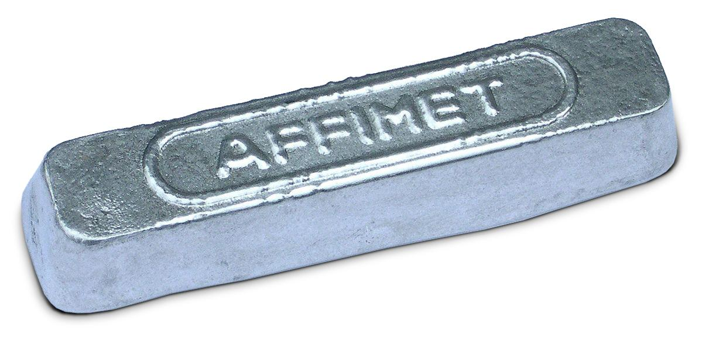

In commerce and production, metal ingots are crucial components within the metal casting industries. These blocks of metal are not just utilitarian; they carry significant historical and economic value. The creation and use of ingots reflect the advancements in metallurgy and the development of economic systems over time.

Algorithmic trading, or algo trading, represents a transformative change in financial markets, significantly affecting how metal commodities are traded. This article examines how various types of metal ingots are produced and utilized, followed by their integration into broader economic frameworks, including their role in the realm of cutting-edge trading methodologies like algorithmic trading.



We begin by defining ingots and their historical importance. Next, we dissect their types and applications before connecting these insights to their economic implications. The article culminates with discussions on how algos are reshaping commodity trading, particularly with metals. Through this exploration, we aim to offer a complete perspective on the significance of ingots in industrial and trading contexts.

Let’s explore how metallurgy and advanced trading strategies converge to shape modern industries and markets.

## Table of Contents

## What is an Ingot?

An ingot is a solid mass of metal that is shaped into a form convenient for subsequent processing or manufacturing operations. Characteristically, ingots are often rectangular, which facilitates easier handling, storage, and transportation. While gold ingots are perhaps the most recognized due to their iconic status and storage in secure vaults globally, ingots come in a wide variety and serve diverse purposes across different industries.

The process of producing these metal blocks is deeply rooted in history, tracing back thousands of years as humans sought efficient methods to transport and utilize valuable metals. This method involves melting metal until it reaches a liquid state and then pouring it into a shaped mold. As the metal cools and solidifies within the mold, it takes on the mold's specific dimensions and geometry. This critical step not only defines the ingot's shape but also sets its structural properties and potential uses.

The utility of the ingot lies in its composition and form, which make it suitable for various subsequent industrial applications. The structural integrity achieved through the solidification process is crucial in determining the ingot's appropriateness for further refinement, shaping, or alloying, often leading to its use in manufacturing a broad spectrum of metal products. These can include components for construction, electronics, automotive, and aerospace industries, among others. Understanding the specific properties acquired during the cooling and solidification process allows industries to modify and optimize these ingots for tailored applications.

## Types of Metal Ingots

Ingots can be categorized by the type of metal used, each offering unique properties and applications across various industries. Aluminum ingots are especially valued in the aerospace and automotive sectors. Their combination of lightweight and durability contributes significantly to fuel efficiency and vehicle performance, supporting structures that need to withstand substantial stress while minimizing weight.

Copper ingots are integral in electrical applications due to their high electrical and thermal conductivity. These properties make copper a preferred choice for wiring, motors, and other electrical components, ensuring efficient energy transmission and reducing losses across power systems.

Steel ingots are essential in construction, known for their strength, durability, and flexibility. They form the basis of structural components that require high load-bearing capacity and resistance to environmental conditions. Steel's ability to be alloyed with other elements further enhances its utility, making it versatile for a multitude of construction needs, from skyscrapers to bridges.

Gold and silver ingots hold a different significance, primarily within the financial sector. Their value as precious metals makes them a common investment vehicle. Gold and silver ingots serve as secure and tangible assets, often used by investors seeking stability against currency fluctuations and economic uncertainty. Their global recognition and intrinsic value ensure they remain a steadfast reserve asset in both national and international economies.

These diverse types of ingots highlight the versatility of metals and their critical roles in various industrial applications, from enhancing technological progress to underpinning economic security.

## Ingot Casting Process

The casting process for ingots is a pivotal stage in metallurgy, transforming metals into a solid form suitable for subsequent processing and application. Initially, the raw metal is heated until it reaches a molten state, ensuring uniform temperature distribution and fluidity. Once molten, the metal is carefully poured into precast molds that determine the final shape of the ingot. As the metal cools, it solidifies within the mold, assuming its intended geometry and structural integrity.

Several casting techniques are employed based on the type of metal and desired production outcomes. Sand casting is a traditional method celebrated for its straightforwardness and cost-effectiveness. It involves using sand molds, which are easily formed and reusable. However, sand casting may not offer the precision needed for all industrial applications.

Continuous casting is another prevalent technique, renowned for its high production efficiency and superior quality outputs. This process involves the uninterrupted pouring of molten metal into a cooled mold, allowing the metal to solidify as it exits. The continuous nature of this method reduces waste and facilitates large-scale production, making it a preferred choice for metals like steel and aluminum.

For high-purity metals, ingot casting remains the method of choice. This process often incorporates advanced techniques like vacuum casting, designed to minimize contamination and enhance quality by reducing gaseous impurities and solid inclusions that could compromise the ingot's properties. Vacuum casting is particularly critical in producing ingots for aerospace and electronics industries, where material purity is paramount.

Post-casting processes are essential to improve the mechanical properties and refine the microstructure of the ingot. Hot rolling is frequently applied, where ingots are heated and passed through rollers to achieve the desired thickness and enhance grain structure, improving strength and ductility. Annealing, a heat treatment process, further contributes to this by relieving internal stresses and homogenizing the metal, thereby augmenting its durability and workability.

These meticulous processes of casting and subsequent treatments underscore the significance of precision and technique in the production of ingots, ensuring they meet the high standards required for their diverse industrial applications.

## Advantages and Applications of Ingots

Ingots, due to their versatility and structural integrity, are integral across various industries. Their compact and standardized form makes them an efficient choice for further processing, enabling manufacturers to transform them into essential components for diverse applications. 

In the construction industry, ingots serve as the primary material for producing structural elements such as beams and girders. Their ability to be cast and shaped into various forms ensures that they meet specific architectural requirements. For the electronics sector, ingots, particularly those made from metals like copper and aluminum, are crucial due to their excellent conductive properties. These properties are vital for creating electronic components and wiring systems.

Metals such as titanium have become indispensable in advanced technological applications requiring resistance to extreme pressures and temperatures. Titanium ingots, for instance, are used to manufacture components in aerospace engineering where high-performance materials are necessary. The unique attributes of these ingots facilitate innovation, ensuring materials perform under challenging conditions.

Ingots also hold significant value in the financial world. Their standardized weights and forms make them ideal for investments, particularly in precious metals like gold and silver. These ingots are tangible assets often held in reserve by financial institutions and investors seeking stability against market [volatility](/wiki/volatility-trading-strategies).

Beyond manufacturing and finance, ingots play an essential role in promoting sustainable practices. They are pivotal in recycling processes where scrap metals are melted and recast into ingots, facilitating eco-friendly reuse. This cycle not only conserves materials but also reduces energy consumption compared to producing new metals from raw ores.

In summary, ingots are central to economic activities, providing essential materials across sectors, maintaining their appeal as investment vehicles, and supporting environmental sustainability through recycling initiatives. Such versatile applications underscore their importance in today's industrial landscape.

## Algorithmic Trading in Metal Markets

Algorithmic trading, or algo trading, has transformed the metal markets by leveraging the power of advanced algorithms to execute trades with remarkable speed and precision. These complex algorithms process vast amounts of data to identify profitable trading opportunities and execute them in fractions of a second, far outpacing human capabilities. 

One of the primary benefits of algo trading in metal markets is the enhanced [liquidity](/wiki/liquidity-risk-premium) it provides. By facilitating real-time buying and selling of metal commodities, it enables traders to quickly respond to market movements and secure favorable prices. This is particularly advantageous in markets for metals like gold and silver, where prices can be highly volatile.

Investment strategies involving metals increasingly depend on algorithmic tools to minimize risks and optimize returns. For instance, strategies may include statistical [arbitrage](/wiki/arbitrage), which identifies and capitalizes on price discrepancies between different markets or instruments. By employing predictive models, algo trading systems can forecast market trends and make informed decisions, potentially increasing returns while reducing exposure to volatile price movements.

In addition to commodity trading, algo trading spans [forex](/wiki/forex-system) markets and the stocks of mining companies. It employs [machine learning](/wiki/machine-learning) techniques to analyze historical data and recognize patterns, thereby forecasting future price movements. Python, with its wealth of libraries like NumPy and pandas, is often used in building these models. Here’s a simple example of how Python can be used to evaluate moving averages, a common technique in trading strategies:

```python
import pandas as pd

# Sample dataframe of metal prices
data = {'Date': ['2023-01-01', '2023-01-02', '2023-01-03'],
        'Price': [1900, 1920, 1910]}
df = pd.DataFrame(data)
df['Date'] = pd.to_datetime(df['Date'])
df.set_index('Date', inplace=True)

# Calculate moving averages
df['Short_MA'] = df['Price'].rolling(window=2).mean()
df['Long_MA'] = df['Price'].rolling(window=3).mean()

print(df)

```

Moreover, the integration of [artificial intelligence](/wiki/ai-artificial-intelligence) in algo trading enables the customization of trading strategies to adapt to dynamic market conditions. This adaptability allows for precise management of trade volumes and execution times, maximizing profitability in the metal markets.

In essence, [algorithmic trading](/wiki/algorithmic-trading) offers substantial benefits in terms of speed, efficiency, and decision-making capabilities within the often volatile and complex markets of metals and commodities. This trading innovation continues to unlock significant value, presenting opportunities for growth in both traditional and emerging market structures.

## Conclusion

Ingots, through their versatile formation and diverse applications, illustrate the intricate links between materials science and the global economic landscape. These metal blocks serve as the bedrock for crafting everyday objects, ranging from industrial machinery to consumer electronics. Their standardized shapes and weights, combined with inherent metallic properties, make them quintessential in manufacturing processes across various sectors.

Moreover, ingots hold a strategic place in global financial markets, particularly through commodities trading. Metals like gold and silver, often cast into ingots, are not only tangible assets for investors but also serve as stability anchors in volatile market conditions. The fusion of traditional metallurgy with the innovative realm of algorithmic trading presents both opportunities and challenges. Algorithmic trading, by employing high-speed and data-driven strategies, is transforming how metal commodities are traded, optimizing returns while reducing risks associated with market unpredictability.

In this era of digital transformation, understanding the synergy between physical assets like metal ingots and technological advancements in trading is crucial. From mining and metallurgy to stock exchanges and digital trading platforms, every part of the supply chain is being influenced by modern technology, emphasizing the need for adaptability and innovation.

The narrative of ingots extends beyond their physical properties and industrial uses. It is a testament to human ingenuity, reflecting how societies have harnessed these versatile forms across centuries of industrial progress. Ingots, embodying the continuous evolution of industrial materials and modern market strategies, symbolize resilience and adaptability in the ever-changing landscape of global commerce and finance.

## References & Further Reading

[1]: ASM International. (1998). "Casting Design and Performance." ASM International. [Link](https://www.asminternational.org/wp-content/uploads/files/05263G/05263G-toc.pdf)

[2]: Asprey, W. (1976). "The Discovery of the Art of the Bronze Worker: Renaissance Ingots and the Transformation of Metallurgical Technology." MIT.

[3]: Geman, H. (2005). "Commodities and Commodity Derivatives: Modeling and Pricing for Agriculturals, Metals and Energy." Wiley.

[4]: Vasicek, O. (1977). "An equilibrium characterization of the term structure." Journal of Financial Economics, 5(2).

[5]: O'Higgins, B. (2009). "Algorithmic Trading: Winning Strategies and Their Rationale." Wiley.

[6]: Hull, J. C. (2015). "Options, Futures, and Other Derivatives." Pearson Education.

[7]: Brealey, R. A., Myers, S. C., & Allen, F. (2017). "Principles of Corporate Finance." McGraw-Hill Education.

[8]: Lopez de Prado, M. (2018). "Advances in Financial Machine Learning." Wiley.

[9]: Johnson, H. R., & Jackson, C. T. (2012). "High-Frequency Trading: The Complete Guide to Algorithmic and High-Speed Trading." Finance and Investment.