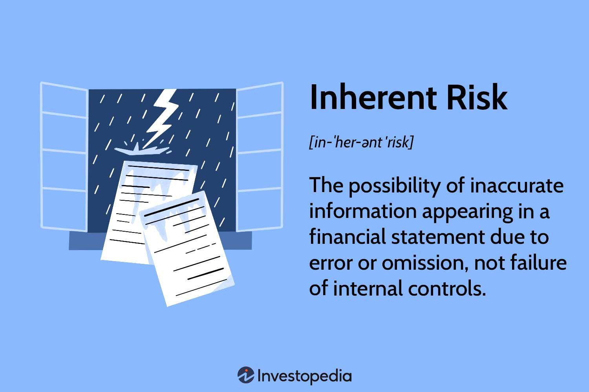

Algorithmic trading, known as algo trading, has surged in popularity in financial markets, primarily due to its ability to execute trades swiftly and in large volumes. This advancement allows traders to leverage vast datasets and complex algorithms to make precise trading decisions within milliseconds. However, the same features that make algo trading advantageous also introduce significant risks. Rapid execution and high volumes can amplify errors, making effective risk management essential to prevent substantial losses.

Traders and investors must be vigilant in identifying and managing the risks inherent in algorithmic trading. This includes understanding technical challenges like system failures or programming errors, as well as market risks arising from volatility or unforeseen geopolitical events. Managing these risks systematically not only safeguards investments but also optimizes trading performance.

This article explores the essential aspects of risk management specific to algo trading, emphasizing the understanding and mitigation of inherent risks through illustrative examples. A thorough comprehension of these risks is crucial for both novice and experienced traders to protect their financial assets and achieve sustainable trading success.

## Table of Contents

## Understanding Risk Management in Algo Trading

Risk management in trading is the systematic approach to identifying, assessing, and mitigating potential risks associated with trading activities. In the context of algorithmic trading, it involves strategies and practices designed specifically to protect capital and minimize potential losses. This is crucial due to the high-speed and high-volume nature of algo trading, which increases exposure to various risks.

Effective risk management is about maintaining a balance between risk exposure and potential returns. This balance allows traders to make informed decisions despite market uncertainties. In algo trading, this involves using statistical and computational methods to analyze market data and modify trading strategies. By utilizing risk assessment tools, traders can set parameters that automatically adjust to market conditions, potentially reducing the chance of significant financial loss.

One technique involves the use of stop-loss orders, which automatically sell an asset once it reaches a certain price. This limits losses by preventing further decline in asset value. Another tool is diversification, which spreads investments across various asset classes to reduce exposure to any single market movement. These techniques can be supplemented by using quantifiable risk measures such as Value at Risk (VaR), which estimates the potential loss in value of a portfolio over a defined period for a given confidence interval.

Moreover, the algorithms used in trading strategies should be thoroughly tested using historical data, a process known as [backtesting](/wiki/backtesting). This helps to identify potential pitfalls and refine the algorithms to better handle various market scenarios. Continuous monitoring and performance evaluation are integral, allowing for the swift rectification of any identified issues.

In conclusion, effective risk management in [algorithmic trading](/wiki/algorithmic-trading) is essential for optimizing returns and safeguarding investments. By leveraging technology and adopting systematic strategies, traders can better handle the complexities and uncertainties inherent in financial markets.

References:
- P. De Prado, "Advances in Financial Machine Learning", Wiley.
- T. Ho, "Quantitative Finance for Dummies", Wiley.
- D. Edwards, "Algorithmic Trading: Winning Strategies and Their Rationale", Wiley.

## Inherent Risks in Algo Trading

Inherent risks in algorithmic trading stem from the complex nature of automated trading processes and are distinct from risks due to control failures. These include technical errors, market [volatility](/wiki/volatility-trading-strategies), operational missteps, and behavioral biases, each presenting unique challenges that can affect trading outcomes.

Technical errors in algo trading are often due to system failures, programming bugs, or data inaccuracies. An algorithm might be set to execute trades based on incorrect assumptions if there is a flaw in its coding or if it processes erroneous data. For instance, a faulty algorithm could be triggered to buy or sell assets excessively, potentially leading to significant financial losses. Developers need to perform rigorous testing and quality assurance to minimize such technical risks, ensuring that algorithms operate as intended under various market conditions.

Market volatility is another inherent risk. Algorithmic trading strategies are frequently designed with specific market conditions in mind, and unexpected changes in these conditions, caused by economic shifts or geopolitical events, can render strategies less effective. For example, during periods of high volatility, such as a financial crisis, price movements can be unpredictable, leading to misalignment between the algorithm's actions and current market realities. Implementing adaptive algorithms that can quickly adjust to new market patterns is crucial for mitigating these risks.

Operational risks are associated with failures in regulatory compliance, cybersecurity, and [liquidity](/wiki/liquidity-risk-premium) management. Compliance issues arise when trading algorithms do not adhere to market rules, potentially leading to legal penalties. Cybersecurity threats pose risks to the integrity and confidentiality of trading operations. A breach could lead to manipulation of trading algorithms or theft of sensitive data. Moreover, insufficient liquidity can cause slippage, where the execution price differs from the intended price, thereby affecting the profitability of trades.

Behavioral biases, although less intuitive in automated trading, can still influence trading portfolios if algorithms are driven by historical data that reflect irrational market behaviors. Such biases can be particularly problematic when algorithms are overly reliant on past performance trends without accounting for changes in market dynamics. To mitigate these biases, it's essential to incorporate comprehensive market analysis and robust statistical models in the algorithm design process.

Understanding inherent risks in algorithmic trading allows traders to anticipate and mitigate these challenges effectively. By acknowledging the complexities involved, traders can develop strategies that are preemptive rather than reactive, safeguarding their positions against the inherent unpredictability of financial markets.

## Common Examples of Inherent Risks in Algo Trading

Algorithmic trading, while offering remarkable efficiency and speed in executing trades, presents various inherent risks that need careful consideration. These risks can broadly be categorized into technical, market, operational, and behavioral risks, each posing distinct challenges for traders.

**Technical Risks**

Technical risks primarily stem from system failures, programming errors, and data inaccuracies. These issues can lead to incorrect execution of trades, resulting in financial losses. For instance, flaws in the trading algorithm code can cause unintended trading behaviors, including errant trade executions at undesirable prices. Moreover, inaccuracies in input data, caused by delayed market feeds or incomplete data sets, can lead to incorrect decision-making within the algorithm. Regular updates and thorough testing of algorithms, along with reliable data sources, are paramount to mitigating such risks.

**Market Risks**

Market risks are associated with volatility and unpredictability inherent to financial markets. Algorithmic strategies may falter when unforeseen economic or geopolitical events induce significant market swings. Algorithms trained on historical data might struggle to adapt swiftly to the dynamic shifts during, for example, a political upheaval or unexpected economic announcements. Such events can lead to rapid market movements, placing even well-designed trading strategies under stress. To address this, traders can implement risk management tools like stop-loss orders, which automatically sell positions at predetermined thresholds to limit potential losses.

**Operational Risks**

Operational risks encompass issues related to regulatory compliance, cybersecurity threats, and liquidity challenges. Regulatory environments are constantly evolving, and non-compliance can result in significant penalties and reputational damage. Moreover, algorithmic trading platforms are attractive targets for cyberattacks, which can compromise trading integrity or lead to unauthorized trades. Liquidity challenges, such as the inability to execute trades promptly due to insufficient market participants, can result in financial losses. Traders must enforce stringent operational protocols to ensure compliance, maintain strong cybersecurity measures, and have strategies to manage liquidity deficits.

**Behavioral Risks**

Behavioral risks arise from human emotional biases and the herd mentality, which might influence algorithmic trading decisions. Despite being automated, trading algorithms are ultimately designed by humans and infused with subjective insights and assumptions. Emotional biases, such as overconfidence or excessive risk aversion, can inadvertently shape trading rules, leading to suboptimal performance. Herd behavior can trigger simultaneous actions by multiple algorithms following similar strategies, amplifying market movements and volatility. Incorporating backtesting to assess algorithm robustness during varied market conditions can help mitigate behavioral biases, ensuring the algorithm's decisions remain objective and data-driven.

By understanding and acknowledging these inherent risks, traders can develop strategies and safeguards to reduce their adverse effects, maintaining the integrity and effectiveness of their algo trading operations.

## Strategies for Managing Inherent Risks

Implementing robust risk management techniques is essential to mitigate inherent risks in algorithmic trading. These strategies encompass multiple facets, each targeting specific risk categories to ensure a comprehensive risk management approach.

### Technical Risk Mitigation
Technical risks in algo trading primarily stem from system failures and programming errors. To prevent these issues, it is crucial to conduct regular algorithm testing and system maintenance. Algorithms should be tested in a simulated environment that mirrors real-market conditions to identify potential execution errors before they occur in live trading. Additionally, maintaining redundancy in trading systems can safeguard against technical failures. For example, running parallel systems or backup servers ensures that a failure in one does not halt trading activities.

### Managing Market Risks
Market risks are intrinsic to financial trading, given that markets are often influenced by unpredictable events. One effective strategy to manage market risk is the use of stop-loss orders, which automatically sell an asset when its price falls to a predetermined level, thereby limiting potential losses. Diversifying portfolios across different asset classes can also reduce risk exposure, as it minimizes the impact of adverse price movements in any single asset or market sector. This diversification can be quantitatively assessed using metrics such as the Sharpe ratio, which evaluates the risk-adjusted return of a portfolio.

### Operational Risk Management
Operational risks involve factors like regulatory compliance, cybersecurity threats, and liquidity issues. Ensuring thorough regulatory compliance requires staying informed about relevant trading laws and regulations and incorporating them into the trading operations. Robust cybersecurity practices are essential to protect against data breaches and unauthorized access. This includes using encryption, multi-[factor](/wiki/factor-investing) authentication, and regular security audits. Managing liquidity risk is also crucial, as insufficient liquidity can impede the ability to [exit](/wiki/exit-strategy) positions without significant price slippage. Strategies such as maintaining a buffer of liquid assets and trading in high-[volume](/wiki/volume-trading-strategy) markets can help alleviate liquidity concerns.

### Controlling Behavioral Risks
Behavioral risks arise from emotional biases and irrational decision-making, which can be detrimental to algorithmic trading outcomes. Fostering emotional discipline is key to controlling these risks. Traders should adhere strictly to well-defined trading strategies and avoid making impulsive decisions based on market sentiment. Developing a comprehensive trading plan that includes entry and exit criteria, along with risk management rules, can help maintain objectivity. Additionally, employing algorithmic trading strategies that limit human intervention can reduce the impact of emotional biases on trading decisions.

By integrating these strategies into their trading operations, traders can effectively mitigate the inherent risks in algorithmic trading, leading to more stable and predictable trading outcomes.

## Best Practices for Risk Management in Algo Trading

Setting clear investment goals and establishing a risk tolerance framework are foundational practices for effective risk management in algorithmic trading. These steps guide trading decisions by defining what level of risk is acceptable and aligning trading strategies with broader investment objectives. Clearly stated goals help traders remain focused and prevent knee-jerk reactions to market fluctuations, ensuring decisions are aligned with long-term strategies.

Diversifying investments is another vital practice. By spreading investments across different asset classes, traders can reduce their exposure to individual market movements. This practice mitigates the impact of adverse events affecting particular assets or markets, thereby safeguarding the overall portfolio. Diversification works on the principle that different asset classes often react differently to the same economic event, providing a buffer against market volatility.

Regularly monitoring and evaluating trading performance is crucial for identifying and rectifying potential issues swiftly. Continuous assessment allows traders to adjust their strategies in response to changing market conditions. This proactive approach helps in maintaining the efficiency and effectiveness of trading algorithms and prevents small issues from escalating into significant problems.

Utilizing hedging strategies and quantitative risk techniques like [value at risk](/wiki/var-value-at-risk) (VaR) can enhance risk management efforts. VaR is a statistical technique used to measure the potential loss in value of a portfolio over a defined period for a given confidence interval. It is a widely used tool for quantifying and managing market risk. The formula for VaR can be expressed as:

$$
VaR = \text{Portfolio Value} \times \sigma \times Z
$$

where:
- $\sigma$ represents the standard deviation of the portfolio’s returns,
- $Z$ is the Z-score corresponding to the desired confidence level.

Implementing hedging strategies, such as options and futures contracts, allows traders to offset potential losses by taking an opposing position in related markets. This strategy provides a safety net during periods of high volatility or unfavorable market movements.

Incorporating these best practices into algo trading strategies empowers traders to manage risks more effectively, optimize performance, and pursue consistent profitability amidst the uncertainties of financial markets.

## The Importance of a Strong Algo Trading Platform

Choosing a robust algorithmic trading platform equipped with advanced risk management features is essential for minimizing potential risks associated with trading activities. A strong trading platform provides traders with the necessary tools to manage risks effectively and optimize trading performance.

One of the critical features a robust trading platform should offer is detailed performance reporting and analysis. Such reports enable traders to scrutinize their strategies, identify discrepancies, and make informed decisions to adjust their trading approaches as necessary. For example, performance reports can highlight issues like discrepancies between expected and actual returns or indicate unexpected volatility impacts on a particular strategy. By evaluating these reports, traders can refine their algorithms to improve performance and adaptability.

Moreover, advanced trading platforms often include tools that allow for proactive risk management. These tools can automate several aspects of risk management, such as setting stop-loss orders, diversifying portfolios, or hedging against market volatility. By automating these tasks, traders can ensure that their risk management strategies are consistently applied, reducing the likelihood of human error and emotional biases affecting trading decisions.

The platform's ability to integrate with various data sources is also a vital aspect of risk management. Access to real-time data streams and historical data repositories enables traders to back-test trading strategies under different market conditions, further safeguarding against unforeseen risks. This capability allows traders to anticipate potential market shifts and adjust their strategies accordingly.

Additionally, a strong trading platform provides robust cybersecurity measures to protect sensitive data and trading algorithms. The security of a platform ensures that proprietary trading strategies are not compromised or exposed to unauthorized access, which could lead to financial losses or strategic disadvantages.

In conclusion, a strong algorithmic trading platform plays a pivotal role in managing inherent risks associated with algorithmic trading. By offering detailed performance reports, advanced risk management tools, data integration capabilities, and robust cybersecurity measures, such platforms enhance overall trading efficiency and support the long-term success of algorithmic trading endeavors.

## Conclusion

Risk management is a fundamental aspect of effective algorithmic trading. By comprehensively understanding and systematically addressing inherent risks, traders are better equipped to safeguard their capital and enhance the overall performance of their trading strategies. Inherent risks, such as technical glitches, market volatility, operational mishaps, and behavioral biases, can significantly impact the trading process. Recognizing these risks allows traders to devise and implement strategies that mitigate potential negative outcomes.

Implementing best practices in risk management is essential for navigating the complexities and uncertainties of financial markets. This includes setting clear investment goals, establishing a risk tolerance framework, and diversifying portfolios to spread risk across various asset classes. Regular performance monitoring and evaluation are critical for identifying and addressing issues promptly, ensuring that trading strategies remain aligned with market conditions.

Moreover, employing advanced risk management techniques, such as stop-loss orders, hedging strategies, and quantitative measures like Value at Risk (VaR), can further bolster a trader's ability to manage exposure to risk. These tools help in quantifying potential losses and making informed decisions to protect investments.

Choosing a robust algo trading platform that offers comprehensive risk management features is also pivotal. Platforms equipped with detailed performance reports and analytical tools enable traders to proactively manage their strategies, identifying and rectifying discrepancies before they result in significant losses.

Through diligent risk management, traders can optimize their trading outcomes, minimizing potential losses while maximizing returns. Ultimately, adhering to these practices not only enhances the efficiency of trading operations but also ensures long-term profitability in the dynamic and often volatile world of algorithmic trading.

## References & Further Reading

[1]: ["Advances in Financial Machine Learning"](https://www.amazon.com/Advances-Financial-Machine-Learning-Marcos/dp/1119482089) by Marcos Lopez de Prado

[2]: ["Quantitative Finance for Dummies"](https://www.amazon.com/Quantitative-Finance-Dummies-Steve-DPhil/dp/1118769465) by Steve Bell

[3]: ["Algorithmic Trading: Winning Strategies and Their Rationale"](https://books.google.com/books/about/Algorithmic_Trading.html?id=WAlFDwAAQBAJ) by Ernie Chan

[4]: ["Quantitative Trading: How to Build Your Own Algorithmic Trading Business"](https://www.amazon.com/Quantitative-Trading-Build-Algorithmic-Business/dp/1119800064) by Ernest P. Chan

[5]: ["Machine Learning for Algorithmic Trading"](https://github.com/stefan-jansen/machine-learning-for-trading) by Stefan Jansen