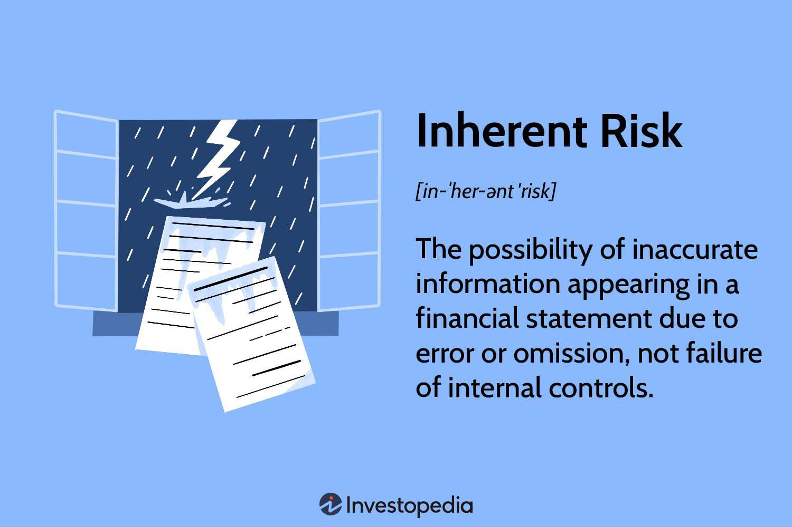

In today's rapidly evolving financial landscape, risk management has become a crucial aspect for companies engaging in algorithmic trading. The complexities of the financial markets necessitate a robust understanding of various risk factors, which can significantly impact an organization's financial health and compliance. Audit risks, a key area of concern, encompass the potential for financial statements to be materially misstated, irrespective of auditors' diligence. Efficiently managing these risks is integral for maintaining transparency and trust in financial reporting.

At the heart of audit risk management lies the concept of inherent risk. This represents the natural susceptibility of financial statements to significant inaccuracies before considering any internal controls. Inherent risks are particularly challenging in industries characterized by intricate financial instruments and stringent regulations, such as the financial services sector. These industries often engage in complex transactions and estimates, amplifying the possibilities for inadvertent errors or intentional misstatements.

Algorithmic trading introduces additional layers of complexity with its reliance on sophisticated quantitative models and high-speed executions. These models, if not correctly managed, can lead to substantial financial and reputational consequences. As such, understanding and mitigating inherent risks is paramount for organizations employing algorithmic trading strategies. By adopting structured model risk management processes, companies can enhance the accuracy and reliability of their financial statements, thereby aligning with regulatory standards and safeguarding their operational integrity. This article delves into the intricacies of audit risks, inherent risks in financial reporting, and effective model risk management in the context of algorithmic trading.

## Table of Contents

## Understanding Audit Risks

Audit risks pertain to the possibility that financial statements may contain material misstatements, even when the auditor performs their tasks thoroughly. These risks are critical in ensuring the integrity and accuracy of financial reporting. There are three primary types of audit risks: inherent risk, control risk, and detection risk. Understanding and scrutinizing each type of risk is essential to minimize the overall audit risk and maintain financial integrity.

Inherent risk is the risk of material misstatement in financial statements due to factors other than a failure of control systems. This type of risk arises naturally from the complexity of transactions or financial estimations involved. For example, transactions that require significant judgment or those that occur infrequently inherently possess a higher chance of errors or misstatements.

Control risk is tied to the effectiveness of a company's internal controls. It represents the danger of material misstatements occurring because existing controls fail to prevent or detect errors. For instance, if a company has insufficient oversight over its financial reporting process, it might inadvertently introduce errors into its financial statements, increasing control risk.

Detection risk is associated with the auditor's procedures. This risk signifies the possibility that an auditor will not detect existing material misstatements in the financial statements. Various factors can affect detection risk, including insufficient testing or sampling during the audit process.

The relationship between these risks can be better understood through the audit risk model, which is expressed as:

$$
\text{Audit Risk (AR) = Inherent Risk (IR) x Control Risk (CR) x Detection Risk (DR)}
$$

In this model, the overall audit risk is a cumulative result of the three overlapping risks. Auditors aim to understand and modify their audit procedures (primarily affecting detection risk) so that the overall audit risk is kept at an acceptably low level. This requires rigorous evaluation of a company's internal controls, the inherent risks related to their operations, and strategic planning to tailor the audit scope and depth accordingly. Effectively managing these aspects is crucial to ensure that financial misstatements are minimized and that financial integrity is maintained.

## What is Inherent Risk?

Inherent risk is the vulnerability of financial statements to significant inaccuracies or misstatements, independent of the effectiveness of a company's control systems. This type of risk is often elevated in environments characterized by highly intricate financial transactions and estimates. Such complexity can arise from a wide range of sources, including innovative financial products, complex business models, or significant estimates in income recognition and asset valuation.

Financial sectors with stringent regulatory requirements and sophisticated financial instruments are particularly susceptible to inherent risk. This vulnerability is due to the intricate nature of the regulations and the financial instruments themselves, which can require precise calculations, thorough understanding, and significant judgment by management. For example, in the financial services industry, organizations might deal with derivatives, securitized assets, and other complicated financial products, which inherently [carry](/wiki/carry-trading) higher levels of uncertainty and estimation. 

Additionally, inherent risk tends to be higher in industries undergoing rapid technological advances or market changes. These scenarios can introduce novel scenarios and transactions that are more likely to have complex accounting implications. As such, these complexities can lead to potential material misstatements if not accurately understood and appropriately reported. Understanding and assessing inherent risk is critical for financial reporting accuracy and is an essential consideration during the audit planning and execution phases.

## Control and Detection Risks

Control risk arises when financial errors occur due to inefficient or insufficient internal controls within a company. Internal controls are processes and procedures implemented to ensure the integrity of financial and accounting information, promote accountability, and prevent fraud. When these controls are inadequate, they fail to detect or prevent errors, leading to the potential for material misstatements in financial statements.

Detection risk, on the other hand, refers to the risk that auditors may not identify material misstatements in a company's financial documents. This can occur even when auditing procedures are applied diligently, due to the natural limitations of audit processes. Detection risk is particularly influenced by the effectiveness of an auditor's testing procedures and their ability to interpret data accurately. It is essential for auditors to design their procedures to minimize detection risk to an acceptable level, thereby enhancing the reliability of the audit results.

These audit risks, when combined with inherent risk, constitute the broader audit risk model that auditors must assess. The audit risk model can be formally represented as:

$$
\text{Audit Risk} (\text{AR}) = \text{Inherent Risk} (\text{IR}) \times \text{Control Risk} (\text{CR}) \times \text{Detection Risk} (\text{DR})
$$

The objective is to manage the Audit Risk (AR) to an acceptably low level, ensuring that the possibility of undetected material misstatements is minimized. While inherent risk is related to the nature of transactions and their complexity, control risk and detection risk are closely associated with the practices and procedures employed by the company and auditors, respectively. Together, they form a comprehensive framework that is critical for maintaining the integrity of financial reporting and ensuring that auditors provide accurate assessments of an organization's financial health.

## Inherent Risk in Algorithmic Trading

Algorithmic trading relies heavily on the utilization of complex models and advanced technologies to execute trades at speeds and frequencies that human traders cannot match. These models, while powerful and efficient, inherently carry significant risks due to their complexity, which presents challenges in terms of accuracy and stability. The inherent risk in [algorithmic trading](/wiki/algorithmic-trading) is amplified by the rapid pace of transactions and the intricate nature of financial instruments used. 

Algorithms operate based on pre-defined rules and data inputs, and any malfunction or oversight in these parameters can lead to substantial errors or financial losses. This susceptibility to rapid market changes and anomalies requires tailored risk management strategies to mitigate potential adverse outcomes. For instance, unexpected market behavior or "black swan" events can trigger algorithmic responses that exacerbate losses if not properly accounted for during the model development phase.

The Financial Markets Standards Board (FMSB) provides guidelines that serve as a valuable resource in managing the model risks associated with algorithmic trading. These guidelines emphasize the importance of comprehensive model validation, thorough testing under various market conditions, and regular updates to account for new data and evolving market dynamics. They recommend rigorous testing processes that simulate extreme market conditions to ensure that the models behave as expected in both typical and atypical scenarios.

In practice, effective risk management in algorithmic trading necessitates ongoing monitoring and adjustment of trading models to reflect current market conditions and emergent risks. This includes incorporating robust control mechanisms, such as stop-loss orders and automated fail-safes that can terminate trading activities if certain risk thresholds are breached.

Additionally, transparency in model development and operation is crucial. This means maintaining detailed documentation of algorithmic strategies, decision-making processes, and the rationale behind model adjustments. By doing so, firms can ensure compliance with regulatory requirements and enhance their ability to manage inherent risks effectively.

In conclusion, the inherent risk associated with algorithmic trading is a critical consideration for financial entities employing such strategies. Implementing comprehensive risk management frameworks, informed by industry guidelines such as those from the FMSB, is essential for maintaining financial stability and achieving long-term operational success.

## Model Risk Management in Algo Trading

Model risk management in algorithmic trading involves a comprehensive process of identifying, assessing, and mitigating the risks associated with the quantitative models integral to trading algorithms. Effective model risk management is essential to ensure the integrity and reliability of these models under various market conditions.

One of the best practices in model risk management is tailoring model testing to reflect real-world trading environments. This involves simulating a wide variety of market conditions to observe how models perform under stress. Stress-testing models against historical market data can reveal weaknesses or assumptions that may not hold in volatile markets.

Another critical best practice is considering model controls, which are systems and procedures that ensure models operate as expected. This includes implementing limits on model outputs, incorporating checks on data quality, and setting parameters for risk exposure. A robust control environment helps prevent unauthorized or unintended use of trading models.

Rigorous validation processes form the core of model risk management. This involves independent reviews of models by teams separate from those who developed them to ensure objectivity. Validation should include back-testing, where model predictions are compared with actual outcomes, and sensitivity analysis, which examines how variations in input parameters affect model results.

Continuous monitoring and documentation are critical for adapting to changes and maintaining algorithmic integrity. Financial markets are dynamic, and models must be updated regularly to maintain accuracy. This requires continuous tracking of model performance and integrating new data inputs to recalibrate models as necessary. Documentation of all changes and updates is vital to maintain a clear audit trail and understand the evolution of model assumptions and performance.

In essence, model risk management in algorithmic trading necessitates a structured approach with a focus on testing, control, validation, and monitoring. By adhering to these best practices, organizations can enhance their model's robustness, reduce unexpected losses, and uphold the integrity of their trading operations.

## Key Considerations and Best Practices

Establishing effective model risk management protocols is crucial to addressing the unique challenges presented by algorithmic trading. These challenges stem from the intricate and dynamic nature of trading algorithms, which necessitate specialized approaches to ensure both accuracy and compliance. 

One fundamental consideration is empowering validation teams with adequate market expertise. Team members should possess both quantitative skills and a deep understanding of market mechanics to effectively oversee and validate trading algorithms. This expertise should be complemented by granting teams access to essential analytical and computational tools. Such tools facilitate comprehensive assessments and enable real-time adjustments as market conditions evolve. This proactive approach helps in maintaining the reliability of trading models.

Regularly reviewing and updating models and corresponding risk management strategies is also vital. Markets are continuously evolving due to factors such as regulatory changes, technological advancements, and shifts in economic conditions. Consequently, trading algorithms must be periodically reviewed to ensure they remain relevant and effective. This includes recalibrating models based on new data and testing them against historical scenarios to assess robustness.

Incorporating a continuous feedback loop into the model risk management protocol can significantly enhance the adaptability of trading strategies. This involves monitoring model performance in real-time and fine-tuning algorithms based on observed outcomes and market feedback, thus reducing the potential for significant losses or compliance issues.

By adhering to these best practices, organizations can navigate the complexities of algorithmic trading more effectively, safeguarding their financial interests and ensuring long-term operational sustainability.

## Conclusion

Managing audit risks, especially inherent risks, is vital for organizations engaged in algorithmic trading. The complexities inherent in algorithmic models can lead to significant financial misstatements if not properly addressed. The financial sector, with its intricacies and rapid technological advancements, necessitates a keen understanding of these risks to ensure accurate financial reporting and compliance.

Adopting robust risk management frameworks is essential in mitigating these complexities and potential pitfalls. These frameworks should encompass comprehensive risk identification, assessment, and management strategies that cater specifically to the dynamic nature of algorithmic trading. For instance, employing sophisticated model validation techniques and continuously refining algorithmic models helps in reducing inherent risks. Additionally, the inclusion of rigorous controls and regular audits ensures that potential discrepancies are promptly identified and rectified, thus maintaining the integrity of financial statements.

Furthermore, organizations must stay vigilant and adaptive to safeguard their financial operations and maintain regulatory compliance. This involves implementing continuous monitoring protocols and updating risk management strategies in response to evolving market conditions and regulatory requirements. By fostering a culture of vigilance and adaptability, organizations can better navigate the challenges posed by algorithmic trading and fortify their financial structures against potential risks. Hence, the role of audit and inherent risk management cannot be overstated in maintaining the financial health and regulatory fidelity of entities engaged in algorithmic trading.

## References & Further Reading

[1]: ["Audit Risk and Materiality in Conducting an Audit"](https://us.aicpa.org/content/dam/aicpa/research/standards/auditattest/downloadabledocuments/au-00312.pdf) by the American Institute of Certified Public Accountants

[2]: ["Algorithmic and High-Frequency Trading"](https://assets.cambridge.org/97811070/91146/frontmatter/9781107091146_frontmatter.pdf) by Álvaro Cartea, Sebastian Jaimungal, and José Penalva

[3]: ["Risk Management and Financial Institutions"](https://books.google.com/books/about/Risk_Management_and_Financial_Institutio.html?id=1J1QDwAAQBAJ) by John C. Hull

[4]: ["A Practical Guide to Risk Management"](https://rpc.cfainstitute.org/en/research/foundation/2011/a-practical-guide-to-risk-management) by Thomas S. Coleman

[5]: ["Understanding the Risk Management Process"](https://www.metricstream.com/learn/risk-management-process.html) from the CFA Institute Research Foundation

[6]: ["Model Risk Management"](https://assets.kpmg.com/content/dam/kpmg/xx/pdf/2019/12/model-risk-management-toolkit.pdf) by the Basel Committee on Banking Supervision

[7]: ["The Financial Stability Board's Principles for Sound Compensation Practices"](https://www.fsb.org/work-of-the-fsb/market-and-institutional-resilience/post-2008-financial-crisis-reforms/building-resilience-of-financial-institutions/compensation/) by the Financial Stability Board