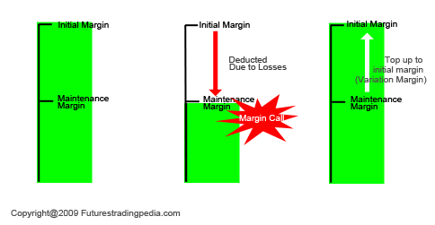

## Table of Contents

## What is a futures contract?

A futures contract is an agreement to buy or sell something at a future date for a price that is decided today. This 'something' could be anything from farm products like wheat or corn, to financial products like stock indexes or currencies. People use futures contracts to manage risk or to try to make money by betting on price changes.

For example, a farmer might use a futures contract to lock in a price for their crops before they are harvested. This way, they know how much money they will get, even if prices drop later. On the other hand, a trader might buy a futures contract hoping that the price will go up, so they can sell it later for a profit. Futures contracts are traded on special exchanges, and they help make markets more stable by allowing people to plan ahead.

## What is initial margin in the context of futures trading?

Initial margin in futures trading is the amount of money you need to put down to open a futures contract. It's like a deposit that shows you're serious about the trade. When you want to buy or sell a futures contract, the exchange where you're trading will ask for this initial margin. It's not the full value of the contract, but just a part of it, usually a percentage.

This initial margin acts as a safety net for the exchange. It helps make sure that traders can cover any losses they might have while the contract is active. If the market moves against your position, the exchange can use your initial margin to cover the losses. That's why the amount of initial margin required can change based on how risky the market thinks the contract is.

## How is the initial margin amount determined?

The initial margin amount is decided by the exchange where the futures contract is traded. They look at how much the price of the thing you're trading might change. If the price can change a lot, the exchange will ask for more money as initial margin. They want to make sure they have enough money to cover any big losses. The exchange also thinks about how much money is in the whole market and any rules they have to follow.

Sometimes, the exchange can change the initial margin amount. They might do this if the market starts to act differently or if there are big news events that could shake things up. When they change the initial margin, it's to keep the market safe and to make sure everyone can still trade without too much risk. So, the initial margin isn't just a random number; it's carefully picked to keep the trading fair and safe for everyone involved.

## What is maintenance margin and why is it important?

Maintenance margin is like a safety check on your futures trading account. It's a smaller amount of money compared to the initial margin, and it's the minimum amount you need to keep in your account while you're holding a futures contract. If the money in your account falls below this maintenance margin because of losses, you'll get a margin call. This means you have to add more money to your account to bring it back up to the initial margin level.

This maintenance margin is important because it helps keep the futures market stable. It makes sure that traders always have enough money to cover their losses. If traders didn't have to keep a minimum amount in their accounts, they could lose more money than they have, which could cause big problems for everyone trading. By having a maintenance margin, the exchange can stop trades from going too far into the red, protecting both the traders and the market.

## How does the maintenance margin differ from the initial margin?

Initial margin and maintenance margin are two different kinds of money you need to have in your account when you're trading futures. The initial margin is the amount you have to put down when you first start a futures contract. It's like a deposit that shows you're serious about the trade and can cover any early losses. This amount is set by the exchange and is usually a percentage of the total value of the contract.

On the other hand, the maintenance margin is a smaller amount of money that you need to keep in your account while you're holding the futures contract. It's like a safety net that makes sure you always have enough money to cover your losses. If your account balance drops below this maintenance margin, you'll get a margin call, and you'll need to add more money to your account to get it back up to the initial margin level. So, while the initial margin gets you into the trade, the maintenance margin keeps you in it safely.

## What happens if the account balance falls below the maintenance margin?

If your account balance drops below the maintenance margin, you'll get a margin call. This means you need to put more money into your account quickly. The exchange wants to make sure you have enough money to cover any losses. If you don't add more money, the exchange might close your position to stop any further losses.

This system helps keep the futures market safe and stable. It makes sure that everyone trading can handle their losses. By having a maintenance margin, the exchange can stop traders from losing more money than they have, which protects both the traders and the market.

## Can you explain the process of a margin call?

When your account balance falls below the maintenance margin, you get a margin call. This means you need to add more money to your account right away. The exchange does this to make sure you can cover any losses you might have. If you don't add more money, the exchange might close your position to stop any further losses. This helps keep the market safe and stable.

The process starts when the exchange checks your account and sees that it's below the maintenance margin. They will then send you a notice, telling you to put more money in. You have to act quickly because if you don't, the exchange will take action. They might sell your futures contract to get back the money they need. This is all done to protect everyone in the market from big losses.

## How do margin requirements vary across different types of futures contracts?

Margin requirements can be different for different types of futures contracts. This is because some things that people trade, like gold or oil, can have prices that change a lot. When prices can change a lot, the exchange will ask for more money as initial and maintenance margins. This is to make sure that traders can handle the bigger swings in price. For example, a futures contract for a stock index might need less margin than one for a commodity like oil, because stock indexes usually don't jump around as much.

The exchange also looks at how much money is in the market and any rules they need to follow when they set margin requirements. If the market is acting wild or if there are big news events that could shake things up, the exchange might change the margin requirements. They might ask for more money to keep the market safe. So, margin requirements are not the same for all futures contracts; they change based on what you're trading and what's happening in the market.

## What role do clearinghouses play in managing margin requirements?

Clearinghouses are important in futures trading because they make sure that everyone follows the rules, including margin requirements. When you trade futures, the clearinghouse is in the middle of the deal. They make sure that you put down the right amount of initial margin when you start a trade. This initial margin is like a deposit that shows you're serious about the trade and can handle any early losses. The clearinghouse keeps this money safe and uses it if you start losing money on your trade.

Clearinghouses also keep an eye on your account to make sure it stays above the maintenance margin. If your account balance drops too low, the clearinghouse will send you a margin call, telling you to add more money. If you don't, they might close your position to stop any more losses. By doing this, clearinghouses help keep the futures market safe and stable. They make sure that traders can cover their losses and that the market keeps running smoothly.

## How have margin requirements evolved over time in response to market conditions?

Margin requirements have changed a lot over time because markets keep changing. When the market is calm, exchanges might not ask for as much money for initial and maintenance margins. But if the market starts to get wild, with prices jumping around a lot, exchanges will ask for more money. This is to make sure that traders can handle the bigger swings in price and to keep the market safe. For example, during big events like the 2008 financial crisis, exchanges raised margin requirements to protect against the huge losses that were happening.

Over the years, technology and better ways to watch the market have also changed how margin requirements work. Now, exchanges can change margin requirements more quickly if they need to. They use computers to keep a close eye on the market and can adjust margins in real-time. This helps them respond faster to big news or changes in the market. So, margin requirements are always being tweaked to make sure the futures market stays stable and safe for everyone trading.

## What strategies can traders use to manage their margin effectively?

Traders can manage their margin effectively by keeping a close eye on their account balance and the market. They should always have more money in their account than the maintenance margin. This means they won't get a margin call, and they can keep their trades open. Traders can also use stop-loss orders to limit their losses. A stop-loss order tells the exchange to close a trade if it starts losing too much money. This can help keep the account balance from dropping below the maintenance margin.

Another strategy is to not use all the money in the account for one trade. Traders should spread their money across different trades. This way, if one trade loses money, they still have money for other trades. It's also smart to keep some extra money in the account, just in case the market changes a lot. By being careful and planning ahead, traders can manage their margin better and keep trading safely.

## How do regulatory bodies influence margin requirements for futures contracts?

Regulatory bodies like the Commodity Futures Trading Commission (CFTC) in the U.S. play a big role in setting rules for futures trading, including margin requirements. They work with exchanges to make sure that the margin rules are fair and protect everyone in the market. The regulators can step in and change the rules if they think the market is too risky or if something big happens that could shake things up. They want to make sure that traders have enough money to cover their losses and that the market stays stable.

Sometimes, regulators might ask exchanges to raise margin requirements if they see that prices are jumping around a lot or if there's a big event that could cause problems. This helps keep the market safe by making sure traders can handle the bigger swings in price. By setting and changing margin requirements, regulatory bodies help keep the futures market running smoothly and protect everyone who trades there.

## What is Maintenance Margin and How Does it Help in Keeping Positions Open?

The maintenance margin plays a crucial role in futures trading by ensuring that traders maintain a certain level of equity in their margin accounts. This requirement is distinct from the initial margin, which is the initial collateral amount when establishing a position. The maintenance margin acts as a threshold that must not be breached, as it is crucial for covering potential losses that a position may incur due to adverse price movements in the market.

When the equity in a trader's margin account drops below the maintenance margin due to unfavorable price changes, a margin call is initiated by the broker. This call requires the trader to deposit additional funds or close positions to restore the account balance above the maintenance margin. Failure to meet a margin call can result in the forced liquidation of positions by the broker, which is undertaken to prevent account equity from falling into a negative balance.

The maintenance margin is generally set at a lower percentage of the contract value compared to the initial margin, reflecting its ongoing protective function rather than the upfront risk consideration. The formula to calculate the necessary deposit when a margin call occurs is given by:

$$
\text{Deposit Required} = \text{Maintenance Margin} - \text{Current Equity}
$$

Here, the current equity is the balance available in the trading account, reflecting the real-time valuation of the open positions. As market conditions fluctuate, the maintenance margin ensures the trader has sufficient "skin in the game" to manage risks effectively, promoting stability in futures markets overall.

Traders need to monitor their account balances regularly and have funds readily available to promptly address margin calls. Implementing risk management strategies, such as stop-loss orders and portfolio diversification, can help traders maintain positions without frequent margin calls. This proactive approach is essential, especially in volatile markets where price swings can swiftly impact account equity.

## References & Further Reading

[1]: Hull, J. C. (2017). ["Options, Futures, and Other Derivatives."](https://www.pearson.com/en-us/subject-catalog/p/options-futures-and-other-derivatives/P200000005938/9780136939917) Pearson Education.

[2]: Pirrong, C. (2011). ["The Economics of Central Clearing: Theory and Practice."](https://www.isda.org/attachment/MzE0NA==/ISDAdiscussion_CCP_Pirrong.pdf) International Swaps and Derivatives Association.

[3]: Lopez de Prado, M. (2018). ["Advances in Financial Machine Learning."](https://www.amazon.com/Advances-Financial-Machine-Learning-Marcos/dp/1119482089) Wiley.

[4]: Aronson, D. R. (2006). ["Evidence-Based Technical Analysis: Applying the Scientific Method and Statistical Inference to Trading Signals."](https://www.amazon.com/Evidence-Based-Technical-Analysis-Scientific-Statistical/dp/0470008741) Wiley.

[5]: Chan, E. P. (2013). ["Algorithmic Trading: Winning Strategies and Their Rationale."](https://github.com/ftvision/quant_trading_echan_book) Wiley.

[6]: CME Group. ["Understanding Margin Calls and Maintenance."](https://www.cmegroup.com/education/articles-and-reports/understanding-margin-changes.html)

[7]: "Futures Margin Requirements Explained." Investopedia. [Online Article](https://www.investopedia.com/ask/answers/072815/what-does-futures-contract-cost.asp).

[8]: Jorion, P. (2006). ["Value at Risk: The New Benchmark for Managing Financial Risk."](https://books.google.com/books/about/Value_at_Risk_3rd_Ed.html?id=nnblKhI7KP8C) McGraw-Hill Education.

[9]: Interactive Brokers. ["Margin Requirements for Futures Traders."](https://www.interactivebrokers.com/en/trading/margin-futures-fops.php)

