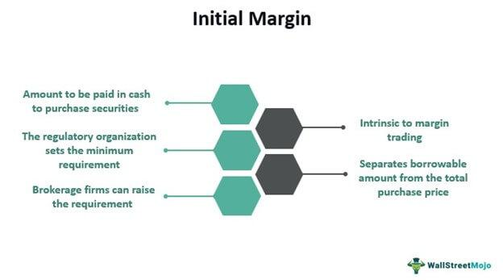

Understanding the intricacies of futures contracts is essential for traders, especially when they participate in margin trading. At the core of futures trading are key components such as maintenance margin and initial margin. These margins not only act as financial safeguards but also enable traders to leverage positions significantly, making them fundamental to the trading process.

Maintenance margin and initial margin are intertwined with the dynamics of market volatility and risk management. The initial margin acts as the upfront collateral needed to open a futures position, providing a buffer against potential defaults. In contrast, the maintenance margin represents the equity level that must be sustained in a trader's account to keep a position open. If the account balance dips below this level due to market fluctuations, a margin call is triggered, necessitating additional deposits to maintain the trader's position. Understanding these concepts helps traders better manage their risks and rewards in a rapidly changing market environment.



Moreover, algorithmic trading introduces a new dimension to margin trading, leveraging automated systems to execute trades based on pre-defined strategies and criteria. This technological advancement enables traders to optimize margin usage by swiftly adjusting positions and responding efficiently to market changes. Algorithmic trading not only facilitates improved risk management but also enhances trade execution speed, accuracy, and consistency, contributing to an evolved trading landscape.

In sum, the exploration of maintenance and initial margins, alongside the integration of algorithmic trading, highlights the complexity and opportunities within futures trading. These elements serve as building blocks for traders aiming to optimize their strategies and maximize potential returns in the futures markets.

## Table of Contents

## What are Futures Contracts?

Futures contracts are cornerstone financial derivatives that bind the buyer to procure, and the seller to deliver, a specified asset at a predetermined date and price in the future. This type of contract distinguishes itself from other market instruments by its standardized nature and its trading on futures exchanges. The underlying assets can be a diverse range of items including commodities like oil and wheat, financial instruments like currencies, and indices that reflect stock market movements.

One primary function of futures contracts is hedging. They allow market participants to mitigate the risk associated with price fluctuations of an asset. For example, a farmer growing wheat can use futures to lock in a selling price for their crop months before the harvest. This action safeguards against potential future price drops. Conversely, companies reliant on commodities as inputs might use futures to secure current prices for future purchases, thus protecting themselves from rising costs.

Speculation is another prevalent use of futures contracts. Traders often engage in buying and selling futures to take advantage of expected price changes, potentially yielding profits from the contract's price [volatility](/wiki/volatility-trading-strategies). Since futures allow for leverage, where only a fraction of the trade's total value (the initial margin) is required upfront, they offer the opportunity for amplified gains. However, this leverage also increases the potential for significant losses.

Trading futures contracts involves specific nomenclature and operations, including aspects such as contract size, tick size (the smallest permissible price change), and expiration date. An example in Python for calculating profit or loss based on futures contract trading could look like this:

```python
def calculate_futures_pnl(contract_size, entry_price, exit_price, number_of_contracts):
    """
    Calculate the profit or loss for futures trading.

    Parameters:
    contract_size (float): The size of one futures contract.
    entry_price (float): The entry price of the futures contract.
    exit_price (float): The exit price of the futures contract.
    number_of_contracts (int): The number of futures contracts traded.

    Returns:
    float: The profit or loss from the trade.
    """
    pnl_per_contract = contract_size * (exit_price - entry_price)
    total_pnl = pnl_per_contract * number_of_contracts
    return total_pnl

# Example usage
contract_size = 100  # Assume 100 units per contract
entry_price = 500.0
exit_price = 505.0
number_of_contracts = 10

profit_or_loss = calculate_futures_pnl(contract_size, entry_price, exit_price, number_of_contracts)
print(f"The profit or loss from the trade is: ${profit_or_loss}")
```

This Python code snippet captures the financial outcome of trading futures, providing a straightforward calculation based on the contract size, entry and [exit](/wiki/exit-strategy) prices, and the number of contracts involved. 

Ultimately, futures contracts play an integral role in modern markets, providing mechanisms for risk management and speculative investment opportunities that are vital for both individual traders and large institutions alike. Their standardization and [liquidity](/wiki/liquidity-risk-premium) make them an appealing choice for many diverse trading strategies.

## Initial Margin Explained

The initial margin is a crucial component in futures trading, acting as a financial safeguard that allows traders to establish positions in the futures market. When a trader decides to enter into a futures contract, they are required to pay an initial margin, which is a small percentage of the total contract value. This margin functions as a security deposit, ensuring that the trader has sufficient funds to cover potential losses and reducing the risk of default. 

Typically, the initial margin is a fraction of the contract's full value, representing the leverage that futures contracts can provide. For example, if the initial margin requirement is 5%, a trader would need to pay $5,000 to control $100,000 worth of the underlying asset. This ability to control a larger position with a relatively small investment is one of the primary attractions of futures trading, as it allows traders to amplify their potential gains. However, this leverage also magnifies potential losses, necessitating careful management of trading strategies and risk.

The establishment of initial margins is typically handled by the exchange or clearinghouse that facilitates the futures trading. The margin requirements can vary based on factors such as market volatility, the liquidity of the underlying asset, and the specific policies of the exchange. For example, during times of heightened market volatility, exchanges may increase initial margin requirements to mitigate the risk of large price swings.

In practice, the calculation of initial margin can involve complex models that consider various risk factors. One common approach is the SPAN (Standard Portfolio Analysis of Risk) system, which evaluates the entire portfolio's risk, rather than individual positions, to determine the required margin. SPAN uses sophisticated algorithms that assess potential changes in the value of the portfolio under different scenarios to calculate the margin requirements.

By requiring an initial margin, exchanges help ensure the integrity and stability of the futures market, providing confidence to both traders and investors. Understanding and managing initial margins is a foundational skill for any futures trader, as it not only facilitates the opening of trades but also plays an essential role in overall risk management.

## Maintenance Margin: Keeping Positions Open

The maintenance margin plays a crucial role in futures trading by ensuring that traders maintain a certain level of equity in their margin accounts. This requirement is distinct from the initial margin, which is the initial collateral amount when establishing a position. The maintenance margin acts as a threshold that must not be breached, as it is crucial for covering potential losses that a position may incur due to adverse price movements in the market.

When the equity in a trader's margin account drops below the maintenance margin due to unfavorable price changes, a margin call is initiated by the broker. This call requires the trader to deposit additional funds or close positions to restore the account balance above the maintenance margin. Failure to meet a margin call can result in the forced liquidation of positions by the broker, which is undertaken to prevent account equity from falling into a negative balance.

The maintenance margin is generally set at a lower percentage of the contract value compared to the initial margin, reflecting its ongoing protective function rather than the upfront risk consideration. The formula to calculate the necessary deposit when a margin call occurs is given by:

$$
\text{Deposit Required} = \text{Maintenance Margin} - \text{Current Equity}
$$

Here, the current equity is the balance available in the trading account, reflecting the real-time valuation of the open positions. As market conditions fluctuate, the maintenance margin ensures the trader has sufficient "skin in the game" to manage risks effectively, promoting stability in futures markets overall.

Traders need to monitor their account balances regularly and have funds readily available to promptly address margin calls. Implementing risk management strategies, such as stop-loss orders and portfolio diversification, can help traders maintain positions without frequent margin calls. This proactive approach is essential, especially in volatile markets where price swings can swiftly impact account equity.

## Differences Between Initial and Maintenance Margins

Initial margin and maintenance margin are fundamental components in futures trading, each serving distinct but complementary roles in risk management.

The initial margin is the upfront deposit required to open a futures position. It acts as a financial buffer against potential losses, enabling traders to leverage their market exposure without committing to the full contract value. Typically, this margin is set as a percentage of the contract's total value, taking into account market volatility and potential price fluctuations. For example, if the initial margin is 10% for a futures contract worth $100,000, the trader would need to deposit $10,000 to initiate the trade. This requirement helps ensure the integrity and stability of futures markets, mitigating the risk of default by providing a cushion against adverse price movements.

On the other hand, maintenance margin pertains to sustaining an open futures position. It represents the minimum account balance a trader must maintain to keep the position open. Should the account's equity fall below this margin due to unfavorable market movements, a margin call is triggered. This requires the trader to deposit additional funds to restore the account balance to the initial margin level, thereby safeguarding against market fluctuations that could otherwise lead to a default situation. For instance, if a trader's equity drops below the maintenance margin threshold of $8,000, they must contribute additional capital to meet the requirements or risk having their position liquidated.

In summary, while the initial margin is the required capital to open a position, the maintenance margin is necessary to keep it operational. Both margins are crucial in managing risk, with initial margins generally set higher to account for potential market volatility. Understanding these differences enables traders to effectively manage their capital, navigate margin calls, and maintain their trading positions in dynamic market conditions.

## The Role of Algorithmic Trading in Margin Trading

Algorithmic trading, often referred to as algo trading, uses sophisticated algorithms to execute trades automatically based on predefined instructions such as timing, price, and [volume](/wiki/volume-trading-strategy). This method is particularly advantageous in margin trading, where it can enhance efficiency and mitigate risks by optimizing margin usage. 

In margin trading, traders are required to maintain specific margin levels to sustain their positions. Algorithmic trading systems can continuously monitor market conditions and automatically adjust positions to ensure compliance with margin requirements. This automated adjustment is critical because market volatility can rapidly alter margin needs, leading to potential margin calls if not managed properly.

One of the primary functions of [algorithmic trading](/wiki/algorithmic-trading) in this context is real-time data processing. Algorithms can analyze large datasets, identifying market trends and executing trades within microseconds. This capability allows traders to capitalize on small price movements, adjust their positions promptly, and maintain optimal margin levels without the need for constant manual intervention.

Furthermore, algorithmic strategies can incorporate risk management protocols to safeguard against potential losses. For instance, stop-loss orders can be programmed into algorithms to automatically liquidate positions if the market moves unfavorably, thus preserving capital. Additionally, algorithms can be designed to redistribute risk across multiple positions, further optimizing the use of available margin.

Consider a simplified example in Python to illustrate the concept:

```python
# A simple algorithmic trading strategy for margin optimization
import numpy as np

# Simulated price data
market_prices = np.array([100, 102, 101, 105, 107, 110])  # Example price points

# Initial margin level requirement
initial_margin = 10  # Assume $10 per unit
maintenance_margin = 5  # Assume $5 per unit

# Trading function
def trade_strategy(prices, initial, maintenance):
    position_size = 1  # Number of units in position
    cash_balance = 1000  # Initial cash balance in dollars

    for price in prices:
        position_value = price * position_size
        required_margin = initial * position_size

        # Check if current margin level is maintained
        if position_value < maintenance * position_size:
            # Automated liquidation or additional funds required
            print("Margin call! Adjusting position or adding funds.")
            # Example: Liquidate a portion or add cash to margin account
        else:
            # Position is maintained, continue monitoring
            print(f"Position maintained at price: {price}, Margin level: {required_margin}")

trade_strategy(market_prices, initial_margin, maintenance_margin)
```

This basic example monitors price changes and reports when a margin call situation arises. In a real-world application, the algorithms would be more complex, factoring in diverse data and execution conditions.

In summary, algorithmic trading enhances margin trading by automating trade execution and margin management, providing traders with a significant advantage in dynamic markets. By swiftly responding to market fluctuations, algorithms help maintain required margin levels, prevent undesirable margin calls, and potentially improve profitability through strategic leverage use.

## Challenges and Opportunities in Margin Trading

Margin trading, while offering the lucrative advantage of leverage, significantly heightens the inherent risks associated with financial trading. The primary allure of margin trading is the ability to control larger positions with relatively smaller amounts of capital, thereby potentially increasing profits. However, this increased exposure also means that losses can magnify rapidly if the market moves unfavorably.

A critical aspect of successful margin trading is the development and implementation of robust trading strategies. These strategies should be formulated based on thorough market analysis and an understanding of technical and fundamental indicators. Traders must be adept at interpreting market signals and adapting their strategies accordingly. For instance, setting stop-loss orders and maintaining a diversified portfolio are practical ways to cushion against the shocks of adverse market movements.

Risk management practices are equally vital in margin trading. One of the key challenges is managing the risk of margin calls, which occur when the account's equity falls below the maintenance margin level. To address this, traders should regularly monitor their equity levels and ensure they have sufficient reserves to meet potential margin calls. Strategies such as employing a conservative leverage ratio and keeping some cash aside as a buffer can help mitigate the risk of forced liquidation due to margin calls.

The volatility of markets further compounds the complexities associated with margin trading. Price swings can be abrupt and substantial, influenced by macroeconomic events, political developments, and market sentiment. Therefore, it is crucial for traders to stay informed about global events that might impact market conditions. Utilizing tools such as volatility indices can provide insights into potential market fluctuations, enabling traders to adjust their positions proactively.

Incorporating algorithmic trading techniques presents an opportunity for margin traders to optimize their strategies. Algorithmic trading involves the use of automated systems to execute trades based on predetermined criteria, allowing for rapid adjustments in response to market changes. Python, for example, can be used to write algorithms that analyze market data and execute trades, thus helping to maintain the required margin levels efficiently. Here is a basic example of how Python can be used in such a context:

```python
import numpy as np
from trading_api import get_market_data, execute_trade

def trading_algorithm():
    data = get_market_data('futures_contract')
    moving_average = np.mean(data['price'][-20:])
    current_price = data['price'][-1]

    if current_price < moving_average:
        execute_trade('buy', 'futures_contract', amount=10)
    elif current_price > moving_average:
        execute_trade('sell', 'futures_contract', amount=10)

trading_algorithm()
```

This simple trading algorithm calculates a moving average of the last 20 price data points and makes buy or sell decisions based on the current price relative to the moving average.

In summary, while margin trading can enhance profit-making potential, it requires a thorough understanding of the associated risks and a disciplined approach to risk management. By developing sound trading strategies, staying informed about market dynamics, and leveraging technological advancements like algorithmic trading, traders can navigate the challenges and seize the opportunities presented by margin trading.

## Conclusion

Trading futures with initial and maintenance margins offers a dynamic landscape for traders, with inherent challenges and diverse opportunities. Initial and maintenance margins serve pivotal roles: the initial margin provides the necessary collateral to open a futures position, while the maintenance margin ensures that the position remains secure against market fluctuations. Together, they form the foundation for risk management strategies, essential for trading efficacy.

The application of algorithmic trading has significantly enhanced the precision and speed at which these margins can be managed. Algorithms enable traders to execute trades automatically based on predefined conditions, adapting swiftly to market changes. This agility is crucial in maintaining the required margin levels, mitigating the risk of margin calls. For instance, a trader can employ an algorithm to automatically rebalance their positions to maintain sufficient equity in their margin account, thereby avoiding penalties or the forced closure of positions.

Furthermore, effectively understanding and applying these margin concepts allows traders to strategically leverage their positions while simultaneously managing risks. Algorithmic trading can optimize this process by adjusting positions in real-time, ensuring that traders are well-positioned to capitalize on favorable market movements, and safeguard against potential downturns.

In summary, mastering the nuances of initial and maintenance margins, especially in conjunction with algorithmic trading techniques, can significantly enhance a trader's ability to navigate the complexities of the futures market. By adopting these strategies, traders not only manage their risk more effectively but also position themselves for greater potential returns. The integration of rigorous risk management practices, coupled with innovative trading technologies, offers a formidable approach to futures trading.

## Further Reading and Resources

To deepen your understanding of futures and margin trading, consider leveraging a broad spectrum of educational resources and materials. Engaging in structured educational courses can provide a strong foundational knowledge, offering insights into complex concepts and practical applications. Websites like Coursera and edX provide specialized courses on derivatives and financial markets, which can be invaluable for both beginner and seasoned traders.

Webinars are another effective way to stay informed and enhance your trading acumen. Many financial institutions and trading platforms, such as CME Group and [Interactive Brokers](/wiki/interactive-brokers-api), frequently host webinars that cover a variety of topics related to futures trading, margin requirements, and modern trading strategies. These webinars often feature industry experts and provide opportunities for live Q&A sessions, enabling participants to clarify doubts and gain deeper insights into current market dynamics.

In addition, academic journals and industry publications offer a wealth of information on the latest research and developments in futures trading and margin management. Publications like the Journal of Futures Markets and the Journal of Derivatives provide empirical studies and theoretical analyses that can enrich your understanding and support strategic decision-making processes.

Keeping abreast of market trends and regulatory changes is crucial for optimizing trading strategies continuously. Financial news platforms such as Bloomberg and Reuters, as well as regulatory bodies like the Securities and Exchange Commission (SEC) and the Commodity Futures Trading Commission (CFTC), provide up-to-date information on market developments and legal updates. Monitoring these resources regularly can help traders anticipate shifts in market conditions and adapt their strategies accordingly.

For those interested in the technical and analytical side, exploring algorithmic trading frameworks can be beneficial. Libraries in Python, such as `pandas` for data analysis and `QuantLib` for quantitative finance, can be used to create, test, and refine trading strategies. Here’s a simple example using Python to calculate moving averages, a common technique in trading strategies:

```python
import pandas as pd

# Assuming 'data' is a pandas DataFrame with a 'Close' column for closing prices
data['Moving Average'] = data['Close'].rolling(window=20).mean()

# Display the first few rows to verify the calculation
print(data.head())
```

Finally, participating in online forums and community discussions can offer practical insights and shared experiences. Platforms such as TradingView and LinkedIn groups dedicated to trading provide spaces for networking, discussion, and feedback, allowing traders to learn from each other’s experiences and continually refine their approaches in the ever-evolving landscape of futures and margin trading.

## References & Further Reading

[1]: Hull, J. C. (2017). ["Options, Futures, and Other Derivatives."](https://www.pearson.com/en-us/subject-catalog/p/options-futures-and-other-derivatives/P200000005938/9780136939917) Pearson Education.

[2]: Pirrong, C. (2011). ["The Economics of Central Clearing: Theory and Practice."](https://www.isda.org/attachment/MzE0NA==/ISDAdiscussion_CCP_Pirrong.pdf) International Swaps and Derivatives Association.

[3]: Lopez de Prado, M. (2018). ["Advances in Financial Machine Learning."](https://www.amazon.com/Advances-Financial-Machine-Learning-Marcos/dp/1119482089) Wiley.

[4]: Aronson, D. R. (2006). ["Evidence-Based Technical Analysis: Applying the Scientific Method and Statistical Inference to Trading Signals."](https://www.amazon.com/Evidence-Based-Technical-Analysis-Scientific-Statistical/dp/0470008741) Wiley.

[5]: Chan, E. P. (2013). ["Algorithmic Trading: Winning Strategies and Their Rationale."](https://github.com/ftvision/quant_trading_echan_book) Wiley.

[6]: CME Group. ["Understanding Margin Calls and Maintenance."](https://www.cmegroup.com/education/articles-and-reports/understanding-margin-changes.html)

[7]: "Futures Margin Requirements Explained." Investopedia. [Online Article](https://www.investopedia.com/ask/answers/072815/what-does-futures-contract-cost.asp).

[8]: Jorion, P. (2006). ["Value at Risk: The New Benchmark for Managing Financial Risk."](https://books.google.com/books/about/Value_at_Risk_3rd_Ed.html?id=nnblKhI7KP8C) McGraw-Hill Education.

[9]: Interactive Brokers. ["Margin Requirements for Futures Traders."](https://www.interactivebrokers.com/en/trading/margin-futures-fops.php)

