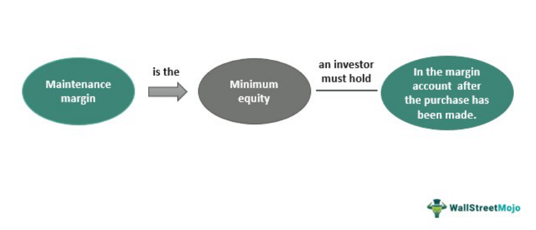

The world of trading and investing has undergone a significant transformation with the rise of margin and algorithmic trading. These innovative approaches have redefined traditional market dynamics, offering new strategies and mechanisms for enhancing financial performance. Margin trading, in particular, facilitates investments by allowing traders to use borrowed funds, thus amplifying potential returns. This method operates through a margin account, where traders are required to deposit an initial margin—essentially a security deposit to cover potential risks associated with leveraged positions. 

Understanding the intricacies of initial margin and maintenance margin is essential for efficient risk management in margin trading. The initial margin represents the minimum equity necessary to open a position, whereas the maintenance margin stipulates the minimum equity required to maintain the position over time. These requirements serve as financial buffers, protecting both the trader and brokerage firm from significant losses by triggering margin calls if equity falls below stipulated levels.



Algorithmic trading has introduced unprecedented speed and precision into the market landscape. By enabling automated trade executions based on predetermined strategies, algorithmic trading minimizes emotional biases and enhances decision-making efficiency. This technology-driven approach is vital in today's fast-paced financial markets, where rapid processing and accuracy can result in substantial opportunities.

This article explores the fundamental differences between initial margin and maintenance margin and examines their strategic importance in the context of algorithmic trading. Both concepts are pivotal in crafting modern trading strategies that capitalize on leverage and speed, highlighting the necessity of technological integration in contemporary financial markets.

## Table of Contents

## Understanding Margin Trading

Margin trading allows investors to purchase securities using borrowed funds, offering the potential to amplify returns. Unlike a standard cash account where transactions occur based on the actual funds available, a margin account provides traders with the ability to leverage their purchasing power through loans from brokerages. This borrowing mechanism requires an initial deposit, known as the initial margin, establishing the foundation for the leverage of a trading position.

The initial margin represents the minimum amount of equity an investor must supply to commence a trade. This requirement is crucial as it dictates the potential amplification of both gains and losses. Generally expressed as a percentage of the total transaction value, the initial margin varies according to asset type and market volatility. For instance, assets with higher volatility typically demand a higher initial margin to mitigate the risk associated with price swings.

Once a position is open, traders must maintain a certain level of equity in the account, termed as the maintenance margin. This is the ongoing funds necessary to keep the position active and to protect the broker against potential losses from market movements adverse to the open position. Should the equity fall below this level, a margin call is triggered, requiring the trader to deposit additional funds or liquidate positions to restore the account's balance.

Regulatory bodies like the Federal Reserve and the Financial Industry Regulatory Authority (FINRA) oversee margin trading to ensure market discipline and reduce systemic risks. These regulations establish guidelines for margin requirements, aiming to safeguard both investors and the broader financial markets from excessive leverage that could lead to instability or cascading failures during market upheavals.

## Initial Margin

Initial margin refers to the minimum equity that a trader must provide to initiate a leveraged position in a trading account. This requirement serves as a crucial risk management tool, ensuring that traders maintain a stake in the transaction and are prepared to endure potential losses. The initial margin is typically expressed as a percentage of the total value of the transaction.

The exact percentage required for initial margin depends on several factors, including the type of asset being traded and prevailing market conditions. For instance, assets with higher [volatility](/wiki/volatility-trading-strategies) generally require a higher initial margin to buffer against unexpected price swings. This requirement helps mitigate the risk posed by sharp market movements, which could otherwise erode the trader's equity in a leveraged position.

Initial margin plays a pivotal role in controlling the leverage potential of a position. Leverage, defined as the ratio of debt to equity in an investment, allows traders to amplify their potential returns by using borrowed funds. However, this also increases potential losses, making the initial margin an essential upfront commitment to manage this risk. Traders are required to secure a significant amount of capital initially, reinforcing the financial discipline needed in leveraged trading.

Example calculations can clarify initial margin requirements across various asset classes. Consider a scenario where a trader wishes to purchase $10,000 worth of stock with an initial margin requirement of 50%. In this case, the trader must contribute $5,000 of their equity to the transaction. The remaining $5,000 is borrowed, effectively doubling the trader's exposure to market fluctuations relative to their invested capital.

Similarly, in futures trading, initial margin requirements vary based on contract specifications and can be more complex, often determined by exchanges. For instance, if trading an oil futures contract with a value of $50,000 and an initial margin requirement of 10%, a trader needs to deposit $5,000 to open the position.

In Python, calculating the initial margin requirement can be implemented as follows:

```python
def calculate_initial_margin(transaction_value, initial_margin_rate):
    return transaction_value * initial_margin_rate

# Example usage
transaction_value = 10000  # Total transaction value in dollars
initial_margin_rate = 0.50  # Initial margin rate as a decimal

initial_margin = calculate_initial_margin(transaction_value, initial_margin_rate)
print(f"Initial Margin Required: ${initial_margin}")
```

Understanding the implications of initial margin requirements is fundamental for traders seeking to engage in leveraged trading, as it involves committing capital upfront and recognizing the associated risks. Through effective margin management, traders can optimize their positions while safeguarding against potential market downturns.

## Maintenance Margin

Maintenance margin plays a critical role in the trading ecosystem by ensuring that a trader maintains a certain level of equity in their margin account subsequent to the purchase of securities. This margin acts as a financial safeguard for brokerage firms, reducing the risk associated with lending. If the equity in a trader's account falls below this predefined maintenance margin level, a margin call is triggered, prompting the trader to deposit additional funds or securities to restore the account to the required margin level.

Failure to meet a margin call can result in the liquidation of open positions by the brokerage. This intervention serves to cover any potential deficits, protecting the trader from incurring further losses and the broker from exposure to excessive risk. The maintenance margin requirement is typically a percentage of the total market value of the securities held within the account. The specific percentage can vary depending on the broker, the type of securities, and market volatility conditions.

An illustrative example can help elucidate the concept of maintenance margins. Suppose a trader purchases 100 shares of a stock priced at $50 per share, totaling a $5,000 investment. With a broker requiring a 25% maintenance margin, the trader must maintain at least $1,250 in equity ($5,000 * 0.25) in their account. Should the stock price decline significantly, decreasing the account's equity to below $1,250, a margin call is issued. Without timely fund deposits to cover the shortfall, the broker may liquidate enough shares to bring the equity back to the acceptable threshold.

Market downturns often accelerate the occurrence of margin calls as equity levels can fall swiftly, prompting brokers to react. This mechanism ensures that financial responsibility is maintained and reduces the likelihood of defaults, which could cascade through the financial system.

Mathematically, the equity in the account must fulfill the condition:

$$
\text{Equity} \geq \text{Total Market Value of Securities} \times \text{Maintenance Margin Percentage}
$$

In Python, a simple check for a margin call can be implemented as follows:

```python
def check_margin_call(equity, market_value, maintenance_margin):
    required_equity = market_value * maintenance_margin
    if equity < required_equity:
        return "Margin call triggered. Deposit required."
    else:
        return "Margin level is adequate."

# Example usage
equity = 1200
market_value = 5000
maintenance_margin = 0.25
print(check_margin_call(equity, market_value, maintenance_margin))
```

This financial mechanism not only aids in maintaining discipline among traders but also underlines the importance of continuous monitoring of leveraged positions, especially in volatile market conditions.

## Key Differences

Initial margin and maintenance margin are essential components of margin trading, each serving a unique function. The initial margin represents the upfront capital required to establish a leveraged trading position. It is typically expressed as a fixed percentage of the asset's total transaction value at the time of purchase. This requirement ensures that traders can cover a portion of the asset's cost, thereby controlling leverage potential from the outset. The high initial margin serves as a risk buffer, making certain that traders have a substantial equity stake before leveraging borrowed funds.

Conversely, the maintenance margin pertains to the minimum equity level a trader must maintain in their margin account after the acquisition of assets. Unlike the initial margin, maintenance margin is an ongoing requirement that ensures the sustainability of the position. Should a trader's equity fall below this threshold due to market fluctuations or declining asset values, a broker issues a margin call. This requires the trader to deposit additional funds promptly or face the liquidation of their positions, protecting brokers from assuming excessive risk stemming from client defaults.

The difference in purpose between these two margins is reflected in their percentage requirements. Initial margin rates are generally higher than maintenance margin rates, underscoring the role of the initial margin in controlling leverage at the commencement of trading. For instance, equities might demand an initial margin of 50% but a maintenance margin of only 25%. This distinction indicates that initial margin requirements are designed to mitigate risk at the start, while maintenance margins address ongoing risk and loss prevention.

Together, initial and maintenance margins play distinct yet complementary roles in the margin trading ecosystem, safeguarding the interests of both traders and brokers. By mandating substantial initial capital and demanding continuous equity maintenance, these margins help manage leverage effectively and curtail potential trading losses. This duality of function is instrumental in maintaining market stability and discipline.

## Algo Trading: A New Frontier

Algorithmic trading has revolutionized the financial markets by automating trade executions based on predefined strategies, offering new dimensions of speed, precision, and efficiency. By utilizing algorithms, this method significantly reduces human error and emotional biases, allowing trades to be executed with remarkable speed and accuracy.

A key aspect of [algorithmic trading](/wiki/algorithmic-trading) is its ability to incorporate margin trading, potentially enhancing leveraged positions with greater strategic finesse. Traders can capitalize on market opportunities that require swift execution, which would be unattainable manually. Given the leverage involved, traders can maximize their exposure with a relatively smaller amount of capital, amplifying potential returns but also increasing risk.

The implementation of algorithmic trading necessitates advanced technological infrastructure. High-speed processing capabilities are crucial to executing numerous transactions with minimal delay. Reliable data feeds are indispensable, ensuring that algorithms can make informed decisions based on the most current market information. The rapid influx of data needs to be processed and utilized without latency, requiring robust computing power and data management systems.

Furthermore, ethical considerations and regulatory compliance play a critical role in the deployment of algorithmic trading strategies. With the capability to influence market dynamics significantly, algorithms must adhere to stringent regulatory frameworks to ensure fair trading practices and prevent market manipulation. Regulatory bodies worldwide have instituted guidelines and monitoring mechanisms to oversee algorithmic trading activities, ensuring that they do not distort market integrity.

Practitioners in algorithmic trading must navigate these regulations carefully, implementing strategies that comply with legal standards while maintaining competitive edge. This balancing act is crucial to the sustainability and ethical operation of algorithms in financial markets.

In summary, algorithmic trading represents a sophisticated frontier in modern finance, offering unmatched speed and accuracy. However, it demands a hybrid approach of advanced technology, strategic incorporation of margin trading, and conscientious adherence to regulatory standards to maximize its benefits while mitigating inherent risks.

## Strategic Combination: Margin and Algo Trading

Combining margin trading and algorithmic (algo) trading enhances both leverage and precision in financial markets. This synergy is particularly advantageous in strategies such as [arbitrage](/wiki/arbitrage) and high-frequency trading ([HFT](/wiki/high-frequency-trading-strategies)), which thrive on exploiting market inefficiencies. 

**Arbitrage and High-Frequency Trading**

Arbitrage involves simultaneously buying and selling an asset in different markets to profit from price discrepancies. Incorporating margin trading allows arbitrageurs to amplify their positions, thereby increasing potential returns. In high-frequency trading, algorithms execute trades at extraordinary speeds, capitalizing on minute price changes across financial instruments. The combination with margin trading provides the necessary capital to fully leverage market conditions.

**Risk Management**

Effective risk management becomes paramount when combining these strategies due to the increased potential for rapid financial losses. Employing stop-loss orders is essential, as they automatically close out positions when a predetermined price threshold is reached, thus helping to limit losses. Additionally, continuous market oversight ensures that positions remain aligned with predetermined risk parameters and strategies.

**Market Implementations**

The practical application of margin and algo trading is evident across various trading arenas, including equities, [forex](/wiki/forex-system), and futures markets. In equities, for instance, advantages are drawn from the volatility and price movement inherent to stocks. Forex markets benefit from high [liquidity](/wiki/liquidity-risk-premium) and the ability to trade 24 hours a day, offering more opportunities for algorithmic strategies to execute efficiently. Futures markets also provide leverage, allowing trading strategies to be applied at lower initial capital requirements.

**Development Guidelines**

Developing a robust integration of margin and algo trading requires stringent guidelines focused on stress-testing and continuous monitoring. Stress-testing involves simulating different market conditions to evaluate the resilience and performance of trading models, ensuring they can withstand adverse scenarios. Continuous monitoring involves real-time analysis of trading algorithms to ensure they are operating as intended and making necessary adjustments to align with current market dynamics.

The strategic combination of margin trading with algorithmic models requires a disciplined approach, balancing the enhanced leverage potential with comprehensive risk management strategies. This balanced approach helps traders navigate the complexities and volatilities of modern trading landscapes effectively.

## Conclusion

In modern trading, comprehending the roles of initial and maintenance margins, alongside the implementation of algorithmic trading, is essential for achieving trading success. These elements form the backbone of risk management strategies and are indispensable for crafting effective trading plans. Initial and maintenance margins provide the framework for managing leverage and protecting both traders and brokers from excessive losses. Algorithmic trading, with its capacity for speed and precision, facilitates the execution of trades in line with pre-determined strategies, enhancing the decision-making process and reducing emotional biases.

To mitigate potential trading pitfalls, a balanced approach is necessary—one that integrates robust risk management tools and ongoing education. Trading environments are not static; they evolve with technological advances and regulatory changes, necessitating continuous adaptation. Future innovations in trading technology and shifts in regulatory frameworks will reshape the landscape, demanding traders remain agile and informed.

To maintain a competitive edge, traders should enhance their understanding of these critical concepts and leverage technology effectively. This involves not only staying abreast of market trends and technological advancements but also refining their strategies and risk management practices. By doing so, traders can position themselves to respond adeptly to changing market conditions and regulatory demands, ensuring sustained success in an increasingly complex trading ecosystem.

## References & Further Reading

[1]: ["Margin Trading - Understanding the Risks"](https://www.fidelity.com/learning-center/trading-investing/trading/understanding-benefits-risks-margin) by the Financial Industry Regulatory Authority (FINRA)

[2]: Hull, J. C. (2017). ["Options, Futures, and Other Derivatives"](https://www.semanticscholar.org/paper/Options%2C-Futures%2C-and-Other-Derivatives-Hull/89bdee500c8623864fc9eb7a471546aa713acc44). Pearson.

[3]: ["Algorithmic Trading - Overview"](https://www.investopedia.com/articles/active-trading/101014/basics-algorithmic-trading-concepts-and-examples.asp) by the U.S. Securities and Exchange Commission (SEC)

[4]: Pardo, R. (2008). ["The Evaluation and Optimization of Trading Strategies."](https://onlinelibrary.wiley.com/doi/book/10.1002/9781119196969) Wiley.

[5]: ["Margin Rules for Day Trading"](https://www.investor.gov/introduction-investing/general-resources/news-alerts/alerts-bulletins/investor-bulletins/margin) by the Financial Industry Regulatory Authority (FINRA)

[6]: Aldridge, I. (2013). ["High-Frequency Trading: A Practical Guide to Algorithmic Strategies and Trading Systems"](https://books.google.com/books/about/High_Frequency_Trading.html?id=6l0DDQAAQBAJ) Wiley.

[7]: ["Initial and Variation Margin Requirements for Futures Contracts"](https://www.thebalancemoney.com/all-about-futures-margin-on-futures-contracts-809390) by CME Group

[8]: Kissell, R. (2014). ["The Science of Algorithmic Trading and Portfolio Management"](https://www.sciencedirect.com/book/9780124016897/the-science-of-algorithmic-trading-and-portfolio-management) Academic Press.