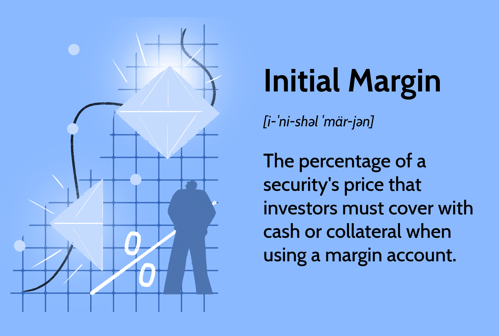

## Table of Contents

## What is an initial margin?

An initial margin is the amount of money or collateral that a trader must deposit with a broker when they open a new position in a futures or options contract. This deposit acts as a guarantee that the trader can cover potential losses from the trade. The initial margin is set by the exchange and is usually a percentage of the total value of the contract.

The purpose of the initial margin is to protect both the trader and the broker from the risk of default. If the market moves against the trader's position, the initial margin helps ensure that there are funds available to cover the losses. This requirement helps maintain stability in the financial markets by reducing the likelihood of traders defaulting on their obligations.

## Why are initial margin requirements important in trading?

Initial margin requirements are important in trading because they help keep the market safe and stable. When a trader wants to buy or sell a futures or options contract, they need to put down some money first. This money, called the initial margin, acts like a safety net. It makes sure that if the price of the contract goes against what the trader expected, there is enough money to cover the losses. This way, the trader can't lose more money than they can afford, and the broker is protected too.

Without initial margin requirements, trading could become very risky. If traders didn't have to put down any money upfront, they might take bigger risks than they can handle. If many traders start losing money and can't pay, it could cause big problems in the market. The initial margin helps prevent this by making sure everyone has some skin in the game. This helps keep the market fair and stable for everyone involved.

## How is the initial margin calculated?

The initial margin is calculated by the exchange where the futures or options contract is traded. The exchange looks at how much the price of the contract might change and decides on a percentage of the contract's total value that traders need to put down. This percentage is the initial margin rate. For example, if the initial margin rate is 5% and the contract value is $10,000, the trader needs to deposit $500 as the initial margin.

Sometimes, the initial margin can change. The exchange might increase it if the market becomes more risky or if the price of the contract starts to move a lot. This is to make sure there's enough money to cover bigger possible losses. The initial margin can also depend on the type of contract and how much risk it carries. So, it's important for traders to check the initial margin requirements before they start trading.

## What are the typical initial margin requirements for different types of financial instruments?

Initial margin requirements can vary a lot depending on the type of financial instrument. For futures contracts, the initial margin is often between 5% to 15% of the contract's value. This means if you're trading a futures contract worth $100,000, you might need to put down anywhere from $5,000 to $15,000. The exact percentage depends on how risky the market thinks the contract is. For example, commodities like oil or gold might have different margin requirements compared to stock index futures.

For options trading, the initial margin requirements can be different. If you're buying an option, you usually don't need to put down an initial margin because you're just paying the premium for the option. But if you're selling or writing an option, you do need to put up margin. This is because when you sell an option, you're taking on more risk. The margin for selling options can be around 20% to 30% of the underlying stock's value, but it can vary based on the specific option and the market's volatility.

In [forex](/wiki/forex-system) trading, the initial margin requirement is usually expressed as a percentage of the total trade value, often called leverage. Common initial margin requirements in forex can be as low as 1% to 2% of the trade's value. This means with a leverage of 100:1, you might only need to put down $1,000 to control a $100,000 position. However, forex margin requirements can also change based on the currency pair being traded and the broker's policies.

## Can you provide examples of initial margin requirements for stocks?

When you trade stocks on margin, you borrow money from your broker to buy more stocks than you could with just your own money. The initial margin requirement for stocks is usually set by the Federal Reserve's Regulation T, which says you need to put down at least 50% of the purchase price of the stocks. So, if you want to buy $10,000 worth of stocks, you need to have $5,000 in your account as the initial margin.

However, some brokers might have their own rules and could ask for more than 50%. For example, a broker might require an initial margin of 60% or even 70% for certain stocks that they see as riskier. This means if you want to buy $10,000 worth of those riskier stocks, you might need to put down $6,000 or $7,000 instead of just $5,000. The exact amount can change based on the broker's policies and the type of stocks you're trading.

## How do initial margin requirements differ between brokers?

Initial margin requirements can be different from one broker to another. Even though the Federal Reserve's Regulation T says you need at least 50% of the stock's purchase price as the initial margin, some brokers might ask for more. They might want a higher percentage, like 60% or 70%, especially for stocks they think are riskier. This means you have to put down more money upfront to trade with them. Brokers can set their own rules because they want to make sure they're safe from big losses if the market goes down.

Brokers also look at other things when setting initial margin requirements. They might change the margin based on how much you trade, how long you've been their customer, or even the type of account you have. For example, a broker might have different margin rules for a new trader compared to someone who's been trading for a long time. This can make a big difference in how much money you need to start trading, so it's good to check with your broker to know exactly what they need.

## What happens if the initial margin requirement is not met?

If you don't meet the initial margin requirement, your broker won't let you open a new trade. This is because the initial margin is like a safety deposit that shows you can handle the risk of the trade. If you don't have enough money in your account to cover the initial margin, the broker will stop you from making the trade to protect themselves and the market.

If you already have a trade open and the value of your account drops below the initial margin requirement, you might get a margin call. This means your broker will ask you to add more money to your account to bring it back up to the required level. If you don't add the money quickly, the broker might close your position to limit their risk. This can happen fast, so it's important to keep an eye on your account and make sure you always have enough money to meet the margin requirements.

## How do changes in market volatility affect initial margin requirements?

When the market gets more up and down, or volatile, the initial margin requirements can go up. This is because when prices change a lot, there's more risk that traders might lose money. Exchanges and brokers want to make sure they're safe, so they ask for more money upfront. If the market for a certain stock or commodity starts moving a lot, the exchange might say, "Hey, we need a bigger initial margin now to keep things stable." This means traders have to put down more money to start a new trade.

Sometimes, if the market calms down and isn't as volatile anymore, the initial margin requirements might go down. But this doesn't happen as often because exchanges and brokers usually want to stay on the safe side. They might keep the higher margin even if things seem better, just in case the market gets wild again. So, traders need to keep an eye on the market and be ready to put down more money if things start to get bumpy.

## What are the regulatory requirements for initial margins in different countries?

In the United States, the Federal Reserve sets the rules for initial margins through Regulation T. This rule says that traders need to put down at least 50% of the stock's purchase price when they want to buy stocks on margin. But, different brokers can ask for more than that. They might want 60% or even 70% if they think the stocks are riskier. The rules can change based on how the market is doing, and the Commodity Futures Trading Commission (CFTC) also sets initial margin rules for futures and options.

In Europe, the European Securities and Markets Authority (ESMA) and the European Central Bank (ECB) set the rules for initial margins. They want to make sure the market stays stable, so they have rules that can change based on how risky things are. For example, they might ask for a higher initial margin if the market gets very up and down. In the UK, the Financial Conduct Authority (FCA) also has rules about initial margins. They work to make sure traders and brokers follow the rules to keep the market safe.

In Asia, countries like Japan and Singapore have their own rules too. In Japan, the Financial Services Agency (FSA) sets the rules for initial margins, and they can change these rules if the market gets risky. In Singapore, the Monetary Authority of Singapore (MAS) makes sure that traders follow the rules to keep the market stable. All these countries want to make sure that traders have enough money to cover possible losses, so they adjust the initial margin requirements to match the market's ups and downs.

## How do initial margin requirements impact portfolio management strategies?

Initial margin requirements play a big role in how people manage their investment portfolios. When you have to put down a lot of money as an initial margin, it can limit how much you can invest. For example, if you need 50% of the stock's price as the initial margin, you might not be able to buy as many stocks as you want because you don't have enough cash. This means you have to be careful about which stocks you pick and how much you invest in each one. It can also make you think twice about using margin at all, because if the market goes down, you might get a margin call and have to add more money or sell your stocks at a loss.

On the other hand, knowing the initial margin requirements can help you plan better. If you know you need to put down a certain amount of money, you can set aside that cash and make sure you're ready for it. This can help you stay calm even if the market gets volatile, because you've already planned for the extra money you might need. Also, understanding how initial margin requirements can change with market conditions can help you adjust your strategy. If you see the market getting riskier, you might decide to hold more cash or choose less risky investments to avoid getting caught off guard by higher margin requirements.

## What advanced techniques can be used to optimize initial margin usage?

One way to optimize initial margin usage is by using a strategy called "margin netting." This means you look at all your trades together and see if some of them can cancel each other out. For example, if you buy and sell the same stock at the same time, the gains from one trade might cover the losses from the other. By doing this, you can lower the total amount of margin you need to put down. It's like balancing your trades so that you don't have to use as much money upfront.

Another technique is to use "portfolio margining." This is a bit more advanced and usually only available to experienced traders. With portfolio margining, the broker looks at your whole portfolio and calculates the margin based on how all your investments might move together. If your portfolio is well-balanced and the different investments tend to offset each other's risks, you might need less initial margin. This can free up more cash for you to use in other investments or to cover any margin calls that might come up if the market changes.

## How do initial margin requirements interact with other risk management tools like stop-loss orders?

Initial margin requirements and stop-loss orders are both tools that help you manage risk when you're trading, but they work in different ways. The initial margin is the money you need to put down before you start trading. It acts like a safety deposit to make sure you can cover any losses. If the market goes against you, the initial margin is there to protect your broker from losing money. On the other hand, a stop-loss order is like a safety net that you set up to automatically sell your investment if the price drops to a certain level. This helps you limit how much money you could lose on a trade.

Using these tools together can help you manage your trades better. For example, if you know you have enough money in your account to meet the initial margin requirement, you might feel more comfortable setting a stop-loss order at a lower price. This way, you can still try to make money if the market goes your way, but you won't lose more than you can handle if it doesn't. By understanding how much margin you need and setting stop-loss orders wisely, you can keep your trading safe and avoid big losses.

## What are margin requirements and how can they be understood?

Margin requirements are essential financial metrics in the trading landscape, determining the minimum equity an investor must sustain within a margin account. The role of margin requirements extends beyond just an entry threshold; they serve as a critical component of risk management, safeguarding both brokerage firms and individual traders from substantial financial losses in volatile markets.

At the core of these requirements is the concept of initial margin, which specifies the percentage of a trade's purchase price that must be paid upfront using cash in a margin account. The initial margin acts as a good faith deposit between the investor and the broker, ensuring that the investor has enough skin in the game before trading on borrowed funds. For instance, if an investor wishes to buy $10,000 worth of stock, and the initial margin requirement is 50%, the investor must deposit $5,000 of their funds to proceed with the transaction.

The formula for the initial margin is generally expressed as follows:

$$
\text{Initial Margin} = \text{Purchase Price} \times \text{Initial Margin Requirement (\%)}
$$

This upfront requirement is vital for minimizing credit risk by ensuring that traders have enough capital to cover potential losses. It acts as a buffer against market [volatility](/wiki/volatility-trading-strategies), protecting brokers from the credit risk associated with lending money, and traders from overextending their financial positions.

Moreover, margin requirements serve as a regulatory measure to promote market stability. By establishing minimum equity thresholds, regulators aim to curtail excessive leverage, which can fuel market bubbles and heighten systemic risks. These requirements thus uphold market integrity and contribute to a more predictable trading environment.

In summary, understanding margin requirements, particularly the initial margin, is crucial for traders operating in financial markets. They ensure traders maintain adequate equity levels, providing a financial cushion that protects all parties involved from severe financial ramifications.

## What is Initial Margin: Definition and Examples?

Initial margin is the minimum amount of capital that an investor must deposit in a brokerage account to initiate a trade. This requirement serves as a safeguard for brokers and the wider financial system, ensuring that the investor has a vested interest in the trade and reducing the risk of default.

For U.S. equities, the Federal Reserve's Regulation T sets the initial margin requirement at 50%. This means that an investor must cover at least 50% of the purchase price of securities with their own funds, whereas the remaining 50% can be borrowed from the broker. However, brokerage firms often have the discretion to impose stricter margin requirements based on their risk assessment and the volatility of the particular securities being traded. For example, during periods of heightened market volatility, a broker might require a higher initial margin to buffer against potential market swings.

To illustrate, consider an investor who wants to buy 1,000 shares of a company, with each share priced at $200. The total value of this transaction would amount to:

$$

\text{Total Purchase Price} = \text{Number of Shares} \times \text{Price per Share} = 1,000 \times 200 = 200,000 
$$

According to Regulation T, the initial margin required would be 50%. Thus, the investor would need to deposit:

$$

\text{Initial Margin} = 200,000 \times 0.50 = 100,000 
$$

This implies the investor would need to provide $100,000 in cash or equivalent securities as the initial margin, giving them $200,000 in purchasing power for the shares.

In scenarios where the broker sets a higher initial margin requirement, say 60%, the calculation changes accordingly. The required initial margin would then be:

$$

\text{Initial Margin} = 200,000 \times 0.60 = 120,000 
$$

Such higher requirements serve to further mitigate risk for both the broker and the investor during turbulent market times or for high-risk securities.

Understanding initial margin is crucial for traders since it impacts the amount of leverage one can utilize and the potential returns from their trading activities. Failing to maintain adequate margin levels can result in margin calls, where the broker demands additional funds or the liquidation of assets to restore the required margin balance. Therefore, managing and monitoring initial margin levels is a fundamental aspect of effective trading strategy and risk management.

## References & Further Reading

[1]: Fabozzi, F. J., Focardi, S. M., & Kolm, P. N. (2010). ["Quantitative Equity Investing: Techniques and Strategies."](https://www.semanticscholar.org/paper/Quantitative-Equity-Investing%3A-Techniques-and-Fabozzi-Focardi/1c49a2a53919f7e65cb96f16691b8ff726fd3cd7) Wiley Finance.

[2]: Hull, J. C. (2015). ["Options, Futures, and Other Derivatives."](https://books.google.com/books/about/Options_Futures_and_Other_Derivatives.html?id=t6CSAgAAQBAJ) Pearson Education Limited.

[3]: Kolb, R. W. (2003). ["Futures, Options, and Swaps."](https://archive.org/details/futuresoptionssw0004kolb) Blackwell Publishing.

[4]: Peltz, J. J., & Kane, G. D. (2003). ["Understanding Margin Accounts: A Detailed Guide."](https://pubmed.ncbi.nlm.nih.gov/11283721/) McGraw-Hill.