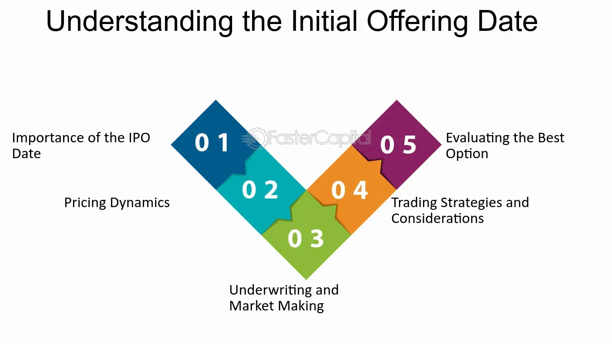

## Table of Contents

## What is an Initial Offering Date?

An Initial Offering Date is when a company first sells its stocks or bonds to the public. This is a big step for a company because it's a way to get money from people who want to invest in it. It's like when a new store opens and starts selling things for the first time.

This date is important because it marks the beginning of the company being traded on a stock market. People can buy and sell the company's stocks after this date. It's a key moment that can affect the company's future and how much money it can raise.

## Why is the Initial Offering Date important for investors?

The Initial Offering Date is important for investors because it's their first chance to buy a piece of a new company. When a company decides to sell its stocks or bonds to the public for the first time, investors can decide if they want to put their money into this new opportunity. This date gives investors a chance to get in on the ground floor, which can be exciting because they might see the company grow and their investment increase in value.

Also, the Initial Offering Date can tell investors a lot about how other people feel about the company. If lots of people want to buy the stocks or bonds on this day, it might mean that many people believe the company will do well. This can help investors decide if they want to buy the stocks or bonds too. But, it's important for investors to do their own research because the Initial Offering Date is just the start, and the company's future can be hard to predict.

## How is the Initial Offering Date determined?

The Initial Offering Date is chosen by the company that wants to sell its stocks or bonds to the public for the first time. The company works with banks and other experts to figure out the best time to do this. They look at things like how the stock market is doing, what's happening in the news, and if people are interested in their company. They want to pick a date when people are more likely to buy their stocks or bonds.

Once the company and its helpers agree on a good date, they start planning. They need to make sure everything is ready for that day, like having all the legal papers in order and telling everyone about the offering. The goal is to make sure that when the Initial Offering Date comes, everything goes smoothly and as many people as possible can buy the stocks or bonds.

## What are the key steps involved in preparing for an Initial Offering Date?

Getting ready for an Initial Offering Date involves several important steps that a company needs to take. First, the company has to work with banks and lawyers to make sure all the legal papers are in order. This includes things like a prospectus, which is a document that tells investors all about the company and what they're selling. The company also needs to decide how many stocks or bonds they want to sell and at what price. They might hire people to help them figure out the best price so they can raise as much money as possible.

Next, the company needs to tell people about the offering. This is called marketing the offering. They might hold meetings with big investors to explain why they should buy the stocks or bonds. They also need to make sure the stock exchange where they want to sell their stocks is ready for the big day. This means talking to the exchange and making sure all the computer systems are set up to handle the new stocks. It's a lot of work, but it's important to make sure everything goes smoothly on the Initial Offering Date.

The last step is making sure everything is ready on the day of the offering. The company needs to make sure the stocks or bonds are available for people to buy at the right time. They also need to keep an eye on how things are going and be ready to answer any questions from investors. If everything goes well, the company can start raising money from the public, which is a big moment for them and the start of a new chapter.

## What role do regulatory bodies play in the process of setting an Initial Offering Date?

Regulatory bodies, like the Securities and Exchange Commission (SEC) in the United States, play a big role in making sure that a company's Initial Offering Date goes smoothly and fairly. Before a company can sell its stocks or bonds to the public, it has to follow a lot of rules set by these regulatory bodies. The company needs to give the regulatory body all the important information about their business, like how they make money and any risks people should know about. This information goes into a document called a prospectus, which the regulatory body checks to make sure it's honest and complete. If the regulatory body finds any problems, they might ask the company to fix them before they can go ahead with the offering.

Once the regulatory body is happy with the prospectus, they give the company the go-ahead to set an Initial Offering Date. The regulatory body keeps watching to make sure the company follows all the rules during the offering. They want to make sure that investors get all the information they need to make good choices and that the company doesn't do anything unfair. If the company breaks the rules, the regulatory body can stop the offering or even punish the company. So, the regulatory body's job is to protect investors and make sure the market stays fair and honest.

## How does the Initial Offering Date affect the pricing of securities?

The Initial Offering Date can have a big impact on how much people are willing to pay for a company's stocks or bonds. When a company decides to sell its securities to the public for the first time, they set an initial price. This price is based on what they think people will pay, but it can change a lot depending on how interested people are on the Initial Offering Date. If lots of people want to buy the stocks or bonds, the price might go up because there's more demand than there are stocks or bonds available. On the other hand, if not many people are interested, the price might stay the same or even go down.

After the Initial Offering Date, the price of the securities can keep changing based on what's happening in the market and how well the company is doing. The first day of trading can be especially exciting because it's the first time the public can buy and sell the securities. If the price goes up a lot on this day, it might mean that people are really excited about the company's future. But if the price goes down, it might mean that people are worried about the company or think the initial price was too high. Either way, the Initial Offering Date sets the stage for how the securities will be priced in the future.

## What are the differences between an Initial Public Offering (IPO) and other types of initial offerings?

An Initial Public Offering (IPO) is when a company sells its stocks to the public for the first time. This is a big step because it means the company is now listed on a stock market where anyone can buy and sell its shares. IPOs are usually used by companies that want to raise a lot of money to grow their business. They have to follow strict rules set by regulatory bodies like the SEC, which includes making a detailed prospectus to inform investors about the company.

Other types of initial offerings include things like Initial Coin Offerings (ICOs) and Initial Bond Offerings (IBOs). An ICO is when a company or project sells digital tokens or coins to raise money, often used by startups in the tech and blockchain industries. These are less regulated than IPOs and can be riskier for investors. An IBO is when a company sells bonds to the public for the first time, which are like loans that the company promises to pay back with interest. Unlike IPOs, IBOs do not give investors ownership in the company but instead a promise of future payments.

Each type of initial offering has its own rules and goals. IPOs are about selling ownership in a company and are heavily regulated to protect investors. ICOs and IBOs, on the other hand, can have different structures and levels of regulation, depending on the country and the type of security being offered. Understanding these differences is important for anyone thinking about investing in these offerings.

## Can the Initial Offering Date be postponed, and if so, under what circumstances?

Yes, the Initial Offering Date can be postponed if something goes wrong or if the company needs more time to get ready. Sometimes, the company might find out that they need to fix something in their legal papers or the prospectus. Or, the market might be doing badly, and the company might think it's better to wait until things get better. If the regulatory body, like the SEC, finds any problems with the offering, they can also make the company wait until everything is fixed.

Postponing the Initial Offering Date is not a decision a company takes lightly. It can be disappointing for the company because they were looking forward to raising money and for investors who were excited to buy the stocks or bonds. But, it's better to wait and make sure everything is right than to rush and have problems later. The company and their helpers will keep everyone updated on any changes to the date and why they need more time.

## How do market conditions influence the choice of the Initial Offering Date?

Market conditions play a big role in deciding when a company should have its Initial Offering Date. If the stock market is doing well and people are feeling good about investing, it might be a good time for a company to sell its stocks or bonds. This is because more people might want to buy them, which could help the company raise more money. On the other hand, if the market is not doing well, like during a recession, the company might decide to wait. They might think that people won't want to buy their stocks or bonds when they're worried about the economy.

The company and its helpers, like banks, look at things like stock market trends, interest rates, and even big news events to pick the best date. They want to make sure that the day they choose is one where people are likely to be interested in their offering. If something big and bad happens in the news, like a financial crisis, the company might delay the Initial Offering Date until things calm down. It's all about trying to find the right moment when the market is in a good spot for the company to get the best results.

## What are the common strategies companies use to maximize success on the Initial Offering Date?

Companies use different strategies to make sure their Initial Offering Date goes well. One common strategy is to pick the right price for their stocks or bonds. They work with banks and experts to find a price that people will want to pay but that also helps the company raise a lot of money. Another strategy is to tell a lot of people about the offering. They might hold meetings with big investors to explain why their company is a good investment. They also use ads and news stories to get people excited about buying their stocks or bonds.

Another important strategy is timing. Companies try to choose an Initial Offering Date when the market is doing well. They look at things like stock market trends and big news events to find the best time. If the market is not doing well, they might wait until things get better. Also, companies make sure all their legal papers are ready and that the stock exchange knows what's happening. They want everything to go smoothly on the big day so they can raise as much money as possible.

## How can investors prepare for and react to announcements related to the Initial Offering Date?

Investors can prepare for an Initial Offering Date by doing their homework. They should read the company's prospectus, which tells them all about the business and the risks of investing. It's also a good idea to keep an eye on the news and see what other people are saying about the company. If they're thinking about buying the stocks or bonds, they should decide how much money they want to spend and be ready to act quickly when the offering happens.

When the Initial Offering Date is announced, investors need to pay attention. If the date changes, they should understand why and decide if they still want to invest. On the day of the offering, they might see the price of the stocks or bonds go up or down. If they think the price is good and they believe in the company, they can buy the stocks or bonds. But they should be ready for the price to keep changing after the offering, so they need to keep watching what's happening in the market.

## What advanced metrics and analyses are used by experts to predict the success of an offering on its Initial Offering Date?

Experts use different advanced metrics and analyses to guess how well a company will do on its Initial Offering Date. One important thing they look at is the company's valuation. They compare it to other companies in the same industry to see if the price of the stocks or bonds makes sense. They also look at the company's financial health, like how much money it's making and if it has any debt. Another thing they check is the demand from investors. If lots of big investors want to buy the stocks or bonds, it's a good sign that the offering might do well. They also use something called a "book-building process" where they talk to investors to see what price they're willing to pay.

Another way experts predict success is by looking at market conditions. They study things like stock market trends, interest rates, and even big news events to see if it's a good time for the company to sell its stocks or bonds. If the market is doing well, people might be more excited about buying new stocks or bonds. Experts also use models to predict how the price might change on the Initial Offering Date. These models take into account things like how much people want to buy the stocks or bonds and how the company has been doing. By putting all this information together, experts can make a better guess about how successful the offering will be.

## References & Further Reading

[1]: ["Advances in Financial Machine Learning"](https://www.amazon.com/Advances-Financial-Machine-Learning-Marcos/dp/1119482089) by Marcos Lopez de Prado

[2]: ["Quantitative Trading: How to Build Your Own Algorithmic Trading Business"](https://www.amazon.com/Quantitative-Trading-Build-Algorithmic-Business/dp/1119800064) by Ernest P. Chan

[3]: ["Evidence-Based Technical Analysis: Applying the Scientific Method and Statistical Inference to Trading Signals"](https://www.amazon.com/Evidence-Based-Technical-Analysis-Scientific-Statistical/dp/0470008741) by David Aronson

[4]: ["Machine Learning for Algorithmic Trading"](https://github.com/stefan-jansen/machine-learning-for-trading) by Stefan Jansen

[5]: Ritter, J. R. (1998). "Initial Public Offerings." In: Logue, A. & Seward, J. (eds) Handbook of Modern Finance. Warren, Gorham & Lamont.

[6]: Aggarwal, R. K. (2000). "Stabilization Activities by Underwriters after Initial Public Offerings." Journal of Finance, 55(3), 1075-1103.