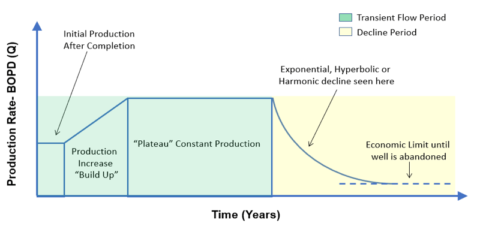

## Table of Contents

## What is the Initial Production Rate (IPR)?

The Initial Production Rate (IPR) is a term used in the oil and gas industry to describe the amount of oil or gas that a well can produce right after it starts operating. It's like checking how much water comes out of a new well right after you dig it. This rate is important because it gives an idea of how good the well is and how much it might produce in the future.

Knowing the IPR helps companies plan their operations and investments. If a well has a high IPR, it means it can produce a lot of oil or gas quickly, which is good for the company's profits. On the other hand, a low IPR might mean the well needs more work or might not be as profitable. So, the IPR is a key number that helps decide what to do next with the well.

## Why is the Initial Production Rate important in the oil and gas industry?

The Initial Production Rate (IPR) is really important in the oil and gas industry because it tells companies how much oil or gas a new well can produce right away. This is like knowing how much water you can get from a new well the moment you start using it. If the IPR is high, it means the well can produce a lot of oil or gas quickly, which is great for the company. They can start making money faster and plan their business better.

On the other hand, if the IPR is low, it might mean the well isn't as good as they hoped. The company might need to spend more money to make the well better or decide not to use it as much. Knowing the IPR helps companies make smart choices about where to spend their money and how to manage their wells. It's a key piece of information that guides their decisions and helps them plan for the future.

## How is the Initial Production Rate measured?

The Initial Production Rate (IPR) is measured by taking readings of how much oil or gas comes out of a well right after it starts working. This is done by using special tools and meters that keep track of the flow of oil or gas over a set period, usually the first 24 hours. The data collected during this time is used to calculate the IPR, giving a clear picture of the well's early performance.

Engineers and technicians make sure the measurements are accurate by following strict procedures. They might take several readings to make sure the numbers are right. Once they have the data, they can use it to figure out the IPR, which is usually reported in barrels of oil per day or cubic feet of gas per day. This number helps companies understand how well the new well is doing and what they can expect from it in the future.

## What factors can affect the Initial Production Rate of a well?

Several things can change how much oil or gas comes out of a well when it first starts working. The type of rock the well is drilled into is a big deal. Some rocks let oil or gas flow easily, while others make it harder. The pressure inside the well also matters a lot. If there's a lot of pressure, more oil or gas can come out quickly. But if the pressure is low, the well might not produce as much right away. How the well is drilled and finished can also make a difference. If the drilling is done well, the well can produce more oil or gas from the start.

Another thing that can affect the initial production rate is the equipment used. Good equipment can help get more oil or gas out of the well faster. But if the equipment isn't working right, it can slow things down. The weather can also play a part. If it's really cold or hot, it can change how the well works. And sometimes, the people working on the well can make a difference too. If they know what they're doing and take good care of the well, it can produce more oil or gas right from the start.

## Can you explain the difference between Initial Production Rate and Peak Production Rate?

The Initial Production Rate (IPR) is the amount of oil or gas that comes out of a well right after it starts working. It's like checking how much water you can get from a new well the moment you turn it on. The IPR gives companies an early idea of how good the well is and helps them plan what to do next. It's important because it shows how much the well can produce at the very beginning, which can help decide if the well is worth investing more money in.

The Peak Production Rate, on the other hand, is the highest amount of oil or gas that a well can produce during its entire life. It's like the best day ever for the well when it's pumping out the most oil or gas it ever will. This peak might happen a while after the well starts working, not right away like the IPR. Knowing the peak rate helps companies understand the well's full potential and how much they can expect to get out of it over time. Both rates are important, but they tell different stories about the well's performance.

## How does the Initial Production Rate impact the economic viability of a drilling project?

The Initial Production Rate (IPR) is really important for figuring out if a drilling project will make money. When a company starts a new well, they look at the IPR to see how much oil or gas they can get right away. If the IPR is high, it means the well can start making money quickly. This is good because the company can pay back what they spent to drill the well faster. A high IPR makes the project look more promising and can help the company get more money from investors.

On the other hand, if the IPR is low, it can be a problem. A low IPR means the well won't produce much oil or gas at first, so it will take longer to start making money. This can make the project less attractive to investors because it's riskier. Companies might need to spend more money to improve the well or decide not to keep drilling if the IPR is too low. So, the IPR is a big deal when it comes to deciding if a drilling project is worth doing.

## What are the common methods used to estimate the Initial Production Rate before drilling?

Before drilling a new well, companies use different ways to guess what the Initial Production Rate (IPR) might be. One common method is looking at data from wells nearby. If there are other wells in the area that are already working, companies can use the IPR from those wells to make a guess about the new one. They also use special pictures of the underground rock, called seismic data, to see what the rock looks like where they want to drill. This helps them figure out if the rock will let oil or gas flow easily.

Another way to estimate the IPR is by using computer models. These models take in a lot of information about the area, like the type of rock, how deep the well will be, and what the pressure underground might be. The computer then uses this information to predict how much oil or gas might come out of the well at the start. These models can be really helpful, but they're not perfect. Sometimes, the real IPR can be different from what the model says, so companies have to be ready for surprises.

## How does the geology of a reservoir influence the Initial Production Rate?

The type of rock in a reservoir plays a big role in deciding how much oil or gas comes out of a well at the start. Some rocks are like sponges and can hold a lot of oil or gas. If the rock is this kind, the oil or gas can flow out easily when the well starts working, making the Initial Production Rate (IPR) high. But if the rock is tight and doesn't let oil or gas move around easily, the IPR will be lower because it's harder for the oil or gas to get out of the well.

Another important thing about the geology is the pressure inside the reservoir. If there's a lot of pressure, it can push more oil or gas out of the well right away, which makes the IPR higher. But if the pressure is low, the oil or gas won't come out as quickly, so the IPR will be lower. So, the kind of rock and the pressure in the reservoir are key factors that can make a big difference in how much oil or gas a well can produce at the start.

## What technologies are used to enhance the Initial Production Rate?

To make the Initial Production Rate (IPR) better, companies use special technologies. One way is called hydraulic fracturing, or "fracking." This is when they pump water, sand, and chemicals into the well to break the rock and let more oil or gas out. This can make the IPR a lot higher because it opens up more paths for the oil or gas to flow. Another technology is called horizontal drilling. Instead of drilling straight down, they drill sideways through the rock. This lets them reach more of the oil or gas, which can also make the IPR better.

There are also smart tools and equipment that help increase the IPR. For example, using better pumps and valves can help get more oil or gas out of the well faster. Companies also use special sensors and computers to keep an eye on the well and make sure everything is working right. These technologies help them fix problems quickly and keep the IPR high. By using these different methods and tools, companies can make their wells produce more oil or gas right from the start.

## How do regulatory and environmental factors influence the management of Initial Production Rate?

Regulatory and environmental factors can have a big impact on how companies manage the Initial Production Rate (IPR) of a well. Governments set rules that companies have to follow when they drill for oil or gas. These rules might limit how much oil or gas a well can produce at the start to protect the environment or make sure the well lasts longer. For example, there might be limits on how much water a company can use for fracking, or they might need special permits to drill in certain areas. If a company doesn't follow these rules, they could get in trouble or have to pay big fines. So, companies have to plan carefully and make sure their IPR fits within the rules.

Environmental concerns also play a role in managing the IPR. Companies have to think about how their drilling might affect the land, water, and air around the well. They might need to use special technologies or methods to reduce pollution or protect wildlife. For example, they might have to use equipment that captures gas that would otherwise escape into the air. These environmental steps can sometimes make the IPR lower than it could be, but they're important for keeping the environment safe. Balancing the need to produce oil or gas with protecting the environment is a big part of managing the IPR.

## What are the challenges in maintaining a high Initial Production Rate over time?

Keeping a high Initial Production Rate (IPR) over time can be tough because the well's performance can change as it gets older. At first, the well might produce a lot of oil or gas because the pressure inside the reservoir is high. But as time goes on, the pressure can drop, and it gets harder to get the oil or gas out. This means the IPR can go down even if the well was doing great at the start. Companies have to use special methods like fracking or adding more wells to keep the IPR high, but these methods can be expensive and might not always work.

Another challenge is that the rock around the well can change over time. The rock might start to close up the paths that the oil or gas uses to get out of the well. This can make the IPR drop because it's harder for the oil or gas to flow. Also, if the company doesn't take good care of the well or if the equipment breaks down, the IPR can go down. So, companies have to keep an eye on the well and fix any problems quickly to keep the IPR high. It's a lot of work to keep a well producing well over time.

## How can data analytics and machine learning be used to predict and optimize the Initial Production Rate?

Data analytics and machine learning can help companies guess and make better the Initial Production Rate (IPR) of a well. They use a lot of information from past wells, like how much oil or gas they produced and what the rock was like. This information is put into computer programs that can find patterns and make guesses about new wells. For example, the computer might see that wells in a certain area usually have a high IPR, so it can predict that a new well in that area might do well too. By using all this data, companies can make smarter choices about where to drill and how to set up their wells to get the best IPR.

Machine learning also helps by always learning from new data. As more wells are drilled and more information comes in, the computer gets better at predicting the IPR. It can even suggest ways to make the IPR better, like using certain drilling methods or equipment. This helps companies save money and time because they can plan better and avoid problems. So, data analytics and machine learning are like smart helpers that make it easier for companies to get more oil or gas out of their wells right from the start.

## What is the Initial Production Rate in the Oil Industry?

The Initial Production (IP) rate is a fundamental metric within the oil industry, signifying the volume of [crude oil](/wiki/crude-oil) a newly drilled well yields during its initial phase of production. This measure is instrumental for oil companies and investors as it provides an early indication of a well's potential productivity and longevity. Typically expressed in barrels per day (b/d), the IP rate allows companies to gauge the immediate extraction capability of a well, offering insight into the well's performance and reserve estimation.

The significance of the IP rate extends beyond mere initial output figures. It is crucial for estimating the future productivity of an oil well. By employing decline curve analysis, a widely used method in the petroleum industry, companies can forecast the well's future production rates and its ultimate recovery. Decline curve analysis entails plotting the production rate against time and fitting a decline model—such as exponential, hyperbolic, or harmonic decline models—to the data. This approach helps to predict long-term production trends and recoverable oil volume, essential for strategic planning and financial forecasting.

$$

q(t) = q_i \left(1 + b \cdot D_i \cdot t \right)^{-1/b} 
$$

In this hyperbolic decline equation, $q(t)$ represents the production rate at time $t$, $q_i$ is the initial production rate, $D_i$ is the initial decline rate, and $b$ is the decline curve exponent. By manipulating these parameters, companies can simulate different scenarios, aiding in the optimization of production strategies.

Accurate estimation of recoverable reserves facilitated by IP rates influences investment decisions significantly. Investors rely on these estimates to assess the economic viability of oil fields, considering factors such as the breakeven cost per barrel and the projected revenue stream. Moreover, the IP rate helps in appraising the financial metrics of an oil project, such as the Net Present Value (NPV) and Internal Rate of Return (IRR), which are critical for determining the investment's attractiveness.

In summary, the IP rate serves as a pivotal tool for the oil industry, enabling informed investment decisions and efficient resource management. By providing an early snapshot of a well's capabilities, it lays the foundation for prudent economic planning and management of oil reserves.

## What are the Mechanisms of Production Efficiency?

Production efficiency in manufacturing aims to achieve maximum output with the least possible input, thereby optimizing resource utilization. This balance is crucial for improving profit margins and developing competitive pricing strategies. Several principles and methodologies contribute to this goal, including the law of diminishing returns, economies of scale, lean manufacturing, and Six Sigma.

The law of diminishing returns, a fundamental economic principle, states that as additional units of a variable input are added to a fixed input, the additional output produced will eventually decrease. This principle guides manufacturers in identifying the optimal allocation of resources to prevent wastage.

Economies of scale refer to the cost advantages that enterprises obtain due to their scale of operation, with cost per unit of output generally decreasing with increasing scale as fixed costs are spread out over more units of output. Larger production volumes enable manufacturers to negotiate better terms with suppliers, leverage more efficient production techniques, and amortize costs over a higher quantity of goods.

Lean manufacturing is a production practice that emphasizes eliminating waste (resources that do not add value) within a manufacturing system. Its core principles include just-in-time production, continuous improvement (kaizen), and respecting employees. Lean methodologies reduce overproduction, minimize inventory, and improve product flow, thus enhancing efficiency.

Six Sigma focuses on improving quality by identifying and removing causes of defects and minimizing variability in manufacturing and business processes. Utilizing a set of quality management methods, including statistical methods, Six Sigma creates a special infrastructure of people within the organization ("Black Belts", "Green Belts", etc.) who are experts in these methods, fostering an environment of precision and accountability.

Efficiency ratios, such as the output-to-input ratio, help measure production efficiency. These ratios can be calculated using formulas like:

$$
\text{Efficiency Ratio} = \frac{\text{Total Output}}{\text{Total Input}}
$$

Higher ratios indicate more efficient processes. Capacity utilization is another key metric, defined as the extent to which an enterprise or a nation uses its installed productive capacity. Calculated by:

$$
\text{Capacity Utilization} = \left( \frac{\text{Actual Output}}{\text{Potential Output}} \right) \times 100 \%
$$

This metric aids in understanding whether an entity is operating at its optimal production level.

By implementing these principles and utilizing these metrics, manufacturers can significantly enhance their production efficiency. The result is not only substantial cost reductions but also improved quality and speed to market, positioning a company advantageously within its industry.

## References & Further Reading

[1]: Economides, M. J., & Nolte, K. G. (2000). ["Reservoir Stimulation."](https://www.amazon.com/Reservoir-Stimulation-3rd-Michael-Economides/dp/0471491926) John Wiley & Sons, Inc.

[2]: Montgomery, D. C. (2008). ["Introduction to Statistical Quality Control."](https://books.google.com/books/about/Introduction_to_Statistical_Quality_Cont.html?id=oh7zDwAAQBAJ) John Wiley & Sons, Inc.

[3]: Geman, H. (2005). ["Commodities and Commodity Derivatives: Modeling and Pricing for Agriculturals, Metals and Energy."](https://download.e-bookshelf.de/download/0000/5675/90/L-G-0000567590-0015270354.pdf) John Wiley & Sons, Inc.

[4]: Hull, J. C. (2017). ["Risk Management and Financial Institutions."](https://www.amazon.com/Management-Financial-Institutions-Wiley-Finance/dp/1119932483) John Wiley & Sons, Inc.

[5]: Kumar, Y., & Pattanayak, D. (2014). ["Algorithmic Trading: A Practitioner’s Guide."](https://scholar.google.com/citations?user=0sW0DosAAAAJ&hl=en) Createspace Independent Publishing Platform.

[6]: Green, J., & Armstrong, S. (2011). ["Practical Applications of Lean: Lean In a Hydrocarbon Resource Organization."](https://www.sciencedirect.com/science/article/pii/S0925527318304018) Society of Petroleum Engineers.

[7]: Chaboud, A., Chiquoine, B., Hjalmarsson, E., & Vega, C. (2014). ["Rise of the Machines: Algorithmic Trading in the Foreign Exchange Market."](https://papers.ssrn.com/sol3/papers.cfm?abstract_id=1501135) International Monetary Fund.