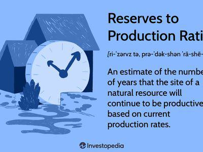

In the world of commodities, particularly oil and gas, comprehending production rates and efficiencies is essential for making informed investment decisions. Successful evaluation of these metrics helps stakeholders in the energy sector predict outputs, assess the viability of projects, and allocate resources effectively. Initial production rates in the oil industry provide critical data for estimating long-term well performance and reserve potential. Accurate predictions of production trends enable companies to optimize resource deployment and strategize financial commitments more effectively.

Similarly, in financial markets, algorithmic trading has emerged as a pivotal element in optimizing trade execution and ensuring market efficiency. By employing sophisticated algorithms, traders can execute orders at high speed and reduced cost, enhancing liquidity and facilitating a more efficient allocation of capital. Algorithmic trading contributes significantly to market dynamics, influencing price discovery and volatility patterns while also posing regulatory and ethical challenges that require careful oversight.



This article examines the interconnected dynamics of these domains, focusing on initial production rates in the oil industry, mechanisms of production efficiency in manufacturing, and the impact of algorithmic trading on financial markets. By analyzing these sectors, the article aims to provide insights into how they leverage efficiency to maximize output and competitiveness. Understanding these interactions is crucial, particularly in a global economy where efficiency dictates market positioning and profitability.

## Table of Contents

## Initial Production Rate in Oil Industry

The Initial Production (IP) rate is a fundamental metric within the oil industry, signifying the volume of [crude oil](/wiki/crude-oil) a newly drilled well yields during its initial phase of production. This measure is instrumental for oil companies and investors as it provides an early indication of a well's potential productivity and longevity. Typically expressed in barrels per day (b/d), the IP rate allows companies to gauge the immediate extraction capability of a well, offering insight into the well's performance and reserve estimation.

The significance of the IP rate extends beyond mere initial output figures. It is crucial for estimating the future productivity of an oil well. By employing decline curve analysis, a widely used method in the petroleum industry, companies can forecast the well's future production rates and its ultimate recovery. Decline curve analysis entails plotting the production rate against time and fitting a decline model—such as exponential, hyperbolic, or harmonic decline models—to the data. This approach helps to predict long-term production trends and recoverable oil volume, essential for strategic planning and financial forecasting.

$$

q(t) = q_i \left(1 + b \cdot D_i \cdot t \right)^{-1/b} 
$$

In this hyperbolic decline equation, $q(t)$ represents the production rate at time $t$, $q_i$ is the initial production rate, $D_i$ is the initial decline rate, and $b$ is the decline curve exponent. By manipulating these parameters, companies can simulate different scenarios, aiding in the optimization of production strategies.

Accurate estimation of recoverable reserves facilitated by IP rates influences investment decisions significantly. Investors rely on these estimates to assess the economic viability of oil fields, considering factors such as the breakeven cost per barrel and the projected revenue stream. Moreover, the IP rate helps in appraising the financial metrics of an oil project, such as the Net Present Value (NPV) and Internal Rate of Return (IRR), which are critical for determining the investment's attractiveness.

In summary, the IP rate serves as a pivotal tool for the oil industry, enabling informed investment decisions and efficient resource management. By providing an early snapshot of a well's capabilities, it lays the foundation for prudent economic planning and management of oil reserves.

## Mechanisms of Production Efficiency

Production efficiency in manufacturing aims to achieve maximum output with the least possible input, thereby optimizing resource utilization. This balance is crucial for improving profit margins and developing competitive pricing strategies. Several principles and methodologies contribute to this goal, including the law of diminishing returns, economies of scale, lean manufacturing, and Six Sigma.

The law of diminishing returns, a fundamental economic principle, states that as additional units of a variable input are added to a fixed input, the additional output produced will eventually decrease. This principle guides manufacturers in identifying the optimal allocation of resources to prevent wastage.

Economies of scale refer to the cost advantages that enterprises obtain due to their scale of operation, with cost per unit of output generally decreasing with increasing scale as fixed costs are spread out over more units of output. Larger production volumes enable manufacturers to negotiate better terms with suppliers, leverage more efficient production techniques, and amortize costs over a higher quantity of goods.

Lean manufacturing is a production practice that emphasizes eliminating waste (resources that do not add value) within a manufacturing system. Its core principles include just-in-time production, continuous improvement (kaizen), and respecting employees. Lean methodologies reduce overproduction, minimize inventory, and improve product flow, thus enhancing efficiency.

Six Sigma focuses on improving quality by identifying and removing causes of defects and minimizing variability in manufacturing and business processes. Utilizing a set of quality management methods, including statistical methods, Six Sigma creates a special infrastructure of people within the organization ("Black Belts", "Green Belts", etc.) who are experts in these methods, fostering an environment of precision and accountability.

Efficiency ratios, such as the output-to-input ratio, help measure production efficiency. These ratios can be calculated using formulas like:

$$
\text{Efficiency Ratio} = \frac{\text{Total Output}}{\text{Total Input}}
$$

Higher ratios indicate more efficient processes. Capacity utilization is another key metric, defined as the extent to which an enterprise or a nation uses its installed productive capacity. Calculated by:

$$
\text{Capacity Utilization} = \left( \frac{\text{Actual Output}}{\text{Potential Output}} \right) \times 100 \%
$$

This metric aids in understanding whether an entity is operating at its optimal production level.

By implementing these principles and utilizing these metrics, manufacturers can significantly enhance their production efficiency. The result is not only substantial cost reductions but also improved quality and speed to market, positioning a company advantageously within its industry.

## Algorithmic Trading: Enhancing Market Efficiency

Algorithmic trading (algo trading) uses computer algorithms to execute orders with minimal human intervention. These algorithms follow predefined criteria based on variables such as timing, price, and [volume](/wiki/volume-trading-strategy). Algo trading is integral to modern financial markets, improving market [liquidity](/wiki/liquidity-risk-premium) and facilitating faster and more effective price discovery. 

Liquidity, or the ability to buy and sell assets without affecting their prices significantly, is a crucial component of market efficiency. Algo trading enhances liquidity by executing numerous trades rapidly and continuously across global markets. This increased liquidity generally results in narrower bid-ask spreads, allowing traders to transact at better prices. The bid-ask spread, typically expressed in ticks, is the difference between the highest price a buyer is willing to pay and the lowest price a seller is willing to accept. Tighter spreads indicate a high level of market efficiency, as it suggests aggressive competition among buyers and sellers.

One of the essential metrics for assessing [algorithmic trading](/wiki/algorithmic-trading) strategies is the Order-to-Trade Ratio (OTR). The OTR measures the number of orders sent to the market compared to the actual trades executed. A high OTR might indicate excessive order submissions, possibly due to inefficiencies in the trading strategy or a strategy geared towards liquidity provision or market-making. Conversely, a lower OTR suggests a more targeted approach, optimizing the execution of orders in line with market opportunities. 

Execution efficiency is another critical metric, reflecting how well a trade's actual execution aligns with its intended price and timing goals. Efficient execution minimizes the market impact and slippage, thus reducing transaction costs. Slippage occurs when the final execution price differs from the intended order price, often due to rapid price movements or insufficient market liquidity.

Below is an illustrative Python code snippet that calculates slippage for a given algorithmic trade:

```python
def calculate_slippage(expected_price, executed_price):
    return executed_price - expected_price

expected_price = 100.0  # example expected price
executed_price = 100.5  # example executed price

slippage = calculate_slippage(expected_price, executed_price)
print(f"Slippage: {slippage} units")  # Output: Slippage: 0.5 units
```

By reducing slippage and narrowing spreads, algorithmic trading lowers the cost of trading, benefiting all market participants. Moreover, the speed and precision with which algo trading systems can process vast amounts of data enhance the overall efficiency of the market by providing more accurate and timely information for price discovery. 

Algorithmic trading significantly contributes to market efficiency by improving liquidity, optimizing execution, and reducing transaction costs. These benefits underscore the growing adoption of algorithmic strategies in diverse financial markets, from equities to commodities. As regulatory frameworks evolve to ensure fair and transparent trading practices, the role of algorithmic trading in enhancing market efficiency is expected to grow further.

## Challenges and Considerations

Measuring efficiency across the oil production, manufacturing, and trading sectors involves distinct challenges, largely driven by rapid technological advancements and inherent data complexities. In the oil industry, the accurate assessment of production efficiency is often impeded by data limitations. This includes variable geological conditions, fluctuating market dynamics, and complexities in reservoir engineering models, making it difficult to predict consistent output levels and efficiency metrics accurately.

Manufacturing industries face substantial hurdles due to the high initial costs associated with implementing new technologies aimed at enhancing production efficiency. The integration of systems such as automation, IoT, and AI often necessitates significant capital investment and involves extensive workforce training. Transitioning to more efficient processes can disrupt existing operations if not managed effectively, potentially leading to temporary declines in productivity and increased operational risks.

In algorithmic trading, a major challenge lies in distinguishing beneficial practices from market manipulation or harmful behaviors. As high-frequency trading and complex algorithms dominate financial markets, ensuring fair and transparent trading practices requires robust regulatory frameworks. Regulators need to utilize sophisticated monitoring systems capable of analyzing massive volumes of trade data in real-time to identify and mitigate potentially manipulative activities. This often entails deploying advanced data analytics and AI-driven surveillance systems to ensure market integrity.

Addressing these challenges requires concerted efforts across industry sectors to develop and implement technologies that enhance data accuracy, improve transparency, and reduce operational costs. Moreover, comprehensive regulatory policies and frameworks must be aligned with technological advancements to safeguard market efficiency and protect stakeholders.

## Technological Advancements Driving Efficiency

Technological advancements are significantly enhancing production efficiency across diverse sectors, including manufacturing and financial markets. Automation stands at the forefront, streamlining manufacturing processes by reducing manual intervention and allowing machines to perform repetitive tasks with precision and speed. This not only minimizes human error but also enhances output consistency. Internet of Things (IoT) devices further augment this by enabling real-time monitoring and predictive maintenance. By collecting and analyzing data from machinery, IoT systems can predict failures before they occur, thereby reducing downtime and maintenance costs.

Artificial Intelligence (AI) is revolutionizing both manufacturing and algorithmic trading. In manufacturing, AI algorithms analyze large datasets to optimize production schedules and resource allocation, enhancing productivity and reducing waste. Machine learning models can predict demand fluctuations, allowing manufacturers to adjust production accordingly and maintain optimal inventory levels.

In financial markets, AI and [machine learning](/wiki/machine-learning) play pivotal roles in algorithmic trading. These technologies enable the development of sophisticated trading strategies that can quickly adapt to market changes. For example, machine learning algorithms process vast amounts of market data to identify patterns and execute trades at optimal times. This rapid decision-making ability improves trade execution and enhances market liquidity.

Blockchain technology is also emerging as a crucial tool for enhancing traceability and transparency in manufacturing supply chains. By creating immutable records of transactions and product journeys, blockchain ensures data integrity and reduces the risk of fraud. This added layer of security is instrumental in complex global supply chains where visibility is key to maintaining efficiency.

Overall, these technological advancements enhance resource allocation, reduce operational errors, and promote a culture of continuous improvement. By integrating these technologies, industries can not only optimize their current operations but also gain a competitive edge in an ever-evolving market landscape.

## Market Implications and Future Outlook

Increased production efficiency offers significant benefits for companies, enabling them to provide competitive pricing and increase market share. By optimizing resource utilization, businesses can lower production costs, which translates into reduced prices for consumers. This ability to offer products at lower prices without compromising quality gives companies a competitive advantage and the potential to capture a larger portion of the market. 

Continued technological innovation plays a crucial role in furthering this trend across production and trading sectors. Automation and Artificial Intelligence (AI) facilitate more streamlined operations, reduce human error, and ensure real-time decision-making capabilities. These technologies contribute to cost reduction and operational efficiency. For instance, AI-driven predictive maintenance can prevent costly machinery breakdowns, while automation can increase production speed and consistency.

Moreover, advancements such as the Internet of Things (IoT) and blockchain enhance sustainability by providing real-time monitoring and improving supply chain transparency. IoT devices allow for precise resource management and energy efficiency, while blockchain offers traceability that can ensure ethical sourcing and production practices.

In the financial markets, algorithmic trading, which employs AI and machine learning, allows for rapid transaction execution that enhances market liquidity and efficiency. As these technologies evolve, trading becomes increasingly efficient, reducing the overall cost of transactions and further tightening bid-ask spreads.

As businesses embrace these technological innovations, they are better positioned to maintain profitability and reinforce their standings in an increasingly competitive global market. With continuous advancements, the focus on sustainability is also growing, encouraging practices that not only seek economic benefit but also take environmental impacts into account.

The future outlook anticipates ongoing technological growth influencing production and trading sectors. Innovations may result in decreased operational costs and heightened sustainability measures, shaping markets that are both economically advantageous and environmentally conscious. By aligning with these advancements, companies not only safeguard their profitability but also adapt to a market that values both efficiency and environmental stewardship.

## Conclusion

Achieving efficiency in production and trading is essential for maximizing output and maintaining a competitive edge. By understanding production efficiency principles and challenges and leveraging technology in trading, businesses can enhance performance across diverse industries. Production efficiency focuses on maximizing output while minimizing input, embodying the law of diminishing returns, economies of scale, and methodologies such as lean manufacturing and Six Sigma. These approaches, coupled with efficiency ratios and capacity utilization metrics, enable businesses to achieve optimal resource utilization and profitability.

In trading, algorithmic strategies improve market efficiency through rapid execution, enhanced liquidity, and optimized price discovery. By implementing predefined algorithms, traders can reduce transaction costs and tighten bid-ask spreads, contributing to more efficient financial markets. Despite these benefits, industries must navigate challenges such as data limitations and regulatory requirements to ensure ethical practices and accurate efficiency assessments.

The continuous exploration of efficiency strategies, supported by technological advancements like IoT, AI, and blockchain, promises sustainable growth and improved market conditions. Technologies provide real-time monitoring and predictive maintenance and enhance market responsiveness, reducing errors and optimizing resource allocation. By embracing continuous improvement and innovation, businesses can adapt to changing market dynamics, ensuring long-term competitiveness and sustainability in a rapidly evolving global landscape.

## References & Further Reading

[1]: Economides, M. J., & Nolte, K. G. (2000). ["Reservoir Stimulation."](https://www.amazon.com/Reservoir-Stimulation-3rd-Michael-Economides/dp/0471491926) John Wiley & Sons, Inc.

[2]: Montgomery, D. C. (2008). ["Introduction to Statistical Quality Control."](https://books.google.com/books/about/Introduction_to_Statistical_Quality_Cont.html?id=oh7zDwAAQBAJ) John Wiley & Sons, Inc.

[3]: Geman, H. (2005). ["Commodities and Commodity Derivatives: Modeling and Pricing for Agriculturals, Metals and Energy."](https://download.e-bookshelf.de/download/0000/5675/90/L-G-0000567590-0015270354.pdf) John Wiley & Sons, Inc.

[4]: Hull, J. C. (2017). ["Risk Management and Financial Institutions."](https://www.amazon.com/Management-Financial-Institutions-Wiley-Finance/dp/1119932483) John Wiley & Sons, Inc.

[5]: Kumar, Y., & Pattanayak, D. (2014). ["Algorithmic Trading: A Practitioner’s Guide."](https://scholar.google.com/citations?user=0sW0DosAAAAJ&hl=en) Createspace Independent Publishing Platform.

[6]: Green, J., & Armstrong, S. (2011). ["Practical Applications of Lean: Lean In a Hydrocarbon Resource Organization."](https://www.sciencedirect.com/science/article/pii/S0925527318304018) Society of Petroleum Engineers.

[7]: Chaboud, A., Chiquoine, B., Hjalmarsson, E., & Vega, C. (2014). ["Rise of the Machines: Algorithmic Trading in the Foreign Exchange Market."](https://papers.ssrn.com/sol3/papers.cfm?abstract_id=1501135) International Monetary Fund.