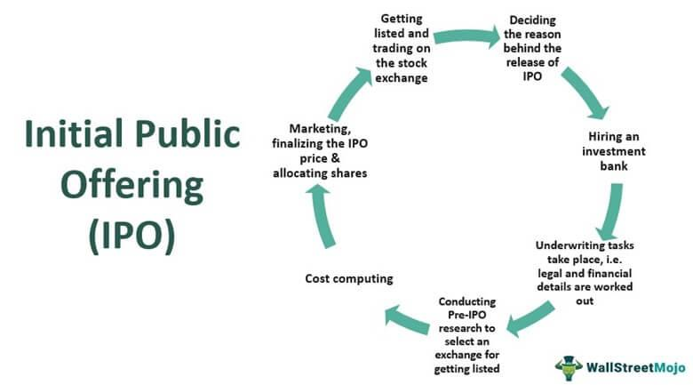

## Table of Contents

## What is an Initial Public Offering (IPO)?

An Initial Public Offering, or IPO, is when a company decides to sell its shares to the public for the first time. Before an IPO, a company is usually owned by a small group of people, like the founders or investors. By going public, the company lets anyone buy a piece of it through the stock market. This can help the company raise a lot of money, which it can use to grow or pay off debts.

When a company wants to have an IPO, it has to follow many rules set by the government and stock exchanges. They need to share a lot of information about their business, like how much money they make and what they plan to do in the future. This helps people decide if they want to buy the company's shares. After the IPO, the company's stock starts trading on the stock market, and its price can go up or down based on what people think about the company.

## Why do companies choose to go public through an IPO?

Companies choose to go public through an IPO mainly to raise money. When a company needs a lot of cash to grow bigger, build new things, or pay off debts, selling shares to the public can be a good way to get it. By going public, a company can get money from many people instead of just a few big investors. This can help the company do more things and become more successful.

Another reason is that going public can make the company more well-known. When a company's shares start trading on the stock market, more people hear about it. This can help the company attract new customers, partners, and even better employees. Plus, the people who already own parts of the company, like the founders or early investors, can sell some of their shares and make money too. So, going public can be a big step for a company to grow and become more important in its industry.

## What are the main steps involved in the IPO process?

When a company wants to go public through an IPO, it starts by choosing investment banks to help with the process. These banks, called underwriters, help the company figure out how much money it wants to raise and how many shares to sell. The company and the underwriters work together to set a price for the shares. This is called the IPO price. The company also has to prepare a lot of paperwork, like a document called a prospectus, which tells people about the company's business, its money situation, and the risks of buying its shares.

After the paperwork is ready, the company sends it to a government agency, like the Securities and Exchange Commission (SEC) in the U.S., to get approval. Once the SEC says it's okay, the company can start marketing the IPO to potential investors. This is called the roadshow, where the company's leaders travel to meet with big investors and tell them why they should buy the company's shares. After the roadshow, the underwriters set a final price for the shares based on what investors are willing to pay. Then, the shares are sold to the public on the stock market, and the company gets the money it raised from the IPO.

## Who are the key players in an IPO and what are their roles?

The key players in an IPO are the company going public, the underwriters, and the investors. The company is the one that wants to sell its shares to the public. It works with the underwriters to figure out how much money it needs and how many shares to sell. The company also has to prepare a lot of information about its business and share it with the public. This helps people decide if they want to buy the company's shares.

The underwriters are usually big investment banks that help the company with the IPO. They help set the price for the shares and find people who want to buy them. The underwriters also help the company get approval from the government to sell its shares. They do a lot of work to make sure the IPO goes smoothly and that the company gets the money it needs.

The investors are the people who buy the company's shares during the IPO. They can be big institutions like pension funds or regular people who want to own a piece of the company. Investors look at the information the company shares and decide if they think the company is a good investment. After the IPO, the investors can sell their shares on the stock market if they want to.

## How is the price of an IPO determined?

The price of an IPO is set by the company and its underwriters, who are usually big investment banks. They work together to figure out how much money the company wants to raise and how many shares to sell. They look at the company's value, how much money it makes, and what other similar companies are worth. They also think about how much people might be willing to pay for the shares. This helps them come up with a price range for the IPO.

Before the IPO, the company and underwriters go on a roadshow to meet with big investors and tell them about the company. They listen to what these investors think about the price and if they want to buy the shares. Based on this feedback, the underwriters set a final price for the IPO. This price is what the company's shares will cost when they start trading on the stock market. It's important to get the price right so the company can raise the money it needs and the investors feel good about their purchase.

## What is a prospectus and what information does it contain?

A prospectus is a big document that a company makes when it wants to go public through an IPO. It's like a detailed report that tells people everything they need to know about the company before they decide to buy its shares. The prospectus is really important because it helps investors understand what they're getting into and what risks they might face.

The prospectus includes a lot of information about the company. It talks about what the company does, how it makes money, and what its plans are for the future. It also has financial details, like how much money the company has made in the past and what it owes. The prospectus also lists any risks that could affect the company, like competition or changes in the market. This way, people can make a smart choice about whether to invest in the company's IPO.

## What are the regulatory requirements for a company to launch an IPO?

When a company wants to launch an IPO, it has to follow many rules set by the government and stock exchanges. In the United States, for example, the company needs to file a registration statement with the Securities and Exchange Commission (SEC). This statement includes a prospectus that gives detailed information about the company's business, financials, and risks. The SEC reviews this information to make sure it's complete and accurate. The company can't sell its shares until the SEC says it's okay.

Besides the SEC, the company also has to meet the rules of the stock exchange where it wants its shares to trade. Each exchange, like the New York Stock Exchange or NASDAQ, has its own set of requirements. These can include things like how much money the company needs to have, how many shares it has to sell, and how many shareholders it needs. The company has to follow all these rules to make sure its IPO goes smoothly and its shares can be traded on the stock market.

## How does the underwriting process work in an IPO?

In an IPO, the underwriting process is when a company hires investment banks to help sell its shares to the public. These banks are called underwriters. The company and the underwriters work together to figure out how much money the company wants to raise and how many shares to sell. They also help set a price for the shares. The underwriters do a lot of work to make sure the IPO goes well. They help the company prepare all the paperwork, like the prospectus, and get approval from the government to sell the shares.

After the company gets the okay from the government, the underwriters help market the IPO to potential investors. They go on a roadshow to meet with big investors and tell them about the company. The underwriters listen to what these investors think about the price and if they want to buy the shares. Based on this feedback, the underwriters set a final price for the IPO. When the shares start trading on the stock market, the underwriters make sure everything goes smoothly. They also might buy any shares that don't sell right away to help keep the price stable.

## What are the different types of IPOs and how do they differ?

There are a few different types of IPOs, and they each work a bit differently. The most common type is the traditional IPO, where a company hires underwriters to help sell its shares to the public. The underwriters set a price for the shares and help the company get approval from the government. Then, the shares start trading on the stock market. Another type is the direct listing, where a company doesn't use underwriters. Instead, it just lists its shares on the stock market and lets people buy them directly. This can be faster and cheaper, but it's riskier because the company doesn't get as much help setting the price.

A third type of IPO is the Dutch auction IPO, which is less common. In a Dutch auction, the company lets investors bid on how much they're willing to pay for the shares. The company then sets the price based on these bids, and everyone who bid at or above that price gets to buy shares. This can be a fairer way to set the price because it's based on what people are actually willing to pay. Each type of IPO has its own pros and cons, and companies choose the one that fits their needs best.

## What are the risks and benefits for investors participating in an IPO?

For investors, participating in an IPO can bring both big rewards and big risks. One of the main benefits is the chance to buy shares in a company before they start trading on the stock market. If the company does well after the IPO, the price of the shares could go up a lot, and investors could make a good profit. Another benefit is that IPOs can be exciting and give investors a chance to be part of a company's growth from the start.

However, there are also risks to think about. One risk is that the price of the shares might go down after the IPO. If the company doesn't do as well as expected, or if people lose interest, the share price could drop, and investors could lose money. Another risk is that there might not be enough information about the company yet. Since the company is new to the public market, it can be hard to know if it's a good investment. So, while IPOs can be a great opportunity, they also come with a lot of uncertainty.

## How can market conditions affect the success of an IPO?

Market conditions can have a big impact on how well an IPO does. If the stock market is doing well and people are feeling good about investing, they might be more likely to buy shares in an IPO. This can help the company set a higher price for its shares and raise more money. On the other hand, if the market is not doing well, or if there's a lot of uncertainty, people might be more cautious about buying new shares. This can make it harder for the company to sell its shares at a good price.

The type of industry the company is in also matters. If the industry is popular and growing, people might be more interested in the IPO. For example, if there's a lot of excitement about technology companies, a tech IPO might do better. But if the industry is struggling or not as popular, the IPO might not get as much attention. So, the overall mood of the market and the specific industry can really affect how successful an IPO is.

## What are some notable examples of successful and unsuccessful IPOs and what lessons can be learned from them?

One successful IPO was Google's in 2004. Google used a Dutch auction to set the price of its shares, which let more people buy them. The IPO raised a lot of money and the share price went up a lot after it started trading. This showed that using a different way to set the price can work well if the company is popular and people want to invest in it. Another lesson is that a strong brand and a good business plan can make an IPO very successful.

An example of an unsuccessful IPO was WeWork's in 2019. WeWork tried to go public but had to stop because people didn't think the company was worth as much as it said. The company was losing a lot of money and its business model didn't seem to make sense to investors. This shows that it's important for a company to have a clear and believable plan before trying to go public. It also shows that if a company is not ready, it's better to wait than to rush into an IPO.

From these examples, we can learn that the way a company sets its IPO price and how it presents itself to investors matters a lot. A strong business plan and a good understanding of the market can make a big difference. Companies should make sure they are ready and that their story makes sense to people before they try to go public.

## References & Further Reading

[1]: ["Algorithmic Trading and DMA: An introduction to Direct Access Trading Strategies"](https://www.semanticscholar.org/paper/Algorithmic-trading-%26-DMA-%3A-an-introduction-to-Johnson/aa5de1ab883d5e23b6651faa7c1807586d688e4b) by Barry Johnson

[2]: ["Investment Banking: Valuation, Leveraged Buyouts, and Mergers and Acquisitions"](https://www.amazon.com/Investment-Banking-Valuation-Leveraged-Acquisitions/dp/1118656210) by Joshua Rosenbaum and Joshua Pearl

[3]: ["Principles of Financial Regulation"](https://academic.oup.com/book/35860) by John Armour, Dan Awrey, Paul Davies, Luca Enriques, Jeffrey N. Gordon, Colin Mayer, and Jennifer Payne

[4]: ["Flash Boys: A Wall Street Revolt"](https://en.wikipedia.org/wiki/Flash_Boys) by Michael Lewis

[5]: Brownlees, C. T., Cipollini, F., & Gallo, G. M. (2011). ["Intra-daily volume modeling and prediction for algorithmic trading."](https://www.semanticscholar.org/paper/Intra-Daily-Volume-Modeling-and-Prediction-for-Brownlees-Cipollini/f749eb6508c2f4439715a0f807b73b07defe7353) Journal of Financial Econometrics, 9(3), 489-518.