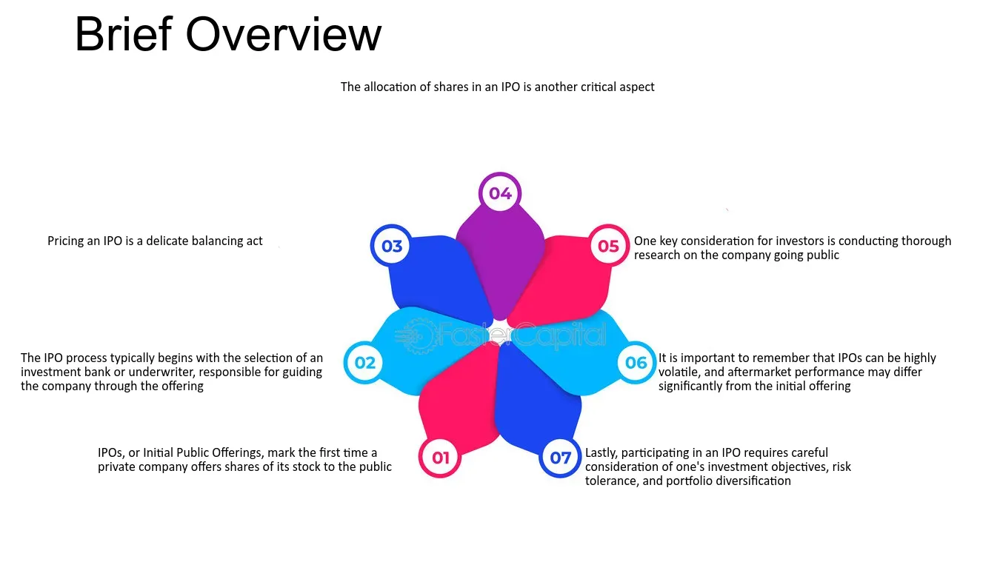

## Table of Contents

## What is an Initial Public Offering (IPO)?

An Initial Public Offering (IPO) is when a company decides to sell its shares to the public for the first time. Before an IPO, a company is usually owned by a small group of people or investors. By going public, the company offers its stock on a stock exchange, allowing anyone to buy and own a piece of the company. This process helps the company raise money, which can be used to grow the business, pay off debts, or invest in new projects.

When a company decides to go public, it works with investment banks to set an initial price for its shares. This price is determined based on the company's value and market conditions. Once the shares are available on the stock exchange, their price can go up or down depending on how much people want to buy or sell them. An IPO can be exciting for a company because it can bring in a lot of money, but it also means the company has to follow strict rules and share more information with the public.

## Why do companies go public through an IPO?

Companies go public through an IPO mainly to raise money. When a company sells its shares to the public, it gets cash from the people who buy those shares. This money can be used to grow the business, like opening new stores or making new products. It can also help the company pay off debts or invest in new projects. Going public can give a company the funds it needs to do big things that it couldn't do before.

Another reason companies go public is to let their early investors and founders cash out some of their shares. Before an IPO, the company might be owned by a small group of people. By selling shares to the public, these early owners can sell some of their shares and make money. This can be a big reward for the hard work they put into starting and growing the company. Also, being a public company can make the company more well-known and respected, which can help attract new customers and business partners.

## How does the IPO process work?

When a company wants to go public, it starts by hiring investment banks to help with the IPO. These banks do a lot of work to figure out how much the company is worth and how much money the company wants to raise. They also help set the price for the shares. The company and the banks make a plan, which includes how many shares to sell and at what price. They also create a document called a prospectus, which tells people about the company and the risks of buying its shares.

Once everything is ready, the company files the prospectus with a government agency, like the Securities and Exchange Commission (SEC) in the U.S. After the agency says it's okay, the company can start selling its shares. The shares are usually sold first to big investors in what's called an "IPO roadshow," where the company's leaders talk to these investors to get them excited about buying the shares. After the roadshow, the shares are sold to the public on a stock exchange. The price of the shares can go up or down depending on how many people want to buy them. After the IPO, the company is now public and has to follow rules about sharing information with its new shareholders.

## What are the key factors that influence IPO pricing?

Several key factors influence the pricing of an IPO. The first big [factor](/wiki/factor-investing) is the company's value, or how much the company is worth. Investment banks and the company work together to figure this out by looking at things like the company's earnings, how fast it's growing, and what other similar companies are worth. Another important factor is the market conditions. If the stock market is doing well and people are excited about buying new stocks, the IPO price might be set higher. But if the market is not doing well, the price might be set lower to make sure people will still want to buy the shares.

Another factor that can influence IPO pricing is the demand for the shares. If a lot of people want to buy the shares, the company and the investment banks might set a higher price. They might also decide to sell more shares if the demand is high. On the other hand, if not many people are interested, they might set a lower price to make the shares more attractive. Lastly, the company's future plans and how it plans to use the money from the IPO can also affect the pricing. If the company has exciting plans that could make it grow a lot, investors might be willing to pay more for the shares.

## How can investors participate in an IPO?

Investors can participate in an IPO by buying shares when they are first offered to the public. To do this, they need to have an account with a brokerage firm that is involved in the IPO. When an IPO is happening, the brokerage firm will let its clients know and give them a chance to place an order for the shares. Sometimes, the demand for the shares is very high, so not everyone who wants to buy them will get to. The brokerage firm will decide who gets the shares based on things like how much money the investor has in their account and how often they trade.

Another way to participate in an IPO is through a directed share program, where the company offers shares directly to its employees, customers, or other people who have a connection to the company. This is less common, but it can be a way for people who are close to the company to get shares before they are available to the general public. Once the IPO is over and the shares start trading on the stock exchange, anyone can buy them, but the price might be different from the IPO price because it will depend on how much people want to buy or sell the shares at that time.

## What is aftermarket performance in the context of an IPO?

Aftermarket performance refers to how the stock of a company does after it goes public through an IPO. When a company's shares start trading on the stock exchange, the price can go up or down based on how much people want to buy or sell the shares. If a lot of people want to buy the shares, the price might go up a lot, which means the aftermarket performance is good. But if not many people want to buy the shares, the price might go down, which means the aftermarket performance is not so good.

The aftermarket performance is important because it shows how the market feels about the company after it goes public. If the stock price goes up a lot, it means that investors think the company is doing well and has a good future. But if the stock price goes down, it might mean that investors are worried about the company or think it's not worth as much as they thought. The aftermarket performance can also be affected by things like news about the company, how the economy is doing, and what other investors are doing.

## How is aftermarket performance typically measured?

Aftermarket performance is usually measured by looking at the stock price after the IPO. People often compare the price of the stock on the first day of trading to the price it was set at during the IPO. If the stock price goes up a lot on the first day, it's a sign that the aftermarket performance is good. This is called the "first-day pop." Another way to measure aftermarket performance is by looking at how the stock does over time, like after a week, a month, or a year. If the stock keeps going up, it shows that investors still believe in the company.

Another important measure is the stock's [volatility](/wiki/volatility-trading-strategies), which means how much the price goes up and down. If the price is very stable, it might mean that investors feel confident about the company. But if the price moves a lot, it could mean that investors are unsure or that there's a lot of trading happening. Overall, aftermarket performance is about seeing if the stock does well after the IPO and if investors keep wanting to buy it.

## What are common trends observed in the aftermarket performance of IPOs?

When a company goes public, the first thing people often notice is a "first-day pop," where the stock price goes up a lot right after the IPO. This happens because there's usually a lot of excitement and interest in the new stock, so many people want to buy it. But this big jump doesn't always last. Sometimes, after the first day, the price can go down as people who got the shares during the IPO start selling them to make a quick profit. This is called "flipping."

Over time, the aftermarket performance can be different for each company. Some stocks keep going up because the company does well and more people want to buy them. Other stocks might go down if the company doesn't do as well as people hoped or if there's bad news about it. The stock market itself can also affect how the stock does. If the market is doing well, the stock might go up, but if the market is doing badly, the stock might go down even if the company is doing okay. So, aftermarket performance can be a bit of a roller coaster, with lots of ups and downs depending on many different things.

## What factors can affect the aftermarket performance of an IPO?

After an IPO, many things can change how the stock does in the market. One big thing is how well the company does after going public. If the company makes more money and grows, people might want to buy more of its stock, which can make the price go up. But if the company has problems or doesn't grow as much as people thought, the stock price might go down. Another important thing is what investors think about the company. If they believe the company has a good future, they might keep buying the stock, which can keep the price high. But if they start to worry, they might sell their shares, which can make the price drop.

The stock market itself can also affect the aftermarket performance. If the market is doing well and people are happy about investing, the stock might go up even if the company doesn't change much. But if the market is doing badly, the stock might go down even if the company is doing okay. News and events can also play a big role. Good news about the company, like new products or big deals, can make the stock price go up. Bad news, like problems with the company or bad reports, can make the price go down. So, the aftermarket performance can be influenced by the company's own actions, what investors think, and what's happening in the market and the world.

## How do long-term aftermarket performances of IPOs compare to their initial performance?

When a company goes public, its stock often goes up a lot on the first day, which is called the "first-day pop." This happens because many people want to buy the new stock right away. But this big jump doesn't always last. After the first day, the stock might go down if people who got the shares during the IPO start selling them to make a quick profit. This is called "flipping." So, the initial performance of an IPO can be very exciting, but it's not always a good sign of what will happen next.

In the long run, the performance of an IPO depends on many things. If the company does well, makes more money, and grows, the stock price might keep going up over time. But if the company has problems or doesn't grow as much as people hoped, the stock price might go down. The stock market itself can also affect how the stock does. If the market is doing well, the stock might go up even if the company doesn't change much. But if the market is doing badly, the stock might go down even if the company is doing okay. So, the long-term aftermarket performance of an IPO can be very different from its initial performance, and it depends on the company's success and what's happening in the market.

## What are some strategies investors can use to analyze and predict IPO aftermarket performance?

Investors can use different strategies to try to guess how a stock will do after an IPO. One way is to look at the company's financials, like how much money it makes and how fast it's growing. If the company is doing well and has a good plan for the future, the stock might do well too. Investors also look at what other people think about the company. If a lot of smart investors are excited about the IPO, it might be a good sign. Another thing to think about is what's happening in the market. If the stock market is doing well, new IPOs might do well too.

Another strategy is to look at what happened with other IPOs in the same industry. If other companies in the same business did well after their IPOs, the new one might do well too. Investors can also pay attention to the "lock-up period," which is a time after the IPO when early investors can't sell their shares. When this period ends, a lot of people might sell their shares, which can make the price go down. So, investors need to think about all these things and use them to make a guess about how the stock will do after the IPO.

## How do regulatory changes impact IPOs and their aftermarket performance?

Regulatory changes can have a big effect on IPOs and how their stocks do after they go public. When the rules change, it can make it easier or harder for companies to go public. For example, if the rules get stricter, it might take longer and cost more for a company to have an IPO. This can make some companies wait or even decide not to go public at all. Also, if the rules change in a way that makes investors feel safer, more people might want to buy the new stocks, which can make the IPO more successful.

After the IPO, regulatory changes can still affect the stock's performance. If new rules make it easier for the company to do business or make more money, the stock price might go up because investors will think the company has a better future. But if the rules change in a way that makes it harder for the company, the stock price might go down because investors will worry about the company's future. So, keeping an eye on regulatory changes is important for understanding how an IPO and its stock might do over time.

## References & Further Reading

[1]: Ritter, J. R. (2003). ["Differences between European and American IPO markets."](https://onlinelibrary.wiley.com/doi/abs/10.1111/1468-036X.00230)00069-2) European Financial Management, 9(4), 421-434.

[2]: Sherman, A. E. (2005). ["Global trends in IPO methods: Book building versus auctions."](https://people.bath.ac.uk/mnsrf/teaching%202010/IB/Literature/L4-underpricing/IPO/sherman.pdf) Journal of Corporate Finance, 11(1-2), 62-79.

[3]: Lopez de Prado, M. (2018). ["Advances in Financial Machine Learning"](https://www.amazon.com/Advances-Financial-Machine-Learning-Marcos/dp/1119482089) John Wiley & Sons.

[4]: Narang, R. K. (2009). ["Inside the Black Box: The Simple Truth About Quantitative Trading"](https://onlinelibrary.wiley.com/doi/book/10.1002/9781118267738) John Wiley & Sons.

[5]: Parsons, J. E. (1988). ["Estimating the Underpricing of Initial Public Offerings: The Case of Inadequate Price History."](https://www.jstor.org/stable/2328890)90005-9) Journal of Banking & Finance, 12(3-4), 355-372.

[6]: Harris, T. (2003). ["Algorithmic Trading and DMA: An Introduction to Direct Access Trading Strategies"](https://archive.org/details/algorithmictradi0000john) Apress.

[7]: Chan, E. P. (2009). ["Quantitative Trading: How to Build Your Own Algorithmic Trading Business"](https://github.com/ftvision/quant_trading_echan_book) John Wiley & Sons.