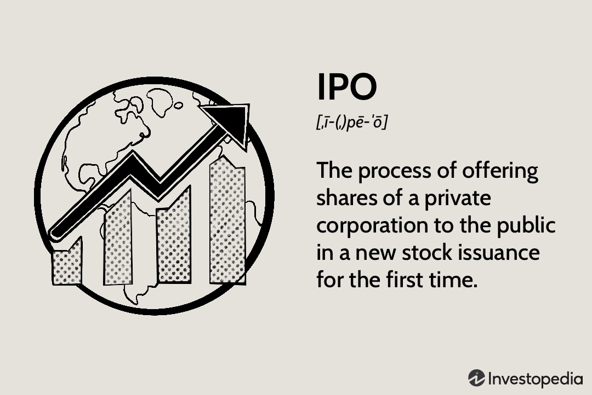

The intersection of financial markets, aftermarket performance, IPOs, and algorithmic trading forms a dynamic and intricate landscape within the investment sphere. This article examines the interplay of these components, revealing their influence on both short-term and long-term market dynamics. Financial markets provide a structure for trading a variety of assets, playing a crucial role in economic growth. IPOs, or initial public offerings, serve as a gateway for private companies to access public capital, impacting stock market behavior significantly, especially in the form of aftermarket performance, which assesses the stock's performance once it begins trading publicly. 

Algorithmic trading introduces another layer by utilizing computer algorithms to execute trades with speed and precision, optimizing efficiency and exploiting minor market inefficiencies. This technological approach has revolutionized market participation, providing both opportunities and challenges for investors globally. Understanding these complex interactions among financial markets, IPOs, aftermarket performance, and algorithmic trading is essential for making informed investment decisions, as they collectively shape the economic landscape. By highlighting the benefits and challenges associated with each element, this analysis aims to equip investors with valuable insights for navigating today’s intricate markets.

## Table of Contents

## Understanding Financial Markets

Financial markets are foundational components of the global economy, facilitating the flow of capital and aiding in the efficient allocation of resources. They provide a platform where buyers and sellers can exchange financial instruments, including stocks, bonds, exchange-traded funds (ETFs), commodities, and other tradable assets. The role of these markets extends beyond mere trading activities; they are crucial for establishing asset prices through the mechanism of supply and demand.

Stocks represent ownership in a company and confer a claim on part of the company’s assets and profits. Bonds are debt securities that obligate the issuer to pay the bondholder a specified sum of money at certain intervals and repay the principal at maturity. ETFs are investment funds traded on stock exchanges, much like stocks, and typically track an index, commodity, or a basket of assets. Commodities, physical goods such as gold, oil, or agricultural products, are traded on specialized exchanges.

The efficient functioning of financial markets is paramount to economic growth and development. Efficiency is often classified into three forms:

1. **Allocative Efficiency**: Financial markets are allocatively efficient if capital is distributed to the most productive investments.

2. **Operational Efficiency**: This ensures that transactions are conducted smoothly and at minimal cost, which is essential for brisk market activity.

3. **Informational Efficiency**: Markets are informationally efficient if prices reflect all available information. This allows investors to make informed decisions without the need for exhaustive personal research.

Moreover, the stability of financial markets underpins confidence in economic systems. Stability refers to the absence of excessive [volatility](/wiki/volatility-trading-strategies) and the capability to absorb shocks without widespread disruption. Market stability is vital for maintaining investor confidence, which in turn fosters capital formation and innovation.

In summary, financial markets are integral to the functioning of the global economy, enabling [liquidity](/wiki/liquidity-risk-premium) and price determination across various asset classes. Their efficiency and stability are essential for sustaining economic growth, reducing the cost of capital, and fostering a fair allocation of resources. These characteristics collectively enhance trust in financial systems, supporting overall economic resilience and prosperity.

## Aftermarket Performance: Definition and Importance

Aftermarket performance refers to the behavior of a company's stock in the public market following its initial public offering (IPO). This phase is critical as it measures the stock price movements after the shares are released to public investors. Aftermarket performance serves as an indicator of how well the market receives the newly public company. The trajectory of the stock post-IPO is scrutinized by investors to assess the company's future prospects and overall market confidence.

The significance of aftermarket performance lies in its ability to influence investor sentiment and future capital-raising capabilities. A robust aftermarket performance often reflects market confidence and acceptance, indicating that investors believe in the company's growth potential and valuation. This positive sentiment can lead to further investment and opportunities for the company to raise additional capital through secondary offerings or debt instruments.

Conversely, poor aftermarket performance can signal potential issues within the company or a mismatch between the offering price and market perception. Such scenarios may lead to a decline in investor confidence, making it challenging for the company to attract further investment. It could also indicate that the IPO was overpriced, leading to an initial surge followed by a downward correction.

The initial days of trading post-IPO are marked by significant volatility as investors reassess the company's value based on new information and market conditions. This volatility can present both opportunities and risks for investors looking to capitalize on the stock's movement. Understanding these dynamics is crucial for investors and companies to effectively navigate the complexities of the public markets.

## The Impact of IPOs on Financial Markets

IPOs, or Initial Public Offerings, serve as a gateway for companies to transition from private to public ownership, thereby accessing a broader pool of capital from investors. This process is pivotal for companies aiming to expand and bolster their market presence. For investors, IPOs provide an opportunity to invest in companies with the prospect of growth and capital appreciation.

The price dynamics during the initial trading days post-IPO are critical. A stock's performance during this period can influence market perception and future valuations. When a stock is initially offered, the underwriters set an issuance price, which serves as a reference point. Once trading begins, the market forces of supply and demand determine the stock's price. A substantial first-day price increase can suggest strong investor interest and optimism about the company's prospects, potentially positively impacting future valuations. Conversely, a decline might indicate skepticism or overvaluation concerns.

Historically, IPOs are characterized by notable volatility. This volatility can arise from multiple factors, including market conditions, investor sentiment, and the specific characteristics of the company going public. Investors often weigh these variables when deciding whether to invest in an IPO. High volatility can present both opportunities and risks. For instance, rapid price movements might offer potential gains, but they can also lead to significant losses if market expectations are not met.

The effects of IPOs on the financial markets aren't limited to individual stocks. IPOs can also influence market indices and investor behavior. For instance, a series of successful IPOs might boost overall market confidence, encouraging more companies to go public and spurring increased investment activity.

In summary, the introduction of new companies through IPOs has a substantial impact on financial markets, affecting individual stock valuations and broader market dynamics. Investors considering IPOs must be cognizant of the inherent volatility and perform diligent analysis to make informed investment decisions. Understanding these price dynamics and their implications is essential for navigating the opportunities and challenges presented by IPOs in financial markets.

## Algorithmic Trading: Revolutionizing Market Participation

Algorithmic trading, often referred to as algo trading, utilizes computer algorithms to execute trades automatically on financial markets. These algorithms operate based on predefined criteria such as timing, price, quantity, or any mathematical model, enabling trades to occur with high precision and speed. This significant advantage over manual trading methods lies in the ability to reduce human error and enhance efficiency, particularly when capitalizing on small and transient market inefficiencies.

Historically, [algorithmic trading](/wiki/algorithmic-trading) was predominantly the domain of institutional investors like investment banks, hedge funds, and other financial institutions. These entities could afford the costly infrastructure and technological expertise required to design and maintain sophisticated trading systems. However, advancements in technology and the proliferation of trading platforms have democratized access to algorithmic trading, extending its reach to individual investors and smaller trading firms.

The core advantage of algorithmic trading comes from its capability to process large volumes of data rapidly and execute orders faster than any human trader could. By implementing these systems, traders can react to market conditions as soon as they occur, exploiting pricing discrepancies before they vanish. For instance, an algorithm might be designed to scan for [arbitrage](/wiki/arbitrage) opportunities, instantly buying an undervalued asset on one exchange while selling it at a higher price on another, thus securing a profit.

Algorithmic trading strategies typically fall into a few main categories:

1. **Trend-following Strategies**: These algorithms identify and capitalize on market trends, making use of moving averages, channel breakouts, or related technical indicators without trying to predict the direction of future prices.

2. **Arbitrage**: This involves exploiting price differentials in identical or similar instruments across different markets or in different forms, leveraging the price discrepancy until it disappears.

3. **Market-making**: Algorithms provide liquidity to the market by simultaneously posting buy and sell orders, profiting from the bid-ask spread. They are especially prevalent in high-frequency trading environments.

4. **Mean Reversion**: These algorithms assume that the price of an asset will revert to its mean or average price. The algorithm employs statistical analysis to identify situations where the price has deviated significantly from its historical average.

5. **Beyond Technical Models**: Real-time data analysis, such as news sentiments, social media trends, and other alternative datasets, can feed into algorithms for decision-making processes, enhancing the predictive power of trading strategies.

For individual traders interested in deploying algorithmic strategies, the availability of various computational tools and user-friendly platforms like MetaTrader, NinjaTrader, and various APIs supports more accessible algo trading. These platforms often include built-in strategy [backtesting](/wiki/backtesting) capabilities, allowing traders to test the viability of their strategies before deployment in live markets. Additionally, algorithmic trading communities and forums provide collaborative spaces for traders to share code, strategies, and insights.

As an advanced trading technique, while algorithmic trading boasts various advantages, it also demands a comprehensive understanding of financial markets, mathematical modeling, and programming knowledge. Traders must rigorously test and validate their algorithms to ensure their strategies perform under different market conditions and adhere to risk management guidelines.

The ongoing evolution of algorithmic trading reflects a broader shift towards automation and data-driven decision-making in financial markets. This trend underscores the importance for participants at all levels to enhance their technical skills and adapt to an increasingly algorithm-reliant trading environment.

## Role of Algo Trading in Improving Aftermarket Performance

Algorithmic trading has emerged as a powerful tool for enhancing aftermarket performance, particularly in the period following an initial public offering (IPO). Through the use of sophisticated algorithms, traders can analyze extensive datasets to make more accurate predictions about price movements. This capability allows market participants to adjust their strategies in real-time, thereby potentially improving the stability and liquidity of stock prices after they begin trading on the open market.

Algorithms in trading operate by executing buy and sell orders automatically based on predetermined criteria, which could include factors such as stock price movements, trading [volume](/wiki/volume-trading-strategy), or economic indicators. By utilizing [machine learning](/wiki/machine-learning) and statistical methods, these algorithms can identify patterns and trends that might not be immediately apparent to human traders. For example, an algorithm might be trained to recognize the specific conditions under which a newly listed stock is likely to experience rapid price increases or declines. 

One of the primary benefits of algorithmic trading in the context of IPOs is its ability to stabilize stock prices. As traditional trading can be somewhat erratic in the immediate aftermath of an IPO—often due to speculative trading, limited historical data, or over/underestimation of demand—algorithmic trading helps in damping extreme volatility through rapid and efficient execution of trades. 

In terms of liquidity, algorithms can substantially enhance market fluidity by increasing the number of trades executed within short time frames. This not only benefits individual stocks but also contributes to overall market efficiency, enabling a larger number of participants to enter and [exit](/wiki/exit-strategy) positions with ease.

Despite these advantages, certain risks are inherent in algorithmic trading, necessitating regulatory oversight. For instance, the possibility of technical glitches, erroneous trades, or unintended market manipulation exists. Recognizing these risks, regulatory bodies have established stringent guidelines to ensure that such activities do not undermine market stability. Measures include mandatory reporting of algorithmic trading activities, setting circuit breakers to prevent severe market disruptions, and ensuring that algorithm design adheres to ethical standards.

Overall, while the potential of algorithmic trading to enhance aftermarket performance is significant, it is accompanied by a responsibility to uphold market integrity and investor protection. Balancing these aspects remains essential for maintaining the trust and functioning of global financial markets.

## Examples and Case Studies

Peloton Interactive's initial public offering (IPO) on September 26, 2019, serves as a pertinent example of aftermarket performance patterns and the use of algorithmic trading. Following its IPO, Peloton's stock experienced significant volatility, showcasing the challenges and dynamics of aftermarket performance. Initially priced at $29 per share, Peloton's stock fluctuated in value due to various market conditions and investor sentiment. This fluctuation highlighted the critical role of algorithmic trading in managing such volatility and optimizing returns.

Algorithmic trading, which utilizes complex algorithms to analyze vast datasets and execute trades, can be instrumental in stabilizing stock prices post-IPO by enhancing liquidity and reducing price volatility. In the case of Peloton, algorithmic trading systems may have been used to respond swiftly to market conditions and investor behaviors, such as increased selling pressure or sudden shifts in demand for the stock. By executing trades with precision and speed, these algorithms potentially helped in balancing supply and demand, thereby contributing to a more stable stock price.

Furthermore, analyzing the historical performance of IPOs over the past decades provides insights into the general behavior of newly public stocks. A study of IPO trends indicates that these stocks often exhibit high volatility in their early trading days, with initial returns that can either be sharply positive or negative. This pattern is elucidated further by the "IPO underpricing" phenomenon where the offering price is set below the actual market price, leading to a surge in initial returns predominantly captured by algorithmic trading entities that capitalize on such pricing inefficiencies.

For instance, data from 1980 to 2020 reveals that the average first-day return (underpricing) for IPOs was approximately 18%. This significant average indicates the potential for substantial returns in the aftermarket. However, long-term performance tends to stabilize, with many IPOs underperforming the market after the initial excitement subsides. Algorithmic trading strategies that incorporate historical data and predictive analytics may mitigate risks associated with these patterns, optimizing trade executions not only during the immediate aftermath of the IPO but also in the longer term by leveraging [statistical arbitrage](/wiki/statistical-arbitrage) and other advanced trading techniques.

In summary, the case of Peloton Interactive illustrates the complexities of aftermarket performance and underscores the strategic importance of algorithmic trading in navigating these post-IPO periods. By examining historical IPO performance data and the role of algorithmic systems, investors can gain a deeper understanding of how to effectively manage and potentially capitalize on the inherent volatility associated with new stock issues.

## Risks and Limitations of Algorithmic Trading for IPOs

Algorithmic trading in the context of IPOs presents several inherent risks and limitations that market participants must recognize. A primary concern involves the potential for market manipulation. Algorithmic strategies can execute large volumes of trades in milliseconds, creating the possibility of influencing stock prices artificially. This manipulation can lead to distorted market signals and impact investor psychology, potentially skewing the fair valuation of newly-listed companies.

The lack of human oversight is another inherent risk associated with algorithmic trading. Algorithms operate based on pre-set parameters and are devoid of the intuition and adaptability that human traders possess. This rigidity can lead to significant losses if the algorithm encounters market conditions for which it is not programmed. For instance, unexpected geopolitical events or abrupt market shifts can result in substantial deviations from expected performance.

Technical failures also pose significant risks. Algorithmic trading systems rely heavily on complex software and hardware structures. Even minor glitches can lead to erroneous trades or complete system malfunctions. A notable example is the 2012 Knight Capital incident, where a software error resulted in a $440 million loss for the firm within 45 minutes due to unintentional trades triggered by a faulty algorithm.

To manage these risks effectively, investors and traders employing algorithmic strategies in IPOs must implement robust risk management and safety precautions. This includes rigorous testing of algorithms under diverse market scenarios, continuous monitoring of algorithm performance, and establishing fail-safe mechanisms such as circuit breakers to halt trading during unexpected anomalies.

Moreover, algorithms should be designed with adaptability in mind, allowing for updates and revisions as market conditions evolve. Incorporating machine learning techniques can enhance the adaptive capabilities of trading algorithms, giving them the potential to adjust their strategies based on real-time data analysis.

Risk mitigation also involves regulatory compliance. Traders must ensure their algorithms conform to market regulations, which may include limits on order frequencies and volumes to prevent abusive practices. Engaging with regulatory bodies and adhering to guidelines can further secure algorithmic operations and maintain market integrity.

In summary, while algorithmic trading offers efficiency and precision, recognizing and addressing its risks is vital for maintaining stable and fair IPO market conditions. Through diligent oversight, technological safeguards, and regulatory alignment, the potential pitfalls of algorithmic trading can be effectively minimized.

## Regulatory and Ethical Considerations

Algorithmic trading, particularly in the context of Initial Public Offerings (IPOs), entails a complex interplay of technology, finance, and regulatory frameworks. Regulatory and ethical considerations are crucial to maintaining market integrity and fairness, addressing potential risks associated with these trading strategies.

Regulatory bodies around the world, such as the U.S. Securities and Exchange Commission (SEC), the Commodities Futures Trading Commission (CFTC), and the European Securities and Markets Authority (ESMA), have established guidelines and rules to oversee algorithmic trading activities. These regulations aim to prevent excessive volatility and market disruptions that could arise from high-frequency and algorithmic trading practices. Key regulations often include requirements for pre-trade risk controls, system testing and supervision, and robust mechanisms to ensure order execution accuracy.

To maintain market stability, regulators require trading firms to implement safeguards such as circuit breakers and dynamic price bands. Circuit breakers temporarily halt trading if a security's price moves too sharply within a short period, allowing time for information assimilation and preventing panic selling or buying. Dynamic price bands limit the range within which a security can be traded in a given time frame, thus curbing extreme price fluctuations initiated by algorithmic traders.

Ethically, algorithmic trading in IPOs demands a commitment to transparency and responsible algorithm design. Trading algorithms should be designed to operate in a manner that does not exploit market inefficiencies to the detriment of the market's overall health. Responsible design includes rigorous back-testing, regular updates, and fail-safes to prevent unintended consequences, such as those seen in events like the 2010 Flash Crash. This event, which resulted in a rapid and deep drop in stock prices before a quick recovery, underscored the necessity for stringent ethical and regulatory standards.

Transparency in algorithmic trading involves the clear communication of trading intentions and methodologies to regulatory bodies and, when appropriate, to the broader market. This transparency builds trust among market participants and ensures that all stakeholders are informed of the potential impacts of trading activities.

In conclusion, regulatory and ethical considerations play a pivotal role in the orderly functioning of algorithmic trading in IPOs. By ensuring adherence to robust regulations and fostering a culture of ethical trading practices, the financial markets can leverage algorithmic trading's benefits while minimizing potential risks.

## The Future of IPOs and Algorithmic Trading

The evolving landscape of Initial Public Offerings (IPOs) and algorithmic trading is poised for dynamic growth, fueled by technological innovation and adaptive regulatory frameworks. Technological advancements, particularly in [artificial intelligence](/wiki/ai-artificial-intelligence) and machine learning, are set to refine algorithmic trading strategies, enhancing their predictive accuracy and execution speed. These technologies enable the processing of massive datasets in real-time, offering traders insights for more informed decision-making. Moreover, the integration of blockchain technology can improve transparency and reduce operational inefficiencies, making the IPO process more accessible.

Regulatory frameworks are becoming increasingly crucial in supporting the sustainable growth of algorithmic trading within IPO markets. Regulatory bodies are focusing on ensuring market stability by setting guidelines that prevent flash crashes and reduce systemic risks. As such, regulations are adapting to cover the ethical design and deployment of trading algorithms, with emphasis on transparency and fairness.

Investors and firms must stay informed and agile to leverage future challenges and opportunities effectively. Continuous learning and adaptation to technological changes are vital for maximizing potential returns while mitigating risks associated with algorithmic trading. Moreover, fostering collaborations between technology providers and financial institutions can accelerate innovation, ultimately redefining how IPOs are conducted and traded.

In conclusion, the future of IPOs and algorithmic trading signifies a paradigm shift towards more efficient and transparent markets. Stakeholders need to embrace technological advancements and engage with evolving regulatory frameworks to capitalize on emerging opportunities while safeguarding market integrity.

## Conclusion

The interplay between financial markets, aftermarket performance, IPOs, and algorithmic trading constitutes a sophisticated ecosystem that offers substantial opportunities for informed investors. The interconnected nature of these components requires a comprehensive understanding to strategically navigate the investment landscape effectively. Recognizing the nuances of how IPOs introduce volatility and set the stage for long-term valuations is critical for making informed decisions. Algorithmic trading further complicates this landscape with its capabilities for rapid, data-driven trading decisions, which can enhance market liquidity and stabilize price movements post-IPO.

To maximize potential benefits, investors must engage in continuous education, staying abreast of technological advancements and regulatory changes that shape the market environment. An informed approach facilitates the prudent application of investment strategies, allowing market participants to adapt to unfolding market dynamics and mitigate associated risks effectively.

Investors who can skillfully leverage the synergies between IPO dynamics, aftermarket performance evaluations, and the precision of algorithmic trading stand to gain a competitive edge. However, it is imperative that they maintain a careful, ethical approach that aligns with evolving regulatory standards to safeguard market integrity and sustain long-term success.

## References & Further Reading

[1]: Ritter, J. R. (2003). ["Differences between European and American IPO markets."](https://onlinelibrary.wiley.com/doi/abs/10.1111/1468-036X.00230)00069-2) European Financial Management, 9(4), 421-434.

[2]: Sherman, A. E. (2005). ["Global trends in IPO methods: Book building versus auctions."](https://people.bath.ac.uk/mnsrf/teaching%202010/IB/Literature/L4-underpricing/IPO/sherman.pdf) Journal of Corporate Finance, 11(1-2), 62-79.

[3]: Lopez de Prado, M. (2018). ["Advances in Financial Machine Learning"](https://www.amazon.com/Advances-Financial-Machine-Learning-Marcos/dp/1119482089) John Wiley & Sons.

[4]: Narang, R. K. (2009). ["Inside the Black Box: The Simple Truth About Quantitative Trading"](https://onlinelibrary.wiley.com/doi/book/10.1002/9781118267738) John Wiley & Sons.

[5]: Parsons, J. E. (1988). ["Estimating the Underpricing of Initial Public Offerings: The Case of Inadequate Price History."](https://www.jstor.org/stable/2328890)90005-9) Journal of Banking & Finance, 12(3-4), 355-372.

[6]: Harris, T. (2003). ["Algorithmic Trading and DMA: An Introduction to Direct Access Trading Strategies"](https://archive.org/details/algorithmictradi0000john) Apress.

[7]: Chan, E. P. (2009). ["Quantitative Trading: How to Build Your Own Algorithmic Trading Business"](https://github.com/ftvision/quant_trading_echan_book) John Wiley & Sons.