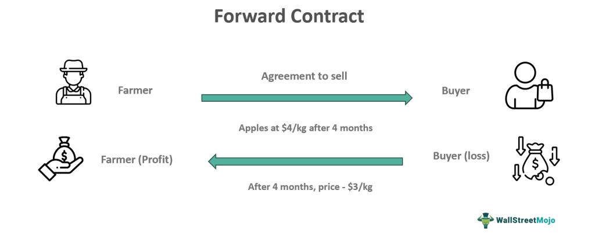

Financial derivatives represent a fundamental component of modern financial markets, functioning as sophisticated instruments that cater to hedging, speculation, and arbitrage needs. These complex financial products derive their value from the performance of underlying assets, such as stocks, bonds, commodities, or currencies. Among the array of derivatives, forward contracts hold a distinctive position. Their bespoke nature and inherent flexibility allow two parties to mutually agree on a transaction involving an asset at a future date, with the price determined at the inception of the contract. This tailoring capability sets forward contracts apart from standardized instruments like futures.

The evolution of technology has significantly influenced the trading landscape, with algorithmic trading emerging as a transformative force in the execution of financial contracts, including forwards. Algorithmic trading utilizes sophisticated computer programs to automate trading decisions, facilitating efficient and rapid trade execution while minimizing human intervention errors. This advancement enhances participants' ability to navigate volatile markets and execute trades with precision.



This article examines the dynamics surrounding financial derivatives, focusing on forward contracts' initial valuation intricacies. It highlights how algorithmic trading not only streamlines the execution process of these contracts but also optimizes trading strategies, providing market participants with a competitive edge in dynamic financial environments. Through this exploration, we aim to elucidate the integral role of forward contracts and algorithmic trading in contemporary financial market operations.

## Table of Contents

## Understanding Financial Derivatives and Forward Contracts

Financial derivatives are financial instruments whose value is dependent on the value of an underlying asset, which can include stocks, bonds, commodities, or foreign currencies. These derivatives serve as pivotal tools for risk management, speculation, and portfolio diversification. They enable investors to hedge against potential adverse price movements of the underlying assets, thereby safeguarding investments and optimizing returns.

Forward contracts are a specific type of financial derivative that represent customized agreements between two parties. In these contracts, the parties agree to either purchase or sell a particular asset at a predetermined price on a specified future date. This bespoke nature of forward contracts sets them apart from standardized futures contracts, which are traded on exchanges and involve standardized terms. The customization of forward contracts offers flexibility in terms and conditions, allowing parties to tailor the contract to their specific needs. As forward contracts are traded over-the-counter (OTC), they are not subject to the regulation and transparency typical of exchange-traded derivatives, which can introduce counterparty risk.

Derivatives, such as forward contracts, are essential tools in financial markets for several reasons. Firstly, they allow hedging against price risks, enabling businesses and investors to lock in prices and protect themselves from adverse price movements. For instance, a commodity producer might use a forward contract to secure a selling price for their product, insulating themselves from potential price declines in the future. Secondly, these derivatives facilitate investment strategies that seek to exploit pricing inefficiencies and earn returns, without necessarily owning the underlying asset. Lastly, they support strategic asset allocation and diversification by providing exposure to different asset classes, which can enhance the risk-return profile of an investment portfolio.

In summary, financial derivatives, and forward contracts in particular, play a crucial role in financial markets by providing mechanisms for risk management and investment strategy execution. Their flexibility and customization make them indispensible for parties needing tailored risk management solutions, despite the associated counterparty risks that arise from their OTC nature.

## Algorithmic Trading in Forward Contracts

Algorithmic trading leverages sophisticated computer programs to automate trading decisions, thereby enhancing efficiency and minimizing human error during the execution of trades. This method is particularly advantageous in the context of forward contracts, which are specialized financial agreements arranged over-the-counter (OTC) between two parties to transact an asset at a specific future date for a pre-agreed price.

One of the key benefits of [algorithmic trading](/wiki/algorithmic-trading) is its capacity to facilitate high-frequency trading ([HFT](/wiki/high-frequency-trading-strategies)) strategies. Such strategies allow the rapid execution of a large number of trades, often executed within microseconds, based on real-time data analysis. This speed and precision are crucial in capitalizing on fleeting market opportunities that may not be perceptible or accessible through manual trading efforts.

Algorithmic trading systems are typically designed to incorporate various predictive models, utilizing [machine learning](/wiki/machine-learning) and statistical analysis, to anticipate price movements and optimize trading decisions. These models analyze historical price data, correlations among different assets, and other market indicators to predict future price trends. For example, a common technique involves using regression analysis to estimate the relationship between the prices of underlying assets and to identify potential [arbitrage](/wiki/arbitrage) opportunities.

The integration of algorithmic trading in the management of forward contracts significantly enhances traders' ability to effectively exploit market conditions. By automating the execution process, traders can swiftly respond to market movements, adjust their positions, and hedge risks more dynamically than traditional manual methods allow. This adaptability is particularly vital given the bespoke nature of forward contracts, where specific terms and conditions can vary widely from one contract to another.

In conclusion, algorithmic trading not only increases the execution efficiency of forward contracts but also improves the strategic exploitation of market data. By using advanced analytical models, traders are better equipped to manage their portfolios, reduce exposure to undesirable risks, and maximize potential returns in a competitive financial environment.

## The Importance of Risk Management in Algo Trading

Risk management holds a pivotal role in algorithmic trading, where the rapid pace and complexity of the market can lead to significant financial risks. The integration of automated systems and algorithms in trading means that even minor errors can escalate quickly, highlighting the necessity of comprehensive risk management strategies to safeguard investments.

A dynamic risk management framework is essential for adapting to fluctuating market conditions. This framework should comprehensively address various risks such as technical errors, market [volatility](/wiki/volatility-trading-strategies), operational mishaps, and behavioral biases. Technical risks often stem from software glitches or hardware failures that can disrupt trading operations. To mitigate these, robust system testing and real-time monitoring are necessary. Market risks arise due to price volatility and fluctuating asset values; these can be managed by diversifying trading strategies and ensuring that algorithms are robustly designed to handle abrupt market changes.

Operational risks encompass human errors and procedural breakdowns. Automating certain processes can help minimize these risks, although continual oversight is still necessary to ensure smooth operation. Behavioral risks, involving human biases and irrational decision-making, can be mitigated by implementing strict trading rules embedded within the algorithms to maintain objective decision-making.

Dynamic stop-loss and take-profit algorithms are vital components of any risk management strategy. These algorithms automatically execute trades to prevent excessive losses or secure profits when certain price levels are reached. In Python, these can be implemented using conditional statements and real-time market data:

```python
def manage_risk(current_price, stop_loss, take_profit):
    if current_price <= stop_loss:
        execute_sell_order()
        print("Stop-loss triggered: Selling to prevent losses.")
    elif current_price >= take_profit:
        execute_sell_order()
        print("Take-profit triggered: Selling to secure profits.")
```

Continuous evaluation and adaptation of risk management strategies are crucial for mitigating potential downsides in algorithmic trading. This involves regular stress-testing of the algorithms under various market scenarios to ensure resilience and effectiveness. Performing scenario analysis and Monte Carlo simulations can help in understanding how trading strategies perform under different market conditions.

In conclusion, a well-rounded risk management strategy in algorithmic trading requires a multi-faceted approach that encompasses technical, market, operational, and behavioral aspects. By employing dynamic algorithms and continuous evaluation, traders can protect against unforeseen events and maintain successful trading operations in volatile markets.

## Risk Management Strategies for Forward Contracts

Effective risk management strategies are critical when dealing with forward contracts due to the inherent risks associated with price volatility, counterparty reliability, and market fluctuations. One primary strategy involves hedging against price volatility to provide a safeguard against adverse price movements. This can be achieved through techniques like taking offsetting positions in related securities or using options to cap potential losses. By locking in prices through forward contracts, traders can effectively hedge against the unpredictability of market prices, thereby securing profit margins.

Dynamic algorithms play a vital role in optimizing entry and [exit](/wiki/exit-strategy) points by responding to real-time market conditions. These algorithms analyze a myriad of market data to adjust trading parameters dynamically, enhancing the ability to manage risks associated with trading positions. A practical approach in this context is to utilize statistical models or machine learning techniques to predict short-term price movements, thereby maximizing returns and minimizing risks. For example, traders can use Python code to implement machine learning models for predicting price trends:

```python
import pandas as pd
from sklearn.model_selection import train_test_split
from sklearn.ensemble import RandomForestRegressor

# Load historical data
data = pd.read_csv('historical_prices.csv')
features = data[['feature1', 'feature2', 'feature3']]
targets = data['price']

# Split data into training and test sets
X_train, X_test, y_train, y_test = train_test_split(features, targets, test_size=0.2, random_state=42)

# Train random forest model
model = RandomForestRegressor(n_estimators=100, random_state=42)
model.fit(X_train, y_train)

# Predict prices
predictions = model.predict(X_test)
```

Regular evaluation and stress-testing of algorithms are crucial to ensure resiliency across varied market conditions. Stress tests simulate extreme market scenarios, assessing how trading strategies and algorithms perform under pressure. By frequently conducting these evaluations, traders can identify vulnerabilities in their strategies and make necessary adjustments to reinforce robustness.

Diversification is another key strategy in managing risks associated with forward contracts. By adopting a strategic mix of assets, traders can disperse exposure to individual asset risks, thereby enhancing the overall risk-adjusted returns. Diversifying trading portfolios across different assets, sectors, and geographies helps mitigate specific risks associated with economic, political, or sectoral events.

These multilayered risk management strategies collectively form a robust framework for handling forward contracts, ensuring that traders remain resilient and well-positioned to capitalize on favorable market opportunities while mitigating potential downsides.

## Case Study: Utilizing Forward Contracts in Algorithmic Trading

A commodity trading firm leverages forward contracts within an algorithmic trading framework to navigate and capitalize on fluctuating market conditions. By employing advanced predictive analytics, the firm optimizes its trading strategies and effectively manages risks associated with price volatility. Predictive analytics involve analyzing historical and real-time data to generate insights and forecast future price trends. This enables the firm to make informed trading decisions, and consequently, enhance its overall trading performance.

One of the primary tools utilized by the firm is the Monte Carlo simulation, a robust risk assessment model that allows for the simulation of various market scenarios. Monte Carlo simulations involve generating random variables to model the behavior of complex systems and assess the impact of risk. In the context of forward contracts, these simulations help stress-test trading strategies under different assumptions, thereby providing a comprehensive view of potential outcomes. This approach aids in identifying the optimal trading strategy that maximizes expected returns while minimizing risk exposure.

The integration of forward contracts with algorithmic trading allows the firm to exploit arbitrage opportunities effectively. Arbitrage involves taking advantage of price discrepancies between different markets or instruments. The firm's algorithmic trading systems are designed to execute trades rapidly and efficiently, capitalizing on these discrepancies before they can be corrected by the market. The ability to execute trades based on real-time data ensures that the firm remains competitive and agile in a fast-paced trading environment.

By combining predictive analytics, algorithmic trading, and forward contracts, the firm demonstrates the efficacy of this approach in managing risks and enhancing trading performance. The case underscores the importance of adopting advanced technological solutions and dynamic risk management models to navigate the challenges associated with modern financial markets. This strategic integration not only mitigates potential downsides but also provides a substantial edge in achieving financial success through well-informed trading decisions and optimized risk management strategies.

## Conclusion

The integration of forward contracts with algorithmic trading offers significant opportunities for managing financial risks and optimizing trading strategies. Forward contracts, characterized by their customizable nature, can be effectively utilized alongside automated trading systems to exploit market efficiencies and improve financial outcomes. The individualized terms of forward contracts allow traders to tailor their risk exposure, while algorithmic trading enhances the precision and speed of executing these tailored strategies.

A comprehensive risk management framework is essential to address the complexities introduced by trading algorithms and ensure resilient trading operations. As algorithmic systems can process massive volumes of data and execute trades at lightning speed, they introduce novel challenges, such as technological malfunctions and unanticipated market shifts. Therefore, traders must adopt robust risk management strategies, incorporating tools such as dynamic stop-loss orders and take-profit mechanisms that adjust based on real-time market data. These mechanisms help mitigate potential downside risks, maintaining trading operations even amidst market volatility.

Dynamic risk management tools, coupled with a diversified trading portfolio, are vital for safeguarding investments and sustaining trading success. Portfolio diversification spreads risk across various assets, reducing the impact of adverse price movements in any single market segment. This diversification, combined with the ability to rapidly respond to market changes through algorithmic trading, strengthens the position of traders against the vicissitudes of the financial markets.

By leveraging the advanced capabilities of algorithmic trading, market participants gain a strategic edge, maximizing the benefits of forward contracts in dynamic financial markets. Algorithmic systems enable traders to execute complex, data-driven strategies that take advantage of temporal market inefficiencies and arbitrage opportunities. In concert with the flexibility of forward contracts, algorithmic trading platforms provide the tools necessary to navigate the challenges of modern finance, enhancing both risk management and potential returns.

## References & Further Reading

- Hull, J. C. (2017). *Options, Futures, and Other Derivatives*. Pearson Education. This comprehensive book provides a detailed examination of various financial derivatives, including forward contracts. It serves as an essential resource for understanding the principles and applications of derivatives in financial markets.

- Aldridge, I. (2013). *High-Frequency Trading: A Practical Guide to Algorithmic Strategies and Trading Systems*. Wiley. Aldridge's work offers a practical insight into the world of high-frequency trading and algorithmic strategies, making it a valuable resource for those looking to understand the intricacies of algorithmic trading.

- Tsay, R. S. (2005). *Analysis of Financial Time Series*. Wiley-Interscience. This book focuses on time series analysis relevant to financial data, providing methodologies and case studies that are crucial for developing predictive models employed in algorithmic trading.

- Cartea, Á., Jaimungal, S., & Penalva, J. (2015). *Algorithmic and High-Frequency Trading*. Cambridge University Press. The authors provide a thorough exploration of algorithmic trading strategies, offering theoretical and practical insights valuable to traders involved with forward contracts and similar derivatives.

- Lewis, M. (2014). *Flash Boys: A Wall Street Revolt*. W. W. Norton & Company. This narrative explores the rise of high-frequency trading and its impact on financial markets, highlighting the transformative role of technology in trading systems.

- Hasbrouck, J. (2007). *Empirical Market Microstructure: The Institutions, Economics, and Econometrics of Securities Trading*. Oxford University Press. Hasbrouck presents in-depth research on the microstructure of financial markets, offering a foundational understanding that is vital for anyone interested in market dynamics and trading strategies.

- Hull, J. C., & Basu, S. (2019). *Risk Management and Financial Institutions*. Wiley. This text provides a comprehensive guide to risk management techniques applicable to forward contracts and algorithmic trading, covering the complexities and strategies for effective risk management in financial institutions.