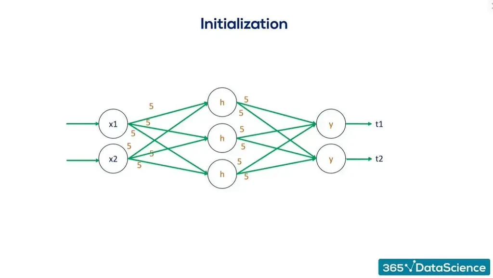

## Table of Contents

## What is initialization in the context of machine learning?

Initialization in machine learning refers to the process of setting the initial values of the parameters or weights in a model before the training begins. These parameters are crucial because they influence how the model learns from the data. If the initial values are set poorly, it can lead to slow convergence or even prevent the model from learning effectively. For example, in neural networks, the weights are often initialized randomly to break symmetry and allow the network to learn different features from the input data.

One common method for initializing weights in neural networks is the use of the Xavier/Glorot initialization. This method sets the initial weights so that the variance of the outputs of each layer is the same as the variance of its inputs. The formula for Xavier initialization for a layer with $$n_{in}$$ inputs and $$n_{out}$$ outputs is $$W \sim U\left[-\sqrt{\frac{6}{n_{in} + n_{out}}}, \sqrt{\frac{6}{n_{in} + n_{out}}}\right]$$, where $$W$$ are the weights and $$U$$ represents a uniform distribution. This helps in maintaining a stable gradient during backpropagation, which can lead to faster and more reliable training of the network.

Another important aspect of initialization is the bias terms. Often, biases are initialized to zero or a small constant value. This is because the bias term shifts the activation function, and initializing it to zero allows the network to start learning from a neutral position. Proper initialization of both weights and biases is essential for the model to start on the right path and achieve good performance during training.

## Why is proper initialization important for training neural networks?

Proper initialization is important for training neural networks because it helps the network learn faster and more effectively. When the weights and biases are set correctly at the start, the network can begin learning from a good starting point. If the initial values are too large or too small, it can cause problems like slow learning or getting stuck. For example, if weights are too large, the gradients during backpropagation might become too big, causing the network to overshoot the optimal solution. On the other hand, if weights are too small, the gradients might become too small, making the learning process very slow.

One common method for initializing weights is called Xavier initialization. This method helps keep the variance of the outputs of each layer the same as the variance of its inputs, which can lead to more stable learning. The formula for Xavier initialization is $$W \sim U\left[-\sqrt{\frac{6}{n_{in} + n_{out}}}, \sqrt{\frac{6}{n_{in} + n_{out}}}\right]$$, where $$W$$ are the weights, $$U$$ represents a uniform distribution, $$n_{in}$$ is the number of inputs to the layer, and $$n_{out}$$ is the number of outputs. By using this method, the network can avoid issues like vanishing or exploding gradients, making it easier for the model to converge to a good solution.

## What is Xavier initialization and how does it work?

Xavier initialization is a way to set the starting values of the weights in a [neural network](/wiki/neural-network). It helps the network learn better by making sure the signals passing through the network don't get too big or too small. This is important because if the signals are too big, the network might have trouble learning, and if they are too small, the network might learn very slowly. The idea behind Xavier initialization is to keep the variance of the inputs and outputs of each layer the same. This helps the network learn at a good speed and makes it easier for the network to find the best solution.

The formula for Xavier initialization is $$W \sim U\left[-\sqrt{\frac{6}{n_{in} + n_{out}}}, \sqrt{\frac{6}{n_{in} + n_{out}}}\right]$$. Here, $$W$$ represents the weights, $$U$$ means a uniform distribution, $$n_{in}$$ is the number of inputs to the layer, and $$n_{out}$$ is the number of outputs from the layer. By using this formula, the weights are chosen from a range that helps keep the signals balanced. This method is simple to use and works well for many types of neural networks, making it a popular choice for initializing weights.

## How does Kaiming initialization differ from Xavier initialization?

Kaiming initialization, also known as He initialization, is another way to set the starting values of weights in neural networks, but it's different from Xavier initialization. Kaiming initialization is designed to work well with layers that use the ReLU activation function. ReLU is a popular activation function because it helps the network learn faster and can handle larger networks. The main difference is that Kaiming initialization takes into account the fact that ReLU sets half of its inputs to zero, so it adjusts the scale of the weights to keep the signals strong.

The formula for Kaiming initialization is $$W \sim U\left[-\sqrt{\frac{6}{n_{in}}}, \sqrt{\frac{6}{n_{in}}}\right]$$ for a uniform distribution, and $$W \sim N(0, \sqrt{\frac{2}{n_{in}}})$$ for a normal distribution. Here, $$W$$ represents the weights, $$U$$ means a uniform distribution, $$N$$ means a normal distribution, and $$n_{in}$$ is the number of inputs to the layer. This formula helps keep the variance of the layer's outputs the same as the variance of its inputs, but it's specifically designed for ReLU. By using Kaiming initialization, the network can learn faster and more effectively, especially when using ReLU activation functions.

## What are the benefits of using Kaiming initialization for ReLU activations?

Kaiming initialization, also known as He initialization, helps neural networks learn faster when using ReLU activation functions. ReLU is special because it sets half of its inputs to zero, which can make the signals weaker as they move through the network. Kaiming initialization fixes this by adjusting the starting values of the weights to keep the signals strong. It does this by considering only the number of inputs to a layer, which is different from Xavier initialization that considers both inputs and outputs.

The formula for Kaiming initialization is $$W \sim U\left[-\sqrt{\frac{6}{n_{in}}}, \sqrt{\frac{6}{n_{in}}}\right]$$ for a uniform distribution, and $$W \sim N(0, \sqrt{\frac{2}{n_{in}}})$$ for a normal distribution. Here, $$W$$ represents the weights, $$U$$ means a uniform distribution, $$N$$ means a normal distribution, and $$n_{in}$$ is the number of inputs to the layer. By using this formula, the network can keep the variance of the layer's outputs the same as the variance of its inputs, which helps the network learn more effectively. This makes Kaiming initialization a good choice for networks that use ReLU, helping them train faster and perform better.

## Can you explain SkipInit and its purpose in neural network training?

SkipInit is a way to start training neural networks that helps them learn better. It's like giving the network a little boost at the beginning. When we train a neural network, the weights start with some initial values, and SkipInit changes how these values are set at the start. It does this by adding a small value to the weights at the beginning of training, which helps the network learn faster and more smoothly. This is especially helpful for very deep networks, where learning can be hard because the signals might get too small as they go through many layers.

The main idea behind SkipInit is to make sure the network can start learning from the very beginning. It uses a formula to add a small number to the weights, which helps the network avoid getting stuck early in training. The formula for SkipInit is $$W = W + \epsilon \cdot I$$, where $$W$$ are the weights, $$\epsilon$$ is a small number, and $$I$$ is the identity matrix. By doing this, SkipInit helps the network keep the signals strong and learn effectively from the start, making it easier to train deep neural networks.

## What is Fixup initialization and how does it address the vanishing gradient problem?

Fixup initialization is a way to start training neural networks that helps them learn better, especially when they are very deep. Deep networks can have a problem called the vanishing gradient, where the signals get smaller as they go through many layers, making it hard for the network to learn. Fixup initialization fixes this by setting the weights and biases in a special way at the start. It makes sure the signals stay strong all the way through the network, so the network can learn from the very beginning.

The way Fixup initialization works is by setting the weights to zero and the biases to small values at the start. It then uses a formula to adjust these values during training. The formula for Fixup initialization is $$W = 0$$ and $$b = \epsilon$$, where $$W$$ are the weights, $$b$$ are the biases, and $$\epsilon$$ is a small number. By starting with these values, Fixup initialization helps the network avoid the vanishing gradient problem, making it easier to train deep neural networks and get good results.

## How does T-Fixup initialization improve upon the original Fixup method?

T-Fixup initialization is a better version of the original Fixup method. It helps train even deeper neural networks by making the signals stronger and more balanced as they move through the layers. The main difference is that T-Fixup uses a special way to set the starting values of the weights and biases. It starts with the weights set to zero and the biases set to small values, just like Fixup. But then, it adds a small tweak to the weights during training to make them learn faster and better. This tweak is called a "scale [factor](/wiki/factor-investing)" and it helps keep the signals strong all the way through the network.

The formula for T-Fixup initialization is $$W = 0$$ and $$b = \epsilon$$ at the start, where $$W$$ are the weights, $$b$$ are the biases, and $$\epsilon$$ is a small number. During training, T-Fixup adds a scale factor to the weights to help them adjust. This scale factor is calculated based on the layer's input and output sizes, which helps keep the signals balanced. By doing this, T-Fixup makes it easier for very deep networks to learn from the beginning and avoid problems like the vanishing gradient, which can slow down or stop learning.

## What is LSUV initialization and how is it implemented?

LSUV initialization, which stands for Layer-Sequential Unit-Variance, is a way to set the starting values of weights in a neural network. It helps the network learn faster and better by making sure the signals passing through each layer have the right strength. LSUV does this by adjusting the weights so that the variance of the outputs of each layer is close to 1. This is important because if the signals are too weak or too strong, the network might have trouble learning. LSUV helps keep the signals just right, which makes it easier for the network to find the best solution.

To implement LSUV initialization, you start by setting the weights to random values, just like with other methods. Then, you go through each layer one by one. For each layer, you pass some data through it and calculate the variance of the outputs. If the variance is not close to 1, you adjust the weights by multiplying them by a number that makes the variance closer to 1. You keep doing this for each layer until the variance is good enough. This way, LSUV makes sure every layer starts with the right signal strength, helping the whole network learn more effectively.

## How does ProxyOptimization initialization help in training deep neural networks?

ProxyOptimization initialization helps train deep neural networks by making the learning process easier and faster. It does this by setting the starting values of the weights in a special way. Instead of just using random numbers, ProxyOptimization uses a simpler version of the network to find good starting points for the weights. This simpler version is called a "proxy" and it helps the main network learn better from the very beginning. By starting with these good values, the network can avoid problems like getting stuck or learning very slowly, which can happen with other initialization methods.

The way ProxyOptimization works is by first training the proxy network with the same data that the main network will use. The proxy network is easier to train because it's simpler, so it can quickly find weights that work well. Once the proxy network is trained, its weights are used to set the starting values for the main network. This helps the main network start learning from a good place, making it easier to train deep networks and get good results.

## What are the challenges faced when choosing an initialization method for very deep networks?

Choosing the right initialization method for very deep networks can be tricky. Deep networks have many layers, and the signals passing through them can get weaker or stronger as they go. If the signals get too weak, the network might not learn well because of the vanishing gradient problem. If they get too strong, the exploding gradient problem can happen, making the network hard to train. Different initialization methods try to solve these problems in different ways, but no single method works perfectly for all deep networks. For example, Xavier initialization works well for some networks but might not be the best for networks with ReLU activation functions, where Kaiming initialization is better.

Another challenge is that deep networks often need special tweaks to start learning effectively. Methods like Fixup and T-Fixup start with zero weights and small biases, which can help avoid vanishing gradients. But these methods might need more careful tuning to work well. LSUV initialization adjusts the weights layer by layer to keep the variance of the outputs close to 1, which can help, but it can be slow to set up. ProxyOptimization uses a simpler version of the network to find good starting points, but creating and training the proxy network adds extra steps. Each method has its own strengths and weaknesses, and choosing the right one depends on the specific network and task.

## How can one evaluate the effectiveness of different initialization methods in practice?

To evaluate the effectiveness of different initialization methods in practice, you can start by training the same neural network multiple times with different initialization methods. Each time, keep track of how quickly the network learns and how well it performs on a test set. A good initialization method will help the network learn faster and reach a higher accuracy. You can measure the speed of learning by looking at how the loss or error decreases over time. For example, if using Xavier initialization leads to a faster drop in loss compared to random initialization, it might be more effective for your network. You can also compare the final accuracy on the test set to see which method helps the network perform better overall.

Another way to evaluate initialization methods is by looking at how stable the training process is. Some initialization methods might cause the loss to jump around a lot, making it hard for the network to find the best solution. You can plot the loss over time to see if it's smooth or if it has big ups and downs. A method that leads to a smoother loss curve might be better because it means the network is learning more consistently. For very deep networks, you might also want to check if the method helps avoid problems like vanishing or exploding gradients. You can do this by looking at the gradients during training and seeing if they stay within a good range. By comparing these factors across different initialization methods, you can pick the one that works best for your specific network and task.