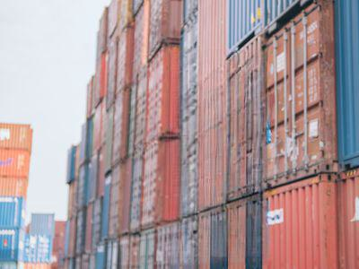

## Table of Contents

## What is an Inland Bill of Lading?

An Inland Bill of Lading is a document used in shipping that covers the transport of goods within a country. It is issued by a carrier or their representative and acts as a receipt for the goods being shipped. This document is important because it shows that the carrier has received the goods and is responsible for delivering them to a specified location within the country.

The Inland Bill of Lading includes details like the names and addresses of the shipper and the receiver, a description of the goods, and the destination. It is different from an Ocean Bill of Lading, which is used for international shipping. The Inland Bill of Lading helps ensure that the goods are tracked and delivered correctly within the country, making it an essential part of domestic shipping logistics.

## How does an Inland Bill of Lading differ from a regular Bill of Lading?

An Inland Bill of Lading is used for moving goods within a country, while a regular Bill of Lading, often called an Ocean Bill of Lading, is used for shipping goods between countries. The Inland Bill of Lading is issued by a carrier or their representative for domestic transport, showing that they have received the goods and are responsible for delivering them to a specific place within the country. On the other hand, a regular Bill of Lading is used when goods are shipped internationally, and it serves as a contract between the shipper and the carrier for the transport of goods across the ocean.

Both types of bills of lading include important details like the names and addresses of the shipper and receiver, a description of the goods, and the destination. However, the Inland Bill of Lading is focused on domestic logistics, ensuring goods are tracked and delivered correctly within the country. In contrast, a regular Bill of Lading is crucial for international trade, as it also acts as a document of title, allowing the holder to claim the goods upon arrival at the destination port.

## What are the primary uses of an Inland Bill of Lading?

The main use of an Inland Bill of Lading is to act as a receipt for goods being moved within a country. When a company sends products from one place to another inside the same country, this document shows that the carrier has picked up the goods and is responsible for delivering them to the right place. It includes important details like who is sending the goods, who is receiving them, what the goods are, and where they are going.

Another important use of the Inland Bill of Lading is to help track the goods during transport. This document makes sure that everyone involved knows where the goods are at all times, from when they leave the sender until they reach the receiver. This is very helpful for keeping the shipping process organized and making sure the goods are delivered on time and in good condition.

## Who are the parties typically involved in an Inland Bill of Lading?

The main parties involved in an Inland Bill of Lading are the shipper, the carrier, and the receiver. The shipper is the person or company that sends the goods. They give the goods to the carrier, who is the person or company responsible for moving the goods from one place to another within the country. The receiver is the person or company that gets the goods at the end of the journey.

Sometimes, there might be other parties involved too. For example, a freight forwarder might help arrange the transport, or a third party might be listed as the consignee, which means they will take possession of the goods on behalf of the receiver. But the most important parties are always the shipper, the carrier, and the receiver, as they are directly involved in the movement of the goods from start to finish.

## What information is required on an Inland Bill of Lading?

An Inland Bill of Lading needs to have some important information to make sure the goods are moved correctly within the country. This includes the name and address of the shipper, who sends the goods, and the name and address of the receiver, who gets the goods. It also has to list what the goods are, how many there are, and any special instructions for handling them. The document should show the date the goods were picked up and the place where they are going.

Another important part is the name and contact information of the carrier, who is in charge of moving the goods. The Inland Bill of Lading should also have a unique number so it can be tracked easily. Sometimes, it might include details about who pays for the shipping and any other charges. All this information helps make sure the goods get to the right place on time and in good condition.

## How is an Inland Bill of Lading processed and managed?

When someone wants to move goods inside a country, they start by filling out an Inland Bill of Lading. This document has all the important details like who is sending the goods, who is getting them, what the goods are, and where they are going. The shipper gives this document to the carrier, who is the company or person moving the goods. The carrier checks everything and then signs the Inland Bill of Lading to show they have received the goods and agree to deliver them.

Once the carrier has the Inland Bill of Lading, they use it to keep track of the goods while they are being moved. The document helps everyone know where the goods are at all times. When the goods reach their destination, the receiver signs the Inland Bill of Lading to show they have received everything correctly. If there are any problems, like damaged goods, the Inland Bill of Lading is used to help solve them. This way, the Inland Bill of Lading helps make sure the goods get to the right place safely and on time.

## What are the legal implications of an Inland Bill of Lading?

An Inland Bill of Lading is a legal document that shows a contract between the shipper and the carrier for moving goods inside a country. It says that the carrier has taken the goods and promises to deliver them to the right place. If something goes wrong, like the goods get lost or damaged, the Inland Bill of Lading can be used in court to help solve the problem. It's like a promise that the carrier will do their job, and if they don't, they might have to pay for any losses.

The Inland Bill of Lading also has rules about who owns the goods while they are being moved. It usually says that the carrier is responsible for the goods until they are delivered to the receiver. If the receiver signs the Inland Bill of Lading without any complaints, it means they agree that the goods arrived in good condition. This can be important if there are any disagreements later on. So, the Inland Bill of Lading helps keep things clear and fair for everyone involved in moving goods within the country.

## Can an Inland Bill of Lading be used for international shipments?

An Inland Bill of Lading is not meant for international shipments. It is a document used for moving goods within one country, from one place to another inside the same country's borders. It shows that a carrier has taken the goods and promises to deliver them to the right place within the country. If you need to move goods between countries, you would use a different kind of document called an Ocean Bill of Lading, which is made for international shipping.

Using an Inland Bill of Lading for an international shipment would not be correct because it does not have the right information or legal protections needed for moving goods across borders. It is important to use the right document for the right kind of shipment to make sure everything goes smoothly and to avoid any legal problems. So, always use an Inland Bill of Lading for domestic shipments and an Ocean Bill of Lading for shipments going to other countries.

## How does an Inland Bill of Lading affect the logistics and transportation process?

An Inland Bill of Lading plays a big role in the logistics and transportation process for moving goods inside a country. It acts like a receipt that shows the carrier has picked up the goods from the shipper and promises to deliver them to the receiver at the right place. This document helps keep track of the goods while they are being moved, making sure everyone knows where the goods are at all times. It also includes important details like who is sending and receiving the goods, what the goods are, and where they are going, which helps plan the transportation route and make sure the goods are handled correctly.

Having an Inland Bill of Lading also makes the logistics process more organized and efficient. It helps coordinate between the shipper, the carrier, and the receiver, making sure everyone knows their responsibilities. If there are any problems, like damaged or lost goods, the Inland Bill of Lading can be used to solve them quickly. This document is very important for making sure the goods are delivered on time and in good condition, which is key for smooth logistics and transportation within the country.

## What are common issues or disputes related to Inland Bills of Lading and how are they resolved?

Common issues or disputes related to Inland Bills of Lading often involve damaged or lost goods during transport. Sometimes, the goods might not be delivered on time, or there could be disagreements about who should pay for the shipping or any other charges. Another issue might be if the details on the Inland Bill of Lading are not correct or complete, which can lead to confusion about what was supposed to be shipped and where it was supposed to go.

These disputes are usually resolved by looking at the Inland Bill of Lading. Since it acts as a contract between the shipper and the carrier, it can be used to see what was agreed upon. If the goods are damaged or lost, the carrier might have to pay for the losses based on what the Inland Bill of Lading says. If there's a problem with the details on the document, everyone involved might need to talk and fix the mistakes. Sometimes, if the dispute can't be solved easily, it might go to court, where a judge will look at the Inland Bill of Lading and other evidence to make a decision.

## How has technology impacted the use and management of Inland Bills of Lading?

Technology has made a big difference in how Inland Bills of Lading are used and managed. Now, instead of using paper documents, many companies use electronic Inland Bills of Lading. This means they can fill out, sign, and send the document online. It's faster and easier to keep track of the goods while they are being moved. Also, special software can help manage all the details and make sure everything is correct. This helps avoid mistakes and makes the whole process smoother.

Another way technology helps is by making it easier to solve problems if they come up. If there's a dispute about damaged or lost goods, electronic records can be checked quickly to see what was agreed upon. This can help solve issues faster without needing to go to court. Plus, technology lets everyone involved in the shipping process share information in real-time, which makes the logistics and transportation process more efficient and reliable.

## What are the best practices for managing and utilizing Inland Bills of Lading effectively?

To manage and use Inland Bills of Lading effectively, it's important to make sure all the details on the document are correct and complete. This means checking the names and addresses of the shipper and receiver, the description of the goods, and the destination. Any mistakes can lead to problems, so it's good to double-check everything before the carrier picks up the goods. Also, using electronic Inland Bills of Lading can help a lot. They are easier to fill out, sign, and send, and they can be tracked online, which makes the whole process faster and smoother.

Another good practice is to keep good communication with everyone involved, like the carrier, the shipper, and the receiver. If there's a problem, like damaged goods or a delay, talking it out quickly can help solve it. It's also smart to use special software to manage the Inland Bills of Lading. This can help keep everything organized and make sure nothing gets missed. By following these practices, the goods can be moved inside the country more efficiently and with fewer problems.

## References & Further Reading

For those interested in exploring more about the topics discussed in this article, a range of resources is available to deepen your understanding of both the Inland Bill of Lading and [algorithmic trading](/wiki/algorithmic-trading) in freight shipping. 

1. **Legal Frameworks and Documentation:**
   - The International Chamber of Commerce (ICC) publishes guidelines and standards regarding bills of lading and other freight documentation. Their resources offer comprehensive insights into the regulations governing domestic and international trade.
   - "Bills of Lading: Law and Practice" by Sir Richard Aikens provides an in-depth analysis of the legal implications and practical applications of various types of bills of lading.

2. **Technological Advancements in Logistics:**
   - For those looking to understand how technology impacts logistics, "Logistics 4.0: Digital Transformation in Supply Chain Management" by Turan Paksoy, Gerhard-Wilhelm Weber, and Sandra Huber Young offers a broad view of the ongoing technological changes.
   - The Journal of Business Logistics frequently publishes articles on supply chain and logistics innovations, including the latest in algorithmic applications.

3. **Algorithmic Trading and Machine Learning:**
   - "Algorithmic Trading: Winning Strategies and Their Rationale" by Ernie Chan provides a detailed examination of algorithmic trading techniques, many of which have been adapted for logistical optimizations.
   - For an academic approach, consider reading papers from IEEE Xplore that focus on machine learning applications in logistics and supply chain management.

4. **Blockchain and Data Security:**
   - To explore how blockchain is transforming documentation like the Inland Bill of Lading, "Blockchain and the Internet of Things in Logistics" by Marilyn Tam provides a foundational overview.
   - The book "Blockchain in Logistics: Emerging Research and Opportunities" by Houda Harb and Kassem Saleh covers recent case studies and research publications on blockchain applications in logistics.

These resources provide a starting point for further study in the legal, technological, and practical aspects of freight shipping documentation and the evolving role of algorithmic trading in logistics.

